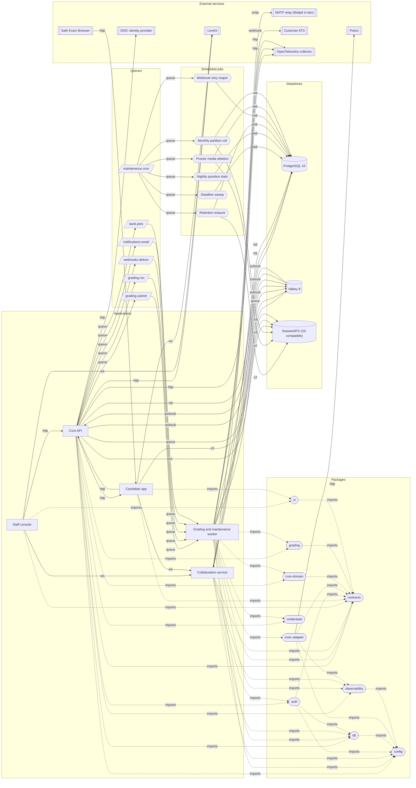

# Code graph — Assaybank

**Status:** draft
**Owner:** _unassigned_
**Last updated:** 2026-09-15
**Companion docs:** [`code-graph.json`](code-graph.json), [`docs/02-HLD.md`](docs/02-HLD.md), [`docs/03-API-spec.md`](docs/03-API-spec.md), [`docs/04-ADRs.md`](docs/04-ADRs.md), [`docs/hiring_platform_schema.sql`](docs/hiring_platform_schema.sql)

---

## How to read this

No code exists in this repository yet. Everything below describes the architecture the team intends to build, not an architecture that has been observed. Every node carries `status: planned`, and it will stay that way until the corresponding workspace actually contains a `package.json`.

[`code-graph.json`](code-graph.json) is the source of truth. This document is partly generated from it: the region between the `BEGIN GENERATED` and `END GENERATED` markers is produced by [`scripts/gen-code-graph.mjs`](scripts/gen-code-graph.mjs) and must never be hand-edited. Everything outside those markers is prose, written and maintained by hand, and the generator leaves it untouched.

The graph has six kinds of node — `app`, `package`, `datastore`, `queue`, `external`, `job` — and nine kinds of edge. Two of the edge kinds matter more than the rest when reading the diagram:

- `imports` is a compile-time workspace dependency. It always points down the layer order and never crosses back up.
- everything else (`http`, `sql`, `queue`, `pubsub`, `ws`, `s3`, `smtp`, `webhook`) is a runtime call. The `sync` column in the edge table says whether the caller blocks on the result, which is the single most useful fact about an edge when you are reasoning about a slow dependency.

Milestones are the ones defined in [`docs/01-PRD.md`](docs/01-PRD.md) section 6: M0 question bank (2026-09-21 onward), M1 async MCQ, M2 coding, M3 live interviews, M4 proctored certification. A node's milestone is the milestone in which it first ships, so the M0 slice of this graph is small and the M4 slice includes the proctoring path.

## Why this graph exists

A distributed system acquires its shape in the first six weeks and then keeps it for years. The shape is cheap to describe now and expensive to recover later from a directory listing, because the interesting facts are not in the directory listing: which component is allowed to write which table, which call is synchronous, which package is forbidden from touching I/O, what happens when a queue backs up.

Three specific things the graph buys:

**Review leverage.** A pull request that adds a call between two services changes `code-graph.json`, and the diff of that file is one line that a reviewer can argue about. The same change buried in an import statement is invisible.

**Executable rules.** The layering rules are not advice in a document; the generator fails the build when an `imports` edge violates one. Rules that are checked survive contact with a deadline. Rules that are written down and not checked do not.

**A test oracle for the boundaries that carry risk.** The sandbox must not learn hidden test expectations and the candidate bundle must not carry scoring logic. Both are properties of the graph, not of any one file, so both belong in a place where they can be asserted.

The cost is real: every structural change costs an extra edit and a regeneration. That is the trade-off, and it is only worth paying while the graph stays accurate. A stale graph is worse than no graph, which is why `--check` runs in CI rather than relying on discipline.

## The five invariants this graph encodes

**1. One writer per table.** The API is the only writer of the bank, assessment, candidate, invitation and attempt-composition tables. Three exceptions exist and all three are enumerated in the data-ownership table below: the grading worker's score write-set, the collaboration service's two collaboration columns, and the bank import job. A fourth exception would be an ADR, not a pull request.

**2. The sandbox never learns the answer.** `exec-adapter` accepts a language, a version, files, stdin, args and limits. It does not accept a question id, an attempt id, a candidate id or a test-case expectation. Comparison happens in `grading`, inside the worker. A candidate who escapes Piston reaches a machine that holds no expectations, no credentials and no route to the database ([`docs/02-HLD.md`](docs/02-HLD.md) sections 3.2 and 7).

**3. Grading is asynchronous and idempotent by submission id.** The API inserts a submission and returns 202. A replayed job produces the same score. A job that exhausts its retries moves the attempt to `under_review` and pages someone; no failure path writes a silent zero (ADR-008).

**4. Nothing crosses the pure boundary.** `core-domain` and `grading` import no database client, no HTTP client, no clock and no configuration. This is what makes a re-grade reproducible and the attempt state machine testable without a container.

**5. The candidate bundle cannot carry staff code.** `apps/candidate` is a separate build that may not import `db`, `auth`, `core-domain`, `grading` or `exec-adapter`. Filtering correct-answer flags in the serialiser is the second line of defence; the first is that the code which knows the answers is not linked into the bundle at all.

Two further constraints show up in this graph as *absent* edges, which is the only way a graph can express a prohibition:

- **ADR-007.** Nothing leads from `proctor_events` or `proctor_media` into scoring. Proctoring signals reach a human review queue and stop there. No node in this graph auto-rejects, auto-voids or down-scores an attempt.
- **ADR-011.** There is no model-serving node, no inference queue and no external AI service anywhere in the graph, and there will not be one on the scoring or decision path.

<!-- BEGIN GENERATED -->

<!--
  Generated from code-graph.json by scripts/gen-code-graph.mjs. Do not edit this region by hand.
  Edit code-graph.json and run: node scripts/gen-code-graph.mjs
-->

## Graph at a glance

Graph version 1.0.0, generated 2026-09-15. 5 applications, 10 packages, 3 datastores, 6 queues, 6 scheduled jobs, 7 external services. 54 runtime edges, 36 import edges.

Solid arrows are runtime calls, labelled by kind. Dotted arrows are compile-time workspace imports and always point down the layer order.

## Nodes

| ID | Node | Type | Milestone | Status | Path | Purpose |
|---|---|---|---|---|---|---|
| `api` | Core API | app | M0 | in-progress | `apps/api` | Fastify 5 HTTP and SSE surface that owns authentication, authorisation, the question bank, assessment composition, the attempt lifecycle and the server-authoritative clock. |
| `candidate` | Candidate app | app | M1 | in-progress | `apps/candidate` | React 19 assessment runner and interview join surface, built as a separate bundle so no staff-only code, correct-answer flag or bank access can ever ship to a candidate. |
| `collab` | Collaboration service | app | M3 | in-progress | `apps/collab` | y-websocket server holding one Yjs document per live interview room, with awareness fan-out and periodic snapshots to Postgres. |
| `web` | Staff console | app | M0 | in-progress | `apps/web` | React 19 console for recruiters, interviewers and admins covering the bank, assessment builder, results, live interview host view and org administration. |
| `worker` | Grading and maintenance worker | app | M1 | in-progress | `apps/worker` | BullMQ consumer that grades submissions, delivers webhooks and e-mail, runs bank import and export jobs, and hosts every scheduled sweep. |
| `auth` | auth | package | M0 | built | `packages/auth` | Staff sessions and OIDC, candidate attempt tokens, WebSocket tickets and the per-action permission checks. |
| `config` | config | package | M0 | built | `packages/config` | Parses and validates the environment once at boot and exposes a typed, frozen configuration object. |
| `contracts` | contracts | package | M0 | in-progress | `packages/contracts` | zod schemas, the generated OpenAPI 3.1 document and the error-code catalogue - the single source of truth for every request and response shape. |
| `core-domain` | core-domain | package | M0 | in-progress | `packages/core-domain` | Pure domain logic: the attempt state machine, section-rule resolution and the question draw, weighted scoring aggregation and skill roll-up. |
| `credentials` | credentials | package | M4 | planned | `packages/credentials` | Open Badges 3.0 claim-set construction, JWS signing and verification, status-list generation, and the deterministic PDF rendering of an issued credential (ADR-016). |
| `db` | db | package | M0 | in-progress | `packages/db` | Drizzle schema, migrations, row-level-security policies and the seed data that mirror docs/hiring_platform_schema.sql. |
| `exec-adapter` | exec-adapter | package | M2 | planned | `packages/exec-adapter` | Thin adapter over Piston behind execute(language, version, files, stdin, args, limits) so the sandbox stays swappable. |
| `grading` | grading | package | M1 | in-progress | `packages/grading` | Pure comparison and weighted scoring: MCQ and short-answer matching, test-case comparison per grading mode, partial credit and optional negative marking. |
| `observability` | observability | package | M0 | built | `packages/observability` | Structured logger, OpenTelemetry tracing setup and the metric registry shared by every service. |
| `ui` | ui | package | M0 | in-progress | `packages/ui` | Shared React components and Tailwind design tokens used by both front ends. |
| `object-store` | SeaweedFS (S3-compatible) | datastore | M0 | planned | `service: seaweedfs S3 :8333 (S3_ENDPOINT)` | Object storage for export files, packaged session replays, archived event partitions, large submission artefacts and proctor media. |
| `postgres` | PostgreSQL 16 | datastore | M0 | built | `service: postgres:5432` | The single source of truth for all domain data, with row-level security for org isolation and monthly partitions on the two event tables. |
| `valkey` | Valkey 8 | datastore | M0 | built | `service: valkey:6379 (REDIS_URL)` | BSD-licensed Redis-protocol server carrying the BullMQ queues, pub/sub fan-out, rate-limit counters and the short-lived candidate session cache. |
| `q-bank-jobs` | bank.jobs | queue | M0 | planned | `logical queue on Valkey` | Long-running bank operations: QTI and JSON import, dataset import, question and report export, candidate bulk CSV, org data export. |
| `q-grading-run` | grading.run | queue | M2 | planned | `logical queue on Valkey` | Interactive trial runs against sample cases only, kept on a separate high-priority queue so a grading backlog never stalls the editor. |
| `q-grading-submit` | grading.submit | queue | M2 | planned | `logical queue on Valkey` | Batch grading of scored coding submissions against the full hidden test-case set. |
| `q-maintenance` | maintenance.cron | queue | M1 | in-progress | `logical queue on Valkey` | Repeatable-job carrier for every scheduled sweep, so schedules survive a worker restart and never run twice concurrently. |
| `q-notifications` | notifications.email | queue | M1 | planned | `logical queue on Valkey` | Invitation, reminder and result e-mail delivery, off the request path. |
| `q-webhooks` | webhooks.deliver | queue | M1 | planned | `logical queue on Valkey` | At-least-once outbound delivery of org webhooks to the ATS. |
| `job-deadline-sweep` | Deadline sweep | job | M1 | planned | `apps/worker/src/jobs/deadline-sweep.ts` | Transitions attempts whose deadline_at has passed to expired and grades whatever was autosaved. |
| `job-partition-roll` | Monthly partition roll | job | M3 | planned | `apps/worker/src/jobs/partition-roll.ts` | Creates next month's partitions for session_events and proctor_events and archives partitions older than 90 days to object storage. |
| `job-proctor-media-deletion` | Proctor media deletion | job | M4 | planned | `apps/worker/src/jobs/proctor-media-deletion.ts` | Deletes proctor media objects and their rows once proctor_media.delete_after has passed. |
| `job-question-stats` | Nightly question stats | job | M0 | built | `apps/worker/src/jobs/question-stats.ts` | Recomputes question_stats - exposure count, p-value, discrimination and mean seconds - from attempt_questions and answers. |
| `job-retention-erasure` | Retention erasure | job | M1 | planned | `apps/worker/src/jobs/retention-erasure.ts` | Erases candidate PII past candidates.erase_after and prunes attempt data, session recordings and archived partitions past their RETENTION_* ceilings. |
| `job-webhook-reaper` | Webhook retry reaper | job | M1 | planned | `apps/worker/src/jobs/webhook-reaper.ts` | Closes out deliveries that have exhausted the 24-hour retry window, marks them failed and surfaces the endpoint for operator attention. |
| `ats` | Customer ATS | external | M1 | planned | `external: customer-configured webhook endpoints` | Receives signed webhooks for invitation, attempt, session and scorecard events. |
| `livekit` | LiveKit | external | M3 | planned | `service: self-hosted SFU (LIVEKIT_URL)` | Apache-2.0 self-hosted SFU carrying audio and video for live interview rounds. |
| `oidc` | OIDC identity provider | external | M0 | built | `external: OIDC_ISSUER` | Customer SSO for staff accounts via the authorisation-code flow. |
| `otel-collector` | OpenTelemetry collector | external | M0 | in-progress | `service: otel-collector OTLP :4317 (OTEL_EXPORTER_OTLP_ENDPOINT)` | Receives traces and metrics from every service and forwards them to Prometheus and the trace backend. |
| `piston` | Piston | external | M2 | planned | `service: piston:2000 (PISTON_URL), self-hosted` | MIT-licensed sandboxed code execution, self-hosted on dedicated network-isolated nodes. |
| `seb` | Safe Exam Browser | external | M4 | planned | `external: candidate-installed lockdown browser` | Lockdown client for certification-mode exams; loads the candidate app under a signed configuration. |
| `smtp` | SMTP relay (Mailpit in dev) | external | M1 | planned | `service: mailpit SMTP :1025, UI :8025 (SMTP_URL)` | Outbound mail transport for invitations, reminders and result notifications. |

## Public surface and invariants

#### `api` — Core API

**Owner:** _unassigned_ (expected: backend lead) · **Milestone:** M0 · **Status:** in-progress

Public surface:

- HTTP :8080 - /auth/*, /skills, /job-roles/*, /job-openings/*, /questions/*, /import-jobs/*, /assessments/*, /sections/*, /rules/*, /candidates/*, /applications/*, /invitations/*, /attempts/*, /answers/*, /sessions/*, /join/{room_code}, /scorecards/*, /scorecard-templates/*, /webhooks/*, /reports/*, /users/*, /user-roles, /permissions, /audit-log, /org/*
- HTTP :8080 - /candidate/redeem and the attempt-token surface /attempt/*
- SSE - GET /attempt/submissions/{id}/stream, GET /sessions/{id}/events
- Health and telemetry - GET /healthz, GET /readyz, GET /metrics

Invariants:

- Sole writer of the identity, bank, assessment, candidate, invitation and attempt-composition tables, with exactly three enumerated exceptions: the grading worker's score write-set, the collaboration service's two collaboration columns, and the bank import job. The full ownership table lives in CODE-GRAPH.md.
- Owns time: deadline_at is computed server-side at attempt start and every response carries server_time (ADR-006).
- Never executes candidate code and never computes a coding score on the request path; it enqueues and returns 202.
- Never makes an outbound webhook call on the request path; webhook emission is enqueued so retries cannot block a candidate.
- Strips reference solutions, hidden expectations and correct-answer flags in the serialisation layer, not in the client.
- Sets app.current_org on every pooled connection so row-level security is active for every query (ADR-010).

Specified by: [`docs/02-HLD.md`](docs/02-HLD.md), [`docs/03-API-spec.md`](docs/03-API-spec.md), [`docs/04-ADRs.md`](docs/04-ADRs.md), [`docs/hiring_platform_schema.sql`](docs/hiring_platform_schema.sql)

#### `candidate` — Candidate app

**Owner:** _unassigned_ (expected: frontend lead) · **Milestone:** M1 · **Status:** in-progress

Public surface:

- Dev server :5174, production bundle served on :3001
- Routes /t/{token}, /attempt/*, /join/{room_code}

Invariants:

- Separate bundle from apps/web; no shared chunk may carry staff routes, bank queries or correct-answer logic.
- Displays a countdown derived from server_time and never trusts the local clock (ADR-006).
- Buffers autosaves locally and replays them on reconnect; losing the network must not lose work.
- Emits proctoring signals as advisory telemetry only; it renders no integrity verdict (ADR-007).

Specified by: [`docs/01-PRD.md`](docs/01-PRD.md), [`docs/03-API-spec.md`](docs/03-API-spec.md), [`docs/15-accessibility-conformance.md`](docs/15-accessibility-conformance.md)

#### `collab` — Collaboration service

**Owner:** _unassigned_ (expected: backend engineer (realtime)) · **Milestone:** M3 · **Status:** in-progress

Public surface:

- WSS :8081 - /collab/{room_code}?ticket=... (Yjs sync protocol plus awareness)
- Valkey pub/sub channels room:{room_code}:updates and room:{room_code}:control
- Health - GET /healthz

Invariants:

- Accepts a connection only against a valid, unexpired, single-use 60-second ticket minted by the API (HLD section 7).
- Writes exactly two things: appends to session_events and the interview_sessions.doc_state snapshot column. It touches no other table.
- Holds no source of truth in memory; an instance crash loses at most COLLAB_SNAPSHOT_INTERVAL_MS of document state.
- Never resolves permissions itself beyond the ticket; role and org checks happen in the API before the ticket is issued.
- Never executes code; in-session runs go through the API and the grading queue.

Specified by: [`docs/02-HLD.md`](docs/02-HLD.md), [`docs/03-API-spec.md`](docs/03-API-spec.md), [`docs/04-ADRs.md`](docs/04-ADRs.md)

#### `web` — Staff console

**Owner:** _unassigned_ (expected: frontend lead) · **Milestone:** M0 · **Status:** in-progress

Public surface:

- Dev server :5173, production bundle served on :3000
- Routes /bank/*, /assessments/*, /candidates/*, /attempts/*, /sessions/*, /reports/*, /admin/*

Invariants:

- Renders state; it never decides a score, a deadline or a question draw.
- Talks only to the API and the collaboration service; it never reaches Postgres, Valkey or the object store directly.
- Never ships in the candidate bundle and never shares a build output with apps/candidate.

Specified by: [`docs/01-PRD.md`](docs/01-PRD.md), [`docs/03-API-spec.md`](docs/03-API-spec.md), [`docs/15-accessibility-conformance.md`](docs/15-accessibility-conformance.md)

#### `worker` — Grading and maintenance worker

**Owner:** _unassigned_ (expected: backend lead) · **Milestone:** M1 · **Status:** in-progress

Public surface:

- Consumes queues: grading.submit, grading.run, webhooks.deliver, notifications.email, bank.jobs, maintenance.cron
- Publishes on Valkey channel submission:{submission_id} and attempt:{attempt_id}
- Health and telemetry - GET /healthz, GET /metrics on an internal port

Invariants:

- One job equals one submission, and grading is idempotent by submission id; a replayed job produces the same score (ADR-008).
- Compares test-case expectations itself and never sends an expectation into the sandbox (HLD section 3.2).
- Truncates captured stdout and stderr to EXEC_MAX_OUTPUT_BYTES before persisting.
- A failure after QUEUE_MAX_ATTEMPTS moves the job to a dead-letter queue and the attempt to under_review; it never writes a silent zero.
- Re-grading a finalised attempt creates a new grading run rather than mutating the existing scores in place.
- Writes bank tables only from the bank.jobs import, through the same packages/db repositories and the same validation the API uses; it has no private write path.
- Holds no candidate-facing HTTP surface; everything it produces reaches a client through Postgres or the API.

Specified by: [`docs/02-HLD.md`](docs/02-HLD.md), [`docs/03-API-spec.md`](docs/03-API-spec.md), [`docs/04-ADRs.md`](docs/04-ADRs.md)

#### `auth` — auth

**Owner:** _unassigned_ (expected: backend engineer (security)) · **Milestone:** M0 · **Status:** built

Public surface:

- Exported symbols: createStaffSession(), verifyStaffSession(), startOidc(), completeOidc(), mintAttemptToken(), verifyAttemptToken(), mintWsTicket(), verifyWsTicket(), can(actor, permission, resource)

Invariants:

- Invitation and attempt tokens are high-entropy, peppered with TOKEN_PEPPER and stored only as hashes; plaintext is returned exactly once.
- A token grants access to exactly one attempt and nothing else.
- WebSocket tickets are separate from attempt tokens, live 60 seconds and are single-use.
- Permission checks are per action and org-scoped; there is no ambient admin path.

Specified by: [`docs/02-HLD.md`](docs/02-HLD.md), [`docs/03-API-spec.md`](docs/03-API-spec.md), [`docs/14-threat-model.md`](docs/14-threat-model.md)

#### `config` — config

**Owner:** _unassigned_ (expected: platform engineer) · **Milestone:** M0 · **Status:** built

Public surface:

- Exported symbols: loadConfig(), AppConfig, envSchema

Invariants:

- Fails fast: a missing or malformed variable aborts the process at boot rather than surfacing mid-exam.
- The only module permitted to read process.env.
- Never logs a secret value; secrets are redacted in every dump of the config object.

Specified by: [`.env.example`](.env.example), [`docs/13-environments-and-release.md`](docs/13-environments-and-release.md)

#### `contracts` — contracts

**Owner:** _unassigned_ (expected: backend lead) · **Milestone:** M0 · **Status:** in-progress

Public surface:

- Exported symbols: request/response schemas per route group, inferred TypeScript types, ErrorCode enum, problem+json envelope
- Generated artefact: openapi.json (OpenAPI 3.1)

Invariants:

- Imports no other workspace package; it is the root of the dependency graph.
- Performs no I/O and reads no environment variable.
- Candidate-facing response schemas physically cannot express a hidden expectation or an is_correct flag; the type system is the first line of the leak defence.

Specified by: [`docs/03-API-spec.md`](docs/03-API-spec.md)

#### `core-domain` — core-domain

**Owner:** _unassigned_ (expected: backend lead) · **Milestone:** M0 · **Status:** in-progress

Public surface:

- Exported symbols: resolveSections(), drawQuestions(rules, bank, seed), canTransition(from, to), computeDeadline(), rollUpSkills(), aggregateAttemptScore()

Invariants:

- Pure and deterministic: no database client, no HTTP client, no filesystem, no clock read that is not passed in as an argument.
- The question draw is a function of (rules, candidate bank snapshot, seed); the same inputs always produce the same served set (ADR-004).
- Refuses the transition to finalised unless every answer carries a non-null final_score.

Specified by: [`docs/02-HLD.md`](docs/02-HLD.md), [`docs/03-API-spec.md`](docs/03-API-spec.md), [`docs/04-ADRs.md`](docs/04-ADRs.md)

#### `credentials` — credentials

**Owner:** _unassigned_ (expected: backend lead) · **Milestone:** M4 · **Status:** planned

Public surface:

- Exported symbols: buildClaimSet(attempt, assessment, skills), signCredential(claimSet, key), verifyCredential(jws), buildStatusList(entries), renderPdf(credential)

Invariants:

- Only a finalised, non-voided attempt can produce a credential; issuance is an explicit human-approved action in certification mode.
- The signing key never resides on an API or execution node; the package receives a signer handle, never raw key material.
- A claim set is frozen at issuance - re-rendering an existing credential never recomputes its claims.
- Verification output reveals no answers, no question set and no PII beyond what the holder consented to.

Specified by: [`docs/10-certification-and-credentials.md`](docs/10-certification-and-credentials.md), [`docs/04-ADRs.md`](docs/04-ADRs.md)

#### `db` — db

**Owner:** _unassigned_ (expected: backend lead) · **Milestone:** M0 · **Status:** in-progress

Public surface:

- Exported symbols: schema tables, typed query helpers, withOrg(orgId) connection scope, migrate(), seed()
- Migration directory and the expand-contract migration runner

Invariants:

- Every tenant table carries org_id and an org_isolation policy; a table added without one fails the schema test (ADR-010).
- Migrations are expand-contract - add nullable, backfill, switch reads, drop later - so a running exam window never breaks.
- Exposes no raw connection that bypasses the app.current_org setting.
- The DATABASE_APP_ROLE and DATABASE_JOB_ROLE grants differ; the job role cannot read candidate PII columns it does not need.

Specified by: [`docs/hiring_platform_schema.sql`](docs/hiring_platform_schema.sql), [`docs/02-HLD.md`](docs/02-HLD.md), [`docs/04-ADRs.md`](docs/04-ADRs.md)

#### `exec-adapter` — exec-adapter

**Owner:** _unassigned_ (expected: backend engineer (execution)) · **Milestone:** M2 · **Status:** planned

Public surface:

- Exported symbols: execute(request): Promise<ExecResult>, listRuntimes(), ExecLimits, ExecResult
- Outbound: POST {PISTON_URL}/api/v2/execute

Invariants:

- Never receives a question id, an attempt id, a candidate id or a test-case expectation - only code, stdin, args and limits (HLD section 3.2).
- Always sets CPU, wall, memory, process and output limits from EXEC_* configuration; an unlimited call is a compile error, not a runtime choice.
- Returns stdout and stderr already truncated to EXEC_MAX_OUTPUT_BYTES.
- Treats every result as untrusted input; a sandbox escape must not be able to influence a score through the adapter.

Specified by: [`docs/02-HLD.md`](docs/02-HLD.md), [`docs/04-ADRs.md`](docs/04-ADRs.md), [`docs/05-licensing-and-compliance.md`](docs/05-licensing-and-compliance.md)

#### `grading` — grading

**Owner:** _unassigned_ (expected: backend lead) · **Milestone:** M1 · **Status:** in-progress

Public surface:

- Exported symbols: gradeMcq(), gradeShortAnswer(), compareCase(mode, expected, actual), scoreSubmission(cases, weights), GradingMode

Invariants:

- Pure and idempotent by submission id: the same inputs always yield the same result, which is what makes re-grade reproducible (ADR-008).
- No I/O of any kind - it receives expectations and observed output as arguments and returns a score.
- Contains no model call, no heuristic ranking and no similarity scoring; nothing statistical touches the decision path (ADR-011).
- Comparison happens here and never inside the sandbox, so escaping the sandbox reveals nothing about hidden cases.

Specified by: [`docs/02-HLD.md`](docs/02-HLD.md), [`docs/04-ADRs.md`](docs/04-ADRs.md), [`docs/16-ai-usage-policy.md`](docs/16-ai-usage-policy.md)

#### `observability` — observability

**Owner:** _unassigned_ (expected: platform engineer) · **Milestone:** M0 · **Status:** built

Public surface:

- Exported symbols: logger, withSpan(), tracer, metrics registry, propagateTrace(job) / adoptTrace(job)

Invariants:

- A trace id propagates from the candidate request through the queue payload into the worker and the execution call; without it, 'why did this score change on re-grade' is unanswerable.
- Logs are structured and never contain candidate PII, token plaintext or submitted code.
- Metric names are stable; renaming one is a breaking change to the dashboards and alerts.

Specified by: [`docs/02-HLD.md`](docs/02-HLD.md), [`docs/12-observability-and-runbooks.md`](docs/12-observability-and-runbooks.md)

#### `ui` — ui

**Owner:** _unassigned_ (expected: frontend lead) · **Milestone:** M0 · **Status:** in-progress

Public surface:

- Exported symbols: design tokens, layout primitives, form controls, table, dialog, toast, Monaco editor wrapper, timer display

Invariants:

- Presentation only: no data fetching, no route definitions, no permission logic.
- Imports no workspace package other than contracts (types only), so it can never drag server code into a client bundle.
- Every component meets the contrast and keyboard requirements in docs/15-accessibility-conformance.md.

Specified by: [`docs/15-accessibility-conformance.md`](docs/15-accessibility-conformance.md), [`docs/08-i18n-and-localisation.md`](docs/08-i18n-and-localisation.md)

#### `object-store` — SeaweedFS (S3-compatible)

**Owner:** _unassigned_ (expected: platform engineer) · **Milestone:** M0 · **Status:** planned

Public surface:

- S3 API on 8333, bucket S3_BUCKET, path-style addressing
- Key prefixes exports/, replays/, artefacts/, proctor/, archive/

Invariants:

- Reached only through short-lived pre-signed URLs; no service proxies object bytes through the API (HLD section 3.5).
- proctor/ objects carry a delete_after that the retention job enforces unconditionally.
- SeaweedFS, not MinIO, because MinIO is AGPL-3.0 and fails the licence policy.

Specified by: [`docs/02-HLD.md`](docs/02-HLD.md), [`docs/05-licensing-and-compliance.md`](docs/05-licensing-and-compliance.md), [`docs/11-data-retention-and-dpia.md`](docs/11-data-retention-and-dpia.md)

#### `postgres` — PostgreSQL 16

**Owner:** _unassigned_ (expected: platform engineer) · **Milestone:** M0 · **Status:** built

Public surface:

- TCP 5432, roles DATABASE_APP_ROLE and DATABASE_JOB_ROLE
- Schema as defined in docs/hiring_platform_schema.sql

Invariants:

- Row-level security is enabled on every tenant table and app.current_org is set per connection (ADR-010).
- session_events and proctor_events are partitioned by month and archived to object storage after 90 days.
- audit_log is append-only; no service holds UPDATE or DELETE on it outside the retention job.
- Reporting queries run against a read replica; the transactional path stays on the primary.

Specified by: [`docs/hiring_platform_schema.sql`](docs/hiring_platform_schema.sql), [`docs/02-HLD.md`](docs/02-HLD.md)

#### `valkey` — Valkey 8

**Owner:** _unassigned_ (expected: platform engineer) · **Milestone:** M0 · **Status:** built

Public surface:

- RESP on 6379
- BullMQ keyspaces for the queues listed below
- Pub/sub channels submission:{id}, attempt:{id}, room:{room_code}:updates, room:{room_code}:control

Invariants:

- Nothing here is a source of truth; a total flush must cost throughput and in-flight jobs, never a score or an answer.
- Valkey 8, not Redis above 7.2, because the latter is RSALv2/SSPL (docs/05-licensing-and-compliance.md).
- Queue persistence is enabled so an unexpected restart does not drop queued submissions.

Specified by: [`docs/02-HLD.md`](docs/02-HLD.md), [`docs/05-licensing-and-compliance.md`](docs/05-licensing-and-compliance.md)

#### `q-bank-jobs` — bank.jobs

**Owner:** _unassigned_ (expected: backend lead) · **Milestone:** M0 · **Status:** planned

Public surface:

- Queue name bank.jobs
- Dead letter bank.jobs.dlq

Invariants:

- An import is transactional per question; a malformed row is skipped and reported, never partially written.
- Licence provenance from an imported dataset is preserved on the question row.

Specified by: [`docs/03-API-spec.md`](docs/03-API-spec.md), [`docs/05-licensing-and-compliance.md`](docs/05-licensing-and-compliance.md)

#### `q-grading-run` — grading.run

**Owner:** _unassigned_ (expected: backend lead) · **Milestone:** M2 · **Status:** planned

Public surface:

- Queue name grading.run
- Dead letter grading.run.dlq

Invariants:

- Never writes a score; a trial run produces a transient result for display only.
- Subject to a per-attempt execution budget so one candidate cannot starve the execution pool.

Specified by: [`docs/02-HLD.md`](docs/02-HLD.md)

#### `q-grading-submit` — grading.submit

**Owner:** _unassigned_ (expected: backend lead) · **Milestone:** M2 · **Status:** planned

Public surface:

- Queue name grading.submit
- Dead letter grading.submit.dlq

Invariants:

- One job per submission id; duplicate enqueues are collapsed by job id.
- A job that exhausts its retries lands in the dead-letter queue and moves the attempt to under_review.

Specified by: [`docs/02-HLD.md`](docs/02-HLD.md), [`docs/04-ADRs.md`](docs/04-ADRs.md)

#### `q-maintenance` — maintenance.cron

**Owner:** _unassigned_ (expected: platform engineer) · **Milestone:** M1 · **Status:** in-progress

Public surface:

- Queue name maintenance.cron
- Dead letter maintenance.cron.dlq

Invariants:

- Concurrency is 1 per job key; two workers must never run the same sweep at the same time.
- Every sweep is idempotent - a missed tick is caught up by the next one, not by a manual replay.

Specified by: [`docs/12-observability-and-runbooks.md`](docs/12-observability-and-runbooks.md)

#### `q-notifications` — notifications.email

**Owner:** _unassigned_ (expected: backend engineer (integrations)) · **Milestone:** M1 · **Status:** planned

Public surface:

- Queue name notifications.email
- Dead letter notifications.email.dlq

Invariants:

- Carries a notification id, never a token plaintext; the worker re-reads what it needs.
- A failed send never rolls back the invitation row; resend is an explicit operator action.

Specified by: [`docs/03-API-spec.md`](docs/03-API-spec.md)

#### `q-webhooks` — webhooks.deliver

**Owner:** _unassigned_ (expected: backend engineer (integrations)) · **Milestone:** M1 · **Status:** planned

Public surface:

- Queue name webhooks.deliver
- Dead letter webhooks.deliver.dlq

Invariants:

- Every delivery carries a stable event_id so consumers can be idempotent.
- Retries stop at the 24-hour window; nothing retries forever.

Specified by: [`docs/03-API-spec.md`](docs/03-API-spec.md), [`docs/09-ats-integration.md`](docs/09-ats-integration.md)

#### `job-deadline-sweep` — Deadline sweep

**Owner:** _unassigned_ (expected: backend lead) · **Milestone:** M1 · **Status:** planned

Public surface:

- Repeatable job key maintenance.cron:deadline-sweep

Invariants:

- expired is set by the server, never by a client (ADR-006).
- An expired attempt is graded on its autosaved answers; it is never scored zero for expiring.

Specified by: [`docs/04-ADRs.md`](docs/04-ADRs.md), [`docs/03-API-spec.md`](docs/03-API-spec.md)

#### `job-partition-roll` — Monthly partition roll

**Owner:** _unassigned_ (expected: platform engineer) · **Milestone:** M3 · **Status:** planned

Public surface:

- Repeatable job key maintenance.cron:partition-roll

Invariants:

- Partitions exist before the month they cover; an insert must never fail for want of a partition.
- Archiving copies and verifies before dropping.

Specified by: [`docs/02-HLD.md`](docs/02-HLD.md), [`docs/11-data-retention-and-dpia.md`](docs/11-data-retention-and-dpia.md)

#### `job-proctor-media-deletion` — Proctor media deletion

**Owner:** _unassigned_ (expected: backend engineer (security)) · **Milestone:** M4 · **Status:** planned

Public surface:

- Repeatable job key maintenance.cron:proctor-media-deletion

Invariants:

- The ceiling is hard: RETENTION_PROCTOR_MEDIA_DAYS applies even to an attempt still under review, and there is no extension path in the product (ADR-007).
- Deletes the object first, then the row, so a crash can never leave an orphaned biometric object.

Specified by: [`docs/11-data-retention-and-dpia.md`](docs/11-data-retention-and-dpia.md), [`docs/04-ADRs.md`](docs/04-ADRs.md)

#### `job-question-stats` — Nightly question stats

**Owner:** _unassigned_ (expected: backend lead) · **Milestone:** M0 · **Status:** built

Public surface:

- Repeatable job key maintenance.cron:question-stats

Invariants:

- Statistics are recomputed from the record, never incremented at request time, so a replay cannot drift them.
- Produces evidence for retiring a question; it never retires one automatically.

Specified by: [`docs/hiring_platform_schema.sql`](docs/hiring_platform_schema.sql), [`docs/03-API-spec.md`](docs/03-API-spec.md)

#### `job-retention-erasure` — Retention erasure

**Owner:** _unassigned_ (expected: backend engineer (security)) · **Milestone:** M1 · **Status:** planned

Public surface:

- Repeatable job key maintenance.cron:retention-erasure

Invariants:

- PII is hard-deleted while de-identified scores and the audit log survive for their own retention periods.
- Every erasure writes an audit_log row; the fact of deletion is itself a record.

Specified by: [`docs/11-data-retention-and-dpia.md`](docs/11-data-retention-and-dpia.md), [`docs/05-licensing-and-compliance.md`](docs/05-licensing-and-compliance.md)

#### `job-webhook-reaper` — Webhook retry reaper

**Owner:** _unassigned_ (expected: backend engineer (integrations)) · **Milestone:** M1 · **Status:** planned

Public surface:

- Repeatable job key maintenance.cron:webhook-reaper

Invariants:

- A delivery leaves the queue in a terminal, visible state; it never disappears.
- A dead endpoint is flagged, not silently disabled; disabling an integration is an operator decision.

Specified by: [`docs/03-API-spec.md`](docs/03-API-spec.md), [`docs/09-ats-integration.md`](docs/09-ats-integration.md)

#### `ats` — Customer ATS

**Owner:** _unassigned_ (expected: backend engineer (integrations)) · **Milestone:** M1 · **Status:** planned

Public surface:

- Customer HTTPS endpoint, HMAC-SHA256 signature in X-Signature

Invariants:

- Treated as untrusted and possibly slow; delivery is queued, never synchronous.
- Receives scores and skill breakdowns, never raw proctor media or hidden test-case content.

Specified by: [`docs/03-API-spec.md`](docs/03-API-spec.md), [`docs/09-ats-integration.md`](docs/09-ats-integration.md)

#### `livekit` — LiveKit

**Owner:** _unassigned_ (expected: backend engineer (realtime)) · **Milestone:** M3 · **Status:** planned

Public surface:

- WebRTC over WSS, room admin REST API

Invariants:

- Room access tokens are minted by the API with a short TTL and a single room grant.
- Carries media only; no domain state and no code execution passes through it.
- Recording retention is bounded by RETENTION_SESSION_RECORDING_DAYS.

Specified by: [`docs/02-HLD.md`](docs/02-HLD.md), [`docs/11-data-retention-and-dpia.md`](docs/11-data-retention-and-dpia.md)

#### `oidc` — OIDC identity provider

**Owner:** _unassigned_ (expected: backend engineer (security)) · **Milestone:** M0 · **Status:** built

Public surface:

- OIDC discovery, authorisation and token endpoints

Invariants:

- Staff only; candidates never authenticate against the IdP.
- Group or role claims map to platform roles through explicit configuration, never implicitly by name.

Specified by: [`docs/03-API-spec.md`](docs/03-API-spec.md), [`docs/14-threat-model.md`](docs/14-threat-model.md)

#### `otel-collector` — OpenTelemetry collector

**Owner:** _unassigned_ (expected: platform engineer) · **Milestone:** M0 · **Status:** in-progress

Public surface:

- OTLP/gRPC on 4317
- Prometheus scrape endpoint for the collector's own metrics

Invariants:

- Telemetry is best-effort; a collector outage degrades observability and must never fail a request or a job.
- Span attributes carry ids, never candidate PII or submitted code.

Specified by: [`docs/12-observability-and-runbooks.md`](docs/12-observability-and-runbooks.md), [`infra/README.md`](infra/README.md)

#### `piston` — Piston

**Owner:** _unassigned_ (expected: platform engineer) · **Milestone:** M2 · **Status:** planned

Public surface:

- POST /api/v2/execute
- GET /api/v2/runtimes

Invariants:

- Holds no secret, no database credential and no cloud identity; it is assumed to be escapable (HLD section 7).
- No network egress, no route to the API or the database.
- Never co-located with the API, the worker or the database; nodes are ephemeral and recycled.
- Never sees a test-case expectation, a question id or a candidate identity.

Specified by: [`docs/02-HLD.md`](docs/02-HLD.md), [`docs/04-ADRs.md`](docs/04-ADRs.md), [`docs/14-threat-model.md`](docs/14-threat-model.md)

#### `seb` — Safe Exam Browser

**Owner:** _unassigned_ (expected: backend engineer (security)) · **Milestone:** M4 · **Status:** planned

Public surface:

- SEB config file (.seb), Config Key and Browser Exam Key request headers

Invariants:

- The API verifies the config key before allowing a certification attempt to start.
- Lockdown is a control, not a verdict: a failed key check blocks the start and raises a review item; it never voids or down-scores an attempt in flight (ADR-007).

Specified by: [`docs/01-PRD.md`](docs/01-PRD.md), [`docs/10-certification-and-credentials.md`](docs/10-certification-and-credentials.md), [`docs/04-ADRs.md`](docs/04-ADRs.md)

#### `smtp` — SMTP relay (Mailpit in dev)

**Owner:** _unassigned_ (expected: platform engineer) · **Milestone:** M1 · **Status:** planned

Public surface:

- SMTP on SMTP_URL, sender MAIL_FROM

Invariants:

- Dev and staging use Mailpit so no candidate can ever receive mail from a non-production environment.
- An invitation e-mail carries a single-use token link and nothing else about the assessment content.

Specified by: [`docs/03-API-spec.md`](docs/03-API-spec.md), [`docs/13-environments-and-release.md`](docs/13-environments-and-release.md)

## Edges

| From | To | Kind | Protocol | Sync | Milestone | What crosses it |
|---|---|---|---|---|---|---|
| `web` | `api` | http | HTTPS/JSON | yes | M0 | Staff console requests carrying the session cookie; every payload is validated against a contracts schema on both ends. |
| `candidate` | `api` | http | HTTPS/JSON | yes | M1 | Token redemption, attempt start, question fetch, autosave, heartbeat, submit, run and submit of code, batched proctor events. |
| `api` | `candidate` | http | SSE (text/event-stream) | no | M2 | GET /attempt/submissions/{id}/stream pushes grading progress and the filtered final result; hidden cases carry pass/fail and a label only. |
| `web` | `collab` | ws | WSS / Yjs sync + awareness | no | M3 | Interviewer joins the room document with a 60-second ticket; cursors and selections travel over awareness. |
| `candidate` | `collab` | ws | WSS / Yjs sync + awareness | no | M3 | Candidate joins the same room document after POST /join/{room_code} returns a ticket. |
| `api` | `postgres` | sql | TCP/libpq via Drizzle | yes | M0 | All domain reads and writes, with app.current_org set on the pooled connection for row-level security. |
| `worker` | `postgres` | sql | TCP/libpq via Drizzle | yes | M1 | Loads question versions, test cases and limits; writes submission_results, submission and answer scores, attempt transitions and question_stats. |
| `collab` | `postgres` | sql | TCP/libpq via Drizzle | no | M3 | Batched appends to session_events and a doc_state snapshot every COLLAB_SNAPSHOT_INTERVAL_MS. No other table is written. |
| `api` | `valkey` | queue | RESP via BullMQ / ioredis | yes | M0 | BullMQ producer connection; the same instance carries rate-limit counters and the short-lived candidate session cache. |
| `worker` | `valkey` | queue | RESP via BullMQ / ioredis | yes | M1 | BullMQ consumer connection for every queue below, including the repeatable maintenance jobs. |
| `api` | `q-grading-submit` | queue | BullMQ | no | M2 | POST /attempt/questions/{aq_id}/submit inserts submissions(status='queued') then enqueues by submission id and returns 202. |
| `api` | `q-grading-run` | queue | BullMQ | no | M2 | POST /attempt/questions/{aq_id}/run and POST /sessions/{id}/run enqueue a sample-case-only trial run. |
| `api` | `q-webhooks` | queue | BullMQ | no | M1 | Domain events are recorded and enqueued in the same transaction boundary as the state change that produced them. |
| `api` | `q-notifications` | queue | BullMQ | no | M1 | Invitation send and resend, reminder and result notification requests. |
| `api` | `q-bank-jobs` | queue | BullMQ | no | M0 | Import, export and bulk CSV endpoints return 202 with a job id and hand the work over. |
| `q-grading-submit` | `worker` | queue | BullMQ | no | M2 | Batch grading jobs are dequeued at QUEUE_SUBMIT_CONCURRENCY. |
| `q-grading-run` | `worker` | queue | BullMQ | no | M2 | Interactive runs are dequeued at QUEUE_RUN_CONCURRENCY ahead of batch work. |
| `q-webhooks` | `worker` | queue | BullMQ | no | M1 | Delivery jobs with exponential backoff across a 24-hour window. |
| `q-notifications` | `worker` | queue | BullMQ | no | M1 | E-mail send jobs. |
| `q-bank-jobs` | `worker` | queue | BullMQ | no | M0 | Import, export and bulk candidate jobs, each streaming progress into the job row. |
| `q-maintenance` | `job-deadline-sweep` | queue | BullMQ repeatable | no | M1 | Repeatable tick every 60 seconds. |
| `q-maintenance` | `job-question-stats` | queue | BullMQ repeatable | no | M1 | Repeatable tick nightly. |
| `q-maintenance` | `job-retention-erasure` | queue | BullMQ repeatable | no | M1 | Repeatable tick nightly. |
| `q-maintenance` | `job-webhook-reaper` | queue | BullMQ repeatable | no | M1 | Repeatable tick every five minutes. |
| `q-maintenance` | `job-proctor-media-deletion` | queue | BullMQ repeatable | no | M4 | Repeatable tick hourly. |
| `q-maintenance` | `job-partition-roll` | queue | BullMQ repeatable | no | M3 | Repeatable tick daily; acts only near the month boundary. |
| `job-deadline-sweep` | `postgres` | sql | TCP/libpq | yes | M1 | Selects attempts where status='in_progress' and deadline_at < now(), transitions them to expired and enqueues grading for autosaved answers. |
| `job-question-stats` | `postgres` | sql | TCP/libpq | yes | M1 | Recomputes question_stats from attempt_questions, answers and submission_results. |
| `job-retention-erasure` | `postgres` | sql | TCP/libpq | yes | M1 | Erases candidate PII past erase_after, prunes attempt data past RETENTION_ATTEMPT_DATA_MONTHS and writes the audit rows. |
| `job-retention-erasure` | `object-store` | s3 | S3 DeleteObject | yes | M1 | Deletes expired exports, replays and archived partitions. |
| `job-webhook-reaper` | `postgres` | sql | TCP/libpq | yes | M1 | Marks deliveries past the retry window as failed and flags the endpoint. |
| `job-proctor-media-deletion` | `postgres` | sql | TCP/libpq | yes | M4 | Deletes proctor_media rows once their object is gone. |
| `job-proctor-media-deletion` | `object-store` | s3 | S3 DeleteObject | yes | M4 | Deletes proctor media objects past delete_after; the object goes first, the row second. |
| `job-partition-roll` | `postgres` | sql | TCP/libpq | yes | M3 | Creates next month's partitions for session_events and proctor_events and detaches partitions older than 90 days. |
| `job-partition-roll` | `object-store` | s3 | S3 PutObject | yes | M3 | Writes detached partitions to archive/ and verifies the copy before the drop. |
| `worker` | `valkey` | pubsub | RESP PUBLISH | no | M2 | Publishes grading progress and the final result on submission:{id}, and finalisation on attempt:{id}. |
| `valkey` | `api` | pubsub | RESP SUBSCRIBE | no | M2 | The API subscribes per open SSE stream and relays the candidate-filtered payload; no polling of Postgres. |
| `api` | `valkey` | pubsub | RESP PUBLISH | no | M3 | Publishes room lifecycle control messages on room:{room_code}:control when POST /sessions/{id}/end runs. |
| `collab` | `valkey` | pubsub | RESP PUBLISH/SUBSCRIBE | no | M3 | Cross-instance awareness and update fan-out so sticky routing by room code is an optimisation rather than a requirement. |
| `valkey` | `collab` | pubsub | RESP SUBSCRIBE | no | M3 | Delivers peer updates and the API's room control messages to every collaboration instance holding the room. |
| `exec-adapter` | `piston` | http | HTTP/JSON | yes | M2 | POST /api/v2/execute with language, version, files, stdin, args and the EXEC_* limits. No question id, no expectation, no identity. |
| `api` | `object-store` | s3 | S3 pre-sign | yes | M0 | Issues short-lived pre-signed GET and PUT URLs and records object keys; it never proxies object bytes. |
| `worker` | `object-store` | s3 | S3 PutObject/GetObject | yes | M0 | Writes export files, packaged session replays and oversized submission artefacts. |
| `candidate` | `object-store` | s3 | HTTPS pre-signed PUT | yes | M4 | Proctor media and large artefacts upload directly against a pre-signed URL obtained from POST /attempt/proctor-media, so bytes never transit the API (HLD section 3.5). |
| `worker` | `smtp` | smtp | SMTP | yes | M1 | Sends invitation, reminder and result mail from MAIL_FROM through SMTP_URL. |
| `worker` | `ats` | webhook | HTTPS POST, HMAC-SHA256 in X-Signature | yes | M1 | At-least-once delivery of invitation.sent, attempt.started, attempt.submitted, attempt.finalised, attempt.flagged, session.ended and scorecard.submitted. |
| `api` | `oidc` | http | OIDC authorisation code | yes | M0 | Staff SSO: POST /auth/oidc/start redirects, GET /auth/oidc/callback exchanges the code and establishes a session. |
| `api` | `livekit` | http | HTTPS/JSON | yes | M3 | Mints short-lived room access tokens and issues room admin calls when a session ends. |
| `web` | `livekit` | ws | WebRTC over WSS | no | M3 | Interviewer audio and video for the live round. |
| `candidate` | `livekit` | ws | WebRTC over WSS | no | M3 | Candidate audio and video for the live round. |
| `seb` | `candidate` | http | HTTPS with Config Key headers | yes | M4 | Safe Exam Browser loads the candidate app under a signed configuration; the API verifies the config key before a certification attempt may start. |
| `api` | `otel-collector` | http | OTLP/gRPC | no | M0 | Traces and metrics, sampled at OTEL_TRACES_SAMPLER_ARG. |
| `worker` | `otel-collector` | http | OTLP/gRPC | no | M1 | Traces adopted from the queue payload, so one trace spans request, queue and execution. |
| `collab` | `otel-collector` | http | OTLP/gRPC | no | M3 | Connection, reconnect and snapshot metrics. |
| `api` | `contracts` | imports | workspace dependency | yes | M0 | Request and response validation for every route. |
| `api` | `db` | imports | workspace dependency | yes | M0 | Schema, typed queries and the org-scoped connection helper. |
| `api` | `core-domain` | imports | workspace dependency | yes | M0 | Rule resolution, the question draw, state transitions and deadline computation. |
| `api` | `grading` | imports | workspace dependency | yes | M1 | Inline MCQ and short-answer grading at submit; these are pure comparisons and need no queue. |
| `api` | `auth` | imports | workspace dependency | yes | M0 | Sessions, OIDC, attempt tokens, WebSocket tickets and permission checks. |
| `api` | `config` | imports | workspace dependency | yes | M0 | Validated configuration at boot. |
| `api` | `observability` | imports | workspace dependency | yes | M0 | Logger, tracer and metrics. |
| `worker` | `contracts` | imports | workspace dependency | yes | M1 | Job payload schemas and the webhook event envelope. |
| `worker` | `db` | imports | workspace dependency | yes | M1 | Its enumerated write-set plus read access to bank and attempt tables. |
| `worker` | `core-domain` | imports | workspace dependency | yes | M1 | Attempt transitions, score aggregation and skill roll-up at finalisation. |
| `worker` | `grading` | imports | workspace dependency | yes | M1 | Test-case comparison and weighted scoring, executed in the worker and never in the sandbox. |
| `worker` | `exec-adapter` | imports | workspace dependency | yes | M2 | The only consumer of execute(); the API never imports this package. |
| `worker` | `config` | imports | workspace dependency | yes | M1 | Validated configuration at boot. |
| `worker` | `observability` | imports | workspace dependency | yes | M1 | Trace adoption from the job payload, logger and metrics. |
| `collab` | `contracts` | imports | workspace dependency | yes | M3 | Ticket claims and session event shapes. |
| `collab` | `db` | imports | workspace dependency | yes | M3 | Restricted to the session_events append and the doc_state snapshot. |
| `collab` | `auth` | imports | workspace dependency | yes | M3 | verifyWsTicket() only; it performs no permission resolution of its own. |
| `collab` | `config` | imports | workspace dependency | yes | M3 | Validated configuration at boot. |
| `collab` | `observability` | imports | workspace dependency | yes | M3 | Logger, tracer and metrics. |
| `web` | `contracts` | imports | workspace dependency (types and schemas only) | yes | M0 | Typed API client and form validation shared with the server. |
| `web` | `ui` | imports | workspace dependency | yes | M0 | Shared components and design tokens. |
| `candidate` | `contracts` | imports | workspace dependency (candidate-facing schemas only) | yes | M1 | Candidate-facing schemas; staff schemas are a separate entry point that this bundle must not reach. |
| `candidate` | `ui` | imports | workspace dependency | yes | M1 | Shared components and design tokens. |
| `auth` | `contracts` | imports | workspace dependency | yes | M0 | Token and session claim schemas. |
| `auth` | `db` | imports | workspace dependency | yes | M0 | Users, roles, permissions and invitation token hashes. |
| `auth` | `config` | imports | workspace dependency | yes | M0 | SESSION_SECRET, TOKEN_PEPPER and the OIDC settings. |
| `db` | `config` | imports | workspace dependency | yes | M0 | DATABASE_URL, pool size and the role selection. |
| `exec-adapter` | `contracts` | imports | workspace dependency | yes | M2 | ExecRequest and ExecResult schemas. |
| `exec-adapter` | `config` | imports | workspace dependency | yes | M2 | PISTON_URL and the EXEC_* limits. |
| `exec-adapter` | `observability` | imports | workspace dependency | yes | M2 | Execution latency histogram and timeout counters. |
| `core-domain` | `contracts` | imports | workspace dependency (types only) | yes | M0 | Domain types only; contracts performs no I/O, so the purity rule holds. |
| `grading` | `contracts` | imports | workspace dependency (types only) | yes | M1 | Grading mode and result types only. |
| `ui` | `contracts` | imports | workspace dependency (types only) | yes | M0 | Prop types for the components that render domain objects. |
| `observability` | `config` | imports | workspace dependency | yes | M0 | LOG_LEVEL, OTEL_* settings and the service name. |
| `api` | `credentials` | imports | in-process | yes | M4 | Issuance, verification and revocation endpoints build and sign claim sets through the credentials package. |
| `worker` | `credentials` | imports | in-process | yes | M4 | Status-list publication and the deterministic PDF rendering job run in the worker. |

## Queues

| Queue | Priority | Producer → consumer | Payload | Concurrency | Retry | Dead letter |
|---|---|---|---|---|---|---|
| `grading.submit` | normal (batch) | `api` → `worker` | `{ submission_id: uuid, attempt_question_id: uuid, org_id: uuid, mode: 'submit', trace_id: string, enqueued_at: iso8601 }` | QUEUE_SUBMIT_CONCURRENCY | QUEUE_MAX_ATTEMPTS attempts, exponential backoff from QUEUE_BACKOFF_MS with jitter | grading.submit.dlq - alerts, and the attempt moves to under_review rather than scoring zero |
| `grading.run` | high (interactive) | `api` → `worker` | `{ submission_id: uuid, attempt_question_id?: uuid, session_id?: uuid, org_id: uuid, mode: 'run', stdin?: string, trace_id: string, enqueued_at: iso8601 }` | QUEUE_RUN_CONCURRENCY | min(2, QUEUE_MAX_ATTEMPTS) attempts - a candidate waiting on the editor would rather see an error than a long retry | grading.run.dlq - surfaced to the candidate as a run failure; never recorded as a score |
| `webhooks.deliver` | normal | `api` → `worker` | `{ delivery_id: uuid, webhook_id: uuid, event_id: uuid, event_type: string, org_id: uuid, attempt: int, trace_id: string }` | QUEUE_SUBMIT_CONCURRENCY (shared default; a dedicated variable is TBD - owner: platform engineer, decide by 2026-10-19) | Exponential backoff across a 24-hour window (docs/03-API-spec.md section 12) | webhooks.deliver.dlq - the retry reaper marks the delivery failed and flags the endpoint |
| `notifications.email` | normal | `api` → `worker` | `{ notification_id: uuid, template: string, invitation_id?: uuid, attempt_id?: uuid, org_id: uuid, trace_id: string }` | QUEUE_SUBMIT_CONCURRENCY (shared default; a dedicated variable is TBD - owner: platform engineer, decide by 2026-10-19) | QUEUE_MAX_ATTEMPTS attempts, exponential backoff from QUEUE_BACKOFF_MS | notifications.email.dlq - visible in the invitation list as 'send failed' |
| `bank.jobs` | low | `api` → `worker` | `{ job_id: uuid, kind: 'import' \| 'export' \| 'candidate_bulk' \| 'org_export', format?: 'qti' \| 'json' \| 'humaneval' \| 'mbpp' \| 'lbpp' \| 'exercism', object_key?: string, org_id: uuid, actor_user_id: uuid, trace_id: string }` | QUEUE_SUBMIT_CONCURRENCY (shared default; a dedicated variable is TBD - owner: platform engineer, decide by 2026-10-19) | 2 attempts - a half-applied import is worse than a reported failure, so retries are deliberately few | bank.jobs.dlq - the job row records the error list the operator sees |
| `maintenance.cron` | low | `worker (registers repeatable jobs at boot)` → `worker` | `{ job_key: string, scheduled_for: iso8601 }` | fixed at 1 per job key | 1 attempt - a missed tick is caught by the next one | maintenance.cron.dlq - a non-empty DLQ here pages, because a silent sweep failure is invisible otherwise |

- `grading.submit` — The only queue whose jobs write a score.
- `grading.run` — Sample cases only. Subject to the per-attempt execution budget.
- `webhooks.deliver` — Payload carries ids only; the worker re-reads the event body so a stale queue entry cannot leak superseded data.
- `notifications.email` — Never carries a token plaintext; the worker reads the invitation row and renders the link.
- `bank.jobs` — Each question is imported in its own transaction; skipped rows are reported, never partially written.
- `maintenance.cron` — Carries every scheduled job in the table below.

## Scheduled jobs

| Job | Cadence | Milestone | Specified by | Invariant it protects |
|---|---|---|---|---|
| Deadline sweep (`job-deadline-sweep`) | every 60 seconds | M1 | [`docs/04-ADRs.md`](docs/04-ADRs.md), [`docs/03-API-spec.md`](docs/03-API-spec.md) | No attempt stays in_progress past deadline_at. The server sets expired, not the client, and whatever was autosaved is graded (ADR-006). |
| Nightly question stats (`job-question-stats`) | daily at 02:30 UTC | M0 | [`docs/hiring_platform_schema.sql`](docs/hiring_platform_schema.sql), [`docs/03-API-spec.md`](docs/03-API-spec.md) | Exposure, p-value, discrimination and mean time are recomputed from the record rather than incremented at request time, so they cannot drift and a re-grade cannot distort them. |
| Retention erasure (`job-retention-erasure`) | daily at 03:30 UTC | M1 | [`docs/11-data-retention-and-dpia.md`](docs/11-data-retention-and-dpia.md), [`docs/05-licensing-and-compliance.md`](docs/05-licensing-and-compliance.md) | Candidate PII disappears on the clock set by RETENTION_CANDIDATE_PII_MONTHS and candidates.erase_after, while de-identified scores and the audit log survive their own periods. |
| Webhook retry reaper (`job-webhook-reaper`) | every 5 minutes | M1 | [`docs/03-API-spec.md`](docs/03-API-spec.md), [`docs/09-ats-integration.md`](docs/09-ats-integration.md) | At-least-once delivery inside a bounded 24-hour window. Every delivery reaches a terminal, visible state; none is retried forever and none vanishes. |
| Proctor media deletion (`job-proctor-media-deletion`) | hourly | M4 | [`docs/11-data-retention-and-dpia.md`](docs/11-data-retention-and-dpia.md), [`docs/04-ADRs.md`](docs/04-ADRs.md) | Biometric media carries a hard ceiling of RETENTION_PROCTOR_MEDIA_DAYS that applies even to an attempt under review; deletion is unconditional and has no extension path (ADR-007). |
| Monthly partition roll (`job-partition-roll`) | daily at 01:00 UTC, acting only near the month boundary | M3 | [`docs/02-HLD.md`](docs/02-HLD.md), [`docs/11-data-retention-and-dpia.md`](docs/11-data-retention-and-dpia.md) | session_events and proctor_events always have a partition to land in, and partitions older than 90 days are archived to object storage before they are dropped. |

## Layering rules

Dependency direction is one-way and enforced by the generator's validation pass, by the workspace dependency graph, and by a lint rule once code exists.

Direction of dependency, top to bottom: **apps (composition roots)** → **impure packages (db, auth, exec-adapter, observability, config, ui)** → **pure packages (core-domain, grading)** → **contracts (root)**.

| Rule | Statement | Why | Enforced by |
|---|---|---|---|
| L1 | An app may import any package. A package must never import an app. | Apps are composition roots. A package that reaches back into an app cannot be tested or reused, and it makes the dependency graph cyclic. | scripts/gen-code-graph.mjs validation, pnpm workspace dependencies |
| L2 | core-domain and grading must not import db, auth, exec-adapter, observability, or any I/O module. | Scoring and the attempt state machine have to be reproducible from their inputs alone. If they can read a clock or a database they stop being testable and a re-grade stops being deterministic (ADR-008). | scripts/gen-code-graph.mjs validation, plus a lint rule banning node:fs, node:net, database and HTTP clients in those packages |
| L3 | contracts imports no other workspace package. | It is the root of the graph and is consumed by both servers and both browser bundles; a dependency here would pull server code into a client bundle. | scripts/gen-code-graph.mjs validation |
| L4 | An app must not import another app. | Shared behaviour between apps belongs in a package. Direct app-to-app imports are how a staff-only module ends up in the candidate bundle. | scripts/gen-code-graph.mjs validation |
| L5 | apps/candidate and packages/ui must not import db, auth, core-domain, grading or exec-adapter. | The candidate bundle must be incapable of carrying bank access, correct-answer logic or scoring rules, whatever a future refactor does. This is a build-graph guarantee, not a code review habit. | scripts/gen-code-graph.mjs forbidden_imports, plus a bundle-content test in CI |
| L6 | Only apps/worker may import exec-adapter. | Execution belongs behind the queue. If the API could call execute() directly, a slow sandbox would become a slow request, and the HLD's separation of tiers would exist only on paper. | scripts/gen-code-graph.mjs forbidden_imports |

Forbidden import pairs. The generator fails if any of these appears as an `imports` edge.

| From | To | Reason |
|---|---|---|
| `candidate` | `db` | L5 - bank and answer-key access must not exist in the candidate bundle |
| `candidate` | `auth` | L5 - server-side token minting must not exist in a browser bundle |
| `candidate` | `core-domain` | L5 - the question draw and state machine are server decisions |
| `candidate` | `grading` | L5 - scoring rules in the client are a leak of correct answers |
| `candidate` | `exec-adapter` | L5 - candidates never address the sandbox directly |
| `web` | `db` | L5 - the console talks to the API, never to Postgres |
| `web` | `exec-adapter` | L6 - execution goes through the API and the queue |
| `ui` | `db` | L5 - shared components are presentation only |
| `ui` | `auth` | L5 - shared components are presentation only |
| `ui` | `core-domain` | L5 - shared components are presentation only |
| `ui` | `grading` | L5 - shared components are presentation only |
| `api` | `exec-adapter` | L6 - the API must not execute code on the request path |
| `collab` | `exec-adapter` | L6 - in-session runs go through the API and grading.run |
| `collab` | `grading` | the collaboration service holds no scoring logic |
| `core-domain` | `db` | L2 - purity |
| `core-domain` | `auth` | L2 - purity |
| `core-domain` | `exec-adapter` | L2 - purity |
| `core-domain` | `observability` | L2 - purity; callers instrument, the domain does not |
| `core-domain` | `config` | L2 - configuration is passed in as arguments |
| `grading` | `db` | L2 - purity |
| `grading` | `auth` | L2 - purity |
| `grading` | `exec-adapter` | L2 - the grader compares expectations; it never runs code |
| `grading` | `observability` | L2 - purity |
| `grading` | `config` | L2 - limits and weights are passed in as arguments |

<!-- END GENERATED -->

## Request path walkthrough — a candidate coding submission

One submission, from the button press to the result appearing in the editor. Node ids are in backticks.

1. **`candidate` → `api`.** `POST /attempt/questions/{aq_id}/submit` with `{language, code}`, carrying the attempt token. Edge `candidate-api`, synchronous.
2. **`api` → `auth`.** `verifyAttemptToken()` resolves the token hash to exactly one attempt. A token that matches a different attempt is a 403, not a lookup.
3. **`api` → `core-domain`.** The attempt is checked against `deadline_at` using the server clock. Past the deadline the request is rejected — the client's countdown has no authority here (ADR-006).
4. **`api` → `postgres`.** `INSERT INTO submissions (status='queued')` inside the org-scoped connection, plus an `audit_log` row. Edge `api-postgres`.
5. **`api` → `q-grading-submit`.** The job is enqueued with the submission id as the BullMQ job id, so a retried HTTP request cannot enqueue the work twice. The trace id from `observability` travels in the payload.
6. **`api` → `candidate`.** `202 {submission_id}`. The request is over; nothing about the sandbox is on the request path.
7. **`candidate` → `api`.** The editor opens `GET /attempt/submissions/{id}/stream`. The API subscribes to `submission:{id}` on `valkey` (edge `valkey-api-pubsub`) rather than polling Postgres.
8. **`q-grading-submit` → `worker`.** A worker dequeues at `QUEUE_SUBMIT_CONCURRENCY` and adopts the trace.
9. **`worker` → `postgres`.** Loads the submission, the pinned `question_versions` row, its `coding_specs` and every `test_cases` row including the hidden ones.
10. **`worker` → `exec-adapter` → `piston`.** Once per test case: code, stdin, args and the `EXEC_*` limits go into the sandbox. The expected output does not. Piston returns stdout, stderr, exit code, time and memory; the adapter truncates output to `EXEC_MAX_OUTPUT_BYTES`.
11. **`worker` → `grading`.** `compareCase()` per case and `scoreSubmission()` over the weights. Pure functions, no I/O, no network, so this step is exactly reproducible on re-grade.
12. **`worker` → `postgres`.** `INSERT INTO submission_results` per case, `UPDATE submissions` with the status and score, `UPDATE answers.auto_score` if this is the latest submission for the attempt question.
13. **`worker` → `valkey`.** Publishes progress and then the final result on `submission:{id}`.
14. **`api` → `candidate`.** The SSE stream relays the result **after filtering**: sample cases carry stdin, expected, actual and stderr; hidden cases carry a label and pass or fail and nothing else ([`docs/03-API-spec.md`](docs/03-API-spec.md) section 7).
15. **`worker` → `postgres`.** If every question in the attempt now has a `final_score`, the attempt transitions to `auto_graded` and then `finalised` in a single guarded transaction; otherwise it waits, or moves to `under_review` if a human is needed.
16. **`api` → `q-webhooks` → `worker` → `ats`.** `attempt.finalised` is delivered to the customer ATS, HMAC-signed, at least once, inside a 24-hour retry window.

If Piston is down, steps 10 onward stall in the queue; the attempt stays valid and the candidate sees "grading in progress". If the worker crashes mid-pipeline, the job is retried and step 11 produces the same numbers. Neither path scores a zero.

## Request path walkthrough — a live interview join

1. **`web` → `api`.** The interviewer calls `POST /sessions`; the API writes `interview_sessions` and returns a `room_code` and join URL.
2. **`candidate` → `api`.** `POST /join/{room_code}` with a display name. No authentication — the room code plus the session's scheduled window is the credential.
3. **`api` → `auth`.** `mintWsTicket()` issues a ticket that lives 60 seconds, is single-use, and is bound to one room. The permission decision happens here, in the API, and nowhere else.
4. **`candidate` → `collab`.** WSS to `/collab/{room_code}?ticket=...` on port 8081. Edge `candidate-collab`.
5. **`collab` → `auth`.** `verifyWsTicket()` runs locally against the signature. There is deliberately no `collab` → `api` edge: an interview must not stop working because the API tier is mid-deploy.
6. **`collab` → `postgres`.** Loads `interview_sessions.doc_state` and hydrates the Yjs document, or creates an empty one.
7. **`collab` ↔ `valkey`.** Awareness and document updates fan out on `room:{room_code}:updates`, so a second interviewer landing on another instance sees the same cursors. Sticky routing by room code is an optimisation, not a requirement.
8. **`collab` → `postgres`.** Updates are batched into `session_events` for replay, and the document state vector is snapshotted every `COLLAB_SNAPSHOT_INTERVAL_MS`. An instance crash loses at most one snapshot interval.
9. **In-session execution.** `web` → `api` `POST /sessions/{id}/run` → `q-grading-run` → `worker` → `exec-adapter` → `piston`. Runs go through the high-priority interactive queue and write no score. The collaboration service never executes anything.
10. **Video.** `web` and `candidate` connect to `livekit` directly with a short-lived room token minted by the API. Media never transits the API or the collaboration service.
11. **End.** `web` → `api` `POST /sessions/{id}/end`. The API writes the session row and publishes on `room:{room_code}:control`; `collab` takes a final snapshot and closes the room. The replay is assembled later from `session_events` and packaged to `object-store` by the worker.

## Data ownership

Table names come from [`docs/hiring_platform_schema.sql`](docs/hiring_platform_schema.sql). Every node not listed as a writer for a group has read access only, always through an org-scoped connection with `app.current_org` set (ADR-010).

| Tables | Written by | Notes |
|---|---|---|
| `organizations`, `users`, `user_roles`, `permissions`, `user_role_permissions`, `user_role_assignments` | `api` | Identity and RBAC. Role and permission changes are audited. |
| `skills`, `job_roles`, `job_role_skills`, `job_openings` | `api` | The skill taxonomy is the join between roles and questions (ADR-009). |
| `questions`, `question_versions`, `question_skills`, `mcq_options`, `coding_specs`, `test_cases`, `short_answer_keys` | `api`; `worker` only from the `bank.jobs` import, through the same repositories | A published `question_versions` row is immutable; editing one is a 409 and a new version instead (ADR-003). |
| `question_stats` | `worker` only, from the nightly stats job | Recomputed from the record, never incremented at request time. The API reads it; nothing writes it on the request path. |
| `assessments`, `assessment_sections`, `section_questions`, `section_rules` | `api` | Published assessments with existing attempts clone into a new version rather than mutate. |
| `candidates`, `applications`, `invitations` | `api`; `worker` erases PII from the retention job | Invitation tokens are stored as hashes; the plaintext is returned once and never again. |
| `attempts` | `api` for `created`, `in_progress`, `submitted`, `voided`; `worker` for `expired`, `auto_graded`, `under_review`, `finalised` | `expired` comes from the deadline sweep, never from a client. The transition to `finalised` is guarded and requires every `answers.final_score` to be non-null. |
| `attempt_questions` | `api` only, once, at `POST /attempt/start` | The record of what was served, including shuffle order. Never recomputed (ADR-004). |
| `answers` | `api` for candidate-supplied fields and staff `manual_score`; `worker` for `auto_score` and `final_score` | Two writers, disjoint columns. |
| `submissions` | `api` inserts with `status='queued'`; `worker` updates status, score and timings | |
| `submission_results` | `worker` only | Per-test-case rows, stdout and stderr truncated before storage. Filtered on read for candidates. |
| `interview_sessions` | `api` for the row and its lifecycle; `collab` for the `doc_state` snapshot column only | The only column the collaboration service may touch on this table. |
| `session_participants` | `api` | |
| `session_events` | `collab` only, append-only | Partitioned by month, archived to `object-store` after 90 days. |
| `scorecard_templates`, `scorecard_criteria`, `scorecards`, `scorecard_ratings` | `api` | A submitted scorecard is immutable, and reviewers cannot read each other's until all are submitted. |
| `proctor_events` | `api`, from the batched fire-and-forget ingest endpoint | Advisory only. No scoring node reads this table (ADR-007). |
| `proctor_media` | `api` writes the metadata row on upload; `worker` deletes rows from the media deletion job | Objects live in `object-store` behind pre-signed URLs with a hard `delete_after`. |
| `audit_log` | `api` and `worker`, append-only | No node holds `UPDATE` or `DELETE` on this table within `RETENTION_AUDIT_LOG_YEARS`. |

## How to update this graph

1. Edit [`code-graph.json`](code-graph.json). Add or change the node, the edge, the queue entry or the scheduled job. Every node needs `milestone`, `status`, `purpose`, at least one `public_surface` entry, at least one `invariant` and at least one `docs` link — the generator rejects the file otherwise.
2. If the change introduces a new dependency direction, decide whether it is allowed *before* writing the edge. If it is not, either restructure or write the ADR that changes the rule. Adding a pair to `layers.forbidden_imports` is a normal, cheap thing to do; removing one is an architectural decision.
3. Run `node scripts/gen-code-graph.mjs`. Fix whatever it prints; the errors name the offending array index and node id.
4. Commit `code-graph.json` and `CODE-GRAPH.md` in the same commit. They are one artefact in two formats.
5. Update the prose above if the change invalidates a walkthrough or the ownership table. The generator cannot do this for you, and a walkthrough that describes a path the code no longer takes is the most expensive kind of stale documentation.

CI runs `node scripts/gen-code-graph.mjs --check`, which exits 1 if the document is stale or the graph is invalid.

## What a reviewer should check

- **Does the change alter the graph at all?** A new service call, a new queue, a new scheduled job, a new workspace package or a new external dependency all do. If the diff touches structure and not `code-graph.json`, the pull request is incomplete.
- **Direction.** Does any new `imports` edge point back up the layer order, into an app, or out of a pure package? The generator catches these, but catching it in review is cheaper than catching it in CI.
- **Writers.** Does the change give a second node write access to a table that already has an owner? That is the one change in this system most likely to produce a bug nobody can reproduce.
- **Synchronicity.** Does a new synchronous edge put a slow or untrusted dependency on a candidate's request path? Piston, the ATS and the SMTP relay all belong behind a queue, permanently.
- **The sandbox boundary.** Does anything new travel into `exec-adapter`? If the payload gained a question id, an attempt id or an expectation, the change is wrong regardless of how convenient it is.
- **Proctoring and scoring.** Does any new edge connect a proctoring signal to a score, or introduce a model call anywhere near a decision? ADR-007 and ADR-011 are not defaults to be tuned; they are product constraints.
- **Docs.** Does each touched node still link to the document that specifies it, and does that document still say the same thing?
