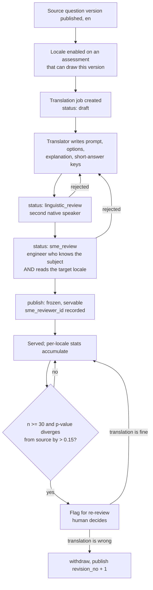

# Internationalisation and localisation

**Status:** draft
**Owner:** _unassigned_
**Last updated:** 2026-09-15
**Companion docs:** [`01-PRD.md`](01-PRD.md), [`02-HLD.md`](02-HLD.md), [`03-API-spec.md`](03-API-spec.md), [`04-ADRs.md`](04-ADRs.md), [`hiring_platform_schema.sql`](hiring_platform_schema.sql), [`09-ats-integration.md`](09-ats-integration.md), [`15-accessibility-conformance.md`](15-accessibility-conformance.md)

---

## 1. The question this document closes

`docs/README.md` lists "No i18n design for question content" as a known gap, and PRD open question 3 asks whether English-only content is acceptable for v1. This document answers both.

**Recommendation: ship v1 with English-only question content and an English-only staff console, but build the seams now — a locale column on every row that will one day need one, a resolution order that already exists, externalised UI strings from the first React component, and a translation table in the schema that is created empty.** Content translation is deferred to v2. UI translation is deferred to v2 but costs almost nothing to prepare for and is prepared for in M1.

The justification is not that other languages do not matter. It is that a translated question is a **different question** — psychometrically, legally, and operationally — and building the machinery to treat it as one is a larger piece of work than it looks, while building the *seams* is a small one. The expensive half of i18n is not the plumbing; it is the human process that keeps 400 translated questions correct across 6 locales as the source bank changes underneath them. Nothing in M0–M2 produces value that depends on that process existing, and a bank of 200 English questions with honest per-question statistics is worth more in month 6 than a bank of 200 questions in three languages whose statistics are pooled and therefore meaningless.

The cost of deferring is bounded to the size of the seams. The cost of retrofitting *without* the seams is a schema migration across `question_versions`, `attempt_questions`, `invitations` and `attempts` while attempts are in flight, plus a string-extraction pass over a finished React codebase. The seams below cost roughly three engineer-days spread across M0 and M1 and remove most of that.

### What we commit to in v1

| Commitment | Milestone | Where it lands |
|---|---|---|
| Every user-visible string in `apps/web` and `apps/candidate` goes through a `t()` call against an ICU catalogue, even though only `en` exists | M1 (2026-10-12 → 2026-10-30) | `packages/ui`, both app bundles |
| `locale` persisted on invitation, attempt, and served question row | M1 | `packages/db` migration |
| Locale negotiation implemented and returning `en` for everyone | M1 | `apps/api`, `packages/auth` |
| `question_version_translations` and per-locale statistics tables created, empty, with constraints live | M0 (2026-09-21 → 2026-10-09) | `packages/db` migration |
| All dates, times and numbers rendered through `Intl.*` with an explicit locale argument, never string concatenation | M1 | `packages/ui` |
| Logical CSS properties (`margin-inline-start`, not `margin-left`) throughout | M1 | `packages/ui`, Tailwind config |

### What we explicitly do not do in v1

No translator tooling, no translation memory, no review workflow UI, no per-locale reporting, no RTL QA pass, no locale-aware assessment composition. These are v2 items and the effort estimate in §13 covers them.

---

## 2. Two different problems that share a name

"i18n" collapses two pieces of work with different owners, different failure modes, and very different risk profiles. Keeping them separate is the single most useful thing this document does.

| | **UI localisation** | **Content localisation** |
|---|---|---|
| What | Console chrome, buttons, nav, validation messages, email templates, candidate app shell, error strings | Question prompts, MCQ options and rationales, explanations, assessment and section names, scorecard criteria and behavioural anchors |
| Volume | ~1,200 strings, growing slowly and predictably | ~200 questions at v1, each with prompt + 4 options + explanation; grows with the bank forever |
| Owner | Frontend engineering, with a professional translation vendor | Question authors and a subject-matter reviewer per locale; the assessment owner is accountable |
| Cost of a bad string | A confusing label. Annoying, cosmetic, fixed in the next release | A candidate answers the wrong question and is rejected. Not cosmetic, and potentially a discrimination exposure |
| Review needed | Linguistic | Linguistic **and** technical. A translator who does not know what a window function is will mistranslate a SQL question in a way no linguist catches |
| Change cadence | Every release | Every source-question edit invalidates every translation of it |
| Statistics | None | Each locale has its own p-value and discrimination. See §5 |
| Legal weight | Low | High. The translated prompt is the artefact a candidate disputes |
| Failure mode | Missing string renders as the key or the English fallback | Missing or wrong translation must **fail closed** — the assessment is not served. See §7 |

The asymmetry drives the design: UI localisation is a solved problem handled by a catalogue and a vendor; content localisation is a versioned, reviewed, statistically-tracked artefact that lives in the database next to the thing it translates.

There is a third category people forget: **operational text authored by customers** — the recruiter's own assessment description, the invitation email's custom message, the organisation's branding copy. This is neither UI nor bank content. It is customer data, it is not translated by us, and the only i18n obligation is that we store it as UTF-8 `text`, never truncate mid-grapheme, and render it with `dir="auto"` so a Hebrew assessment name laid inside an English console reads correctly. That is v1 work and it is nearly free.

---

## 3. Content model

### 3.1 The constraint ADR-003 imposes

ADR-003 makes a published `question_version` immutable and makes attempts reference versions, not questions. A translation is therefore **a property of a specific version, not of the question**. Translating "version 3 of question X into French" is meaningful. Translating "question X into French" is not, because the next source edit produces version 4 and silently invalidates the French text.

The schema as it stands in [`hiring_platform_schema.sql`](hiring_platform_schema.sql) has `question_versions.locale text NOT NULL DEFAULT 'en'` with `UNIQUE (question_id, version_no, locale)`. That column is the seed of a wrong model and we should be explicit about it before anyone builds on it. Storing a translation as a sibling `question_versions` row means:

- `question_stats` is keyed on `question_version_id`, so the French row would accumulate its own statistics — correct — but nothing links it back to the English row it was translated from, so you cannot detect drift or answer "which translations of v3 exist".
- Nothing forces the French row to carry the same `difficulty`, `max_score`, `negative_score` or test cases as its source. Two rows that must score identically are free to disagree.
- The `mcq_options` of the French row are separate rows with separate IDs, so an answer recorded against the French option cannot be compared to the English option in cohort analytics.
- A section rule that draws "10 Python questions at difficulty 3" would draw the English and French rows as two independent questions and could serve both to the same candidate.

**Decision: `question_versions.locale` is reinterpreted as the *source* locale of the authored version — the language the question was written in — and is never used to represent a translation.** Translations live in the tables below. The `UNIQUE (question_id, version_no, locale)` constraint is narrowed to `UNIQUE (question_id, version_no)` in the M0 migration. This is a documentation and migration decision to make now, while the table is empty, not later.

### 3.2 DDL

Written in the style of [`hiring_platform_schema.sql`](hiring_platform_schema.sql). This is planned schema; none of it is built. It lands as a `packages/db` migration in M0 so the constraints exist before any content does.

```sql
-- ============================================================
-- SECTION 4b: CONTENT LOCALISATION
-- A translation belongs to a question_version, not to a question.
-- It carries its own review state and becomes immutable on publish,
-- exactly as the source version does (ADR-003).
-- ============================================================

CREATE TYPE translation_status AS ENUM (
    'draft',                -- translator working
    'linguistic_review',    -- a second speaker of the target locale is checking language
    'sme_review',           -- a subject-matter expert is checking technical correctness
    'published',            -- servable; immutable from here
    'withdrawn'             -- pulled; never served again, kept for audit
);

CREATE TABLE question_version_translations (
    id                      uuid PRIMARY KEY DEFAULT gen_random_uuid(),
    org_id                  uuid NOT NULL REFERENCES organizations(id) ON DELETE CASCADE,
    question_version_id     uuid NOT NULL REFERENCES question_versions(id) ON DELETE CASCADE,
    locale                  text NOT NULL,      -- BCP 47: 'fr', 'pt-BR', 'zh-Hans', 'ar'
    revision_no             int  NOT NULL DEFAULT 1,
    status                  translation_status NOT NULL DEFAULT 'draft',

    prompt_md               text NOT NULL,
    explanation_md          text,

    -- sha256 over the source version's translatable surface at the moment
    -- the translation was created. If the source could ever change this
    -- would detect drift; under ADR-003 it cannot, so this is a tripwire
    -- for an accidental in-place edit and a checksum for import/export.
    source_checksum         text NOT NULL,

    translator_id           uuid REFERENCES users(id),
    linguistic_reviewer_id  uuid REFERENCES users(id),
    sme_reviewer_id         uuid REFERENCES users(id),
    translation_method      text NOT NULL DEFAULT 'human',   -- human | vendor | memory_match
    notes_md                text,               -- translator notes; never shown to candidates

    published_at            timestamptz,
    withdrawn_at            timestamptz,
    created_at              timestamptz NOT NULL DEFAULT now(),

    UNIQUE (question_version_id, locale, revision_no),
    CHECK (locale ~ '^[a-z]{2,3}(-[A-Z][a-z]{3})?(-[A-Z]{2})?$'),
    CHECK (status <> 'published' OR published_at IS NOT NULL),
    CHECK (status <> 'published' OR sme_reviewer_id IS NOT NULL)
);

-- At most one servable translation per (version, locale). Superseding a
-- published translation means withdrawing it and publishing revision_no + 1,
-- which mirrors how versions supersede each other.
CREATE UNIQUE INDEX question_version_translations_live
    ON question_version_translations (question_version_id, locale)
    WHERE status = 'published' AND withdrawn_at IS NULL;

CREATE INDEX ON question_version_translations (org_id, locale, status);

-- MCQ options are translated per option, keyed on the source option so a
-- French answer and an English answer collapse to the same option in analytics.
CREATE TABLE mcq_option_translations (
    id                  uuid PRIMARY KEY DEFAULT gen_random_uuid(),
    translation_id      uuid NOT NULL REFERENCES question_version_translations(id) ON DELETE CASCADE,
    mcq_option_id       uuid NOT NULL REFERENCES mcq_options(id) ON DELETE CASCADE,
    body_md             text NOT NULL,
    rationale_md        text,
    UNIQUE (translation_id, mcq_option_id)
);

-- Short-answer keys are language-dependent: a regex that matches "constant time"
-- does not match "tiempo constante". A translation of a short_answer question is
-- not publishable until it supplies its own key set.
CREATE TABLE short_answer_key_translations (
    id                  uuid PRIMARY KEY DEFAULT gen_random_uuid(),
    translation_id      uuid NOT NULL REFERENCES question_version_translations(id) ON DELETE CASCADE,
    match_type          text NOT NULL,      -- exact | ci | regex | numeric_tolerance
    pattern             text NOT NULL,
    tolerance           numeric,
    score               numeric(6,2) NOT NULL DEFAULT 1.0
);

-- Test-case labels are the only part of a coding question that is translated,
-- and only because they are shown to the candidate ("Case 3: empty input").
-- stdin, expected_stdout and args are never translated. See section 8.
CREATE TABLE test_case_label_translations (
    translation_id      uuid NOT NULL REFERENCES question_version_translations(id) ON DELETE CASCADE,
    test_case_id        uuid NOT NULL REFERENCES test_cases(id) ON DELETE CASCADE,
    label               text NOT NULL,
    PRIMARY KEY (translation_id, test_case_id)
);

-- Per-locale psychometrics. A translated question is a different measurement
-- instrument and cannot inherit the source version's p-value. See section 5.
CREATE TABLE question_version_locale_stats (
    question_version_id uuid NOT NULL REFERENCES question_versions(id) ON DELETE CASCADE,
    locale              text NOT NULL,
    n_attempts          int NOT NULL DEFAULT 0,
    p_value             numeric(5,4),
    discrimination      numeric(5,4),
    mean_seconds        numeric(8,2),
    computed_at         timestamptz,
    PRIMARY KEY (question_version_id, locale)
);

-- Assessment-level chrome the candidate reads before and during the attempt.
CREATE TABLE assessment_translations (
    id                  uuid PRIMARY KEY DEFAULT gen_random_uuid(),
    assessment_id       uuid NOT NULL REFERENCES assessments(id) ON DELETE CASCADE,
    locale              text NOT NULL,
    name                text NOT NULL,
    instructions_md     text,
    UNIQUE (assessment_id, locale)
);

CREATE TABLE assessment_section_translations (
    id                  uuid PRIMARY KEY DEFAULT gen_random_uuid(),
    section_id          uuid NOT NULL REFERENCES assessment_sections(id) ON DELETE CASCADE,
    locale              text NOT NULL,
    name                text NOT NULL,
    instructions_md     text,
    UNIQUE (section_id, locale)
);
```

Locale columns on the rows that resolve or record a locale:

```sql
-- Org default, assessment default, candidate preference, invitation override.
ALTER TABLE users
    ADD COLUMN locale text;          -- null = fall back to Accept-Language, then org default

ALTER TABLE organizations      ADD COLUMN default_locale   text NOT NULL DEFAULT 'en';
ALTER TABLE users
    ADD COLUMN locale text;          -- null = fall back to Accept-Language, then org default

ALTER TABLE organizations      ADD COLUMN enabled_locales  text[] NOT NULL DEFAULT '{en}';
ALTER TABLE assessments        ADD COLUMN default_locale   text NOT NULL DEFAULT 'en';
ALTER TABLE assessments        ADD COLUMN offered_locales  text[] NOT NULL DEFAULT '{en}';
ALTER TABLE candidates         ADD COLUMN preferred_locale text;      -- null = not stated
ALTER TABLE invitations        ADD COLUMN locale           text;      -- null = negotiate

-- What was actually resolved and served. Never recomputed, for the same
-- reason attempt_questions is materialised at start (ADR-004).
ALTER TABLE attempts           ADD COLUMN locale           text NOT NULL DEFAULT 'en';
ALTER TABLE attempt_questions  ADD COLUMN locale           text NOT NULL DEFAULT 'en';
ALTER TABLE attempt_questions  ADD COLUMN translation_id   uuid REFERENCES question_version_translations(id);

CREATE INDEX ON attempt_questions (translation_id);   -- per-locale exposure and stats
```

`attempt_questions.translation_id` is the row that makes a dispute answerable. Twelve months after the fact, "what exactly did this candidate read" resolves to one immutable row, not to a join that re-derives the current best translation.

### 3.3 Immutability rules

A translation follows the same lifecycle discipline as the version it belongs to:

1. `draft` and both review states are freely editable.
2. `publish` sets `published_at`, sets `status = 'published'`, and freezes the row. `PATCH` against a published translation returns `409` with code `translation_immutable`, mirroring `version_immutable`.
3. Correcting a published translation means `POST .../withdraw` followed by a new row at `revision_no + 1`. In-flight attempts that already materialised the withdrawn translation finish on it — the same rule FR-10 applies to assessment versions.
4. A withdrawn translation is never deleted. It is the evidence for any attempt that was served it.
5. Publishing a translation requires `sme_reviewer_id` to be set, enforced by a `CHECK`, not by application code. See §10.

---

## 4. Why not machine translation in the serving path

Worth stating plainly because it will be proposed. ADR-011 keeps AI out of the scoring and decision path. A machine-translated question prompt is *in* that path: the prompt is the stimulus that produces the score. Machine translation may be used as a **first-pass drafting aid for a human translator**, exactly as ADR-011 permits AI question drafting with a human reviewer — recorded as `translation_method = 'vendor'` or a distinct value with the engine named in `notes_md` — but no translation reaches a candidate without a named human linguistic reviewer and a named human subject-matter reviewer. This is the same shape as ADR-011 and should not be softened.

---

## 5. Translation changes the psychometrics

This is the part that is easy to get wrong and expensive to discover late.

A question's difficulty is a property of the question *and its wording*. Translation changes the wording. Concretely:

- **Lexical difficulty moves.** "Idempotent" is a specialist English term; the natural German rendering may be a common compound and therefore easier, or an unfamiliar loanword and therefore harder.
- **Distractor plausibility moves.** MCQ distractors work because they are attractive. A distractor that shares a misleading English word stem may share nothing in Japanese, and the question becomes easier because the wrong answer stops tempting anyone.
- **Reading load moves.** Romance-language translations of English technical prose typically run 15–25% longer. A question calibrated at `est_seconds = 120` can take materially longer to read, which changes time pressure and therefore performance on a timed assessment.
- **The population moves.** Candidates taking the French version are a different population from candidates taking the English version. Even a perfect translation would produce a different p-value, because p-value is a property of the item *and the cohort*.

Consequences, all of which are hard rules:

1. `question_version_locale_stats` is keyed on `(question_version_id, locale)`. A translated question never inherits the source version's `p_value`, `discrimination` or `mean_seconds`. The source version's row in `question_stats` becomes, in effect, the `en` row; the nightly job writes both and the API reads the locale-specific row.
2. The FR-5 threshold applies per locale: statistics are computed only once n ≥ 30 **in that locale**. A French translation served to 12 candidates has no statistics, and the UI shows "insufficient data", not the English numbers.
3. Section rules that filter on difficulty use the authored `difficulty` band (1–5), which is a human judgement about the source. Where per-locale statistics exist and disagree materially with the authored band, that is a **review signal** surfaced in `GET /assessments/{id}/analytics`, not an automatic re-banding. Nothing re-bands a question automatically.
4. **Divergence detection.** Once both locales clear n ≥ 30, a nightly check flags any `(version, locale)` whose p-value differs from the source locale's by more than 0.15, or whose discrimination falls below 0.2 while the source is above it. A flag means "a human reads the translation again", nothing more. Threshold is a working assumption — TBD: confirm the divergence threshold against real data, owner: whoever owns question quality, decide by 2027-03-31.
5. **Cohort comparison across locales is not valid by default.** A cohort report that mixes locales must label it. Comparing a candidate who took the Spanish version against a candidate who took the English version on raw score assumes measurement equivalence that has not been established. Establishing it properly is differential item functioning analysis, which is out of scope for v2 and noted here so nobody claims it silently.
6. Exposure counting (FR-4) is per version, summed across locales — a leaked question is leaked regardless of which language it leaked in — but the retirement report breaks the count down by locale so you can see where it leaked.

---

## 6. Locale negotiation

One resolution order, implemented once, in `packages/core-domain`, used by the API on invitation redemption and by nothing else. The resolved locale is written to `attempts.locale` and never recomputed.

```
1. invitations.locale            explicit, set by the recruiter or by the ATS
                                 on the invitation. Wins over everything.
2. candidates.preferred_locale   stated by the candidate or supplied by the ATS
                                 in the inbound candidate payload.
3. Accept-Language               the browser's header, at redemption time only,
                                 matched against assessments.offered_locales
                                 using BCP 47 lookup (RFC 4647).
4. assessments.default_locale    what this assessment is authored in.
5. organizations.default_locale  the tenant's fallback.
6. 'en'                          the system fallback, always present.
```

Rules that make this behave:

- Every step is filtered through `assessments.offered_locales` **first**. A candidate whose browser says `de-AT` but whose assessment is offered in `{en, fr}` gets step 3 skipped entirely, not a German attempt that fails at question 1.
- Matching is BCP 47 *lookup*, not exact string equality: `pt-BR` requested against `{pt}` offered resolves to `pt`; `pt` requested against `{pt-BR, pt-PT}` offered resolves to the assessment's default among them, not to an arbitrary pick.
- `Accept-Language` is read exactly once, at `POST /candidate/redeem`. It is not consulted again. A candidate who switches browsers mid-attempt keeps the locale the attempt started in, because the served question set is materialised (ADR-004) and the prompts are part of what was materialised.
- The candidate may change locale **only before `POST /attempt/start`**, through an explicit control on the pre-start screen, and only to a locale in `offered_locales`. After start the choice is frozen. Allowing a mid-attempt switch means the candidate reads two different framings of the same question, which is both a fairness problem and an analytics problem.
- The resolved locale is echoed in every attempt response as `locale`, so the candidate app never guesses.
- Staff UI locale is independent and resolves from `users.timezone`'s sibling `users.locale` (added in the same migration), falling back to `Accept-Language` then the org default. A recruiter reading a French console can inspect an English attempt; the attempt renders in the locale it was served in, with a badge saying so.

---

## 7. Fallback policy, and failing closed

**Hard rule: a partially translated assessment is never served.** If a candidate resolves to `fr` and any single question drawn for that attempt has no published `fr` translation, the attempt does not start in French. There is no per-question fallback to English inside a French attempt.

The reasoning is not aesthetic. A candidate who reads nine questions in French and hits the tenth in English is (a) disadvantaged relative to the French cohort, which is an adverse-impact exposure, (b) statistically in neither cohort, and (c) very likely to raise a support ticket that becomes a dispute. Mixed-language assessments are worse than monolingual assessments in a second language.

Where the check happens, in order of preference — earliest is best:

| Stage | Check | Failure behaviour |
|---|---|---|
| `POST /assessments/{id}/simulate` | For each locale in `offered_locales`, resolve every section rule and pinned question and assert a published translation exists for every candidate version in the draw pool | `feasible: false` with `warnings[]` naming the locale and the untranslated question versions |
| `POST /assessments/{id}/publish` | Same check, blocking | `409 conflict`, code `locale_coverage_incomplete`, details listing locale → missing version IDs |
| `POST /invitations` | `locale` (if set) must be in `offered_locales` | `422 validation_failed`, code `locale_not_offered` |
| `POST /attempt/start` | Last-resort assertion after the draw is resolved | `409 conflict`, code `locale_coverage_incomplete`; the attempt stays in `created` and the candidate sees a "contact the recruiter" screen rather than a broken test |

The `simulate` check is the important one. §5 of [`03-API-spec.md`](03-API-spec.md) already makes `simulate` mandatory before publish precisely to catch "your rule asks for 10 hard Python questions and the bank has 4". Locale coverage is the same class of failure — an infeasible draw discovered at the worst possible moment — and belongs in the same gate.

A random-draw rule makes this stricter than it first appears: coverage must hold for the **entire eligible pool**, not for one sampled draw, because the next candidate draws differently. In practice this means enabling a locale on an assessment requires translating every question the rules can reach, which is a real cost and is precisely why locale enablement is an explicit, deliberate action per assessment rather than an org-wide switch.

### Where fallback *is* allowed

- **UI strings.** A missing catalogue key falls back to the source-locale string, then to the key itself. This is a cosmetic failure and blocking the console over it would be absurd. CI fails the build on a missing key in a non-`en` catalogue at 100% coverage requirement for `en`; other locales warn.
- **Assessment and section names and instructions.** These fall back to the assessment default locale, because they are chrome, not stimulus. The candidate app marks fallback text with `lang="en"` so screen readers switch voice correctly — see [`15-accessibility-conformance.md`](15-accessibility-conformance.md).
- **Explanations shown post-attempt.** If `explanation_md` has no translation but the prompt does, the explanation falls back with a visible language marker. It does not affect scoring and withholding it is worse than showing it in English.
- **Emails.** Fall back to the org default locale, with the candidate-facing link always working regardless.

---

## 8. What is never translated

Translating any of the following is a correctness bug, not a missing feature. This list belongs in the translator brief verbatim.

| Never translated | Why |
|---|---|
| Code in fenced blocks, inline code spans, identifiers, keywords | `if` is not a word in the prompt; it is a token. A translated identifier makes starter code and reference solutions disagree |
| `test_cases.stdin`, `expected_stdout`, `args` | Graded data. Translating `"true"` to `"vrai"` fails every test case |
| `coding_specs.starter_code`, `solution_code`, `checker_code`, `fixture_sql` | Executed, not read. A translated column name in `fixture_sql` breaks the SQL question |
| Language names and versions (`python 3.12`, `cpp`) | Identifiers in the exec adapter |
| `skills.key`, `job_roles.code`, `permissions.key`, error `code` values, event names | Stable machine identifiers. `skills.name` **is** translatable; `skills.key` is not |
| Room codes, invitation tokens, UUIDs, `external_ref` | Opaque |
| Units and symbols inside test data (`ms`, `MB`, `O(n log n)`) | Notation, not prose |
| SQL keywords and PostgreSQL error text surfaced from a failed query | Comes from the engine; translating it would mean rewriting engine output |

Comments *inside* starter code are a genuine grey area: they are read by the candidate, so leaving them in English partially defeats the translation, but translating them risks touching the code. **Decision: comments in starter code are translatable, but only through a dedicated `starter_code_comment_translations` mechanism deferred to v2, and only when the language's comment syntax is preserved.** For v2 launch, starter-code comments stay in the source locale and the translator brief says so.

Prompt Markdown is translated as Markdown. The translator tool must present fenced blocks as locked, non-editable regions. Anything less and someone will translate `# Example` inside a Python block into a French comment and nobody will notice until a candidate's code fails to compile.

---

## 9. Formatting, direction, and the clock

### Message catalogues

**Format: ICU MessageFormat, stored as flat JSON catalogues, one file per locale per bundle.**

```
apps/web/src/locales/en.json
apps/web/src/locales/fr.json
apps/candidate/src/locales/en.json
packages/ui/src/locales/en.json
```

Keys are dotted, namespaced by feature, and never assembled at runtime (`t('attempt.timer.remaining')`, never `t('attempt.' + section + '.label')`) — runtime-assembled keys cannot be statically extracted and cannot be verified by CI.

ICU MessageFormat rather than a simpler placeholder syntax, because the two things that break naive systems are plurals and gender, and ICU handles both declaratively:

```json
{
  "attempt.questions.remaining": "{count, plural, =0 {No questions left} one {# question left} other {# questions left}}",
  "attempt.timer.remaining": "{minutes, number} min {seconds, number} s remaining",
  "report.score.summary": "{name} scored {pct, number, percent} on {assessment}"
}
```

English has two plural categories. Russian has four, Arabic has six, Japanese has one. Hardcoding `count === 1 ? 'question' : 'questions'` anywhere in the codebase is a lint error from M1, with a custom ESLint rule, because it is invisible until the day someone adds Russian and then it is everywhere.

**Tooling, all within the licence policy of [`05-licensing-and-compliance.md`](05-licensing-and-compliance.md):**

| Need | Choice | Licence |
|---|---|---|
| Runtime formatting | `intl-messageformat` / FormatJS | BSD-3-Clause |
| React bindings | `react-intl` | BSD-3-Clause |
| Extraction and linting | `@formatjs/cli` + `eslint-plugin-formatjs` | BSD-3-Clause / MIT |
| Number, date, currency, relative time, list, plural rules | Platform `Intl.*` | Built in; no dependency |
| Locale matching (RFC 4647 lookup) | `@formatjs/intl-localematcher` | BSD-3-Clause |
| Server-side formatting (emails, PDF reports) | Same FormatJS packages under Node 22 | BSD-3-Clause |

Rejected: any hosted TMS that requires pushing candidate-adjacent content to a third party without a data-processing agreement (see §12 of [`09-ats-integration.md`](09-ats-integration.md) for the same argument in the ATS context), and any tool under a copyleft or source-available licence. CI enforces this via `scripts/check-licences.mjs` like everything else.

Catalogues are checked into the repo. They are code. A locale is added by adding a file and adding the tag to `enabled_locales`, both of which are reviewed changes.

### RTL

Arabic and Hebrew are the realistic RTL targets. Preparing for them is cheap if done from the first component and expensive as a retrofit.

- `<html dir>` is set from the resolved locale. No component reads it.
- **Logical CSS properties only**: `margin-inline-start`, `padding-inline-end`, `inset-inline-start`, `text-align: start`. Tailwind's logical utilities (`ms-4`, `pe-2`, `start-0`) are used instead of `ml-4`, `pr-2`, `left-0`. A lint rule bans the physical variants in `packages/ui` from M1.
- Icons that encode direction (back arrows, progress chevrons, the "next question" affordance) need mirroring; icons that encode a thing (a clock, a warning triangle) must not be mirrored. This is a per-icon decision recorded in the icon component, not a blanket CSS transform.
- **Code is always LTR, even inside an RTL page.** The Monaco editor, code blocks in prompts, and test-case output are wrapped in `dir="ltr"` containers. A right-to-left rendering of a Python function is unreadable and Monaco's own RTL support is not something to rely on. Monaco's line numbers stay on the left.
- Mixed-direction strings (an Arabic prompt containing an English function name) need Unicode bidi isolation — `<bdi>` around interpolated values, or `dir="auto"` on the containing element. Getting this wrong makes the prompt read in the wrong order, which is a correctness failure, not a styling one.
- RTL QA is a manual pass, once, when the first RTL locale is enabled. Budget two days.

### Numbers, dates, times

Everything renders through `Intl.NumberFormat` / `Intl.DateTimeFormat` with an explicit locale and an explicit time zone. No `toLocaleString()` without arguments — it silently picks up the server's locale in Node and the browser's in the client, which produces reports that differ depending on where they were generated.

Specific traps:

- **Decimal separators.** A score of `7.5` renders as `7,5` in French and German. Score *inputs* in the staff console (manual override, criterion weights) must accept the locale's separator and parse it back to a canonical decimal. Parsing a locale-formatted number is not something `Intl` does; use an explicit parse against the locale's resolved separators and reject ambiguity rather than guessing.
- **Percentages.** Pass-mark and `score_pct` render through `{style: 'percent'}`, which places the sign correctly (`75 %` in French, `75%` in English).
- **Names.** `full_name` is a single field and stays one. Do not split into given/family; not all locales have that structure and no feature needs it.
- **Sorting.** Candidate and question lists sort with `Intl.Collator` for the viewing locale, not with Postgres's default collation, or German umlauts land in the wrong place. Where the sort must happen in SQL for pagination, use an explicit `COLLATE` matching the request locale.
- **CSV export.** Excel's separator handling is locale-dependent and will mangle a comma-decimal CSV. Exports are UTF-8 with BOM, always comma-separated, always with `.` as the decimal separator, and documented as such. Localised number formatting in a machine-readable export is a bug.

### The clock

ADR-006 makes the server authoritative over time. Localisation does not touch that, and the rule is worth stating in one sentence because it is where clock bugs come from:

**Compare in UTC, display in the candidate's locale and time zone.**

- `deadline_at`, `server_time`, `opens_at`, `expires_at` are `timestamptz`, transmitted as RFC 3339 UTC, compared in UTC on the server. Nothing about locale, time zone, or calendar system enters the comparison.
- The countdown is a *duration*, not a time. It renders through `Intl.NumberFormat` with the locale's digits — Arabic-Indic digits where the locale calls for them — but the number of seconds comes from `server_time` reconciliation on every heartbeat, exactly as ADR-006 specifies.
- Absolute times shown to a candidate ("this invitation expires 14 October 2026 at 17:00 IST") render with `Intl.DateTimeFormat` in the candidate's time zone, with the zone name always visible. Never show an absolute time without its zone; a candidate in a different zone from the recruiter will misread it, miss the window, and be right to complain.
- Non-Gregorian calendars (`ar-SA-u-ca-islamic`, `fa-IR-u-ca-persian`) are a display concern `Intl.DateTimeFormat` handles natively. They never reach the comparison path. If a display calendar is ever configured, the underlying instant is unchanged.
- Time-zone data lives in the platform ICU, which means Node and the browsers must be kept current for zone-rule changes. This is an operations note for [`12-observability-and-runbooks.md`](12-observability-and-runbooks.md), not an application concern.

---

## 10. Translator workflow

The process, not the tooling, is what makes content localisation expensive. Specified here so the v2 estimate is honest.



The non-obvious requirement: **`sme_review` is a distinct gate from `linguistic_review` and cannot be collapsed into it.** A professional translator produces fluent, accurate prose and will still translate "race condition" into a phrase that means "a competitive situation", or render a deliberately-plausible distractor into something obviously wrong. Both errors are invisible to a linguist and obvious to any engineer who reads the target language. The `CHECK (status <> 'published' OR sme_reviewer_id IS NOT NULL)` constraint exists because this gate is the one that will be skipped under delivery pressure.

Finding that reviewer is the real constraint. A team that cannot name a Spanish-reading backend engineer willing to review 200 questions should not enable Spanish. That is a staffing question, and it is the question that should be asked before any of this is built.

Other process notes:

- Translation is scoped to **assessments, not to the bank**. You translate the pool an assessment can draw from, not all 400 questions, or the cost is unbounded and mostly wasted.
- Because source versions are immutable, a source edit produces a new version with zero translations, and the new version cannot be served in a locale until it is translated. The authoring UI must warn on publish: "3 locales are enabled for assessments using this question; publishing v4 will make them incomplete." This warning is the single most valuable piece of translation tooling and it is one query.
- Translation memory (matching a new source string against previously translated ones) becomes worthwhile somewhere around 500 translated questions. Below that, the tooling costs more than it saves. Deferred past v2.
- Import/export (FR-29, QTI 2.1) must round-trip translations. QTI carries `xml:lang` on content elements, so the mapping exists; the export writes one `assessmentItem` per locale sharing a common identifier stem.

---

## 11. API changes

None of these are built. This is the delta against [`03-API-spec.md`](03-API-spec.md) that v2 requires, listed so the v1 API does not paint itself into a corner.

### Conventions

- `Accept-Language` is honoured on staff endpoints for *response chrome only* — error `message` strings, generated report labels. It never changes response data shape and never changes an error `code`. Codes are stable identifiers and are not translated (§8).
- A `locale` query parameter, where present, overrides `Accept-Language`. An unsupported locale returns `422` with code `locale_not_supported` rather than silently falling back, so a client bug is visible.
- Every response carrying localisable content includes a `locale` field naming what was actually resolved, and `Content-Language` is set to match.

### Question bank

```
GET    /questions/{id}/versions/{v}                  ?locale=      → source + requested translation
GET    /questions/{id}/versions/{v}/translations     → [{locale, status, revision_no, reviewers, published_at}]
POST   /questions/{id}/versions/{v}/translations     {locale, prompt_md, explanation_md,
                                                      options[], short_answer_keys[]?,
                                                      test_case_labels[]?}
PATCH  /translations/{id}                            → 409 translation_immutable if published
POST   /translations/{id}/submit-for-review          {stage: linguistic|sme}
POST   /translations/{id}/publish                    → requires question.publish + sme_reviewer set
POST   /translations/{id}/withdraw                   {reason}
GET    /questions/{id}/versions/{v}/stats            ?locale=      → per-locale psychometrics
```

### Assessments

```
PATCH  /assessments/{id}                             {default_locale, offered_locales[]}
POST   /assessments/{id}/simulate                    ?locale=  (omitted = check every offered locale)
                                                     → {feasible, per_locale: {locale: {feasible,
                                                        missing_translations[]}}, warnings[]}
GET    /assessments/{id}/locale-coverage             → per locale: pool size, translated count,
                                                       the exact version IDs that block enablement
PUT    /assessments/{id}/translations                {locale, name, instructions_md}
```

`GET /assessments/{id}/locale-coverage` is the endpoint a recruiter looks at before asking for a locale. It answers "what would it cost to offer this in French" as a number of questions.

### Invitations and attempts

```
POST   /invitations                {..., locale?}     → 422 locale_not_offered if not in offered_locales
POST   /candidate/redeem           {token}            → resolves per section 6; response carries
                                                        {locale, available_locales[]}
PATCH  /attempt/locale             {locale}           → only while status = 'created'; 409 otherwise
GET    /attempt/questions/{ordinal}                   → prompt in attempts.locale; response carries
                                                        {locale, source_locale} so the client can mark
                                                        fallback chrome with the right lang attribute
```

### Reporting

```
GET    /assessments/{id}/analytics  ?locale=          → per-locale p-value, discrimination,
                                                        option distribution; omitting locale
                                                        returns per-locale breakdown, never a
                                                        pooled number across locales
GET    /reports/adverse-impact      ?group_by=locale  → pass rate by served locale
```

The last one matters and is covered next.

### Webhooks

`attempt.finalised` and `invitation.sent` payloads gain a `locale` field. This is an additive change to the event catalogue in [`09-ats-integration.md`](09-ats-integration.md) §3 and follows the additive-only compatibility rule stated there.

---

## 12. Fairness

Offering an assessment in a candidate's second language is an adverse-impact consideration, and it cuts both ways.

**Not offering a locale** can disadvantage a group defined by national origin. A campus drive in a market where technical education is conducted in the local language, run entirely in English, measures English reading speed alongside engineering skill. Where English proficiency is a genuine requirement of the job — which for a distributed engineering team it usually is — that is defensible. Where it is not, it is a construct-irrelevant barrier, which is the technical term for testing something the job does not need.

**Offering a locale badly** is worse than not offering it. A poor translation makes the question harder in a way that is invisible in the score. This is the entire argument for the `sme_review` gate and for per-locale statistics.

Design consequences:

1. **Adverse-impact reporting supports `group_by=locale`.** `GET /reports/adverse-impact` already exists in §9 of [`03-API-spec.md`](03-API-spec.md); locale joins the grouping dimensions. If the Spanish cohort's pass rate is below four-fifths of the English cohort's, that is a finding requiring investigation, exactly as it would be for any other group.
2. **Extra time may be warranted and is already a first-class feature.** PRD §9 makes per-candidate time extensions a supported, audited accommodation, and `invitations.accommodations.extra_time_pct` already carries it. A candidate testing in a second language has a documented basis for requesting it. The policy question — whether second-language testing warrants a standard uplift, and how much — is a policy decision, not an engineering one. TBD: define the second-language time-accommodation policy, owner: hiring policy owner with legal review, decide by 2027-02-28. Engineering's obligation is that the mechanism exists, is recorded on the invitation, flows into `deadline_at`, and appears in the audit log. All of that is v1.
3. **Time limits calibrated on one locale may not transfer.** If translations run 20% longer to read, the same `duration_seconds` is a tighter constraint in the translated locale. `question_version_locale_stats.mean_seconds` measures this directly. Where the mean time for a locale exceeds the source locale's by a material margin, the assessment's duration should be reconsidered for that locale — a human judgement, surfaced by data, never automatic.
4. **The candidate is told which locales are available before starting** and chooses. A forced locale assignment based on inferred nationality would be both offensive and legally reckless. `available_locales[]` in the redeem response exists for this.
5. **The served locale is part of the score record.** `attempts.locale` and `attempt_questions.translation_id` mean that "which language did they sit this in" is answerable for any historical attempt, which is what a defensibility review will ask.

---

## 13. Effort, and what would make this v1

### Estimate

Assumes the seams from §1 are in place. One engineer unless noted.

| Work | Estimate |
|---|---|
| UI localisation infrastructure: FormatJS wiring, extraction, catalogue CI, `t()` everywhere already done via seams | 4 days |
| First non-English UI locale end to end, including email templates and PDF report labels | 3 days |
| Content schema migration, translation CRUD API, immutability and review-state enforcement | 6 days |
| Translation authoring UI: side-by-side editor, locked code regions, review queue, diff against source | 8 days |
| Locale negotiation, attempt materialisation, fail-closed checks in simulate/publish/start | 4 days |
| Per-locale statistics: nightly job changes, divergence flagging, analytics API and UI | 4 days |
| RTL pass: logical properties audit, bidi isolation, icon mirroring, manual QA | 4 days |
| QTI and JSON import/export round-tripping translations | 3 days |
| Locale-aware formatting audit: number parsing, collation, CSV, calendars | 3 days |
| **Engineering total** | **~39 days ≈ 8 engineer-weeks** |
| Translation of a 250-question pool, per locale, including both review passes | 3–5 weeks elapsed, mostly non-engineering |
| Ongoing: re-translation on every source version bump | ~10% of authoring throughput, per locale, forever |

The last row is the one that decides this. Engineering cost is bounded and one-time. Translation maintenance is unbounded and recurring, and it scales with the number of locales multiplied by the bank's churn rate. Two locales on a churning bank is a part-time job that nobody has been hired for.

### Triggers that would move this into v1

Any one of these makes the case; the first two are the realistic ones.

1. **A committed campus drive in a market where the candidate population does not test comfortably in English**, with a named cohort and a date. This is the trigger most likely to fire, and it fires with the least warning.
2. **A customer or internal business unit with a contractual or regulatory requirement to assess in a specific language.** Several jurisdictions require employment-related communications in an official language; France and Québec are the standard examples. Legal, not optional, and it makes the locale a hard gate rather than a nice-to-have. Cross-reference [`05-licensing-and-compliance.md`](05-licensing-and-compliance.md).
3. **Certification mode (M4) sold externally.** A certification programme with international candidates has different expectations from an internal hiring funnel, and a monolingual certification is a weaker credential. See [`10-certification-and-credentials.md`](10-certification-and-credentials.md).
4. **Measured adverse impact by national origin** traced to language. If §12's report shows it, remediation is not optional and the timeline is not ours to choose.
5. **A named subject-matter reviewer per target locale is already on staff and has capacity.** Not sufficient alone, but its absence is disqualifying — see §10.

If a trigger fires during M0–M2, the response is to add the locale work as a milestone between M2 (ends 2026-11-27) and M3 (starts 2026-11-30) rather than to interleave it, because the fail-closed checks touch `simulate`, `publish` and `start` — three paths that must be stable before live interviews are built on top of them.

---

## 14. Open items

| Item | Owner | Decide by |
|---|---|---|
| Confirm the p-value divergence threshold (working assumption 0.15) against real per-locale data | question quality owner | 2027-03-31 |
| Second-language time-accommodation policy: standard uplift or case by case | hiring policy owner, with legal review | 2027-02-28 |
| Whether starter-code comments are translated, and the mechanism if so | engineering lead | at v2 scoping |
| Candidate self-service locale switch before start: one control or a locale-specific invitation link per locale | product | at v2 scoping |
| Which locales, in priority order, and who reviews each | hiring policy owner | at the first trigger in §13 |
| Narrow `question_versions` `UNIQUE (question_id, version_no, locale)` to `UNIQUE (question_id, version_no)` while the table is empty | engineering lead | 2026-10-09, end of M0 |
