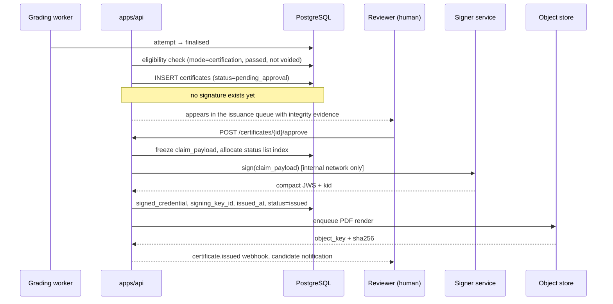

# Certification and verifiable credentials

**Status:** draft
**Owner:** _unassigned_
**Last updated:** 2026-09-15
**Companion docs:** [`01-PRD.md`](01-PRD.md) · [`02-HLD.md`](02-HLD.md) · [`03-API-spec.md`](03-API-spec.md) · [`04-ADRs.md`](04-ADRs.md) · [`05-licensing-and-compliance.md`](05-licensing-and-compliance.md) · [`11-data-retention-and-dpia.md`](11-data-retention-and-dpia.md) · [`14-threat-model.md`](14-threat-model.md) · [`16-ai-usage-policy.md`](16-ai-usage-policy.md) · [`hiring_platform_schema.sql`](hiring_platform_schema.sql)

---

## 1. The decision

PRD §11 open question 4 asks whether certification mode issues verifiable credentials or a PDF. The docs index lists the same thing as a known gap: "Certificate issuance format undecided (PDF vs Open Badges)". This document closes it.

**Decision.** The canonical credential is an **Open Badges 3.0** credential — a W3C Verifiable Credential — signed by the issuing organisation. A **rendered PDF** is produced from the same signed source as a presentation artefact. Both are issued together from one issuance event; neither is issued without the other.

**Why not PDF alone.** A PDF is a picture of a claim. It carries no cryptographic binding to the issuer, so verifying one means a human emailing the issuer and a human answering. Any candidate with a text editor can change a name, a date or a score; the forgery is indistinguishable from the original because there is nothing to compare against. A hiring platform whose entire design rationale is "a defensible, repeatable, auditable record" (PRD §1) cannot ship an unverifiable credential as its output.

**Why not a badge alone.** Nobody outside the credentialing world knows what a `.jsonld` file is. A candidate wants something to attach to an email, drop into a portfolio, and print. A recruiter at the receiving end wants to look at it for four seconds. A credential that is technically superior and socially unusable is not used, and an unused credential is worth less than a forgeable one.

**Why both from one source.** The failure mode of issuing both independently is divergence: the PDF says 82%, the badge says 84%, and now you have two conflicting assertions with the issuer's name on them. The PDF is therefore a *rendering* of the signed credential, deterministic, reproducible from the credential alone, and explicitly marked on its face as not authoritative. When the two disagree, the signed credential wins, and the PDF says so in print.

**Why Open Badges 3.0 specifically.** Open Badges 2.0 is a hosted-JSON format whose verification depends on the issuer's server being reachable and honest forever — it is a link, not a proof. Open Badges 3.0 is aligned with W3C Verifiable Credentials 2.0: the credential carries its own proof, verifies offline, and is portable into wallets that already exist. It is also the format the education and professional-certification ecosystem is converging on, which matters because the value of a credential is entirely a function of who can read it.

**What we are not doing.** No blockchain anchoring. The property people reach for blockchains to get — the issuer cannot silently un-issue — is not a property we want, because GDPR erasure requires us to be able to withdraw a credential (§11). A signed credential plus a published status list gives verifiability without immutability, which is the correct trade for personal data.

### Scope

Credentials are a **certification mode** feature. They are issued from proctored certification exams (M4) and, by explicit configuration, from other assessments an organisation chooses to certify. They are never issued from a screening round by default: a screening result is an internal hiring signal, not a public claim about a person, and turning every failed screen into a dangling credential record is both useless and a retention liability.

---

## 2. What a hiring credential may assert, and what it may not

Everything in this document follows from one sentence:

> A credential from this platform asserts what the system observed under stated conditions. It never asserts that the system verified who was sitting at the keyboard.

ADR-007 says proctoring produces signals, never decisions. Applied to credentials, that means the credential cannot launder a weak signal into a strong claim. A webcam that saw one face for ninety minutes did not establish identity; it established that one face was visible. Writing "identity verified" on a credential because a proctoring profile was active would be exactly the automated integrity verdict ADR-007 forbids, printed and signed.

So the credential carries an explicit **assurance profile** — the conditions that actually applied — and an explicit limitation statement in human-readable text, rendered on the PDF and shown on the verification page. The reader decides what that assurance is worth. We do not decide for them.

| The credential asserts | The credential does not assert |
|---|---|
| This assessment, at this version, was completed | That a particular human being completed it |
| The score achieved and the threshold applied | That the score predicts job performance |
| The skills the questions were tagged with, at the difficulty band served | Mastery of those skills in general |
| The proctoring profile in force and whether a human reviewed integrity signals | That no assistance was used |
| The issuing organisation and the date | Any endorsement by a third party or standards body |

---

## 3. Credential data model

### 3.1 Required fields

A hiring certification must carry the following. Anything not on this list is a candidate for omission, because a credential is personal data and every field is a disclosure.

| Field | Source | Notes |
|---|---|---|
| Credential identifier | `certificates.credential_id` | A URN UUID. Stable for the life of the credential, survives re-signing. |
| Issuer | Org profile, `did:web` | Resolvable issuer document carrying the public keys. |
| Subject name | `candidates.full_name`, holder-approved | Display mode chosen at issuance (§4.2). |
| Subject identifier | Salted SHA-256 of the candidate email | Never the plaintext email. Lets a holder prove the badge is theirs without publishing the address. |
| Achievement | Assessment name, description, criteria URL | The human-readable "what this is". |
| Assessment reference | `assessments.id` + `assessment_version` | The exact version, per ADR-003's logic applied one level up. |
| Attempt reference | `attempts.id` | **Internal only.** Present in the platform's record, never in the public credential (§7.2). |
| Result | `raw_score`, `max_score`, `score_pct`, `pass_score_pct` | Score inclusion is an org setting; the threshold is always present. |
| Skills demonstrated | `skills.key` per question served, rolled up | Taxonomy keys, not free text, so a consumer can machine-match. |
| Assurance profile | `assessments.proctoring_profile`, review outcome | Plus the limitation statement from §2. |
| Issued at | `certificates.issued_at` | RFC 3339 UTC. |
| Expires at | `certificates.expires_at` | Nullable only where the org has an explicit no-expiry policy (§10). |
| Revocation pointer | Bitstring Status List entry | List URL plus index. |
| Proof | Detached EdDSA signature | Key id references the issuer document. |

### 3.2 Serialisation

The canonical media type is `application/vc+jose` — an *enveloping* proof: the credential payload is the JWT claim set, signed with EdDSA over Ed25519. This is chosen over an embedded Data Integrity proof (`eddsa-rdfc-2022`) for one reason: embedded proofs require RDF canonicalisation of the JSON-LD document before hashing, which drags in a JSON-LD processor, a canonicalisation library, and a class of verification failures caused by context resolution rather than by anything being wrong with the credential. JWS is a dependency we already carry for session tokens, and its failure modes are boring.

The cost is ecosystem reach: some wallets and verifiers accept only Data Integrity proofs. Mitigation: `GET /public/credentials/{code}` content-negotiates, and a Data Integrity serialisation is a post-M4 addition producing a second proof over the same claim set — the credential identifier does not change, so a holder does not end up with two credentials.

### 3.3 Example credential (claim set, before signing)

```json
{
  "@context": [
    "https://www.w3.org/ns/credentials/v2",
    "https://purl.imsglobal.org/spec/ob/v3p0/context-3.0.3.json"
  ],
  "id": "urn:uuid:0f1c2b4a-8d3e-4c7a-9f21-6b0d5e8a1c33",
  "type": ["VerifiableCredential", "OpenBadgeCredential"],
  "issuer": {
    "id": "did:web:hiring.example.com:issuers:acme",
    "type": ["Profile"],
    "name": "Acme Engineering",
    "url": "https://hiring.example.com/public/issuer/acme"
  },
  "validFrom": "2027-01-19T10:04:31Z",
  "validUntil": "2029-01-19T10:04:31Z",
  "credentialSubject": {
    "type": ["AchievementSubject"],
    "identifier": [
      {
        "type": "IdentityObject",
        "identityType": "emailAddress",
        "hashed": true,
        "salt": "8f2b1d7c9a4e6035",
        "identityHash": "sha256$4b1f...c92a"
      }
    ],
    "name": "R. Mehta",
    "achievement": {
      "id": "https://hiring.example.com/public/achievements/acme-backend-cert-v3",
      "type": ["Achievement"],
      "name": "Acme Backend Engineering Certification",
      "description": "Proctored examination covering server-side Python, relational data modelling and API design.",
      "criteria": {
        "narrative": "Score of at least 70% across four sections, completed within 90 minutes under the stated proctoring profile."
      },
      "alignment": [
        { "type": ["Alignment"], "targetCode": "python", "targetName": "Python", "targetFramework": "acme.skills.v2" },
        { "type": ["Alignment"], "targetCode": "sql.window-functions", "targetName": "SQL window functions", "targetFramework": "acme.skills.v2" },
        { "type": ["Alignment"], "targetCode": "api-design", "targetName": "API design", "targetFramework": "acme.skills.v2" }
      ],
      "resultDescription": [
        { "id": "urn:uuid:...:score", "type": ["ResultDescription"], "name": "Overall score",
          "resultType": "Percent", "requiredValue": "70" }
      ]
    },
    "result": [
      { "type": ["Result"], "resultDescription": "urn:uuid:...:score", "value": "82.5", "status": "Completed" }
    ]
  },
  "credentialStatus": {
    "id": "https://hiring.example.com/public/status-lists/acme-rev-2027#41823",
    "type": "BitstringStatusListEntry",
    "statusPurpose": "revocation",
    "statusListIndex": "41823",
    "statusListCredential": "https://hiring.example.com/public/status-lists/acme-rev-2027"
  },
  "evidence": [
    {
      "type": ["Evidence"],
      "id": "https://hiring.example.com/verify/K7T4-9QM2-XB3F",
      "name": "Assessment conditions",
      "description": "Assessment version 3. Proctoring profile: strict (browser lockdown, focus and paste signals, webcam snapshots with recorded consent). Integrity signals were reviewed by a named human reviewer. This credential records performance observed under these conditions. It does not verify the identity of the person who performed the assessment beyond the stated profile, and no automated integrity verdict was applied."
    }
  ]
}
```

Note what is absent: no attempt id, no candidate email, no question identifiers, no per-question results, no proctoring event detail. Those live in the platform and are reachable only by authorised staff.

---

## 4. Schema additions

Written in the style of [`hiring_platform_schema.sql`](hiring_platform_schema.sql) and intended to land there as **Section 14** when M4 begins. Nothing below exists yet.

```sql
-- ============================================================
-- SECTION 14: CERTIFICATES AND VERIFIABLE CREDENTIALS
-- A credential is a signed public claim about a person. It is
-- derived from exactly one finalised attempt and is never
-- produced automatically - a human approves every issuance.
-- The signed payload is the source of truth; the PDF renders it.
-- ============================================================

CREATE TYPE certificate_status AS ENUM (
    'pending_approval',   -- attempt qualifies, awaiting human approval
    'issued',             -- signed and published
    'suspended',          -- temporarily not valid, status list bit set
    'revoked',            -- permanently withdrawn
    'superseded',         -- replaced by a re-certification
    'expired'             -- past expires_at; set by the retention sweep
);

CREATE TYPE signing_key_status AS ENUM ('pending', 'active', 'retired', 'compromised');

-- Issuer identity. One per org; the DID document is served from
-- /.well-known/ and lists every non-compromised public key.
CREATE TABLE credential_issuers (
    id                  uuid PRIMARY KEY DEFAULT gen_random_uuid(),
    org_id              uuid NOT NULL UNIQUE REFERENCES organizations(id) ON DELETE CASCADE,
    did                 text NOT NULL UNIQUE,   -- 'did:web:host:issuers:acme'
    display_name        text NOT NULL,
    profile_url         text NOT NULL,
    logo_object_key     text,                   -- object store key, rendered into the PDF
    default_validity_months  int,               -- null = credentials do not expire
    include_score       boolean NOT NULL DEFAULT true,
    created_at          timestamptz NOT NULL DEFAULT now()
);

-- Public halves only. The private key never touches this database
-- and never touches an API or execution node - see section 6.
CREATE TABLE credential_signing_keys (
    id                  uuid PRIMARY KEY DEFAULT gen_random_uuid(),
    issuer_id           uuid NOT NULL REFERENCES credential_issuers(id) ON DELETE CASCADE,
    key_id              text NOT NULL,          -- the 'kid' in the JWS header
    algorithm           text NOT NULL DEFAULT 'EdDSA',
    public_key_jwk      jsonb NOT NULL,
    status              signing_key_status NOT NULL DEFAULT 'pending',
    custody_note        text,                   -- where the private half lives, for audit
    activated_at        timestamptz,
    retired_at          timestamptz,
    compromised_at      timestamptz,
    created_at          timestamptz NOT NULL DEFAULT now(),
    UNIQUE (issuer_id, key_id)
);

-- Bitstring Status List v1.0. One list per issuer per purpose per
-- calendar period. Padded to the spec minimum so the index of any
-- one credential reveals little about the cohort.
CREATE TABLE credential_status_lists (
    id                  uuid PRIMARY KEY DEFAULT gen_random_uuid(),
    issuer_id           uuid NOT NULL REFERENCES credential_issuers(id) ON DELETE CASCADE,
    slug                text NOT NULL,          -- appears in the public URL
    purpose             text NOT NULL CHECK (purpose IN ('revocation', 'suspension')),
    capacity            int NOT NULL DEFAULT 131072 CHECK (capacity >= 131072),
    next_index          int NOT NULL DEFAULT 0,
    bitstring           bytea NOT NULL,         -- uncompressed; gzip applied on publish
    published_at        timestamptz,
    published_object_key text,                  -- signed list credential in the object store
    signing_key_id      uuid REFERENCES credential_signing_keys(id),
    is_current          boolean NOT NULL DEFAULT true,
    created_at          timestamptz NOT NULL DEFAULT now(),
    UNIQUE (issuer_id, slug)
);

CREATE TABLE certificates (
    id                  uuid PRIMARY KEY DEFAULT gen_random_uuid(),
    org_id              uuid NOT NULL REFERENCES organizations(id) ON DELETE CASCADE,
    issuer_id           uuid NOT NULL REFERENCES credential_issuers(id),

    -- Identity of the credential as a claim. Stable across re-signing.
    credential_id       text NOT NULL UNIQUE,   -- 'urn:uuid:...'

    -- The public handle. Deliberately NOT the attempt id: attempt ids
    -- appear in staff URLs, exports and logs, and a public verification
    -- link must not be a key into internal records.
    verification_code   text NOT NULL UNIQUE,   -- 12 chars, Crockford base32, ~60 bits

    attempt_id          uuid NOT NULL REFERENCES attempts(id),
    candidate_id        uuid NOT NULL REFERENCES candidates(id),
    assessment_id       uuid NOT NULL REFERENCES assessments(id),
    assessment_version  int NOT NULL,

    status              certificate_status NOT NULL DEFAULT 'pending_approval',

    -- What the credential claims, frozen at issuance. Denormalised on
    -- purpose: the assessment may be re-versioned and the skill
    -- taxonomy may be renamed, but a signed claim cannot change.
    subject_display_name text,                  -- nulled on erasure (section 11)
    subject_identity_hash text,                 -- 'sha256$...', nulled on erasure
    subject_identity_salt text,                 -- nulled on erasure
    achievement_name    text NOT NULL,
    achievement_criteria text NOT NULL,
    raw_score           numeric(8,2),
    max_score           numeric(8,2),
    score_pct           numeric(5,2),
    pass_score_pct      numeric(5,2) NOT NULL,
    assurance_profile   jsonb NOT NULL DEFAULT '{}',  -- proctoring profile, review outcome,
                                                      -- lockdown used, consent references
    claim_payload       jsonb,                  -- the exact claim set that was signed
    signed_credential   text,                   -- compact JWS, application/vc+jose

    signing_key_id      uuid REFERENCES credential_signing_keys(id),
    signed_at           timestamptz,
    payload_sha256      text,                   -- digest of claim_payload, survives erasure

    status_list_id      uuid REFERENCES credential_status_lists(id),
    status_list_index   int,

    issued_at           timestamptz,
    expires_at          timestamptz,
    revoked_at          timestamptz,
    revocation_reason   text,                   -- INTERNAL ONLY. Never rendered publicly.
    superseded_by       uuid REFERENCES certificates(id),

    approved_by         uuid REFERENCES users(id),
    approved_at         timestamptz,
    approval_note       text,
    revoked_by          uuid REFERENCES users(id),

    erased_at           timestamptz,            -- GDPR tombstone marker

    created_at          timestamptz NOT NULL DEFAULT now(),

    -- One live credential per attempt. Re-issues supersede rather than duplicate.
    UNIQUE (attempt_id, credential_id),
    CHECK (status <> 'issued' OR (signed_at IS NOT NULL AND issued_at IS NOT NULL)),
    CHECK (status <> 'revoked' OR (revoked_at IS NOT NULL AND revocation_reason IS NOT NULL)),
    CHECK (status_list_index IS NULL OR status_list_index >= 0)
);

-- Skills asserted, resolved through the taxonomy at issuance and
-- frozen. skill_key is stored alongside the id because the credential
-- is signed against the key, and keys can be merged later.
CREATE TABLE certificate_skills (
    certificate_id      uuid NOT NULL REFERENCES certificates(id) ON DELETE CASCADE,
    skill_id            uuid REFERENCES skills(id) ON DELETE SET NULL,
    skill_key           text NOT NULL,
    skill_name          text NOT NULL,
    difficulty_band     int4range,              -- difficulty actually served
    sub_score_pct       numeric(5,2),
    question_count      int NOT NULL DEFAULT 0,
    PRIMARY KEY (certificate_id, skill_key)
);

-- Rendered artefacts. Never the source of truth; rebuildable from
-- signed_credential at any time, which is why sha256 matters more
-- than the bytes.
CREATE TABLE certificate_artifacts (
    id                  uuid PRIMARY KEY DEFAULT gen_random_uuid(),
    certificate_id      uuid NOT NULL REFERENCES certificates(id) ON DELETE CASCADE,
    kind                text NOT NULL,          -- 'pdf' | 'png_badge' | 'svg_badge'
    object_key          text NOT NULL,          -- object store key, never a public URL
    sha256              text NOT NULL,          -- proves a rebuild is byte-identical
    renderer_version    text NOT NULL,          -- template + library version
    byte_size           int NOT NULL,
    built_at            timestamptz NOT NULL DEFAULT now(),
    delete_after        timestamptz,
    UNIQUE (certificate_id, kind, renderer_version)
);

-- Verification traffic, counted without identifying the verifier.
-- No IP, no user agent: this exists to tell a candidate "your
-- credential was checked 4 times", not to profile recruiters.
CREATE TABLE certificate_verifications (
    certificate_id      uuid NOT NULL REFERENCES certificates(id) ON DELETE CASCADE,
    day                 date NOT NULL,
    hit_count           int NOT NULL DEFAULT 0,
    PRIMARY KEY (certificate_id, day)
);

CREATE INDEX ON certificates (org_id, status);
CREATE INDEX ON certificates (candidate_id, issued_at DESC);
CREATE INDEX ON certificates (assessment_id, issued_at DESC);
CREATE INDEX ON certificates (expires_at) WHERE status = 'issued';
CREATE INDEX ON certificate_skills (skill_key);
CREATE INDEX ON certificate_artifacts (certificate_id);

INSERT INTO permissions (key, description) VALUES
    ('certificate.read',    'View certificates and issuance history'),
    ('certificate.approve', 'Approve issuance of a credential'),
    ('certificate.revoke',  'Revoke or suspend a credential'),
    ('certificate.admin',   'Manage issuer profile, signing keys and templates')
ON CONFLICT DO NOTHING;
```

Row-level security applies to `certificates`, `certificate_skills`, `certificate_artifacts`, `credential_issuers`, `credential_signing_keys` and `credential_status_lists` on the same `app.current_org` pattern as ADR-010. The public verification endpoint is the one place that reads across the boundary; it runs as a dedicated role with a policy that exposes only the columns in §7.2, and it looks up by `verification_code`, never by `org_id`.

---

## 5. Issuance flow

### 5.1 The hard rules

1. **Only a `finalised`, non-`voided` attempt can produce a credential.** `submitted`, `auto_graded` and `under_review` cannot. This is enforced in the same transaction that creates the row, not in the UI. An attempt that reaches `voided` at any point can never produce a credential, and a `voided` transition on an attempt that already has an `issued` credential forces the voiding staff member to choose revoke-or-retain in the same action, defaulting to revoke, audited either way.
2. **Issuance in certification mode is an explicit human action.** The system computes eligibility and queues a `pending_approval` row. It never signs anything on a timer, a webhook, or a grading completion. A named user with `certificate.approve` presses the button and their user id is written to `approved_by`.
3. **Integrity signals inform the approver; they never gate the machine.** A strict-profile attempt with twelve focus-loss events arrives in the approval queue with those events attached and the attempt's review outcome shown. The approver may decline, and declining requires a reason. What the system may not do is refuse to queue it, pre-decline it, or compute an integrity verdict — that is ADR-007, and it does not bend because the output happens to be a certificate.
4. **Nothing is signed until the payload is final.** Score, skills, assurance profile and subject display mode are frozen into `claim_payload` before the signer is called. The signer signs bytes it is handed; it does not read the database.

### 5.2 Flow



### 5.3 Eligibility predicate

An attempt is eligible when all of the following hold. Each is checked at approval time as well as at queue time, because the world moves between the two.

| Condition | Rationale |
|---|---|
| `attempts.status = 'finalised'` | Every answer has a final score; ADR-006's sweep has run |
| `attempts.passed = true` and `score_pct >= pass_score_pct` | Both, because a manual override could move one without the other |
| Attempt is not `voided` and has no `voided` predecessor for the same invitation | A retake after a void is a different question; the org decides, but the default is no |
| The assessment has `certification_mode = true` | Screening results are not public claims |
| `candidates.consent_at` is present and covers credential issuance | §11 |
| No existing `issued` or `pending_approval` certificate for the attempt | Re-issuance goes through supersede, not duplicate |

`certification_mode` is a new boolean on `assessments`, defaulting false, settable only by a user with `certificate.admin`.

```sql
ALTER TABLE assessments
    ADD COLUMN certification_mode boolean NOT NULL DEFAULT false;
```

It is a column and not a row in a settings table because the eligibility predicate joins against it on every issuance check, and because a default of false is the safe default: an assessment does not become capable of issuing a public claim by accident.

---

## 6. Key management

### 6.1 Where the private key lives

The signing private key lives in a **dedicated signer process** with no public ingress, reachable only from `apps/api` and `apps/worker` over the internal network, exposing exactly one operation: `sign(payload) → JWS`. It never returns key material and never accepts a key id it does not already hold.

**It must not live on an API node.** API nodes terminate traffic from the public internet, parse candidate-supplied JSON, and run the largest and most frequently changed body of code in the system. A deserialisation bug, an SSRF, or a dependency compromise on an API node is a bad day; the same bug on a node holding the issuer's private key means every credential the organisation has ever issued or will issue is now forgeable, and there is no way to tell forged credentials from real ones after the fact.

**It must not live on an execution node.** HLD §7 is explicit that execution nodes run hostile code and should be assumed escapable: "Execution nodes hold no secrets, no database credentials, no cloud IAM roles." A signing key is the highest-value secret in the system. Putting it where candidate-authored code runs is the single worst placement available.

Custody options, in descending order of preference:

| Option | Trade-off |
|---|---|
| PKCS#11 HSM or cloud KMS with Ed25519 support | Key is non-exportable; signing is an API call. Best posture, adds an external dependency and a per-signature cost. For self-hosted deployments, SoftHSM (BSD-2) is the fallback that keeps the interface identical. |
| Dedicated signer container, key mounted from a secrets manager at boot, memory-only | No hardware requirement, works in every deployment target. The key is exportable by anyone with node-level access, so node access is the control. |
| Key in the API process environment | Rejected. Documented here so nobody re-proposes it. |

The signer records every signature to the audit log with the credential id, key id and requesting service — not the payload. A signature count that diverges from the count of `issued` certificates is an alert (see [`12-observability-and-runbooks.md`](12-observability-and-runbooks.md)).

### 6.2 Rotation

Keys rotate on a fixed schedule — **every 12 months**, with a 30-day overlap — and immediately on suspected compromise.

Normal rotation:

1. Generate the new key pair in the custody system. Insert `credential_signing_keys` row with `status = 'pending'`.
2. Publish the new public key in the issuer DID document alongside the current one. Wait for cache expiry (the document is served with a one-hour `max-age`).
3. Flip the new key to `active` and the old key to `retired`. New signatures use the new key.
4. **The retired public key stays published forever.** This is the whole point.

**What happens to already-issued credentials on rotation: nothing.** A credential references the key that signed it by `kid`. As long as the retired public key remains resolvable in the issuer document, every credential signed with it continues to verify. Rotation is a forward-looking operation; treating it as invalidating past credentials would make rotation something operators avoid, which is how keys end up ten years old.

Compromise is different, and it is the one case where already-issued credentials are affected:

1. Mark the key `compromised`. The issuer document republishes it with a `revoked` timestamp, so a conforming verifier rejects signatures dated after that point and flags earlier ones.
2. Every certificate signed by the compromised key is re-signed with the current active key. `credential_id`, `verification_code`, `claim_payload` and `payload_sha256` are unchanged; only `signed_credential`, `signing_key_id` and `signed_at` change. The holder's credential identity survives; their copy of the old JWS stops verifying and they are told to fetch the current one from their verification URL.
3. PDFs are rebuilt (they are deterministic renders; §9).
4. The incident is recorded in the audit log and the runbook's incident record.

Re-signing thousands of credentials is a batch job, not an interactive operation. Sizing it is part of the M4 exit criteria: at 10,000 credentials and Ed25519 signing, the work is seconds of CPU and the constraint is database write throughput, not cryptography.

### 6.3 Dependencies

All within the licence policy of [`05-licensing-and-compliance.md`](05-licensing-and-compliance.md) §1:

| Purpose | Library | Licence |
|---|---|---|
| JWS/JWK, EdDSA | `jose` | MIT |
| Ed25519 primitives | `@noble/curves` | MIT |
| Bitstring compression | Node `zlib` | — |
| PDF generation | `pdf-lib` | MIT |
| QR encoding | `qrcode` | MIT |
| Certificate typeface | Roboto | Apache-2.0 |

The typeface line is not padding. Most open fonts ship under SIL OFL 1.1, which is not on the permitted list in §1 of the licensing doc. Roboto is Apache-2.0 and clears the gate without an exception. If a designer wants a different face, that is a licence review, not a preference.

---

## 7. Verification

### 7.1 Surfaces

| Surface | Path | Audience |
|---|---|---|
| Human verification page | `GET /verify/{code}` (served by `apps/candidate`) | A recruiter who scanned the QR or clicked the link |
| Machine verification | `GET /api/v1/public/credentials/{code}` | A wallet, an ATS, a script |
| Issuer document | `GET /.well-known/did.json` | Any verifier resolving the issuer's keys |
| Status list | `GET /api/v1/public/status-lists/{slug}` | Any verifier checking revocation |
| Achievement definition | `GET /api/v1/public/achievements/{slug}` | A reader asking "what does this certification mean?" |

All are unauthenticated. All are rate-limited (60/min per IP, 600/hour per IP) because a public lookup by short code is a guessing surface; 60 bits of entropy makes enumeration infeasible, and the limit makes it pointless as well as infeasible.

### 7.2 What the verification page shows

| Shown | Withheld |
|---|---|
| Issuer name, logo, issuer profile link | The issuing organisation's other credentials |
| Credential title and criteria narrative | The question set, in whole or in part |
| Subject display name, per the holder's chosen mode | Email address, phone, any ATS identifier |
| Status: valid / expired / revoked / suspended | The revocation *reason* |
| Issued and expiry dates | The attempt id, invitation id, or any internal id |
| Skills demonstrated, with difficulty band | Per-question results, answers, code submissions |
| Pass threshold; score if the org enabled score display | Per-skill sub-scores unless score display is on |
| Assurance profile and the §2 limitation statement | Proctoring events, media, or reviewer notes |
| A "download signed credential" link | Anything about other candidates or cohort statistics |

Three of these deserve their own sentence.

**Never the answers or the questions.** Beyond the obvious privacy point, exposing question content on a public page destroys the bank. FR-12 already forbids transmitting hidden test-case content to a candidate's own client; a public page is strictly worse.

**Never the attempt id.** This is why `verification_code` exists as a separate column. An attempt id appears in staff console URLs, CSV exports, webhook payloads and application logs. If it were also the public verification handle, anyone holding a leaked export would hold a directory of public credential pages, and any public page would be a probe into internal identifiers.

**Never the revocation reason.** "Revoked" is a fact the verifier needs. "Revoked because the candidate requested erasure" or "revoked following an integrity review" is a disclosure about a person that no verifier is entitled to and that would, in the erasure case, defeat the erasure. The page says withdrawn, with the date, and nothing else. `revocation_reason` is staff-only and audited.

**Display name modes**, chosen by the holder at issuance and changeable afterwards through a holder-authenticated link:

| Mode | Renders |
|---|---|
| `full` | Rohan Mehta |
| `initial_surname` (default) | R. Mehta |
| `anonymous` | Holder of credential K7T4-9QM2-XB3F |

Changing the mode re-signs the credential and supersedes the previous one, because the name is inside the signed payload. That is the correct cost: the alternative is a display layer that can contradict the signature.

### 7.3 Offline verification

The credential verifies without contacting us, and the verification page explains how. A verifier with only the JWS can:

1. Read the `kid` and `iss`, resolve the issuer document — the only network call, and it can be cached or pinned.
2. Check the EdDSA signature over the payload.
3. Check `validFrom` and `validUntil` against the current time.
4. Read the claims.

What offline verification **cannot** establish is current status. A revoked credential's signature stays mathematically valid forever; that is a property of signatures, not a bug. A verifier that skips the status list is asserting "this was validly issued at some point", not "this is valid now". Both the JSON response and the PDF state this explicitly, because a verifier who believes signature-valid means currently-valid is the person our revocation mechanism fails to protect.

---

## 8. Revocation and status

### 8.1 Mechanism

Bitstring Status List v1.0. Each issuer maintains one revocation list and one suspension list per calendar period. A list is a bitstring of at least 131,072 bits, gzip-compressed and base64url-encoded inside its own signed Verifiable Credential, published at a stable URL. Each certificate holds an index into the list. Bit set means the status applies.

The 131,072 minimum is herd privacy: a list with twelve entries tells an observer that this credential is one of twelve, and correlating index with issue order is trivial. Padding to the minimum means an index reveals essentially nothing. Indices are assigned randomly from the unused set rather than sequentially, for the same reason.

The lists are published to the object store and served with `Cache-Control: max-age=300`. **Revocation is therefore not instantaneous — worst case five minutes plus verifier cache.** That is the trade for a mechanism that does not leak a lookup per verification back to us. Where an organisation needs immediate effect, the verification page reads the database directly and is correct within a transaction; only third-party verifiers see the lag. Say so in the operator documentation rather than implying a guarantee we do not provide.

Regeneration is a worker job, triggered on any status change and also on a 15-minute schedule as a backstop. It rebuilds the bitstring from `certificates`, signs the list credential, and writes it to the object store atomically. A failed publish leaves the previous list in place and raises an alert; it never publishes a partial list, because a partially-rebuilt revocation list silently un-revokes people.

### 8.2 Grounds for revocation

| Reason code | Who initiates | Notes |
|---|---|---|
| `attempt_voided` | Staff, `attempt.void` | The underlying attempt was voided after issuance |
| `integrity_review` | Staff, `certificate.revoke` | A human review concluded the result cannot stand. Never automatic |
| `issued_in_error` | Staff | Wrong candidate, wrong assessment, wrong threshold |
| `superseded` | System, on re-certification | Sets `superseded_by`; usually paired with suspension rather than revocation |
| `erasure` | Erasure pipeline | §11. Reason is internal; the public page shows only "withdrawn" |
| `key_compromise` | Security incident | Only if re-signing is impossible |

Revocation is permanent. Suspension exists for the genuinely temporary case — an integrity review in progress, a disputed result under appeal — and is reversible. Suspension during an open dispute is the honest state: neither asserting the credential nor destroying it while a human decides.

Every status change writes `audit_log` with before and after, and fires a `certificate.revoked` webhook.

---

## 9. PDF rendering

### 9.1 Requirements

- **Deterministic.** Rendering the same credential twice, on different machines, in different months, produces byte-identical output. That means fixed `/CreationDate` and `/ModDate` set from `issued_at`, a fixed document ID derived from `credential_id`, an embedded font subset built from a fixed glyph set, no timestamps, no random object ordering. `certificate_artifacts.sha256` is how we prove it: a rebuild that does not match the stored digest is a bug or a tamper, and either way it is an alert.
- **Rebuildable.** The PDF is derived data. If the object store loses it, the worker rebuilds it from `signed_credential` and the template. This is why it has a `delete_after` and why nothing depends on its persistence.
- **Self-describing.** The PDF carries, in visible print: the credential identifier, the verification URL, a QR code encoding that URL, the issue and expiry dates, the assurance profile, the §2 limitation statement, and the sentence *"This document is a rendering. The signed credential at the address above is authoritative. A rendering cannot be verified on its own."*
- **Embedded credential.** The signed JWS is attached to the PDF as a file attachment and duplicated in XMP metadata, so a PDF that has travelled by email still contains everything a verifier needs for offline checking.

### 9.2 Pipeline

```
certificates.signed_credential
        │
        ▼
  BullMQ job  certificate.render        (apps/worker, queue: batch)
        │
        ├─ load template + renderer_version
        ├─ resolve issuer logo from object store
        ├─ build QR for https://{host}/verify/{code}
        ├─ compose with pdf-lib, deterministic metadata
        ├─ attach signed JWS + XMP
        ├─ sha256 the bytes
        ▼
  object store  certificates/{org}/{credential_id}/{renderer_version}.pdf
        │
        ▼
  certificate_artifacts row (object_key, sha256, renderer_version, byte_size)
```

Delivery is always a **short-lived pre-signed URL** (10 minutes), issued by `GET /certificates/{id}/pdf` for staff and by the holder-authenticated download link for candidates. The object store bucket has no public read. This matches HLD §3.5 and §7 for proctor media and export files, and the reason is the same: an object key that is guessable or a URL that does not expire turns a private artefact into a public one the moment it appears in a referrer header or a shared inbox.

Template changes bump `renderer_version`. Old artefacts are not rebuilt automatically — a credential issued in January should still print as it did in January — but a staff member can force a rebuild, which creates a new artefact row rather than overwriting.

---

## 10. Expiry and re-certification

**Default: credentials expire.** A statement that someone could write correct Python in January 2027 is a statement about January 2027. The default validity is **24 months**, configurable per issuer via `default_validity_months`, and an organisation may set it to null for credentials it considers permanent. Certification programmes that never expire quietly become claims about a person's distant past that they have every incentive to keep presenting.

| Mechanism | Behaviour |
|---|---|
| `validUntil` in the credential | Every conforming verifier checks it offline. This is the primary control |
| Nightly retention sweep | Moves `issued` → `expired` past `expires_at`. Affects internal listing and the verification page |
| Status list | **Not** used for expiry. Expiry is not revocation; conflating them makes "withdrawn" ambiguous |
| Verification page | Shows "expired on {date}" with the original issue date and score. An expired credential is a historical fact, not a void one |
| Renewal reminder | Optional mail at 60 and 14 days before expiry, if the candidate consented to contact |

Re-certification means taking a new attempt at a current version of the assessment. It produces a **new credential** with a new `credential_id` and a new `verification_code`, linked to the previous one via `superseded_by` on the old row. The old credential is not revoked — it remains a true statement about the date it was issued — but the verification page for the old code shows a "superseded by a current credential" notice and links forward, because a verifier who arrives at the old link should not conclude the person is uncertified.

Holders who fail a re-certification attempt keep their existing credential until it expires. Failing a retake does not retroactively invalidate a prior result, and building it so it does would be an automated adverse decision (ADR-007, and Article 22 of the GDPR as discussed in [`05-licensing-and-compliance.md`](05-licensing-and-compliance.md) §3).

---

## 11. GDPR interaction

A credential is personal data. It names a person, links to their performance, and is published to the internet by design. Everything in [`11-data-retention-and-dpia.md`](11-data-retention-and-dpia.md) applies; this section covers the parts specific to credentials.

### 11.1 Lawful basis and consent

Assessment data generally rests on legitimate interest. Issuing a public, durable, shareable credential does not, because the processing is a publication and the data subject may reasonably object to it. Credential issuance therefore requires **specific consent**, collected separately from assessment consent, at or before issuance. The consent record captures: the display-name mode, whether the score may be shown, whether the credential may be listed in any issuer directory, and the retention period. `candidates.consent_at` is not sufficient granularity for this; a `consent_scope jsonb` column on `candidates`, or a dedicated consents table, is required — that decision is owned by the retention doc and is listed as an open item in §14.

A candidate who declines a credential still gets their result. Consent that is a precondition of the assessment is not freely given (licensing doc §3), and a credential is not a precondition of anything.

### 11.2 Erasure: revoke and tombstone, never delete

The naive implementation of a deletion request is `DELETE FROM certificates`. That is wrong, and in a specific way that matters.

A verifiable credential that has been issued has left the building. The holder has a copy. They may have emailed it, uploaded it to a profile, or imported it into a wallet. Those copies keep verifying — the signature is valid and the issuer document still publishes the key. Deleting our row does not un-issue the claim; it only destroys our ability to say anything about it. The verification URL 404s, which a verifier reads as "the issuer's site is broken", and the dangling signed claim outlives the erasure request indefinitely.

The correct sequence, executed as one transaction plus a publish:

1. **Revoke first.** Set the status-list bit with reason `erasure`. Republish the list. The claim is now positively withdrawn to every verifier who checks status, including verifiers holding an offline copy.
2. **Tombstone the row.** Null `subject_display_name`, `subject_identity_hash`, `subject_identity_salt`, `claim_payload` and `signed_credential`. Set `erased_at`. Retain `credential_id`, `verification_code`, `status`, `issued_at`, `revoked_at`, `payload_sha256`, `status_list_id` and `status_list_index`.
3. **Delete the artefacts.** Remove every `certificate_artifacts` object from the object store; keep the rows' digests, drop the keys.
4. **Serve a neutral page.** `GET /verify/{code}` returns 200 with "This credential has been withdrawn by the issuer" and the withdrawal date. Not 404 — a 404 is ambiguous with an outage. Not the reason — stating that the reason is erasure re-identifies the erasure.

What survives is the minimum needed to keep answering "is this credential valid?" with "no". The retained fields are not personal data in isolation: a random 12-character code, a status, and two timestamps. `payload_sha256` survives so that a holder presenting an old copy can be shown that their copy corresponds to a withdrawn credential, without us retaining the contents.

The status list index is **never reused** after erasure. Reuse would make a future credential inherit a revoked bit, or worse, silently clear a revocation.

### 11.3 Retention

| Data | Retention | Mechanism |
|---|---|---|
| `certificates` rows, active | Life of the credential plus the expiry period | — |
| `certificates` rows, tombstoned | Indefinite, PII-free | The status must remain answerable |
| `certificate_artifacts` objects | 24 months after issue, rebuildable on demand | `delete_after`, retention sweep |
| `claim_payload` / `signed_credential` | Life of the credential | Erased on tombstone |
| Status lists | Indefinite | A verifier checking a ten-year-old credential needs the list |
| `certificate_verifications` | 12 months | Aggregate counts only, no verifier identity |

`RETENTION_ATTEMPT_DATA_MONTHS` (24) governs the attempt a credential was derived from. Note the tension: when the attempt is erased, the credential survives it. That is intentional — the credential is a claim we published and remain accountable for, and the attempt is the evidence behind it. Erasing the evidence while keeping the claim means a dispute six months later cannot be investigated. The resolution is that a credential's issuance freezes an extended retention clock on its source attempt: attempts with an active credential retain for the life of the credential plus twelve months, and this is recorded on the attempt at issuance time rather than inferred later. Confirm the exact figure with the owner of [`11-data-retention-and-dpia.md`](11-data-retention-and-dpia.md) — TBD - owner: DPO, decide by 2026-12-11.

---

## 12. Anti-fraud, and the limits we print on the credential

The fraud question for any certification is: did the person named do the work? Our honest answer is a probability, not a fact, and the credential says so.

### 12.1 What the assurance profile records

`certificates.assurance_profile` is a frozen JSON object, rendered in plain English on the page and the PDF:

```json
{
  "proctoring_profile": "strict",
  "lockdown": "safe-exam-browser",
  "webcam_snapshots": true,
  "consent_reference": "urn:uuid:...",
  "identity_document_checked": false,
  "signals_reviewed_by_human": true,
  "review_outcome": "no concerns recorded",
  "ai_policy": "blocked",
  "automated_integrity_verdict": false
}
```

`ai_policy` comes from [`16-ai-usage-policy.md`](16-ai-usage-policy.md) and matters here: a credential issued from a round where AI assistance was permitted asserts something different from one issued from a blocked round, and pretending otherwise would be the credential's central dishonesty.

### 12.2 The limitation statement

Every credential carries this text in its `evidence` block, on the verification page, and printed on the PDF:

> This credential records performance observed under the stated assessment conditions. It does not verify the identity of the person who performed the assessment beyond the assurance profile stated above. Integrity signals, where collected, were reviewed by a person; no automated integrity verdict was applied.

This is not a disclaimer bolted on by legal. It is the accurate description of what we know, and it is what keeps the credential compatible with ADR-007. A system that prints "identity verified" on the strength of a webcam has made an automated judgement about a person and hidden it inside a noun.

### 12.3 Residual fraud vectors and what we do about them

| Vector | Control | Residual |
|---|---|---|
| Impersonation at the keyboard | Proctoring profile stated on the credential; human review | Real. Stated, not solved |
| Forged PDF | Verification URL and QR on every copy; the signed credential is the check | A forged PDF fails verification the moment anyone checks. Recruiters who do not check are the exposure, which is why the QR is large |
| Altered signed credential | EdDSA over the full payload | Cryptographic |
| Replayed credential for a different person | Salted identity hash lets a holder prove the email is theirs | A credential shared as a file cannot self-bind to a presenter; wallet-based presentation (post-M4) closes this |
| Enumerating verification codes | 60 bits of entropy, rate limits, no listing endpoint | Negligible |
| Insider issuing an unearned credential | Eligibility predicate enforced in-transaction; every issuance is audited with a named approver; signature count reconciled against issued count | Detectable after the fact, which is the honest bound |

Detail on the attacker model sits in [`14-threat-model.md`](14-threat-model.md).

---

## 13. API additions

To be added to [`03-API-spec.md`](03-API-spec.md) as §14, with the public routes noted in §1 as a third authentication domain (none).

### Staff

```
GET    /certificates                   ?status=&assessment_id=&candidate_id=&issued_from=&issued_to=
GET    /certificates/pending           → the approval queue, with integrity evidence attached
GET    /certificates/{id}              → full record including assurance profile and skills
POST   /attempts/{id}/certificate      {expires_at?, include_score?, display_name_mode?}
                                       → 201 {id, status: "pending_approval"}
POST   /certificates/{id}/approve      {note?}          → signs and issues; requires certificate.approve
POST   /certificates/{id}/decline      {reason}         → human decision, audited, no signature produced
POST   /certificates/{id}/revoke       {reason_code, note}  → requires certificate.revoke
POST   /certificates/{id}/suspend      {reason_code, note}
POST   /certificates/{id}/unsuspend    {note}
POST   /certificates/{id}/reissue      {reason_code}    → re-signs under the current key, same credential_id
GET    /certificates/{id}/credential   → application/vc+jose
GET    /certificates/{id}/pdf          → 302 to a 10-minute pre-signed URL
POST   /certificates/{id}/pdf/rebuild  → 202 {job_id}

GET    /credential-issuers/{org_id}
PATCH  /credential-issuers/{org_id}    {display_name, profile_url, default_validity_months, include_score}
GET    /credential-signing-keys        → public halves, status, activation dates
POST   /credential-signing-keys        {custody_note}   → generates in custody, status=pending
POST   /credential-signing-keys/{id}/activate
POST   /credential-signing-keys/{id}/retire
POST   /credential-signing-keys/{id}/compromise  {incident_ref}  → 202, triggers the re-sign batch
GET    /credential-status-lists
```

### Public (unauthenticated, rate-limited)

```
GET    /public/verify/{code}           → JSON verification result (§7.2 field set)
GET    /public/credentials/{code}      → the signed credential; content-negotiated
GET    /public/status-lists/{slug}     → Bitstring Status List credential
GET    /public/achievements/{slug}     → achievement definition and criteria
GET    /public/issuer/{org_slug}       → issuer profile
GET    /.well-known/did.json           → issuer DID document (served per host)
```

Holder-authenticated (a signed, expiring link mailed to the candidate — not a candidate account, per PRD G2):

```
GET    /holder/{link_token}                     → the holder's credential view
POST   /holder/{link_token}/display-name        {mode}   → re-signs and supersedes
POST   /holder/{link_token}/download            → 302 pre-signed PDF URL
POST   /holder/{link_token}/withdraw            {confirm} → holder-initiated revocation
```

### Error codes

Added to the common list in §2 of the API spec: `attempt_not_finalised`, `attempt_voided`, `certification_not_enabled`, `certificate_already_exists`, `credential_revoked`, `credential_expired`, `consent_missing`, `signing_unavailable`, `no_active_signing_key`.

`signing_unavailable` is a 503 and is worth calling out: if the signer is down, issuance queues rather than failing the attempt. The certificate row stays `pending_approval` and the approver is told to retry. Nothing about a candidate's result depends on the signer being up.

### Webhooks

| Event | Payload |
|---|---|
| `certificate.pending` | certificate summary, attempt, integrity summary |
| `certificate.issued` | certificate summary, verification URL, skills |
| `certificate.revoked` | certificate id, verification code, revoked_at. **Not the reason** |
| `certificate.expired` | certificate id, expired_at |

Consumers are idempotent on `event_id`, as with every other event in §12 of the API spec. The ATS connector described in [`09-ats-integration.md`](09-ats-integration.md) is the primary consumer.

---

## 14. Plan

Credentials land in **M4**, alongside proctored mode, because a credential is only meaningful with an assurance profile behind it and the assurance profile is what M4 builds. One preparatory task sits in M3.

| Phase | Window | Deliverable |
|---|---|---|
| C0 — prerequisites | see ROADMAP (M3 week 14) | Issuer identity decision (`did:web` host and path), key custody decision, legal sign-off on the §12.2 limitation text, consent-scope column agreed with the retention doc owner |
| C1 — foundations | see ROADMAP (week 15) | Schema section 14 migration, `certification_mode` on assessments, `packages/credentials` with claim-set builder and JWS signing, signer process in `infra/docker`, key generation ceremony documented and performed |
| C2 — issuance | see ROADMAP (week 16) | Eligibility predicate, approval queue in `apps/web`, approve/decline endpoints, claim-set freezing, audit and webhook wiring |
| C3 — verification and revocation | see ROADMAP (week 17) | Public verification endpoints, DID document, verification page in `apps/candidate`, status list generation and publishing worker, revoke/suspend flows |
| C4 — rendering and lifecycle | see ROADMAP (week 18) | Deterministic PDF pipeline with QR and embedded JWS, pre-signed delivery, expiry sweep, erasure tombstone path, holder links |
| C5 — post-M4 | after the M4 gate | Data Integrity proof serialisation, wallet import testing, 1EdTech conformance if pursued, PNG/SVG badge artefacts, issuer directory |

### M4 exit criteria for this workstream

1. A candidate completes a proctored certification exam; the attempt reaches `finalised`; a named reviewer approves; a credential is issued and a PDF is produced.
2. The signed credential verifies in an independent verifier against the published DID document, with our services stopped.
3. Revoking the credential flips the status-list bit and a third-party verifier observes the change within ten minutes.
4. Rebuilding the PDF on a different machine produces a byte-identical file matching the stored `sha256`.
5. A simulated erasure request revokes, tombstones, deletes the artefacts, and leaves `GET /verify/{code}` returning a neutral withdrawal page with no PII and no reason.
6. Signing key rotation is performed end to end; credentials signed with the retired key still verify.

### Open items

| Item | Owner | Decide by |
|---|---|---|
| Issuer DID method — `did:web` on the deployment host, or `did:key` per issuer for air-gapped installs | Engineering lead | 2026-12-11 |
| Whether to pursue formal 1EdTech Open Badges 3.0 conformance certification, and its cost | Product | 2027-02-26 |
| Default validity: 24 months proposed; certification programme owners may want 36 | Certification programme owner | 2027-01-08 |
| Consent granularity — extend `candidates.consent_at` or add a consents table | DPO with the owner of `11-data-retention-and-dpia.md` | 2026-12-11 |
| Extended attempt retention for attempts with an active credential (§11.3) | DPO | 2026-12-11 |
| HSM/KMS availability in the target self-hosted deployments; SoftHSM fallback acceptance | Infrastructure | 2026-12-18 |
| Whether screening assessments may ever opt into `certification_mode` | Product with Legal | 2027-01-15 |
