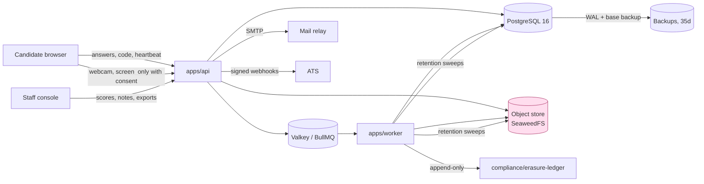

# Data retention and the DPIA

**Status:** draft
**Owner:** _unassigned_ (DPO)
**Last updated:** 2026-09-15
**Companion docs:** [`05-licensing-and-compliance.md`](05-licensing-and-compliance.md), [`14-threat-model.md`](14-threat-model.md), [`15-accessibility-conformance.md`](15-accessibility-conformance.md), [`16-ai-usage-policy.md`](16-ai-usage-policy.md), [`12-observability-and-runbooks.md`](12-observability-and-runbooks.md), [`13-environments-and-release.md`](13-environments-and-release.md), [`03-API-spec.md`](03-API-spec.md), [`hiring_platform_schema.sql`](hiring_platform_schema.sql), [`../project/RISKS.md`](../project/RISKS.md), [`../project/OPEN-QUESTIONS.md`](../project/OPEN-QUESTIONS.md)

---

## 0. What this document closes

[`README.md`](README.md) listed a known gap: *"Retention defaults are working assumptions pending legal sign-off."* [`../project/OPEN-QUESTIONS.md`](../project/OPEN-QUESTIONS.md) carries the same gap as OQ-005. [`01-PRD.md`](01-PRD.md) §11.5 carries it as an open question. All three point here.

This document converts those assumptions into **enforceable defaults**: a number, a column that carries it, a job that acts on it, a constraint that stops an operator raising it, a test that proves it fired, and an owner who signs it off on a stated date. A retention period written only in prose is not a retention period. It is a statement of intent that no system has ever read.

Two things this document does **not** do. It is not legal advice, and it does not substitute for counsel sign-off — §12 carries the sign-off block with the outstanding items named. And it does not soften [ADR-007](04-ADRs.md) (proctoring emits advisory signals only) or [ADR-011](04-ADRs.md) (no AI in the scoring or decision path). Both constraints appear below as mitigations the DPIA depends on; removing either invalidates the risk assessment in §11 and requires the DPIA to be redone before the change ships.

### Status of each obligation

| Obligation | State | Owner | Date |
|---|---|---|---|
| Retention defaults codified as `RETENTION_*` configuration | Specified here, implemented in task H-105 (M4) | Engineering lead | 2027-01-30 |
| Floor/ceiling constraints on per-org override | Specified here as DDL, not yet migrated | Engineering lead | 2027-01-30 |
| Erasure job with anonymisation contract | Specified here, implemented in tasks H-104 and H-105 (M4) | Engineering lead | 2027-01-30 |
| Counsel sign-off on the defaults | **Outstanding** | Legal counsel, _unassigned_ | Decide by 2026-11-27 |
| DPIA sign-off before any proctoring media capture | **Outstanding — hard gate on M4** | DPO, _unassigned_ | Decide by 2026-12-18 |
| Privacy notice text for candidates | TBD — owner: DPO with People lead, decide by 2026-12-04 | DPO | 2026-12-04 |
| Sub-processor register populated for the chosen deployment | TBD — owner: DPO, decide by 2026-12-18 | DPO | 2026-12-18 |

M4 runs 2027-01-05 → 2027-01-30. The DPIA sign-off date sits deliberately before the year-end break so that M4 does not open blocked on a signature nobody is present to give.

---

## 1. The principle: retention is enforced in code

[`05-licensing-and-compliance.md`](05-licensing-and-compliance.md) §3 states it in one line: *"Set a default and enforce it in code, not policy documents."* Everything below is the elaboration of that sentence.

The failure mode this guards against is specific and common. An organisation writes a retention policy, publishes it, and audits itself against the document. The document says webcam recordings are deleted after 30 days. Nothing deletes them. Three years later a subject access request, a breach, or a regulator's inspection discovers 40,000 face images from candidates who were rejected in 2026. The policy was never wrong; it was never connected to anything.

Connection means four things, and all four have to exist or the clock does not run:

1. **A column carries the deadline**, written at the moment the data is created, from configuration and not from a human's memory. If the row has no deadline the row is a leak.
2. **A job reads those columns on a schedule** and acts, with its own audit trail, its own alerting, and a failure that is visible rather than silent.
3. **A constraint prevents the deadline being pushed out** past the ceiling the DPIA assessed. Configuration that an administrator can set to 3650 days through a text box is not a ceiling.
4. **A test proves the job fires**, by moving the clock rather than by waiting. Task H-105 requires a time-travel test per clock for exactly this reason.

### 1.1 Where the clock is written, not where it is checked

Retention is enforced at write time, not at read time. The deadline is computed and persisted when the row is created, from the org's effective policy at that moment. It is not recomputed on read, and it is not derived on the fly by the sweep from `created_at + interval`.

The reason is that a policy change must not retroactively resurrect data. If an org shortens its proctor-media retention from 30 days to 7, the sweep should delete everything older than 7 days on its next pass — that direction is safe, and §5.3 makes shortening take effect immediately. But if an org lengthens a clock, already-written deadlines must stand. A derived-on-read model makes lengthening retroactive, which is how data that a candidate was told would be gone in 30 days survives for a year because somebody edited a settings field. Persisted deadlines make the lengthening apply only to data created after the change, which is the behaviour the privacy notice promised.

The one exception is shortening, which is applied to existing rows by a migration statement inside the settings-change transaction (§4.3). Shortening only ever deletes more, sooner. That direction needs no protection.

### 1.2 The clock columns that exist today

The schema already anticipates two of them.

| Column | Table | Present in schema | Comment in schema |
|---|---|---|---|
| `erase_after` | `candidates` | Yes, nullable | `-- GDPR retention clock` |
| `delete_after` | `proctor_media` | Yes, `NOT NULL` | `-- enforce retention, do not keep biometrics forever` |

`proctor_media.delete_after` is correct as written: `NOT NULL`, so a media row cannot exist without a deadline. `candidates.erase_after` is nullable, which means a candidate row can exist with no clock at all — and in practice every row inserted by a bulk CSV import before the erasure job ships will have exactly that. Nullable is the difference between a clock and a suggestion.

### 1.3 The columns that must be added

The migrations below land as one Drizzle migration in `packages/db` during M4, before task H-105. Each is stated with the reason, because a migration nobody can justify is a migration somebody will revert.

**Make the candidate clock mandatory.** Backfill first, then constrain, so the migration does not fail on existing rows.

```sql
-- packages/db/migrations/00XX_retention_clocks.sql

ALTER TABLE candidates
    ADD COLUMN pii_erased_at    timestamptz,
    ADD COLUMN erasure_reason   text,        -- 'retention_expiry' | 'subject_request' | 'org_purge'
    ADD COLUMN legal_hold_until timestamptz, -- set by POST /candidates/{id}/legal-hold
    ADD COLUMN email_hash       bytea;       -- HMAC-SHA256(TOKEN_PEPPER, lower(email)); see §5.4

UPDATE candidates
   SET erase_after = created_at + make_interval(months => 12)
 WHERE erase_after IS NULL;

ALTER TABLE candidates
    ALTER COLUMN erase_after SET NOT NULL;

-- The sweep's only access path. Partial, so it stays small as erasures accumulate.
CREATE INDEX candidates_erase_after_idx
    ON candidates (erase_after)
 WHERE pii_erased_at IS NULL;
```

**Give proctor media an org, a version and a deletion record.** `proctor_media` today carries no `org_id`, which breaks the schema's own stated convention (*"Every tenant-scoped table carries org_id for row-level isolation"*). For the retention sweep specifically this is not cosmetic: the sweep must run per-org to honour per-org overrides, and without `org_id` it would have to join through `attempts` on every batch. `object_version` exists because a versioned bucket does not delete on `DeleteObject` (§5.6).

```sql
ALTER TABLE proctor_media
    ADD COLUMN org_id         uuid REFERENCES organizations(id) ON DELETE CASCADE,
    ADD COLUMN object_version text,      -- S3 version id, NULL on an unversioned bucket
    ADD COLUMN byte_size      bigint,
    ADD COLUMN sha256         bytea,     -- integrity evidence for the review queue
    ADD COLUMN consent_id     uuid,      -- FK added after candidate_consents exists
    ADD COLUMN deleted_at     timestamptz,
    ADD COLUMN delete_verified_at timestamptz;   -- set only after a HEAD confirms absence

UPDATE proctor_media pm
   SET org_id = a.org_id
  FROM attempts a
 WHERE a.id = pm.attempt_id AND pm.org_id IS NULL;

ALTER TABLE proctor_media ALTER COLUMN org_id SET NOT NULL;

CREATE INDEX proctor_media_delete_after_idx
    ON proctor_media (delete_after)
 WHERE deleted_at IS NULL;
```

`delete_verified_at` is separate from `deleted_at` on purpose. `deleted_at` means the delete call returned success. `delete_verified_at` means a subsequent `HEAD` confirmed the object is gone. On a versioned bucket those are not the same event, and the gap between them is exactly where biometric data survives a deletion that everyone believed had happened.

**Give interview recordings a clock.** `interview_sessions.recording_url` is a URL in a schema whose proctoring table correctly stores `object_key` with the comment *"never a public URL"*. Recordings deserve the same treatment and the same clock.

```sql
ALTER TABLE interview_sessions
    ADD COLUMN recording_object_key   text,         -- supersedes recording_url
    ADD COLUMN recording_version      text,
    ADD COLUMN recording_delete_after timestamptz,
    ADD COLUMN recording_deleted_at   timestamptz,
    ADD COLUMN doc_state_purged_at    timestamptz;  -- Yjs snapshot in interview_sessions.doc_state

COMMENT ON COLUMN interview_sessions.recording_url IS
    'Deprecated 2026-09-15. Use recording_object_key; access only via short-TTL pre-signed URL.';

CREATE INDEX interview_sessions_recording_delete_after_idx
    ON interview_sessions (recording_delete_after)
 WHERE recording_deleted_at IS NULL;
```

**Give attempts a purge clock and an anonymisation marker.** The attempt row survives candidate PII erasure by design (§5.4). It needs its own, longer clock and a flag saying it has been through anonymisation, so a second pass is a no-op rather than a double-scrub.

```sql
ALTER TABLE attempts
    ADD COLUMN purge_after    timestamptz,
    ADD COLUMN anonymised_at  timestamptz;

UPDATE attempts SET purge_after = created_at + make_interval(months => 24) WHERE purge_after IS NULL;
ALTER TABLE attempts ALTER COLUMN purge_after SET NOT NULL;

CREATE INDEX attempts_purge_after_idx ON attempts (purge_after);
```

**Fix the foreign key that blocks ordered deletion.** `answers.final_submission_id` references `submissions(id)` with no `ON DELETE` action. Because `answers` and `submissions` are both children of `attempt_questions`, a cascade from `attempts` deletes them in an order Postgres does not guarantee, and the referential check on this constraint fires as a `foreign_key_violation` in the middle of a purge batch. Either the job nulls the column first on every batch, or the constraint states what should happen. Both, in fact — the constraint is the safety net, the explicit ordering in §5.2 is the contract.

```sql
ALTER TABLE answers DROP CONSTRAINT answers_final_submission_fk;
ALTER TABLE answers
    ADD CONSTRAINT answers_final_submission_fk
    FOREIGN KEY (final_submission_id) REFERENCES submissions(id) ON DELETE SET NULL;
```

**Partition the audit log by year.** Seven years of `audit_log` rows on a busy tenant is tens of millions of rows, and `DELETE FROM audit_log WHERE at < ...` on that volume is a long transaction holding locks on an append-only table that the API writes to on every privileged action. Retention on the audit log is a partition drop, which is instantaneous and does not bloat.

```sql
-- Replaces the existing audit_log with a range-partitioned parent. Run as a
-- table swap during a maintenance window; see 13-environments-and-release.md.
CREATE TABLE audit_log_partitioned (LIKE audit_log INCLUDING ALL) PARTITION BY RANGE (at);
CREATE TABLE audit_log_y2026 PARTITION OF audit_log_partitioned
    FOR VALUES FROM ('2026-01-01') TO ('2027-01-01');
CREATE TABLE audit_log_y2027 PARTITION OF audit_log_partitioned
    FOR VALUES FROM ('2027-01-01') TO ('2028-01-01');
-- ... one per year, created 12 months ahead by the partition-maintenance sweep.
```

`session_events` and `proctor_events` are already noted in the schema as partition-by-month candidates. They become partitioned for the same reason: their retention is a `DROP TABLE` of a month, not a `DELETE` of a hundred million rows.

**Per-org policy, with the floor and ceiling as constraints.** §4.2 explains the asymmetry; this is where it is enforced.

```sql
CREATE TABLE org_retention_policy (
    org_id                 uuid PRIMARY KEY REFERENCES organizations(id) ON DELETE CASCADE,
    proctor_media_days     int,
    session_recording_days int,
    attempt_data_months    int,
    candidate_pii_months   int,
    audit_log_years        int,
    updated_by             uuid REFERENCES users(id),
    updated_at             timestamptz NOT NULL DEFAULT now(),
    -- NULL means "use the RETENTION_* default". A value must sit inside the band.
    CONSTRAINT proctor_media_band     CHECK (proctor_media_days     IS NULL OR proctor_media_days     BETWEEN 1 AND 30),
    CONSTRAINT session_recording_band CHECK (session_recording_days IS NULL OR session_recording_days BETWEEN 7 AND 90),
    CONSTRAINT attempt_data_band      CHECK (attempt_data_months    IS NULL OR attempt_data_months    BETWEEN 6 AND 24),
    CONSTRAINT candidate_pii_band     CHECK (candidate_pii_months   IS NULL OR candidate_pii_months   BETWEEN 1 AND 12),
    CONSTRAINT audit_log_band         CHECK (audit_log_years        IS NULL OR audit_log_years        BETWEEN 7 AND 10)
);
```

**Consent as a record, not a timestamp.** `candidates.consent_at` is a single nullable `timestamptz` described as *"proctoring / data-processing consent"*. One timestamp cannot express which purpose was consented to, which version of the notice was shown, in which language, or whether consent was later withdrawn — and Article 7(1) requires the controller to *demonstrate* consent, which means producing the wording the subject actually saw.

```sql
CREATE TABLE candidate_consents (
    id             uuid PRIMARY KEY DEFAULT gen_random_uuid(),
    org_id         uuid NOT NULL REFERENCES organizations(id) ON DELETE CASCADE,
    candidate_id   uuid NOT NULL REFERENCES candidates(id) ON DELETE CASCADE,
    attempt_id     uuid REFERENCES attempts(id) ON DELETE SET NULL,
    purpose        text NOT NULL,     -- 'identity_photo' | 'webcam_capture' | 'screen_capture'
                                      -- | 'session_recording' | 'talent_pool_retention'
    notice_version text NOT NULL,     -- semver of the privacy notice shown
    notice_sha256  bytea NOT NULL,    -- hash of the exact rendered wording
    notice_locale  text NOT NULL,     -- see 08-i18n-and-localisation.md
    granted_at     timestamptz,
    withdrawn_at   timestamptz,
    method         text NOT NULL,     -- 'explicit_checkbox' | 'in_person_signed'
    evidence       jsonb NOT NULL DEFAULT '{}',   -- ip, user agent, control id clicked
    CHECK (granted_at IS NOT NULL OR withdrawn_at IS NOT NULL)
);

CREATE UNIQUE INDEX candidate_consents_live_idx
    ON candidate_consents (candidate_id, attempt_id, purpose)
 WHERE withdrawn_at IS NULL;

ALTER TABLE proctor_media
    ADD CONSTRAINT proctor_media_consent_fk
    FOREIGN KEY (consent_id) REFERENCES candidate_consents(id);

COMMENT ON COLUMN candidates.consent_at IS
    'Deprecated 2026-09-15. Consent is per-purpose and withdrawable; see candidate_consents.';
```

Making `proctor_media.consent_id` a real foreign key is the cheapest possible enforcement of "no capture without consent": a media row that cannot name its consent record cannot be inserted. The API check in [`03-API-spec.md`](03-API-spec.md) §7 (*"only when `proctoring_profile != 'none'` and consent recorded"*) stays, but it is now backed by a constraint rather than being the only line of defence.

**The subject-request register and the erasure ledger.** Both in §6 and §5.7 respectively; DDL is given there, next to the process that uses it.

---

## 2. Data inventory

Every category of personal data the system holds, where it lives, why it is lawful to hold it, how long, and what happens when the clock fires. This table is the artefact a regulator asks for first, and it is the artefact that tells an engineer which columns a new feature must not quietly add PII to.

"Deletion mechanism" takes one of four values. **Hard delete** removes the row. **Anonymise** overwrites the identifying columns in place and keeps the row for statistics. **Tombstone** keeps a minimal non-identifying record that something existed and was removed, so a restore can be reconciled. **Partition drop** removes a time range wholesale.

### 2.1 Primary store — PostgreSQL

| # | Data category | Tables and columns | Subject | Lawful basis | Retention | Mechanism | Owner |
|---|---|---|---|---|---|---|---|
| D-01 | Candidate contact identity | `candidates.email`, `full_name`, `phone` | Candidate | Art 6(1)(f) legitimate interest — running a recruitment process the candidate initiated; Art 6(1)(b) where an application is in flight | `RETENTION_CANDIDATE_PII_MONTHS` = 12 from last activity | Anonymise (§5.4) | People lead |
| D-02 | Candidate CV / resume pointer | `candidates.resume_url` → object store `resumes/` | Candidate | Art 6(1)(f) | 12 months | Hard delete of object, column nulled | People lead |
| D-03 | Recruitment source | `candidates.source` | Candidate | Art 6(1)(f) | Survives anonymisation (not identifying at row level; feeds funnel stats) | Retained | People lead |
| D-04 | Application state | `applications.*` | Candidate | Art 6(1)(b)/(f) | 24 months, tied to attempt data | Anonymise via candidate link | People lead |
| D-05 | Invitation and token hash | `invitations.token_hash`, `sent_at`, `expires_at` | Candidate | Art 6(1)(f) | 12 months, or immediately on revocation | Hard delete | Engineering |
| D-06 | Accommodation record | `invitations.accommodations` (see [`15-accessibility-conformance.md`](15-accessibility-conformance.md) §14) | Candidate | Art 6(1)(c) legal obligation — reasonable adjustment duty; Art 9(2)(b) where the underlying reason is health data | 24 months with the attempt; the **reason** is never stored here | Hard delete | People lead |
| D-07 | Attempt record and scores | `attempts.*` including `raw_score`, `score_pct`, `passed`, `integrity_flag` | Candidate | Art 6(1)(f) | `RETENTION_ATTEMPT_DATA_MONTHS` = 24 | Anonymise at 12m, hard delete at 24m | Engineering |
| D-08 | Served question set | `attempt_questions.*` | Candidate (weak — links a person to questions seen) | Art 6(1)(f) | 24 months | Retained through anonymisation; hard delete at 24m | Question bank owner |
| D-09 | MCQ and structured answers | `answers.selected_option_ids`, `seconds_spent`, `auto_score`, `manual_score`, `final_score` | Candidate | Art 6(1)(f) | 24 months | Retained through anonymisation (this is what keeps statistics alive) | Question bank owner |
| D-10 | Free-text answers | `answers.text_answer` | Candidate | Art 6(1)(f) | 24 months; **nulled on a subject erasure request regardless of age** | Anonymise (null) | Engineering |
| D-11 | Submitted source code | `submissions.source_code`, `compile_stderr` | Candidate | Art 6(1)(f) | 24 months; nulled on erasure request | Anonymise (null), §5.4 | Engineering |
| D-12 | Execution output | `submission_results.actual_stdout`, `stderr` | Candidate (can echo candidate-typed input) | Art 6(1)(f) | 24 months; nulled on erasure request | Anonymise (null) | Engineering |
| D-13 | Test-case pass/fail and timings | `submission_results.passed`, `runtime_ms`, `memory_kb`, `exit_code` | Candidate (weak) | Art 6(1)(f) | 24 months | Retained through anonymisation | Question bank owner |
| D-14 | Interview participation | `session_participants.*`, `interview_sessions.started_at`, `ended_at` | Candidate + staff | Art 6(1)(f) | 24 months | Anonymise | People lead |
| D-15 | Interview keystroke/event stream | `session_events.payload` | Candidate + staff | Art 6(1)(f) | `RETENTION_SESSION_RECORDING_DAYS` = 90 | Partition drop (monthly) | Engineering |
| D-16 | Final collaborative document | `interview_sessions.doc_state` (Yjs snapshot) | Candidate | Art 6(1)(f) | 90 days, aligned to the event stream | Hard delete (column nulled), `doc_state_purged_at` set | Engineering |
| D-17 | Interviewer written judgement | `scorecards.notes_md`, `scorecard_ratings.comment` | Candidate — **and disclosable to them under Art 15** | Art 6(1)(f) | 24 months; nulled on erasure request | Anonymise (null); numeric `rating` retained | People lead |
| D-18 | Structured ratings | `scorecard_ratings.rating` | Candidate | Art 6(1)(f) | 24 months | Retained through anonymisation | People lead |
| D-19 | Proctoring behavioural signals | `proctor_events.event_type`, `severity`, `at` | Candidate | Art 6(1)(f), with the balancing test in §8.2 | 24 months with the attempt | Retained; see D-20 for the payload | Engineering |
| D-20 | Proctoring signal payloads | `proctor_events.payload` — may carry face bounding boxes, confidences | Candidate — **derived from Art 9 processing** | Art 9(2)(a) explicit consent | `RETENTION_PROCTOR_MEDIA_DAYS` = 30 | Payload nulled at 30 days, event kept | DPO |
| D-21 | Proctoring media metadata | `proctor_media.object_key`, `captured_at`, `kind`, `sha256` | Candidate | Art 9(2)(a) | 30 days | Tombstone — row kept with `deleted_at`, `object_key` nulled | DPO |
| D-22 | Consent records | `candidate_consents.*` | Candidate | Art 7(1) — the controller must be able to demonstrate consent | 7 years, aligned to the audit log | Retained; survives candidate anonymisation | DPO |
| D-23 | Staff account data | `users.email`, `full_name` | Employee | Art 6(1)(b) employment contract | Duration of employment + 12 months | Hard delete; `archived_at` soft delete first | People lead |
| D-24 | Staff action audit trail | `audit_log.*` including `actor_user_id`, `before`, `after` | Employee + candidate (entity data) | Art 6(1)(c)/(f) — defensibility of employment decisions | `RETENTION_AUDIT_LOG_YEARS` = 7 | Partition drop (yearly) | DPO |
| D-25 | Actor IP address | `audit_log.ip` | Employee | Art 6(1)(f) — security | 90 days at full precision, then truncated to /24 (IPv4) or /48 (IPv6) | Anonymise in place | Security owner |
| D-26 | Voluntary demographic data | Not in the schema today; required by `GET /reports/adverse-impact` | Candidate | Art 9(2)(g) substantial public interest — equality monitoring, where the jurisdiction provides it; otherwise Art 9(2)(a) | 24 months, aggregate only | Stored separately (§2.4), never joined to a named candidate in any UI | DPO |
| D-27 | Subject request register | `data_subject_requests.*` | Candidate | Art 6(1)(c) — demonstrating compliance | 7 years | Retained; subject identified only by `subject_email_hash` after closure | DPO |
| D-28 | Erasure ledger | `erasure_ledger.*` (§5.7) | Candidate (pseudonymous) | Art 6(1)(c) | 7 years | Retained — contains no PII by construction | Engineering |

### 2.2 Object store — prefix map

The bucket named by `S3_BUCKET` is laid out by prefix, and the prefix determines the lifecycle rule. This layout is canonical: code writes to these prefixes and nowhere else, and a new prefix is a change to this table before it is a change to code.

| Prefix | Contents | Written by | Clock | Bucket lifecycle rule | Versioning |
|---|---|---|---|---|---|
| `proctor/{org_id}/{attempt_id}/{media_id}` | Webcam snapshots, screen clips, ID photos | `apps/api`, task H-101 | `proctor_media.delete_after`, 30d | `Expiration: 31 days` as backstop | **Disabled.** §5.6 |
| `recordings/{org_id}/{session_id}/…` | Interview recordings, LiveKit egress | `apps/worker` | `interview_sessions.recording_delete_after`, 90d | `Expiration: 91 days` | Disabled |
| `replays/{org_id}/{session_id}/events.ndjson.zst` | Cold-stored event stream after partition drop | `apps/worker` | 90d from session end | `Expiration: 91 days` | Disabled |
| `resumes/{org_id}/{candidate_id}/…` | Candidate CVs | `apps/api` | `candidates.erase_after`, 12m | None — the sweep owns it | Disabled |
| `submissions/{org_id}/{submission_id}/…` | Oversized submission artifacts beyond the `EXEC_MAX_OUTPUT_BYTES` inline cap | `apps/worker` | 24m with the attempt | `Expiration: 24 months` | Disabled |
| `exports/{org_id}/{job_id}/…` | Report and org exports, subject-access bundles | `apps/api`, `apps/worker` | **7 days**, non-negotiable | `Expiration: 7 days` | Disabled |
| `certificates/{org_id}/{certificate_id}.pdf` | Issued certificates ([`10-certification-and-credentials.md`](10-certification-and-credentials.md)) | `apps/worker` | Indefinite — the credential is the point | None | Enabled |
| `compliance/erasure-ledger/{yyyy}/{mm}/…` | Append-only erasure ledger export (§5.7) | `apps/worker` | 7 years | None | Enabled, with object lock where supported |

The `exports/` clock is the shortest in the system and deliberately so. An export bundle is the densest concentration of personal data the platform ever produces — a whole cohort's answers, scores and contact details in one file — and it exists for one download. R-20 in [`../project/RISKS.md`](../project/RISKS.md) names this path as the most likely route for PII to leave unintentionally. Seven days, short-TTL pre-signed URLs only, and every generation audited.

### 2.3 Personal data outside the two stores

This is the section teams forget, and it is where a "complete" erasure turns out to be partial.

| Location | What leaks in | Control | Owner |
|---|---|---|---|
| Application logs | Candidate email in a request log line; source code in an error payload | Structured logging with a redaction list in `packages/observability`; `email`, `full_name`, `phone`, `source_code`, `text_answer`, `token` are never logged, enforced by a serialiser test | Engineering |
| OTel traces | Span attributes carrying identifiers | Only opaque UUIDs as attributes, never email; `OTEL_TRACES_SAMPLER_ARG` keeps volume low; trace retention 14 days ([`12-observability-and-runbooks.md`](12-observability-and-runbooks.md)) | Engineering |
| Prometheus metrics | Nothing — high-cardinality labels including any candidate identifier are prohibited | Cardinality budget enforced in review | Engineering |
| Valkey / BullMQ job payloads | Source code in a grading job; email in an invitation-send job | Job payloads carry ids only, never content; `removeOnComplete: { age: 3600 }`, `removeOnFail: { age: 86400 }` | Engineering |
| SMTP outbound | Invitation emails carry the plaintext token and the candidate's name | Mailpit in dev holds real addresses only if seeded with them — seed data uses `@example.invalid`; production relay is a sub-processor (§13) | Engineering |
| Database backups | Everything | §5.8. Backups age out; they are not edited | Engineering |
| Staging and dev databases | Everything, if seeded from production | **Production data is never copied to a lower environment.** Seed data is synthetic. [`13-environments-and-release.md`](13-environments-and-release.md) carries the rule; a violation is a breach under §14 | Engineering |
| Local developer machines | Export files downloaded for debugging | Exports are pre-signed and expire; downloading one is an audited action and the file is covered by the acceptable-use policy | Engineering |

### 2.4 The demographic-data exception

`GET /reports/adverse-impact` needs demographic attributes to compute a four-fifths-rule check, and demographic attributes are Article 9 data in most of the categories that matter. The design rule is separation:

- The data is collected only where the jurisdiction provides a lawful route for equality monitoring, only voluntarily, and with a "prefer not to say" option that is not a penalty.
- It is stored in a separate table with its own access control, and no staff role except `org.admin` can read a row of it joined to a candidate identity.
- The adverse-impact report reads it through an aggregating view that suppresses any cell with fewer than **10** subjects. A pass-rate broken down to a group of three is not a statistic; it is an identification.
- It is never an input to scoring. [ADR-011](04-ADRs.md) and [`16-ai-usage-policy.md`](16-ai-usage-policy.md) cover the general case; this is the specific one that would be most damaging.

The table itself is deferred: TBD — owner: DPO with counsel, decide by 2027-01-05 (M4 start), because the lawful basis differs per jurisdiction and the schema should follow the legal answer rather than lead it.

---

## 3. Data flow



The only writer of domain tables is `apps/api`, with `apps/worker` as the sole exception for grading results and retention sweeps. That single-writer property is what makes the retention contract auditable: there is one place where a clock can fail to be set.

---

## 4. Retention defaults as configuration

### 4.1 The defaults

Restating [`05-licensing-and-compliance.md`](05-licensing-and-compliance.md) §3 as configuration, with the environment variable that carries each value, the band an org may move within, and the reasoning that fixes the ceiling.

| Data | Env var | Default | Floor | Ceiling | Why the ceiling is there |
|---|---|---|---|---|---|
| Proctor media (webcam, screen, ID photo) | `RETENTION_PROCTOR_MEDIA_DAYS` | 30 | 1 | **30** | Article 9 biometric data. The integrity review queue exists to be worked within days of the exam; a review not done in 30 days will not be done. Nothing about a hiring decision needs a face image a month later |
| Session recordings and replay event streams | `RETENTION_SESSION_RECORDING_DAYS` | 90 | 7 | **90** | Long enough for a hiring loop to conclude, a debrief to happen, and a disputed interview to be reviewed. Beyond a quarter the recording is evidence of nothing anyone is still arguing about. This is the value OQ-005 asked for |
| Attempts, answers, submissions, scores | `RETENTION_ATTEMPT_DATA_MONTHS` | 24 | 6 | **24** | The discrimination-claim limitation period in most of the jurisdictions in scope. Shorter destroys the defence; longer holds evidence for a claim that can no longer be brought |
| Candidate PII (name, email, phone, CV) | `RETENTION_CANDIDATE_PII_MONTHS` | 12 | 1 | **12** | Talent-pool reuse is the only argument for keeping contact details past a rejection, and it decays fast. Twelve months from last activity, not from creation |
| Audit log | `RETENTION_AUDIT_LOG_YEARS` | 7 | **7** | 10 | The defensibility record. The only clock with a floor rather than a ceiling — see §4.2 |
| Anonymised aggregates (`question_stats`, cohort distributions) | — | Indefinite | — | — | No personal data remains. This is the output the whole retention design exists to preserve |

Two clocks are not in the environment contract because they are not tenant-configurable: export artifacts (7 days, §2.2) and the erasure ledger (7 years, §5.7). Both are properties of the platform's compliance position rather than of any customer's policy.

### 4.2 Per-org override rules

An org may set `org_retention_policy` values through `PATCH /org/settings`, subject to three rules, all of which are enforced by the `CHECK` constraints in §1.3 rather than by the API layer alone:

1. **Every clock except the audit log may only be shortened.** An org that wants proctor media gone in 7 days gets 7 days. An org that wants 90 gets a validation error. The ceiling was assessed in the DPIA at §9; raising it invalidates the assessment.
2. **The audit log may only be lengthened.** It is the record that proves a human made each decision and that scores were not altered silently. An org in a regulated sector may need ten years. No org may have fewer than seven, because shortening it degrades every candidate's ability to contest a decision and is therefore against the interest of the data subject, not just the business.
3. **A `NULL` means "follow the platform default"**, and the default tracks the environment variable. An org that has never touched the setting gets a shortened clock automatically if the platform shortens it, which is the direction that needs no negotiation.

The API spec's `PATCH /org/settings {retention_days, ...}` is superseded by a typed object. `retention_days` as a single scalar cannot express five clocks and a jsonb settings blob carries no constraint:

```
PATCH /org/settings   { retention: { proctor_media_days?, session_recording_days?,
                                     attempt_data_months?, candidate_pii_months?,
                                     audit_log_years? } }
```

Out-of-band values return `422` with `code: "validation_failed"` and `details.field`/`details.allowed_range`, per the error contract in [`03-API-spec.md`](03-API-spec.md) §2. Every change writes an `audit_log` row with action `org.retention.update`, `before` and `after` populated, and requires the `org.admin` permission.

### 4.3 Changing a clock

| Direction | Effect on existing rows | Effect on new rows | Approval |
|---|---|---|---|
| Shortening | Applied immediately, in the same transaction, by `UPDATE … SET delete_after = LEAST(delete_after, now() + new_interval)`. The next sweep deletes more | New interval | `org.admin` |
| Lengthening (audit log only, or an org returning to the default) | **Not applied.** Existing deadlines stand | New interval | `org.admin` + a written reason stored in the audit row |
| Raising a platform ceiling (changing the `CHECK` band) | Migration, reviewed | — | DPO sign-off, DPIA re-review, an ADR |

The reason lengthening is not retroactive is in §1.1: a candidate was told a number, and a settings change made after the fact does not retrospectively earn a longer hold on their data.

---

## 5. The erasure job

Lives in `apps/worker` as a set of BullMQ repeatable jobs. Runs as `DATABASE_JOB_ROLE`, which has `DELETE` and `UPDATE` on the tables named here and on nothing else. Task H-105 in [`../project/TRACKER.md`](../project/TRACKER.md) carries the implementation; task H-104 carries the request-driven path in §6.

### 5.1 Cadence and batching

| Sweep | Cadence | Scope | Batch | Budget |
|---|---|---|---|---|
| `retention:proctor-media` | Hourly, at :10 | `proctor_media` past `delete_after` | 200 objects | 10 min |
| `retention:proctor-payload` | Daily 03:10 UTC | `proctor_events.payload` past 30 days | 5,000 rows | 15 min |
| `retention:session-recordings` | Daily 03:20 UTC | Recordings and `doc_state` past `recording_delete_after` | 100 objects | 15 min |
| `retention:candidate-pii` | Daily 03:30 UTC | `candidates` past `erase_after` | 500 candidates | 30 min |
| `retention:attempt-purge` | Daily 03:45 UTC | `attempts` past `purge_after` | 200 attempts | 45 min |
| `retention:audit-ip-truncate` | Daily 04:00 UTC | `audit_log.ip` older than 90 days | one partition | 10 min |
| `retention:partitions` | Daily 01:00 UTC, acting only near the month boundary | Create next partitions, drop expired `session_events` / `proctor_events` / `audit_log` partitions | — | 10 min |
| `retention:verify` | Daily 05:00 UTC | Assertion pass — see §5.9 | — | 5 min |

Proctor media sweeps hourly rather than daily because it is the tightest ceiling and the most sensitive category: the difference between "deleted within 30 days" and "deleted within 30 days and up to 23 hours" is not a difference anyone should have to explain.

Batching rules, uniform across sweeps:

- One transaction per batch, never one per sweep. A 30-minute transaction on `candidates` blocks the API's write path and bloats the table.
- Selection is `SELECT … WHERE clock < now() ORDER BY clock LIMIT :batch FOR UPDATE SKIP LOCKED`. `SKIP LOCKED` means a row a recruiter is editing is picked up on the next pass instead of deadlocking.
- `SET LOCAL statement_timeout = '30s'` inside every batch transaction. A sweep that hangs is worse than a sweep that fails, because a failure alerts.
- 200 ms sleep between batches, so a large backlog degrades sweep duration rather than API latency.
- A distributed lock in Valkey keyed on the sweep name, held with a TTL slightly above the budget. Two `apps/worker` replicas must not both sweep.
- A sweep that exhausts its budget with work remaining exits `partial`, records what it did, and is picked up on the next tick. It never extends its own budget.

### 5.2 Ordering

The candidate-PII sweep anonymises and therefore triggers no cascades. The attempt-purge sweep hard-deletes and must respect the foreign-key graph. The order below is the contract; the `ON DELETE SET NULL` fix in §1.3 is the safety net behind it.

```
For each attempt batch:
  1. Delete object-store artifacts        submissions/{org}/{submission_id}/*
                                          proctor/{org}/{attempt_id}/*
  2. UPDATE answers SET final_submission_id = NULL
       WHERE attempt_question_id IN (…)   -- breaks answers → submissions before the delete
  3. DELETE FROM submission_results       WHERE submission_id IN (…)
  4. DELETE FROM submissions              WHERE attempt_question_id IN (…)
  5. DELETE FROM answers                  WHERE attempt_question_id IN (…)
  6. DELETE FROM proctor_media            WHERE attempt_id IN (…)
  7. DELETE FROM proctor_events           WHERE attempt_id IN (…)
  8. DELETE FROM scorecard_ratings        WHERE scorecard_id IN (SELECT id FROM scorecards WHERE attempt_id IN (…))
  9. DELETE FROM scorecards               WHERE attempt_id IN (…)
 10. DELETE FROM attempt_questions        WHERE attempt_id IN (…)
 11. DELETE FROM attempts                 WHERE id IN (…)
 12. INSERT INTO erasure_ledger           (…)   -- same transaction
```

Two notes that matter more than they look.

**Object-store deletion comes first, inside the same logical unit but before the database rows.** If the database row goes first and the object delete fails, the object is orphaned with nothing left pointing at it — an unreferenced biometric file with no clock, which is the exact failure the whole design exists to prevent. Deleting the object first and failing before the row means the row survives to be retried, and the retry is idempotent because deleting an already-absent object is a success.

**Step 12 is in the same transaction as the deletes.** A ledger entry that can be lost while the deletion commits makes the restore reconciliation in §5.8 unreliable. The ledger is exported to the object store asynchronously afterwards; the row is written synchronously.

### 5.3 Deletion versus anonymisation — the decision rule

Hard-delete when the data has no value once its purpose ends. Anonymise when the row carries statistical value that survives the removal of identity. The test is simple: **could this row still answer a question about the question bank after the person is unlinked from it?** If yes, anonymise. If no, delete.

That test is what keeps [`01-PRD.md`](01-PRD.md) FR-5 alive — p-value and point-biserial discrimination per question version, computed once n ≥ 30. A platform that hard-deletes every attempt at 12 months alongside the PII loses its question statistics annually and can never tell whether a question discriminates. A platform that keeps everything forever is a liability. Anonymisation at 12 months, hard delete at 24, is the shape that serves both.

### 5.4 The anonymisation contract

This is the specification [`03-API-spec.md`](03-API-spec.md) §6 gestures at with *"hard-deletes PII, retains anonymised aggregate rows"*. Stated column by column, because "anonymised" with no column list is where the argument starts.

**`candidates`** — the row survives as a pseudonymous key.

| Column | Treatment | Reason |
|---|---|---|
| `id` | Retained | The join key every anonymised attempt hangs from |
| `org_id` | Retained | Tenant isolation must still work on the anonymised row |
| `email` | **Overwritten** with `erased-<id>@candidate.invalid` | Cannot be nulled — `UNIQUE (org_id, email)` and `NOT NULL`. `.invalid` is reserved by RFC 2606 and can never route, so a bug that tries to mail it fails loudly |
| `full_name` | **Nulled** | — |
| `phone` | **Nulled** | — |
| `resume_url` | **Nulled**, object deleted first | — |
| `source` | Retained | `campus` / `referral` / `inbound` is not identifying at row level and carries the funnel report |
| `consent_at` | Retained (deprecated column) | Proof that consent existed at a time; the detail lives in `candidate_consents` |
| `created_at` | **Truncated** to `date_trunc('month', created_at)` | An exact creation second plus an org is close to a unique fingerprint. Month granularity keeps cohort analysis and removes the timing join. The cost is that anonymised candidates no longer sort correctly within a month, which no report needs |
| `erase_after` | Retained | The record of when the clock fired |
| `pii_erased_at` | **Set** to `now()` | — |
| `erasure_reason` | **Set** | `retention_expiry` / `subject_request` / `org_purge` |
| `email_hash` | **Nulled**, except on objection (§6.4) | See below |

`email_hash` is the one genuinely contested column. Keeping an HMAC of the email after erasure would let the system recognise the same person if they apply again — convenient, and an argument can be made that it is pseudonymised rather than personal. The argument is weak: a hash with a known salt over a low-entropy space like email addresses is reversible by anyone holding a candidate list, and a candidate who asked to be forgotten did not ask to be recognised. So the rule is: **the hash is nulled on erasure, with exactly one exception.** Where the candidate has objected to processing and asked not to be contacted again (Art 21), the hash is retained *specifically and only* to make the suppression list work, because a suppression list that cannot recognise the person it suppresses is useless. That retention is itself recorded in `data_subject_requests` and disclosed in the response to the objection.

**`attempts`** — nothing is nulled. There is no PII in the row. `anonymised_at` is set, and `candidate_id` continues to point at a row that no longer identifies anybody. This is the whole design: the attempt keeps its `raw_score`, `max_score`, `score_pct`, `passed`, `started_at`, `submitted_at`, `integrity_flag` and its link to `assessment_version`.

**`attempt_questions`** — fully retained: `question_version_id`, `ordinal`, `option_order`, `max_score`. Without `option_order` a re-analysis cannot tell whether an option's position drove its selection rate, which is one of the more useful things MCQ analytics tells you.

**`answers`** — structured columns retained, free text removed.

| Column | Treatment |
|---|---|
| `selected_option_ids` | Retained — this is the MCQ statistic |
| `text_answer` | **Nulled.** Free text typed by a candidate cannot be assumed PII-free; people sign their work, paste their CV, explain their circumstances |
| `seconds_spent` | Retained — mean time per question is a published analytic |
| `auto_score`, `manual_score`, `final_score` | Retained |
| `graded_by`, `graded_at` | Retained — the human-oversight record |

**`submissions`** — `source_code` and `compile_stderr` nulled, with `source_code_erased boolean NOT NULL DEFAULT false` set true. `language`, `language_version`, `runtime_image`, `total_passed`, `total_cases`, `score`, `runtime_ms`, `memory_kb`, `is_trial_run` all retained.

The trade-off is explicit and worth stating rather than hiding: **after anonymisation the attempt is no longer re-gradable.** `POST /attempts/{id}/regrade` on an anonymised attempt returns `409` with `code: "attempt_anonymised"`. That is the correct outcome. A candidate whose personal data has been erased is not a candidate whose result is still being adjusted, and the alternative — keeping source code indefinitely so a re-grade stays possible — keeps a document the candidate wrote, under their own authorship, forever.

**`submission_results`** — `actual_stdout` and `stderr` nulled; `passed`, `exit_code`, `runtime_ms`, `memory_kb`, `test_case_id` retained. Per-test-case pass rates are the coding equivalent of MCQ option distribution and are how a broken hidden test case is found.

**`scorecards` and `scorecard_ratings`** — `notes_md` and `comment` nulled; `rating`, `overall`, `criterion_id`, `submitted_at`, `reviewer_id` retained. Interviewer prose is personal data about the candidate and disclosable to them under Article 15; it is also the most likely place for an unguarded remark to live. It goes.

**`proctor_events`** — `payload` nulled at 30 days by its own sweep, `event_type`, `severity` and `at` retained for the attempt's life. A count of focus-loss events with no payload is still a reviewable signal; a bounding box around a face is Article 9-derived and is not.

**`proctor_media`** — the row is tombstoned rather than deleted: `object_key` nulled, `deleted_at` and `delete_verified_at` set, `sha256` and `byte_size` retained. The tombstone is deliberate. It lets the platform answer "was there media, and when was it destroyed" without holding the media, which is precisely the question asked in a subject access request or an integrity dispute.

**`candidate_consents`** — fully retained through candidate anonymisation, because Article 7(1) requires the controller to demonstrate that consent was obtained, and that obligation outlives the data the consent covered. The record identifies the candidate only by `candidate_id`, which after anonymisation points at a pseudonymous row.

### 5.5 Why the anonymised attempt is still statistically useful

Because the statistics the platform computes never needed identity in the first place:

- **p-value** (proportion correct per question version) = count of `answers` rows for a `question_version_id` where `final_score = max_score`, over total. Needs `attempt_questions` and `answers.final_score`. Both retained.
- **Point-biserial discrimination** correlates per-question correctness with the candidate's total score. Needs `answers.final_score` per question and `attempts.raw_score` per attempt. Both retained.
- **Option distribution** — the analytic in [`03-API-spec.md`](03-API-spec.md) §9 that finds ambiguous questions when 60% of candidates pick the same wrong option. Needs `answers.selected_option_ids` and `attempt_questions.option_order`. Both retained.
- **Exposure count per question version** — FR-4's retirement trigger. Needs `attempt_questions.question_version_id`. Retained.
- **Mean time per question** — needs `answers.seconds_spent`. Retained.
- **Score-to-outcome correlation** — the one metric in [`01-PRD.md`](01-PRD.md) §10 that says whether the test works at all. Needs the attempt score and a 90-day manager rating, which arrives against the `applications` row within the 24-month window.

The re-identification guard that comes with this: **an anonymised cohort is never joined to an external dataset, and every group breakdown suppresses cells below n = 10.** `GET /reports/adverse-impact` in particular operates on anonymised rows and is the place where a small campus cohort could be narrowed to one person by intersecting three filters. The suppression floor is enforced in the query layer, not in the UI.

### 5.6 Object-store deletion, and the versioned-bucket trap

`DeleteObject` on a versioned bucket does not delete anything. It writes a delete marker as the new current version and leaves every prior version in place, retrievable by anyone with `GetObjectVersion`. A retention job that issues `DeleteObject` against a versioned bucket, gets a 204, marks the row deleted and moves on has deleted nothing, and the audit trail will say it did. For biometric data that is not a bug, it is the incident.

Four rules:

1. **Versioning is disabled on every prefix that holds personal data.** The `certificates/` and `compliance/` prefixes are the only versioned ones, and neither holds data with a clock. Verification that versioning is off is part of the infrastructure provisioning check in [`13-environments-and-release.md`](13-environments-and-release.md), not an assumption.
2. **If a deployment requires versioning bucket-wide**, the sweep must enumerate versions and issue `DeleteObjectVersion` for each, including the delete markers. `proctor_media.object_version` stores the version id written at upload so the common case needs no `ListObjectVersions` call.
3. **A bucket lifecycle rule backstops every prefix** at clock + 1 day, with `NoncurrentVersionExpiration: 1 day` where versioning cannot be disabled. The lifecycle rule is defence in depth, never the primary mechanism — it has no audit trail, no per-org override and no way to prove it ran.
4. **Deletion is verified, not assumed.** After the delete, a `HEAD` on the key must return 404 before `delete_verified_at` is set. A key that still resolves leaves the row un-verified, increments `retention_runs.errors`, and fires the alert in §5.9.

SeaweedFS's S3 gateway has partial versioning support relative to AWS S3. That partiality is a reason to keep versioning off on these prefixes rather than a reason to trust it, and the first task in the M4 proctoring work is a conformance test that uploads, deletes and verifies absence against the actual deployed gateway. Assuming S3 semantics from a compatible-ish implementation is how the trap above gets sprung.

Pre-signed URLs interact with deletion too. A URL issued before deletion remains valid against a deleted object only if the object still exists — it does not survive the delete. But a URL with a long TTL issued minutes before is a window. TTL ceiling for proctor media is 300 seconds; for exports, 900 seconds. R-20 in [`../project/RISKS.md`](../project/RISKS.md) names any pre-signed URL above the configured ceiling as a trigger.

### 5.7 The audit trail the job writes

Three records, for three different audiences.

**`retention_runs`** — operational. What ran, when, over what cutoff, how much it touched, whether it finished. Read by the runbook in [`12-observability-and-runbooks.md`](12-observability-and-runbooks.md) and by the monthly verification in §15.

```sql
CREATE TABLE retention_runs (
    id                 uuid PRIMARY KEY DEFAULT gen_random_uuid(),
    job                text NOT NULL,       -- 'retention:proctor-media' etc.
    org_id             uuid REFERENCES organizations(id) ON DELETE SET NULL,  -- NULL = all orgs
    started_at         timestamptz NOT NULL DEFAULT now(),
    finished_at        timestamptz,
    cutoff_at          timestamptz NOT NULL,
    rows_scanned       bigint NOT NULL DEFAULT 0,
    rows_affected      bigint NOT NULL DEFAULT 0,
    objects_deleted    bigint NOT NULL DEFAULT 0,
    objects_unverified bigint NOT NULL DEFAULT 0,
    bytes_freed        bigint NOT NULL DEFAULT 0,
    errors             int    NOT NULL DEFAULT 0,
    status             text   NOT NULL DEFAULT 'running',  -- running|ok|partial|failed
    detail             jsonb  NOT NULL DEFAULT '{}'
);

CREATE INDEX retention_runs_job_started_idx ON retention_runs (job, started_at DESC);
```

**`audit_log`** — organisational. One row per sweep with action `retention.sweep`, and one row per candidate erasure with action `candidate.erase`, `entity_type = 'candidate'`, `entity_id` set, `before` carrying only the *names of the columns cleared* and never their values, `after` carrying the erasure reason. Writing the erased values into `before` would defeat the erasure by copying the PII into a table retained for seven years — a mistake that is easy to make because the audit layer's default behaviour is to snapshot the whole row.

**`erasure_ledger`** — reconciliation. Contains no personal data by construction, which is what lets it be kept for seven years and exported outside the database.

```sql
CREATE TABLE erasure_ledger (
    id           bigserial PRIMARY KEY,
    org_id       uuid NOT NULL,
    subject_kind text NOT NULL,        -- 'candidate' | 'attempt' | 'proctor_media' | 'session'
    subject_id   uuid NOT NULL,
    scope        text NOT NULL,        -- 'pii_anonymise' | 'attempt_purge' | 'media_delete'
    reason       text NOT NULL,        -- 'retention_expiry' | 'subject_request' | 'org_purge'
    erased_at    timestamptz NOT NULL DEFAULT now(),
    run_id       uuid REFERENCES retention_runs(id),
    request_id   uuid                  -- data_subject_requests.id where applicable
);

CREATE INDEX erasure_ledger_erased_at_idx ON erasure_ledger (erased_at);
```

The ledger is exported nightly, append-only, to `compliance/erasure-ledger/{yyyy}/{mm}/{yyyy-mm-dd}.ndjson` in the object store. §5.8 explains why it must live outside the database it describes.

### 5.8 Backups

**Backups are not surgically edited.** Deleting a candidate's row from a base backup and every WAL segment that touched it is not a supported operation on any production database, and an organisation that claims to do it is either not doing it or is destroying the recoverability of the backup. Article 17 does not require it either; the position accepted across supervisory-authority guidance is that erasure is effected on live systems immediately and backup copies age out under a documented, short and enforced schedule, during which the data is not available for any operational purpose.

That position only holds if the schedule is short and enforced. So:

| Backup | Retention | Contains PII | Note |
|---|---|---|---|
| PostgreSQL WAL archive (PITR) | **35 days** | Yes | The recovery window |
| Nightly base backup | **35 days** | Yes | Rotates with the WAL |
| Weekly / monthly / yearly snapshots | **None taken** | — | A yearly snapshot would resurrect erased PII for a year. Long-horizon archival is served by the anonymised live data, which is the point of §5.4 |
| Object-store replication | Same clock as the source prefix | Yes | Replication is not a backup and does not get its own retention |
| Erasure ledger export | 7 years | **No** | Deliberately outside the backup lifecycle |

So the honest, disclosable statement is: *personal data is erased from live systems within 24 hours of the clock firing or of a verified request being actioned, and any residual copy in encrypted backups is unrecoverable for operational use and is destroyed within 35 days.* That sentence goes in the privacy notice and in the Article 17 response template. It is defensible because the number is small and because nothing in the backup regime extends it.

**The restore-then-re-erase obligation.** A restore to a point before an erasure resurrects the erased data. The erasure ledger inside the database is restored to its older state along with everything else, so the database cannot tell you what it has forgotten — which is exactly why the ledger is exported to the object store and to the audit sink, outside the restore boundary.

The obligation, which is a release-blocking step in the restore runbook in [`12-observability-and-runbooks.md`](12-observability-and-runbooks.md) and in [`13-environments-and-release.md`](13-environments-and-release.md):

```
After ANY restore to a point-in-time earlier than the last completed retention run:
  1. Keep the restored instance closed to traffic. No API, no worker, no mail.
  2. Read the exported erasure ledger from compliance/erasure-ledger/ for the window
     [restore_point, now].
  3. Run  pnpm --filter @hiring/worker retention:reconcile --since <restore_point>
     which replays every ledger entry — anonymisation, purge, media delete — against
     the restored database, idempotently.
  4. Run  retention:verify  (§5.9). It must return zero assertions failed.
  5. Only then open traffic.
  6. Record the reconciliation in retention_runs with job = 'retention:reconcile' and
     file it against the incident.
```

A restore that skips step 3 is a personal-data breach under Article 4(12) — an unauthorised restoration of data that had been erased — and is handled under §16, not quietly.

### 5.9 Verification and alerting

The sweep is not trusted to report its own success. `retention:verify` runs daily at 05:00 UTC and asserts, per org:

| Assertion | Alert if violated |
|---|---|
| No `proctor_media` row with `delete_after < now() - 2 hours` and `deleted_at IS NULL` | **Page.** Biometric data past its ceiling |
| No `proctor_media` row with `deleted_at` set and `delete_verified_at IS NULL` for over 24 hours | **Page.** A delete that did not delete |
| No `candidates` row with `erase_after < now() - 48 hours` and `pii_erased_at IS NULL` and no legal hold | Ticket |
| No `attempts` row with `purge_after < now() - 7 days` | Ticket |
| No object under `proctor/` older than `RETENTION_PROCTOR_MEDIA_DAYS + 1` with no matching row | **Page.** An orphan with no clock |
| No object under `exports/` older than 8 days | Ticket |
| Every sweep has a `retention_runs` row with `status = 'ok'` within its expected interval | Ticket; page after two consecutive misses |
| `data_subject_requests` with `due_at < now()` and `completed_at IS NULL` | **Page.** A missed statutory deadline |

Metrics exported for [`12-observability-and-runbooks.md`](12-observability-and-runbooks.md): `retention_rows_pending{job}`, `retention_oldest_pending_seconds{job}`, `retention_objects_unverified`, `dsr_open_count{kind}`, `dsr_oldest_open_days`. The one to alert on is `retention_oldest_pending_seconds` — a sweep that runs successfully every day while the backlog grows is the failure mode a success-count metric cannot see.

### 5.10 Testing

Task H-105 requires a time-travel test per clock. The shape:

- `packages/db` test helper sets the database clock forward by overriding `now()` within a transaction, or the sweep takes an injectable clock — the latter is preferred because it tests the code rather than the harness.
- One test per clock: seed a row, advance past the clock, run the sweep, assert the exact anonymisation contract in §5.4 column by column rather than asserting "the row is gone".
- A negative test per clock: advance to one second *before* the clock, run the sweep, assert nothing changed. A sweep that deletes early is as much a defect as one that never deletes.
- An idempotency test: run the sweep twice, assert the second run affects zero rows and does not double-write the ledger.
- An FK-ordering test: purge an attempt whose `answers.final_submission_id` is populated, and assert no `foreign_key_violation`. This is the §1.3 failure, and it will happen in production the first time an attempt with a graded coding question ages out.
- An object-store test against the real deployed gateway: upload, delete, `HEAD`, assert 404. Not a mock — §5.6 explains why.
- A statistics-survival test: seed 40 attempts, anonymise them all, recompute `question_stats`, assert p-value and discrimination are unchanged to the stored precision. This is the test that proves §5.5 is true rather than asserted.

---

## 6. Data-subject-rights runbook

### 6.1 The identity-verification step comes first, always

No request is actioned before the requester's identity is verified, and no more identity data is demanded than the request requires. Both halves matter. Acting on an unverified erasure request is how a malicious third party destroys a candidate's assessment record; demanding a passport scan to process a routine access request is itself excessive processing and has been criticised as such by supervisory authorities.

The ladder, applied in order, stopping at the first step that resolves:

1. **Request received** at the published privacy channel (§17) or through the candidate portal. Logged in `data_subject_requests` immediately, with `received_at` — the statutory clock starts here, not at verification.
2. **Email match.** If the requesting address matches a `candidates.email` in the tenant, send a single-use signed verification link, 24-hour TTL, to the address on record. Clicking it proves control of the identifier the platform holds, which is the identifier the request concerns. This resolves the large majority of requests and costs the subject nothing.
3. **Email change requests** verify both addresses — the old one to prove the request is authorised, the new one to prove it is deliverable.
4. **No email match, or a request concerning proctoring media.** Confirm two non-public facts from the record: the date the invitation was sent, the assessment name, the job opening applied for. Not a document.
5. **Documented doubt only.** Where steps 2–4 fail and the platform holds Article 9 data about the subject, a photo identity document may be requested. It is reviewed, the decision recorded in `identity_method`, and **the document is deleted within 7 days of the decision** by the same sweep infrastructure. Requesting one is logged and reviewed in the quarterly compliance check.
6. **Requests made through an attempt token are never sufficient.** The attempt token is a bearer credential delivered by email and frequently forwarded; possession proves nothing about identity. `GET /attempt` will not serve a rights request.

Verification does not pause the clock. Article 12(3) allows an extension for complex requests, not for slow verification, and the register in §6.5 tracks both dates so a request that ran long can be explained.

### 6.2 The rights, the SLA, and the mechanism

| Right | Article | SLA | Endpoint / mechanism | What is produced | Owner |
|---|---|---|---|---|---|
| **Access** | 15 | 30 calendar days from receipt; extendable once to 90 with written reasons given within the first 30 | `POST /candidates/{id}/personal-data` → `202 {job_id}`; `GET /candidates/{id}/personal-data/{job_id}` → short-TTL pre-signed bundle | JSON + human-readable PDF covering every row in §2.1 keyed to the candidate, **including `scorecards.notes_md` and `scorecard_ratings.comment`**, the served question set, answers, scores, proctoring events, consent records and the retention clocks | DPO |
| **Rectification** | 16 | 30 days; in practice same-day for contact details | `PATCH /candidates/{id}` | Corrected record, audit row, and notification to any recipient the data was disclosed to under Art 19 (in practice, the ATS via `candidate.updated` webhook) | People lead |
| **Erasure** | 17 | 30 days; target **72 hours** from verification | `DELETE /candidates/{id}` → anonymisation per §5.4 | Confirmation naming what was erased, what was retained and why (scores as anonymised statistics; consent records under Art 7(1); audit log under Art 17(3)(b)) | DPO |
| **Portability** | 20 | 30 days | Same bundle as access, `format=json` | Structured, machine-readable JSON of the data the candidate provided — answers, code, contact details. Scores and interviewer notes are *derived*, not provided, so they fall under access rather than portability; the bundle includes them anyway because splitting the two confuses the subject more than it protects anyone | DPO |
| **Objection** | 21 | 30 days; processing **paused on receipt** pending the balancing decision | `POST /candidates/{id}/objection {ground}` | Processing for the objected purpose stops. For talent-pool retention the objection is absolute and the record is erased. For an application in flight, the balancing test in §8.2 is re-run for that individual and the outcome recorded with reasons | DPO |
| **Restriction** | 18 | 30 days; applied on receipt where accuracy is contested | `DELETE /candidates/{id}?mode=restrict` | Row flagged; the retention sweep skips it; the record is readable but not usable in reporting or export until resolved | DPO |
| **Not subject to a solely automated decision** | 22 | n/a — structural | No endpoint. [ADR-007](04-ADRs.md), FR-23, FR-25 and the release-blocking test in task H-098 | The system never makes the decision. The response to an Art 22 enquiry is the architecture, plus the audit log showing which human decided and on what evidence | DPO |
| **Withdraw consent** | 7(3) | Immediate | In-attempt control, and `POST /candidates/{id}/consent/{purpose}/withdraw` | Capture stops immediately; media already captured for that attempt deleted within 24 hours; the attempt continues on the non-proctored profile. See §13 | DPO |

### 6.3 Edge cases the runbook must answer

**An erasure request arrives while an attempt is in progress.** The attempt is allowed to finish — interrupting it would harm the subject more than the delay harms them — and erasure runs on submission or expiry, within the 72-hour target measured from that point. The delay and its reason are recorded on the request.

**An erasure request arrives during a live dispute or claim.** Article 17(3)(e) permits retention for the establishment, exercise or defence of legal claims. This is the only ground on which the platform declines an erasure, it requires a `legal_hold_until` set through `POST /candidates/{id}/legal-hold {until, reason}` with the `org.admin` permission, it is audited, and the candidate is told that their data is retained on this ground and for how long. A legal hold is never open-ended: `until` is required and is capped at 24 months, extendable only by a further explicit act.

**A request concerns data the org holds in its ATS as well.** The platform is the processor for its own store only. The response states what the platform erased, and the org's ATS obligation is the org's. The `candidate.erased` webhook in [`09-ats-integration.md`](09-ats-integration.md) fires so the downstream system can act.

**A request cannot be linked to any record.** A "no data held" response is still a response and still has to be given within 30 days. It is logged in the register with `outcome = 'no_data'` so a later claim that the platform ignored the request has an answer.

**A staff member asks for their own data.** Employees have the same rights. `users`, `audit_log` entries naming them as actor, and `scorecards` they authored are the scope. Note that an interviewer's scorecard notes are personal data about *both* the candidate and the interviewer, and disclosing them to the candidate under Art 15 may reveal the interviewer's identity. Rule: the substance is disclosed, the interviewer's identity is disclosed where the interviewer is acting in a professional capacity and the org has told them it will be — which it does, in the interviewer onboarding note. TBD — owner: People lead with counsel, confirm the wording by 2026-12-04.

### 6.4 Suppression after objection

An objection under Art 21 to further contact means the platform must recognise the person well enough to not contact them, using data it has otherwise erased. The narrow exception in §5.4 applies: `email_hash` is retained, everything else is anonymised, the retention is recorded on the request, and the hash sits in a suppression check run before any invitation is sent. The suppression list is itself subject to erasure on request — a subject who objects and later asks for full erasure gets it, and is told that the platform will consequently no longer be able to suppress them automatically.

### 6.5 The register

```sql
CREATE TABLE data_subject_requests (
    id                   uuid PRIMARY KEY DEFAULT gen_random_uuid(),
    org_id               uuid NOT NULL REFERENCES organizations(id) ON DELETE CASCADE,
    candidate_id         uuid REFERENCES candidates(id) ON DELETE SET NULL,
    subject_email_hash   bytea NOT NULL,     -- the only subject identifier kept after closure
    kind                 text NOT NULL,      -- access|rectification|erasure|portability
                                             -- |objection|restriction|consent_withdrawal
    channel              text NOT NULL,      -- 'email' | 'portal' | 'post' | 'verbal'
    received_at          timestamptz NOT NULL DEFAULT now(),
    due_at               timestamptz NOT NULL,          -- received_at + 30 days
    extended_to          timestamptz,                   -- Art 12(3), max received_at + 90 days
    extension_reason     text,
    identity_verified_at timestamptz,
    identity_method      text,               -- 'email_link' | 'knowledge_facts' | 'document'
    completed_at         timestamptz,
    outcome              text,               -- fulfilled|partially_fulfilled|refused|no_data
    refusal_ground       text,               -- e.g. 'art_17_3_e_legal_claims'
    handled_by           uuid REFERENCES users(id),
    notes_md             text,
    CHECK (extended_to IS NULL OR extended_to <= received_at + interval '90 days')
);

CREATE INDEX dsr_open_idx ON data_subject_requests (due_at) WHERE completed_at IS NULL;
```

`GET /dsr` and `POST /dsr` serve the register to staff holding `org.admin`. The open-request count and the oldest open request are dashboard metrics, because a statutory deadline that is only visible in a table is a deadline somebody will miss.

---

## 7. DPIA — processing description

Article 35(7)(a) requires a systematic description of the processing, its purposes, and the controller's legitimate interest where relevant. The remainder of §7 through §12 is the DPIA proper.

**Controller and processor.** In the self-hosted default the deploying organisation is the controller and there is no processor — the software runs on the organisation's own infrastructure. Where the platform is operated on a customer's behalf, the operator is a processor under Article 28 and the sub-processor register in §13 applies. The distinction is not cosmetic: almost every risk below is reduced by the self-hosted posture, and a managed deployment inherits obligations the self-hosted one does not.

**Purposes of processing.**

| # | Purpose | Data categories | Lawful basis |
|---|---|---|---|
| P-1 | Assess a candidate's technical ability against a role's skill requirements | D-07 to D-13 | Art 6(1)(f) legitimate interest |
| P-2 | Identify and contact the candidate through the process | D-01, D-02, D-05 | Art 6(1)(b) where an application is in flight, else 6(1)(f) |
| P-3 | Record structured human judgement so decisions are comparable and reviewable | D-14, D-17, D-18 | Art 6(1)(f) |
| P-4 | Deter and detect substitution or collusion in high-stakes exams | D-19, D-20, D-21 | Art 6(1)(f) for behavioural signals; **Art 9(2)(a) explicit consent** for media |
| P-5 | Maintain question-bank quality through psychometric statistics | Anonymised D-08, D-09, D-13 | Art 6(1)(f); after anonymisation, outside the Regulation's scope |
| P-6 | Demonstrate that employment decisions were lawful and non-discriminatory | D-24, D-26, D-27 | Art 6(1)(c) legal obligation, Art 9(2)(g) for equality monitoring |
| P-7 | Provide reasonable adjustments to disabled candidates | D-06 | Art 6(1)(c); Art 9(2)(b) where health data is implicated |

**Categories of data subject.** Candidates (the primary subjects, and per WP248 a group in an asymmetric power relationship with the controller). Staff users — recruiters, interviewers, hiring managers, admins. Question authors, including contractors.

**Recipients.** Internal staff, scoped by row-level security and per-action permissions. The org's ATS via signed webhook, where configured. No one else in the default deployment.

**Scale.** Designed for 500 sustained and 1,000 peak concurrent candidates ([`01-PRD.md`](01-PRD.md) §8). A campus drive is the realistic worst case: a few thousand candidates in a day, many of them early-career, some potentially under 18 (§13.5).

**Retention.** §4.

**Transfers.** §14.

---

## 8. Necessity and proportionality

Article 35(7)(b). The question is not whether the processing is useful but whether the same purpose could be achieved with less.

### 8.1 What is deliberately not collected

The strongest necessity argument is a list of things the product could plausibly collect and does not.

| Not collected | Why it would be tempting | Why not |
|---|---|---|
| Continuous video for every assessment | Simplest possible integrity story | Wildly disproportionate for a screening test. Media capture exists only in certification mode, off by default ([`01-PRD.md`](01-PRD.md) §9) |
| Keystroke-dynamics biometrics | A strong continuous-authentication signal | Behavioural biometrics for identification is Article 9 data with poor accuracy across disabilities and input devices, and it would make every assistive-technology user a suspect |
| Device or browser fingerprinting for identity | Cheap duplicate detection | Identification without consent or notice, and easily defeated. Not worth the exposure |
| Browser extension or agent on the candidate's machine | Better lockdown signals | Breaks G2 ("no account, no install, no plugin") and puts the platform inside the candidate's personal device. Safe Exam Browser in M4 is the exception, is an established product, is used unmodified, and is only for supervised certification |
| Social or public profile enrichment | Richer candidate context | Processing data the candidate did not provide, for a purpose they did not anticipate. No |
| AI inference over candidate answers, code or video | The obvious 2026 feature request | [ADR-011](04-ADRs.md), [`16-ai-usage-policy.md`](16-ai-usage-policy.md). Non-negotiable |
| Demographic data by default | Adverse-impact monitoring | Voluntary only, separated, aggregate-only, cell-suppressed (§2.4) |

### 8.2 The legitimate-interest balancing test for P-1 and P-3

Article 6(1)(f) requires a three-part test, and writing it down is the difference between having a basis and asserting one.

**Purpose test.** Is the interest legitimate? Assessing technical ability before making a hiring decision is a plainly legitimate business interest, and the candidate has an interest in the same thing: a structured assessment is more defensible and less arbitrary than an unstructured interview, which is the core argument of [`01-PRD.md`](01-PRD.md) §1.

**Necessity test.** Is the processing necessary? A technical role cannot be filled without evaluating technical ability. The processing is limited to what the assessment produces — answers, code, scores — plus the identity needed to attach them to a person. The alternative, unstructured interviews with free-text notes in a spreadsheet, processes less structured data but produces less defensible outcomes and worse records for the candidate to contest.

**Balancing test.** Does the interest override the subject's rights and freedoms? The relevant factors:

- *Reasonable expectations.* A candidate who applies for a technical role expects a technical assessment. Nothing in P-1 or P-3 is a surprise.
- *Nature of the data.* Answers and source code, not special-category data. The special-category processing is P-4 and runs on consent, not on this basis.
- *Impact.* The impact is real — the processing informs whether someone gets a job. This is why the mitigations in §9 are structural rather than procedural: the human decision (ADR-007), the explainability of every score (FR-19 through FR-21), and the audit trail.
- *Power asymmetry.* Candidates cannot negotiate the terms. This is the factor that pushes hardest against the controller, and it is the reason consent is not used for P-1 — consent obtained under that asymmetry would be worse, not better (§13.1).
- *Safeguards.* Retention clocks enforced in code, anonymisation at 12 months, no automated rejection, no AI, full subject rights, accessible by design.

**Outcome.** The interest is not overridden for P-1, P-2, P-3, P-5 and P-6, conditional on the safeguards holding. It **is** overridden for media capture, which is why P-4's media component runs on explicit consent with a genuine alternative.

---

## 9. Risks to data subjects

Article 35(7)(c) asks for risks to the rights and freedoms of data subjects. Not risks to the business. The distinction is the one most DPIAs get wrong: "reputational damage from a breach" is a risk to the controller; "a candidate's face images are published" is a risk to the subject. Only the second belongs here.

Scores are 1–5. Residual is assessed after the mitigations, assuming they are implemented as specified.

| # | Risk to the data subject | Inherent L×S | Mitigation | Residual L×S |
|---|---|---|---|---|
| **DS-1** | A candidate is rejected because of an unreliable integrity signal — a focus-loss event caused by a screen reader, a second face caused by a family member walking past | 4 × 5 = 20 | [ADR-007](04-ADRs.md): signals are advisory, never decisions. FR-23, FR-24: flagged attempts go to a human review queue with evidence attached. Task H-098 is a release-blocking test asserting no code path lets a signal change a score, status or decision. Accommodation-aware signal suppression per [`15-accessibility-conformance.md`](15-accessibility-conformance.md) §13.2 | 2 × 5 = 10 |
| **DS-2** | Biometric data is retained beyond need, or disclosed | 4 × 5 = 20 | 30-day hard ceiling with a `CHECK` constraint, hourly sweep, verified deletion, versioning disabled, short-TTL pre-signed URLs only, capture off by default, consent per purpose | 2 × 5 = 10 |
| **DS-3** | Assessment data is kept indefinitely and used years later against the person | 4 × 4 = 16 | Clocks enforced in code with time-travel tests; anonymisation at 12 months; lengthening is not retroactive | 1 × 4 = 4 |
| **DS-4** | An "anonymised" attempt is re-identified by joining it to another dataset | 3 × 4 = 12 | Column-level anonymisation contract (§5.4) including `created_at` truncation; `email_hash` nulled; n < 10 cell suppression in all group reporting; prohibition on external joins | 2 × 4 = 8 |
| **DS-5** | A disabled candidate is disadvantaged by an inaccessible or untimed-adjustable assessment | 4 × 5 = 20 | [`15-accessibility-conformance.md`](15-accessibility-conformance.md) in full: WCAG 2.1 AA as an NFR not a milestone, `extra_time_pct` as a first-class recorded accommodation, axe in CI from the first candidate screen, per-milestone conformance gates. R-11 in [`../project/RISKS.md`](../project/RISKS.md) | 2 × 5 = 10 |
| **DS-6** | A candidate cannot exercise their rights because they have no account and no obvious channel | 4 × 3 = 12 | Published privacy channel in the invitation email and on every candidate screen; identity-verification ladder that does not demand documents; register with alerting on overdue requests | 1 × 3 = 3 |
| **DS-7** | Data collected for assessment is reused for something else — performance management, internal ranking, sale | 2 × 5 = 10 | Purpose limitation stated here and in the privacy notice; export is an audited privileged action; no data leaves the tenant in the default deployment; adding a purpose requires a DPIA amendment | 1 × 5 = 5 |
| **DS-8** | Staff browse candidate data they have no business reason to see | 3 × 3 = 9 | RLS per [ADR-010](04-ADRs.md); per-action permissions (FR-27); append-only audit log; media only through signed URLs; quarterly access review | 2 × 3 = 6 |
| **DS-9** | A whole cohort's data leaks through an export file or a long-lived pre-signed URL | 3 × 5 = 15 | 7-day `exports/` clock; TTL ceilings; every export audited; R-20 mitigations in [`../project/RISKS.md`](../project/RISKS.md); [`14-threat-model.md`](14-threat-model.md) | 2 × 5 = 10 |
| **DS-10** | Interviewer free-text notes contain an unguarded, discriminatory or simply wrong remark that follows the candidate | 3 × 4 = 12 | Structured criteria with behavioural anchors (FR-22) so the rating carries the judgement and prose carries less; notes disclosable under Art 15 and interviewers told so; notes nulled at anonymisation; scorecard training | 2 × 4 = 8 |
| **DS-11** | A candidate feels compelled to accept webcam monitoring because refusing costs them the job | 4 × 4 = 16 | §13: consent conditioned on proceeding is not freely given, so a genuine equivalent non-proctored route is mandatory, offered simultaneously and not surfaced on the report | 2 × 4 = 8 |
| **DS-12** | Erased data returns after a database restore | 2 × 5 = 10 | Erasure ledger held outside the restore boundary; mandatory `retention:reconcile` before traffic; verification pass; a skipped reconciliation is treated as a breach | 1 × 5 = 5 |
| **DS-13** | A candidate cannot understand or contest why they were rejected | 3 × 4 = 12 | FR-19: every score reconstructible — questions served, answers given, cases failed, who overrode what. ADR-003 and ADR-004 make the reconstruction exact rather than approximate | 1 × 4 = 4 |
| **DS-14** | Special-category data is inferred from something innocuous — a disability inferred from an accommodation record, a health condition from a break pattern | 3 × 4 = 12 | `invitations.accommodations` stores the *adjustment*, never the *reason* (§2.1 D-06); the reason, where it exists at all, stays with the People function outside this system; no break-pattern analytics | 2 × 4 = 8 |

### 9.1 The two high-risk processing operations, stated explicitly

**Proctoring media is Article 9 biometric data.** Webcam images processed to verify that the person taking the exam is the person invited, or to detect a second face, are processed *for the purpose of uniquely identifying a natural person* — which is the Article 9(1) trigger. An ID photo compared against a live capture is unambiguously in scope. A screen clip is not biometric, but it travels with the same consent and the same 30-day clock because separating them at the storage layer buys nothing and risks a mistake.

Consequences carried through this document: Article 9(2)(a) explicit consent as the only workable condition (9(2)(b) employment-law obligations does not fit; 9(2)(g) substantial public interest does not fit a private hiring process); the 30-day ceiling; the `consent_id` foreign key making capture without consent structurally impossible; the granular per-purpose consent record; the verified-deletion requirement; the non-proctored alternative.

**Automated evaluation informing an employment decision.** The scoring path is deterministic — a weighted sum over test-case results and option matches, with no model anywhere in it ([ADR-011](04-ADRs.md)). Whether a deterministic scorer falls inside the AI Act's definition is a question for counsel; [`05-licensing-and-compliance.md`](05-licensing-and-compliance.md) §3 takes the position of building as if it does, and this DPIA adopts that position.

Article 22 is the sharper edge. It gives a right not to be subject to a decision based *solely* on automated processing which produces legal or similarly significant effects, and not getting a job is squarely within "similarly significant". The platform's answer is structural rather than procedural: the decision is never solely automated, because the system has no mechanism to make it. There is no auto-reject endpoint, no score threshold that advances or rejects, no configuration that turns one on. [ADR-007](04-ADRs.md) calls this *"a product constraint, not a configurable setting"* and task H-098 makes it a release-blocking test.

The honest caveat, which belongs in a DPIA rather than in marketing: **a human who rubber-stamps a ranked list has not made a decision.** Article 22's protection depends on meaningful human involvement, and a recruiter who advances the top 20 without looking has automated the decision using a human as a relay. The countermeasures are: the report leads with evidence rather than a ranked number, per-skill sub-scores rather than a single figure, the review queue showing the actual triggering evidence, and the audit log making a pattern of instant bulk decisions visible to whoever reviews it. TBD — owner: People lead, decide by 2027-01-30: whether to add a "reviewed in under N seconds" indicator to the audit review. It would be uncomfortable, which is the argument for it.

---

## 10. Residual risk and prior consultation

After the mitigations in §9, no risk sits above 10 on the 25-point scale, and the four that sit at 10 (DS-1, DS-2, DS-5, DS-9) are high-severity rather than high-likelihood — each is a rare event with a serious consequence, not a routine occurrence.

Article 36 requires prior consultation with the supervisory authority where a DPIA indicates that the processing would result in a **high residual risk** absent mitigation by the controller. The assessment here is that it does not, **conditional on three things holding**:

1. Proctoring media capture remains off by default, consent-based, and paired with a genuine non-proctored alternative (§13).
2. The 30-day biometric ceiling remains a constraint that no configuration can raise.
3. ADR-007 and ADR-011 remain in force — no automated rejection, no AI in the scoring or decision path.

**If any of the three is removed, the residual risk assessment is void and Article 36 consultation is required before the change ships.** That is the practical enforcement mechanism: the conditions are written into the risk assessment, so weakening them is not a product decision somebody can make in a sprint planning meeting. R-17 and R-19 in [`../project/RISKS.md`](../project/RISKS.md) track the pressure to do exactly that.

---

## 11. Consultation

Article 35(9) requires the controller to seek the views of data subjects or their representatives where appropriate.

| Group | Method | Status | Date |
|---|---|---|---|
| Candidates | Post-assessment survey question on the proctoring experience and the clarity of the privacy notice, on the same instrument as the CSAT metric in [`01-PRD.md`](01-PRD.md) §10 | Planned | First proctored cohort, 2027-01-30 |
| Staff (interviewers, recruiters) | Review of §6.3's interviewer-notes disclosure rule during interviewer onboarding | Planned | 2026-12-04 |
| Works council / employee representatives | Required in jurisdictions with co-determination before monitoring technology is deployed | TBD — owner: People lead, decide by 2026-12-18 | 2026-12-18 |
| Accessibility — disabled candidates | User testing as part of the conformance work, not as a consultation afterthought | Planned per [`15-accessibility-conformance.md`](15-accessibility-conformance.md) §15.4 | Per milestone |

Where views are not sought, Article 35(9) requires the reason to be documented. The reason here would be that no proctored cohort exists yet; that reason expires the moment one does.

---

## 12. DPIA sign-off

This DPIA is not in force until signed. Media capture must not be enabled in any environment holding real candidate data before the signature below exists.

| Role | Name | Responsibility | Signed | Date |
|---|---|---|---|---|
| Data Protection Officer | _unassigned_ | Owns this document; confirms the processing description, lawful bases and risk assessment | ☐ | Required by 2026-12-18 |
| Legal counsel | _unassigned_ | Confirms the retention defaults in §4.1 against the applicable limitation periods; confirms the Art 9 and Art 22 positions in §9.1 | ☐ | Required by 2026-11-27 |
| Engineering lead | _unassigned_ | Confirms every control in §1, §4 and §5 is implemented as specified, with the tests in §5.10 passing | ☐ | Required by 2027-01-30 (M4 close) |
| People / Talent lead | _unassigned_ | Confirms the non-proctored alternative in §13.2 is operationally real and offered as specified | ☐ | Required by 2026-12-18 |
| Security owner | _unassigned_ | Confirms the controls in [`14-threat-model.md`](14-threat-model.md) that DS-2, DS-8 and DS-9 rely on | ☐ | Required by 2027-01-30 |

**Review date: 2027-09-15**, annually thereafter, and additionally on any of the following without waiting for the annual cycle:

- Any change to proctoring — new signal type, new media kind, new retention value, new profile
- Any change to ADR-007 or ADR-011, which would require this DPIA to be redone rather than reviewed
- Any new sub-processor, or any move from self-hosted to managed deployment
- Any new category of personal data, including the demographic table deferred in §2.4
- Any transfer of personal data outside the deployment region
- Any personal-data breach involving candidate data
- A supervisory-authority decision or guidance that changes the Art 9 or Art 22 analysis

---

## 13. Consent mechanics for proctoring

### 13.1 Why consent conditioned on proceeding is not freely given

Article 4(11) defines consent as freely given, specific, informed and unambiguous. Article 7(4) says that in assessing whether consent is freely given, *utmost account* is taken of whether performance of a contract is made conditional on consent to processing that is not necessary for that contract. Recital 43 says consent is not a valid basis where there is a **clear imbalance** between subject and controller.

A job applicant and a prospective employer is the textbook imbalance. A candidate presented with "consent to webcam recording or you cannot take this assessment" is not choosing; they are being charged for a right. The consent obtained is invalid, and an invalid consent for Article 9 data means the processing has no lawful basis at all — not a weaker one.

This is also why P-1, P-2 and P-3 do **not** run on consent. Using consent for the assessment itself would look more protective and be less so: it would be equally invalid under the same imbalance, and it would give the candidate an illusory right to withdraw that the controller could not honour without abandoning the recruitment process. Legitimate interest with a documented balancing test (§8.2) is both more honest and more protective, because it comes with an actual right to object that is actually operable (§6.2).

Consent is reserved for the one thing that genuinely can be declined without the process collapsing: media capture. And that is only true if declining genuinely does not collapse it, which is §13.2.

### 13.2 What the non-proctored alternative must be

A "choice" between a proctored exam and no exam is the conditionality Article 7(4) prohibits. The alternative has to be real, and "real" has a specification:

1. **Equivalent in substance.** Same question bank, same difficulty band, same scoring scale, same weight in the hiring decision. Not a shorter test, not an easier test, not a test that "counts for less".
2. **Offered simultaneously and with equal prominence.** Both options appear in the same invitation, in the same message, with controls of equal visual weight. An alternative available "on request" is one a candidate has to ask a stranger for, immediately after being told monitoring is expected. Most will not ask.
3. **Not penalised, and not visible.** Which route a candidate took does not appear on the candidate report, in the cohort comparison view, or in any export by default. It is recorded in the audit log and in `attempts`, and reading it requires `org.admin`. A recruiter who can see who declined the webcam will, eventually, treat declining as a signal — and it is not one.
4. **Not materially more burdensome.** A supervised in-person session at a single office 300 km away is not an alternative for a remote candidate; it is a refusal with extra steps. Acceptable forms: an unproctored assessment with browser-signal integrity only (no media), a live invigilated session over video with an interviewer present and no recording, or a structured technical interview substituting for the exam. The org picks at least one and states which in the invitation.
5. **Re-offered on withdrawal.** A candidate who withdraws consent mid-attempt is moved to the non-proctored profile and continues. The attempt is not voided, the time already spent is not lost, and `deadline_at` is unchanged.
6. **Available for the exam types where it is hardest.** Certification exams are where the integrity argument is strongest and the alternative is most inconvenient to provide. That is the case the org has to solve, not the case it gets to exempt.

Where a genuine alternative cannot be provided — a professional certification whose issuing standard mandates proctoring, for instance — consent is not the right basis and the org must identify another (which will usually mean the certification is not offered in that jurisdiction, or is offered only in supervised centres under a different arrangement). TBD — owner: DPO with counsel, decide by 2027-01-05, covering the certification case in [`10-certification-and-credentials.md`](10-certification-and-credentials.md).

### 13.3 The consent interaction

- **Granular, not bundled.** Separate controls for identity photo, webcam capture during the exam, screen capture, and session recording. A single "I agree to proctoring" checkbox is not specific within the meaning of Art 4(11).
- **Unticked by default.** Pre-ticked boxes are not consent. Neither is "by continuing you agree", which is the same thing with the box removed.
- **Informed, in the candidate's language.** What is captured, how often, who can view it, how long it is kept, that it will be deleted in 30 days, that a human reviews any flag and no computer rejects anyone, and how to withdraw. Localised per [`08-i18n-and-localisation.md`](08-i18n-and-localisation.md); `candidate_consents.notice_locale` records which version they read, and `notice_sha256` records the exact wording so Article 7(1) can be satisfied years later.
- **Recorded before the first frame.** The `proctor_media.consent_id` foreign key means an upload without a live consent row fails at the database, not at a code path somebody might refactor.
- **Withdrawable as easily as given.** Article 7(3). A persistent control in the attempt UI, one click, effective immediately: capture stops, the media already captured for that attempt is queued for deletion within 24 hours, the attempt continues unproctored.
- **Withdrawal is never an integrity signal.** It does not raise `integrity_flag`, does not create a `proctor_event`, does not appear in the review queue, and does not reach the candidate report. This is added to the assertions in task H-098 alongside the ADR-007 checks, because it is exactly the kind of "helpful" correlation somebody adds in good faith.

### 13.4 Consent for session recording

Interview recordings under `RETENTION_SESSION_RECORDING_DAYS` are not Article 9 data, but they are still a recording of a person, and in several jurisdictions all participants must be informed and in some must agree. The rule: recording is announced in the join flow before the candidate enters the room, visible while active, and declinable — an interview that cannot be recorded still happens, with the interviewer taking notes. Consent is recorded in `candidate_consents` with `purpose = 'session_recording'`.

### 13.5 Minors

Campus drives reach final-year students, and in some education systems that cohort includes people under 18. Consent to biometric processing from a minor is fragile at best, and the platform does not collect date of birth — deliberately, because collecting it to solve this problem would create a worse one.

The rule is therefore a control on the org, not on the candidate: **the proctored media profile must not be used for a cohort that may include minors.** Enabling the media profile on an assessment requires an explicit acknowledgement by an `org.admin` that the invited cohort is 18 or over, stored with the assessment and audited. Where that cannot be asserted, browser-signal proctoring without media is available and carries none of the Article 9 weight.

---

## 14. International transfers

The strongest privacy argument for this build is in [`05-licensing-and-compliance.md`](05-licensing-and-compliance.md) §3: *"Self-hosting in-region is the simplest answer and a genuine argument for this build."* A self-hosted deployment in the region where the candidates are has no transfer to assess, which removes an entire category of obligation.

That property is not automatic. It has to be checked component by component, because a single managed dependency re-introduces the transfer that self-hosting removed.

| Component | Personal data it sees | Default | If not self-hosted |
|---|---|---|---|
| PostgreSQL | Everything | Self-hosted, in-region | A managed database in another region is a transfer — SCCs plus a transfer impact assessment |
| Object store (SeaweedFS) | CVs, proctor media, recordings, exports | Self-hosted, in-region | A managed S3 provider in another region is a transfer of Article 9 data. Assess before, not after |
| Valkey | Job payloads (ids only), session presence | Self-hosted | — |
| Piston | Submitted source code — authored by the candidate, therefore personal data | Self-hosted, network-egress disabled | Never use a hosted execution service. Code goes to a third party and the sandbox guarantees become someone else's claim |
| LiveKit (M3) | Live audio/video, recordings | **Self-hosted (Apache-2.0)** | LiveKit Cloud is a sub-processor and a likely transfer. The self-hosted option exists; take it |
| SMTP relay | Candidate email address and name, plaintext invitation token | Mailpit in dev; production relay is org-chosen | Almost always a sub-processor, frequently US-based. Register it, and consider an in-region relay |
| OIDC provider | Staff identities only, never candidates | Org-chosen | Staff-only scope keeps this the lowest-exposure integration |
| ATS webhook target | Candidate identity, stage, score summary | Org-chosen | The org is usually the controller for both ends; the transfer is theirs, and [`09-ats-integration.md`](09-ats-integration.md) states what is sent |
| OTel collector / Prometheus / Grafana | No candidate identifiers by policy (§2.3) | Self-hosted | A managed observability vendor becomes a sub-processor the moment a single identifier leaks into a span. This is why the redaction list is a test, not a guideline |

Where a transfer is unavoidable: an Article 46 mechanism (standard contractual clauses, or an adequacy decision covering the destination), a transfer impact assessment covering the destination's surveillance regime, and supplementary measures where the TIA identifies a gap. Encryption at rest with keys held in-region is a supplementary measure; encryption in transit alone is not.

---

## 15. Sub-processor register

In the default self-hosted deployment this register is close to empty, and keeping it that way is a design goal rather than an accident. Every row added is a new transfer question, a new DPA, a new breach-notification dependency and a new entry in the customer-facing disclosure.

| Sub-processor | Purpose | Data categories | Location | DPA | Status |
|---|---|---|---|---|---|
| _none in the reference deployment_ | — | — | — | — | Every tier self-hosted |
| SMTP relay provider | Invitation and notification delivery | D-01 (email, name), invitation token | TBD — owner: DPO, decide by 2026-12-18 | Required before M1 sends a real invitation | Pending |
| Hosting / infrastructure provider | Underlying compute and storage | All, at rest | TBD — owner: DPO, decide by 2026-12-18 | Required | Pending |
| LiveKit Cloud | Live A/V, if self-hosting is not chosen | D-14, D-15, recordings | — | Required if adopted | Not adopted |
| Managed object storage | Media and exports, if SeaweedFS is not chosen | D-02, D-21, exports | — | Required if adopted | Not adopted |

Rules for the register:

- Adding a sub-processor requires DPO sign-off and a DPIA review under §12, before contract signature rather than after.
- Customers, where the platform is operated on their behalf, get 30 days' notice of a new sub-processor and a right to object.
- Each entry carries the DPA reference, the Article 46 mechanism where the location requires one, and the security review date.
- Reviewed quarterly alongside the dependency licence review in [`05-licensing-and-compliance.md`](05-licensing-and-compliance.md) §4 — the same cadence, ideally the same meeting, because both answer "what has crept into this system since last quarter".

---

## 16. Breach response

Full incident mechanics live in [`12-observability-and-runbooks.md`](12-observability-and-runbooks.md); this section covers the data-protection obligations specifically.

### 16.1 The clock

Article 33(1): notification to the supervisory authority **without undue delay and, where feasible, not later than 72 hours after having become aware** of the breach. Two things about that sentence are routinely misread.

**"Aware" means aware of the breach, not aware of its full extent.** The clock starts when the organisation has a reasonable degree of certainty that a security incident occurred leading to personal data being compromised. It does not wait for the forensics to finish. A notification made at hour 70 saying "we know this much, investigation continues" is compliant; a complete notification at day 6 is not, and Article 33(4) explicitly allows information to be provided in phases.

**72 hours includes weekends.** An incident detected at 18:00 on a Friday is due by 18:00 Monday. Whoever is on call needs the authority to start the process without waiting for an office to open.

### 16.2 Triage

| Severity | Definition | Examples specific to this system | Action |
|---|---|---|---|
| **S1** | Article 9 data or a whole cohort exposed | Proctor media readable without a signature; an `exports/` object fetched by an unauthorised party; RLS bypass returning another tenant's candidates; a backup exposed | Page DPO and security owner immediately. Assume notifiable. Begin the 72-hour process at detection |
| **S2** | Identified personal data of a limited number of subjects exposed | A report emailed to the wrong recipient; an invitation token leaked and redeemed by a third party; a long-lived pre-signed URL shared outside the org | DPO assesses within 24 hours. Notify unless the risk assessment is documented as unlikely |
| **S3** | Pseudonymised or non-identifying data, or a contained internal access | Staff access outside business need caught by the audit review; anonymised rows exposed | Record in the internal register. Assess. Usually not notifiable |
| **S4** | Availability incident with no confidentiality impact | An outage during an exam window | Article 33 can still apply — loss of availability is a breach — but risk to subjects is usually low. Record and assess |

A skipped restore reconciliation (§5.8) is an S2 by default and an S1 if the restored window contains proctor media.

### 16.3 The sequence

1. **Contain.** Revoke the credential, invalidate the pre-signed URLs, disable the endpoint, rotate the secret. Containment precedes analysis.
2. **Record.** Open the incident in the internal breach register at detection, with the detection timestamp. Article 33(5) requires *all* breaches to be documented, including those not notified, with the facts, effects and remedial action — a register that only contains notified breaches is evidence of under-recording.
3. **Assess.** Categories and approximate number of subjects, categories and approximate number of records, likely consequences. The `erasure_ledger`, `audit_log` and object-store access logs are the evidence base, which is one more reason they are retained.
4. **Notify the supervisory authority** within 72 hours unless the breach is unlikely to result in a risk to subjects — and document the reasoning where it is not notified, because "we decided it was low risk" without a written assessment reads, later, as a decision not to notify.
5. **Notify the data subjects** without undue delay where the risk is high (Article 34). For candidates this means direct email to the address on record, in plain language, saying what happened, what data, what the platform is doing, and what they can do. High risk is the default assumption for any exposure of proctoring media.
6. **Remediate and verify**, with a change that makes the same breach structurally impossible where one exists. Add the detection to §5.9's assertion list if it was not caught automatically.
7. **Post-incident review** within 10 working days, including whether the DPIA needs review under §12.

### 16.4 Rehearsal

An unrehearsed 72-hour process is a 72-hour process that takes five days. A tabletop exercise runs annually, using the S1 scenario most likely here — proctor media reachable without a signature — and measures elapsed time to: detection, containment, a drafted authority notification, and a drafted candidate notification. First exercise scheduled for 2027-02-13, two weeks after M4 closes, when proctoring exists to be breached. Owner: security owner with DPO.

---

## 17. Candidate-facing transparency

Articles 13 and 14 require the subject to be told, at collection, what is happening. For this system that means three surfaces, none of which is a link buried in a footer:

1. **The invitation email** — one short paragraph: who is assessing them, what will be collected, how long it is kept, that a human makes the decision, and the privacy channel address.
2. **The pre-attempt screen** — the full notice, with the proctoring section shown only when the profile requires it, and the consent controls of §13.3 inline rather than behind a link. `candidate_consents.notice_version` and `notice_sha256` pin what was shown.
3. **A standing privacy page** on the candidate app, reachable from every screen, carrying the notice, the retention table from §4.1 in plain language, the rights in §6.2, and the channel.

The privacy channel is a monitored address — `privacy@<org>` by convention — published on all three surfaces and routed to whoever holds the DPO role. An address that nobody reads is worse than no address, because it converts a request the org never received into a request the org ignored.

---

## 18. Compliance checklist

Extends [`05-licensing-and-compliance.md`](05-licensing-and-compliance.md) §4. Those rows stay as written; these are added.

| Item | Owner | Cadence | Evidence |
|---|---|---|---|
| Retention sweep green across every clock | Engineering | Daily, automated | `retention:verify` assertions; alerts in §5.9 |
| Retention backlog trend reviewed | Engineering | Monthly | `retention_oldest_pending_seconds` per job |
| Proctor media deletion verified end to end | Engineering | Monthly | Sample 20 rows past `delete_after`; `HEAD` each key; expect 404 |
| Object-store orphan scan | Engineering | Monthly | Objects under `proctor/` and `resumes/` with no matching row |
| Open subject requests within SLA | DPO | Weekly | `data_subject_requests` register; zero overdue |
| Identity-verification method review | DPO | Quarterly | Count of requests escalated to document verification; expect near zero |
| Data inventory (§2) still accurate | DPO + Engineering | Quarterly, and on any migration adding a column | Diff the inventory against the live schema |
| Object-store prefix map still accurate | Engineering | Quarterly | Prefixes present in the bucket but not in §2.2 |
| Staff access review | People lead + Engineering | Quarterly | Users, roles, permissions; `audit_log` reads outside business need |
| Sub-processor register review | DPO | Quarterly | §15; any new external dependency |
| Consent notice version matches deployed text | DPO | Per release touching the notice | `notice_sha256` against the rendered template |
| Restore reconciliation exercised | Engineering | Semi-annually | A restore drill including `retention:reconcile` and `retention:verify` |
| Breach tabletop exercise | Security owner + DPO | Annually | Elapsed-time measurements per §16.4 |
| DPIA review | DPO | Annually (next 2027-09-15) and on every trigger in §12 | Signed review record |
| Retention defaults re-checked against limitation periods | Legal counsel | Annually | Confirmation that 24 months still matches the applicable period |
| Adverse-impact cell-suppression floor enforced | Engineering | Per release touching reporting | Test asserting n < 10 cells are suppressed |
| `email_hash` retained only on objection | Engineering | Quarterly | Count of anonymised candidates with a non-null hash, reconciled against objection records |

---


### API delta

This document introduces endpoints that [`03-API-spec.md`](03-API-spec.md) does not define. None of
them exist there; they are the delta this document requires, and they are added to the spec when the
work is scheduled rather than assumed to be already agreed:

| Endpoint | Purpose |
|---|---|
| `POST /candidates/{id}/personal-data` | Start a data-subject access export |
| `GET /candidates/{id}/personal-data/{job_id}` | Collect the completed export |
| `POST /candidates/{id}/legal-hold` | Suspend the retention clock pending a dispute or claim |
| `DELETE /candidates/{id}/legal-hold` | Release the hold and resume the clock |
| `POST /candidates/{id}/rectify` | Record a rectification against candidate-supplied fields |


## 19. Open items

| # | Item | Owner | Decide by |
|---|---|---|---|
| RD-1 | Counsel sign-off on the §4.1 defaults, particularly the 24-month attempt window against each operating jurisdiction's limitation period | Legal counsel | 2026-11-27 |
| RD-2 | DPIA sign-off — hard gate on any proctoring media capture | DPO | 2026-12-18 |
| RD-3 | Demographic-data table design and lawful basis per jurisdiction (§2.4) | DPO with counsel | 2027-01-05 |
| RD-4 | Interviewer-identity disclosure rule in Art 15 responses (§6.3) | People lead with counsel | 2026-12-04 |
| RD-5 | Certification exams where a non-proctored alternative may not be permissible (§13.2) | DPO with counsel | 2027-01-05 |
| RD-6 | Works council / employee representative consultation where required (§11) | People lead | 2026-12-18 |
| RD-7 | Sub-processor register populated for the chosen production deployment (§15) | DPO | 2026-12-18 |
| RD-8 | Whether to surface a review-duration indicator in the audit review, to detect rubber-stamping (§9.1) | People lead | 2027-01-30 |
| RD-9 | Privacy notice text, all three surfaces, all supported locales (§17) | DPO with People lead | 2026-12-04 |
