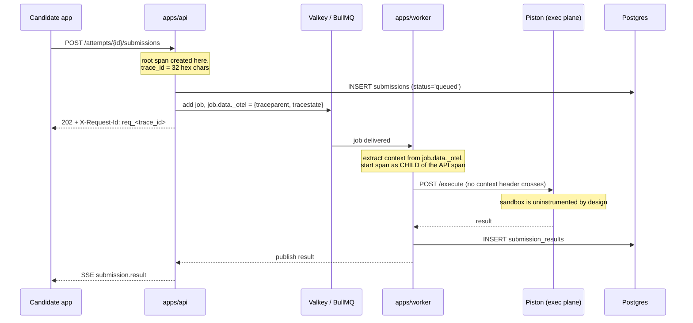

# Observability and runbooks

**Status:** draft
**Owner:** _unassigned_
**Last updated:** 2026-09-20
**Companion docs:** [`01-PRD.md`](01-PRD.md), [`02-HLD.md`](02-HLD.md), [`03-API-spec.md`](03-API-spec.md), [`04-ADRs.md`](04-ADRs.md), [`11-data-retention-and-dpia.md`](11-data-retention-and-dpia.md), [`13-environments-and-release.md`](13-environments-and-release.md), [`14-threat-model.md`](14-threat-model.md), [`../project/RISKS.md`](../project/RISKS.md), [`../project/DEFINITION-OF-DONE.md`](../project/DEFINITION-OF-DONE.md)

---

## 1. What this document is for

[`02-HLD.md`](02-HLD.md) §8 names six metrics and four alerts. That is the right shortlist and the wrong level of detail for 03:00 on the morning of a campus drive. This document expands it into the thing an on-call engineer opens while 400 candidates are mid-attempt: what is measured, what each number means, what pages and what waits, and what to actually type.

Two properties of this system shape everything below.

**The failure that matters is silent.** An API outage is loud — candidates complain within seconds. The expensive failures here are quiet: autosave returning 200 while dropping the write, a deadline sweep that stopped running, a grading worker that died with 200 jobs in flight. Nobody notices until an attempt finalises with an empty answer set, by which point the candidate has left and the evidence is gone. The alerting policy is therefore biased hard toward paging on conditions that nobody would report.

**An infrastructure failure must never silently score a candidate as zero** (HLD §9). Every mitigation below either preserves the attempt or routes it to a human. No runbook in this document tells you to void, expire, fail or re-score an attempt as a way of clearing an alert. Where an attempt cannot be resolved automatically it moves to `under_review` and a person decides.

Nothing in this document is a decision path. Telemetry informs operators; it never scores a candidate, never flags one, and never influences a hiring outcome. Proctoring signals are advisory only (ADR-007), and there is no model anywhere in the scoring or decision path (ADR-011). A metric that started influencing an outcome would be a scoring input smuggled in through the back door.

**Nothing here exists yet.** `packages/observability` is tracked as `H-013` and the metric and alert implementation as `H-079` in [`../project/TRACKER.md`](../project/TRACKER.md). This document is the specification those tasks build to.

---

## 2. The observability stack

| Layer | Component | Licence | Runs where | Activates |
|---|---|---|---|---|
| Instrumentation | OpenTelemetry SDK for Node (`@opentelemetry/sdk-node`) | Apache-2.0 | In-process in `apps/api`, `apps/worker`, `apps/collab` | M0 |
| Pipeline | OpenTelemetry Collector (contrib distribution) | Apache-2.0 | `otel-collector` service, OTLP on 4317 | M0 |
| Metrics store | Prometheus | Apache-2.0 | `prometheus` service on 9090 | M0 |
| Dashboards and alert routing | Grafana OSS | AGPL-3.0 **but** self-hosted and unmodified — see below | `grafana` on 3030 | M0 |
| Logs | Structured JSON on stdout, collected by the container runtime | n/a | Every service | M0 |
| Log search | TBD — owner: platform engineer, decide by 2026-10-30 | — | — | M1 |
| Audit | Postgres `audit_log` table | PostgreSQL | `data` tier | M0 |

Configuration already exists in the repository: [`../infra/otel/otel-collector.yaml`](../infra/otel/otel-collector.yaml), [`../infra/prometheus/prometheus.yml`](../infra/prometheus/prometheus.yml), and the `observability` compose profile in [`../docker-compose.yml`](../docker-compose.yml).

### Why not Datadog, New Relic or Elastic

The licence policy in [`05-licensing-and-compliance.md`](05-licensing-and-compliance.md) and ADR-001 restricts dependencies to MIT, Apache-2.0, BSD, ISC, MPL-2.0, PostgreSQL, Unlicense and CC0. That rules out parts of this space directly and the rest indirectly:

- **Elasticsearch and Kibana** are SSPL/Elastic-Licence-2.0 since 7.11. SSPL is explicitly on the CI deny list. OpenSearch (Apache-2.0) is the compliant fork and remains a legitimate option for log search when we pick one; it is heavier than this system needs at 500 concurrent candidates, which is why the decision is deferred rather than made.
- **Datadog and New Relic** are commercial SaaS. The licence objection is secondary; the substantive one is data residency. Telemetry from this system contains attempt identifiers, submission identifiers and error payloads from an employment-assessment platform, and [`11-data-retention-and-dpia.md`](11-data-retention-and-dpia.md) has to be able to state where candidate-linked data lives. Shipping it to a third-party processor adds a controller-processor agreement, a transfer analysis and a sub-processor disclosure to every deployment of a product whose entire premise is that you self-host it.
- **Grafana OSS is AGPL-3.0**, which the policy would normally reject. It is admitted as a deployed, unmodified, standalone service — never a dependency linked into our code, never redistributed, never modified. Nothing in `package.json` references it and no build step consumes it. That is the same reasoning the policy applies to Postgres tooling: the deny list governs what we link and ship, not what we run beside it. If a future release distributes an appliance image containing Grafana, this admission must be re-examined, because distribution is the trigger that AGPL turns on. Recorded as a standing exception in [`05-licensing-and-compliance.md`](05-licensing-and-compliance.md); the CI licence gate (`make licences`) scans the dependency tree, not the compose file, so it will not catch a regression here.

The practical consequence of self-hosting the whole stack: there is no vendor to call during an incident, and the observability tier can fail at the same time as the thing it observes. Prometheus scrapes each service's `/metrics` endpoint **directly as well as** through the collector's Prometheus exporter, precisely so that a collector crash does not blind you at the moment you need sight ([`../infra/prometheus/prometheus.yml`](../infra/prometheus/prometheus.yml) documents this).

### What is deliberately not instrumented

Piston is not scraped. Prometheus sits on the `edge` network; Piston sits alone on `exec`, which is `internal: true` in production. A scrape job would require exactly the route the isolation model forbids (HLD §7). Execution health is observed from the **worker's** side — the worker already measures every call's latency, exit status, timeout and memory kill, which is what an operator would look at anyway. See RB-05 for how to diagnose an exec node without that route.

---

## 3. Signal taxonomy — what goes where

Four sinks, four different jobs. Putting a signal in the wrong one is the most common instrumentation mistake in this codebase's future, so the rule is written down.

| Sink | Answers | Cardinality | Retention | Queryable by |
|---|---|---|---|---|
| **Metric** (Prometheus) | "Is the system healthy right now, and is it getting worse?" | Low and bounded. Every label value must come from a closed set. | 15 days raw, 13 months rolled up | Aggregate only |
| **Log** (structured JSON) | "What exactly happened in this one request, and why did it fail?" | Unbounded | 30 days hot, 90 days archived | Free text and field filters |
| **Span** (OTel trace) | "Where did the time go, across which services?" | Unbounded, tail-sampled | 30 days | Trace id, then attributes |
| **Audit log** (Postgres `audit_log`) | "Who did this, to what, when, and what was the before and after?" | Unbounded, complete | 7 years (`RETENTION_AUDIT_LOG_YEARS`) | SQL, and `GET /audit-log` |

### The audit log is a domain record, not telemetry

This is the distinction that matters most and the one most likely to be blurred by someone adding "just one more thing to log".

The audit log lives in Postgres, in the `audit_log` table defined in [`hiring_platform_schema.sql`](hiring_platform_schema.sql), written in the same transaction as the change it records, and is append-only. It is not observability data. It is evidence.

The reason is in PRD §9: *"Every score is explainable. For any candidate, you can reconstruct: which questions they saw, what they answered, which test cases failed, and which human overrode what."* When a candidate disputes a score eighteen months after their assessment — or a regulator asks how a decision was made — the answer has to come from a durable, transactional, tenant-scoped, queryable record with a legally defensible retention period. It cannot come from a log aggregator with a 30-day window, a sampling policy and no transactional relationship to the write it describes.

Concretely:

| Event | Audit log | Application log |
|---|---|---|
| Recruiter overrides a score | **Yes** — actor, attempt, before, after, reason | Optional, incidental |
| Attempt voided | **Yes** — required, with reason (API spec §8) | Optional |
| Time accommodation granted | **Yes** — PRD §9 requires it be auditable | Optional |
| Question version published | **Yes** — ADR-003 immutability depends on it | Optional |
| Candidate PII erased | **Yes** — the erasure itself is the record that survives | Must **not** contain the PII |
| Autosave request failed | No | **Yes**, plus a metric |
| Grading job retried | No | **Yes**, plus a metric |
| Piston returned a 502 | No | **Yes**, plus a metric and a span event |

The test: *would you be comfortable if this record vanished in 30 days?* If no, it is an audit record and belongs in Postgres. If yes, it is telemetry.

The audit log is never the source of an alert either. Alerting on it would couple the on-call rotation to domain events that are not incidents — a voided attempt is a recruiter doing their job, not a page.

### Metric versus log versus span

- **Metric** when you would put it on a dashboard or an alert. If you cannot state the alert threshold, you probably want a log.
- **Log** when you need the specific identifiers to debug one occurrence. Every log line that describes a failure carries `trace_id`, so it joins to the span.
- **Span** when the interesting property is *duration across a boundary* — HTTP into queue into worker into Piston. A span is not a place to record business facts; it records timing and outcome.
- A failure usually produces all three: a counter increment, a log line with the detail, and a span marked with `status=ERROR`. That is not duplication; each answers a different question.

---

## 4. Metric catalogue

### Naming conventions

- `lower_snake_case`, no vendor prefix. Subsystem first: `http_`, `db_`, `bullmq_`, `exec_`, `attempt_`, `autosave_`, `sse_`, `ws_`, `collab_`, `webhook_`, `invitation_`, `import_`, `rls_`, `mail_`.
- Counters end in `_total`. Histograms and gauges carry a unit suffix: `_seconds`, `_bytes`, `_ratio`. Never `_ms` — Prometheus convention is base units, and mixing the two guarantees a dashboard that is wrong by a factor of 1000 exactly once, at the worst moment.
- Every service adds `service` and `tier` labels at scrape time via [`../infra/prometheus/prometheus.yml`](../infra/prometheus/prometheus.yml). Do not set them in application code.
- Three names are already referenced elsewhere in the repository and are therefore fixed: `bullmq_queue_depth` ([`../project/RISKS.md`](../project/RISKS.md) R-01), `exec_result_latency_seconds` ([`../project/MILESTONES.md`](../project/MILESTONES.md) M2 exit criteria), `autosave_failure_total` ([`../project/RISKS.md`](../project/RISKS.md) R-15). Renaming any of them is a three-file change.

In the table, **P** marks a page-now alert and **T** a ticket. Thresholds marked *(exam window)* apply only inside a declared exam window (§9.1); outside one the same condition is a ticket. Thresholds marked **TBD** cannot be set honestly before there is a real load profile — owner: platform engineer, decide by 2026-11-27 (M2 exit), from the load test in [`07-load-and-capacity-testing.md`](07-load-and-capacity-testing.md).

### 4.1 Queue and grading

| Metric | Type | Labels | What it tells you | Alert |
|---|---|---|---|---|
| `bullmq_queue_depth` | gauge | `queue` (`grading.run`\|`grading.submit`\|`webhooks.deliver`\|`notifications.email`\|`bank.jobs`\|`maintenance.cron`), `priority` (`interactive`\|`batch`), `state` (`waiting`\|`delayed`) | Backlog. The single most important number during an exam window. | **P** `queue="grading.submit"` rising monotonically for 5 min *(exam window)*; **T** depth > 200 for 15 min |
| `bullmq_time_in_queue_seconds` | histogram | `queue`, `priority` | How long a job waits before a worker picks it up. Separates "not enough workers" from "workers are slow". | **P** p95 > 30s for 5 min *(exam window)* |
| `bullmq_job_duration_seconds` | histogram | `queue`, `job_name` | How long the work itself takes. Rising here with flat queue depth means a slow question, not a capacity problem. | **T** p95 doubles week-over-week |
| `bullmq_job_failed_total` | counter | `queue`, `job_name`, `reason` (`exec_unavailable`\|`timeout`\|`db_error`\|`validation`\|`unknown`) | Jobs that threw. Retries are counted here each time. | **T** rate > 1/min for 10 min |
| `bullmq_job_retried_total` | counter | `queue`, `job_name`, `attempt_no` | Whether `QUEUE_MAX_ATTEMPTS` is being consumed. A job at `attempt_no=3` is one failure from the DLQ. | **T** rate > 0.5/min for 10 min |
| `bullmq_dlq_depth` | gauge | `queue` | Jobs that exhausted retries. **Every unit is an ungraded submission and a candidate waiting.** | **P** `> 0` for 2 min, any time |
| `bullmq_workers_active` | gauge | `queue` | Live consumers. Zero with non-zero depth means the worker tier is down, not busy. | **P** `== 0` while `bullmq_queue_depth > 0` |
| `bullmq_oldest_job_age_seconds` | gauge | `queue` | Age of the head of the queue. Catches a stalled queue that a flat depth hides. | **P** > 300 *(exam window)* |

### 4.2 Execution

| Metric | Type | Labels | What it tells you | Alert |
|---|---|---|---|---|
| `exec_wall_time_seconds` | histogram | `language`, `kind` (`trial`\|`submit`) | Sandbox wall clock per call. Buckets sized against `EXEC_WALL_TIME_MS=10000`: 0.1, 0.25, 0.5, 1, 2, 4, 8, 10, +Inf. | **T** p95 > 4s for 15 min |
| `exec_cpu_time_seconds` | histogram | `language` | CPU consumed, against `EXEC_CPU_TIME_MS=5000`. Diverging from wall time means the node is contended, not the code slow. | — |
| `exec_result_latency_seconds` | histogram | `kind` | **The PRD §8 NFR.** Submit → final SSE event, end to end including queue wait. M2 exit criterion. | **P** p95 > 8s for 5 min *(exam window)*; **T** p95 > 6s for 15 min |
| `exec_calls_total` | counter | `language`, `outcome` (`ok`\|`failed`\|`timeout`\|`oom`\|`error`) | Denominator for every rate below. Keep `outcome` closed — never pass Piston's raw message through. | — |
| `exec_timeout_total` | counter | `language`, `limit` (`cpu`\|`wall`) | Candidates hitting the ceiling. A spike on one language usually means limits are wrong for that runtime, not that candidates got worse. | **T** ratio to `exec_calls_total` > 5% over 30 min for one language |
| `exec_oom_total` | counter | `language` | Memory kills against `EXEC_MEMORY_MB=256`. Same reading as timeouts. | **T** ratio > 5% over 30 min |
| `exec_sandbox_error_total` | counter | `language`, `class` (`connect`\|`http_5xx`\|`malformed`\|`node_unreachable`) | The sandbox failed, not the candidate's code. **This is the one that must never be attributed to a candidate.** | **P** rate > 0.2/s for 2 min *(exam window)*; **T** any occurrence outside |
| `exec_output_truncated_total` | counter | `language` | Output exceeded `EXEC_MAX_OUTPUT_BYTES=65536`. Usually an accidental infinite print; occasionally a comparison that will now fail unfairly. | **T** rate > 1/min |
| `exec_node_health` | gauge | `node` | 1 healthy, 0 failing the worker-side probe. `node` is a bounded operator-assigned label, not a container id. | **P** any node at 0 for 3 min |

### 4.3 Attempts

| Metric | Type | Labels | What it tells you | Alert |
|---|---|---|---|---|
| `attempts_by_status` | gauge | `status` (the eight values of `attempt_status`), `mode` (`async`\|`live`\|`proctored`) | Population snapshot, sampled every 30s from Postgres. The shape of an exam window at a glance. | — |
| `attempts_started_total` | counter | `mode` | Arrival rate. Compare against the expected cohort size before a drive. | — |
| `attempts_finalised_total` | counter | `mode`, `path` (`auto`\|`review`) | Completion. `path="review"` climbing means humans are being asked to do more work than planned. | — |
| `attempts_overdue_in_progress` | gauge | — | **Attempts in `in_progress` whose `deadline_at` has passed.** Steady state is exactly zero. Non-zero means the deadline sweep is broken, or the server clock is wrong, or finalisation is failing — all of which wrongly expire or wrongly extend candidates. | **P** `> 0` for 3 min, any time |
| `attempt_finalisation_duration_seconds` | histogram | `mode` | Submit → `finalised`. The transition requires every `answers.final_score` non-null in one transaction; a long tail here means a grading job never landed. | **T** p95 > 120s |
| `deadline_sweep_last_success_timestamp_seconds` | gauge | — | Unix time of the last successful sweep. A sweep that silently stopped is invisible in every other metric. | **P** `time() - value > 300` |
| `deadline_sweep_expired_total` | counter | — | Attempts the sweep moved to `expired`. A sudden spike is a timer bug, not a cohort that all gave up at once. | **T** > 3× the 7-day baseline in one hour |
| `attempt_clock_skew_seconds` | histogram | — | Client-reported time minus `server_time` at heartbeat. The server owns the clock (ADR-006); this measures how badly clients disagree, which predicts support tickets. | **T** p99 > 120 |

### 4.4 Candidate-facing write path

| Metric | Type | Labels | What it tells you | Alert |
|---|---|---|---|---|
| `autosave_requests_total` | counter | `result` (`ok`\|`conflict`\|`rejected`\|`error`), `kind` (`mcq`\|`text`\|`code`) | Denominator, and the rate tells you how much work is in flight. Against the `60/min` per-attempt rate limit in API spec §2. | — |
| `autosave_failure_total` | counter | `reason` (`db_error`\|`timeout`\|`rls_denied`\|`payload_too_large`\|`unknown`) | **Candidates are losing work right now.** Not a threshold metric. | **P** `rate() > 0` over any 5 min window, any time |
| `autosave_latency_seconds` | histogram | `kind` | Write latency. Rising ahead of failures is the early warning. | **T** p95 > 1s for 10 min |
| `autosave_payload_bytes` | histogram | `kind` | Detects a client shipping the whole editor buffer every keystroke. | — |
| `answer_write_conflict_total` | counter | `kind` | Two writers for one answer — two tabs, or a resumed attempt racing a stale one. Not necessarily a bug, but it precedes "lost work" tickets. | **T** rate > 0.1/s |
| `mail_send_failure_total` | counter | `template` (`invitation`\|`reminder`\|`result`) | Invitations not arriving is invisible from inside the product. | **T** any in 15 min |

### 4.5 Streams and collaboration

| Metric | Type | Labels | What it tells you | Alert |
|---|---|---|---|---|
| `sse_connections_active` | gauge | `stream` (`attempt`\|`submission`\|`session`) | Open SSE connections on `apps/api`. Roughly one per active candidate on a coding question. | **T** > 1200 (above the 1000-peak NFR) |
| `sse_connection_duration_seconds` | histogram | `stream` | Short-lived connections mean a reconnect loop, which multiplies load precisely when the system is already struggling. | **P** p50 < 10s with `sse_connections_active > 100` — a storm (RB-09) |
| `sse_reconnects_total` | counter | `stream`, `reason` (`server_close`\|`client_error`\|`timeout`\|`lb_close`) | The storm's driver. | included above |
| `sse_events_dropped_total` | counter | `stream` | Backpressure. A dropped `submission.result` event leaves a candidate staring at a spinner. | **T** any in 5 min |
| `ws_connections_active` | gauge | `service` (`collab`\|`livekit_signal`) | Live interview participants. `apps/collab` scales on this (HLD §6) — it is memory-bound. | **T** > TBD — owner: platform engineer, decide by 2026-12-24 (M3 exit), from the M3 load test |
| `ws_reconnects_total` | counter | `service`, `reason` (`server_close`\|`network`\|`ticket_expired`\|`unknown`) | Participants dropping. They notice before the dashboard does. | **P** rate > 2/s for 2 min during an active session |
| `collab_snapshot_lag_seconds` | gauge | — | Age of the oldest unpersisted document, against `COLLAB_SNAPSHOT_INTERVAL_MS=15000`. **This number is the upper bound on work lost if a collab node dies.** | **P** > 60 |
| `collab_snapshot_failures_total` | counter | `reason` (`db_error`\|`s3_error`\|`serialise`) | Snapshots failing means lag is unbounded and nobody told you. | **P** any 2 in 5 min |
| `collab_docs_resident` | gauge | — | Documents held in memory on this node. The drain-completion signal during a rolling restart ([`13-environments-and-release.md`](13-environments-and-release.md) §7). | — |
| `collab_doc_bytes` | histogram | — | Yjs document size. Unbounded growth is the known CRDT failure mode; a 10 MB document will not load on a weak laptop. | **T** p99 > 5 MB |

### 4.6 API and database

| Metric | Type | Labels | What it tells you | Alert |
|---|---|---|---|---|
| `http_request_duration_seconds` | histogram | `route_class`, `method`, `status_class` (`2xx`\|`4xx`\|`5xx`) | **The PRD §8 NFR: p95 < 300 ms non-execution.** `route_class` is the *templated* route (`POST /attempts/{id}/answers`), never the resolved path — see §6. | **P** p95 > 300 ms across non-execution routes for 10 min *(exam window)*; **T** otherwise |
| `http_requests_total` | counter | `route_class`, `method`, `status_class` | Rate and error ratio. | **P** 5xx ratio > 1% for 5 min |
| `http_rate_limited_total` | counter | `scope` (the five scopes in API spec §2) | Whether limits are protecting the system or blocking legitimate candidates. A spike on `candidate_autosave` is a client bug, and the candidate is losing work. | **P** `scope="candidate_autosave"` rate > 0.5/s |
| `db_pool_connections_in_use` | gauge | `role` (`app`\|`job`) | Against `DATABASE_POOL_MAX`. | — |
| `db_pool_saturation_ratio` | gauge | `role` | `in_use / DATABASE_POOL_MAX`. The clearest leading indicator of an API-wide stall: everything queues behind a pool with no free slots. | **P** > 0.9 for 3 min; **T** > 0.75 for 15 min |
| `db_pool_acquire_wait_seconds` | histogram | `role` | Time spent waiting for a connection. Non-zero p95 means saturation is already biting. | **P** p95 > 0.5s for 5 min |
| `db_query_duration_seconds` | histogram | `statement_class` | Slow statements by class (`attempt_materialise`, `answer_upsert`, `results_report`, …) — a bounded, hand-assigned set, not the SQL text. | **T** p95 > 500 ms for any class |
| `db_transaction_rollback_total` | counter | `reason` (`serialisation`\|`deadlock`\|`app_abort`) | Serialisation failures under concurrency — the class of bug that only shows up in a full cohort. | **T** rate > 0.1/s |
| `db_replication_lag_seconds` | gauge | `replica` | How stale the standby is, which is how much is lost on failover (RB-07). | **P** > 30 |
| `rls_denied_total` | counter | `table`, `db_role` | Queries refused by a row-level-security policy (ADR-010). **Steady state is zero.** Non-zero is either a bug that is about to look like a cross-tenant leak, or an attempt at one. | **P** `> 0` — any occurrence, any time |

### 4.7 Integration and back office

| Metric | Type | Labels | What it tells you | Alert |
|---|---|---|---|---|
| `webhook_delivery_total` | counter | `event` (the seven in API spec §12), `outcome` (`ok`\|`4xx`\|`5xx`\|`timeout`\|`connect`) | Whether the ATS is receiving results. Per-endpoint identity stays out of the labels — see §6. | **T** success ratio < 95% over 30 min |
| `webhook_retry_depth` | gauge | — | Deliveries pending retry inside the 24-hour window. Growing means a consumer is down and results are not reaching the ATS. | **T** > 100 for 30 min |
| `webhook_delivery_latency_seconds` | histogram | `event` | Time from domain event to accepted delivery. | **T** p95 > 60s |
| `webhook_signing_key_age_days` | gauge | — | Against `WEBHOOK_SIGNING_SECRET_ROTATION_DAYS=90`. | **T** > 90 |
| `invitations_sent_total` | counter | `channel` (`email`\|`link`) | Denominator for redemption. | — |
| `invitations_redeemed_total` | counter | `channel` | Numerator. **Redemption rate** is `increase(invitations_redeemed_total[72h]) / increase(invitations_sent_total[72h])`. A collapse here is almost always mail delivery, not candidate disinterest — it is the only way to detect silent SMTP failure. | **T** ratio < 0.4 over 72h with ≥ 50 sent |
| `invitation_redemption_delay_seconds` | histogram | `channel` | Sent → redeemed. Feeds the PRD §10 "invite to score < 24h median" metric. | — |
| `import_jobs_active` | gauge | `state` (`queued`\|`parsing`\|`validating`\|`writing`\|`failed`) | Bulk question import (API spec §4). A job stuck in `writing` holds a long transaction. | **P** any job in one state > 900s (RB-13) |
| `import_rows_rejected_total` | counter | `reason` (`schema`\|`duplicate`\|`licence_missing`\|`skill_unknown`) | `licence_missing` is a compliance signal, not just a data-quality one ([`05-licensing-and-compliance.md`](05-licensing-and-compliance.md)). | **T** rejection ratio > 20% on a completed job |
| `stats_recompute_last_success_timestamp_seconds` | gauge | — | Nightly psychometrics (FR-5). Silent failure degrades question quality invisibly for weeks. | **T** `time() - value > 172800` |
| `retention_sweep_last_success_timestamp_seconds` | gauge | `policy` (`proctor_media`\|`session_recording`\|`attempt_data`\|`candidate_pii`) | Retention sweeps are a legal obligation ([`11-data-retention-and-dpia.md`](11-data-retention-and-dpia.md)), and a failed sweep means data is being kept longer than the DPIA says. | **P** `proctor_media` stale > 48h; **T** others stale > 48h |

---

## 5. Tracing

### 5.1 The requirement

HLD §8: *"propagate a trace ID from the candidate request through the queue into the worker and execution call. Debugging 'why did this candidate's score differ on re-grade' is impossible without it."*

A trace must survive three boundaries that normally break it: an HTTP edge, a Valkey-backed job queue, and an outbound call into the isolated execution plane.



### 5.2 Rules

1. **W3C Trace Context** (`traceparent` / `tracestate`) is the only propagation format. No B3, no vendor headers.
2. **The API is the trace root for candidate traffic.** Browser instrumentation is not shipped in M0–M2: it costs bundle weight in the candidate app, and a candidate's browser is not a trusted source of trace ids. If an inbound `traceparent` arrives it is recorded as a *link*, never adopted as the parent.
3. **Queue hop.** The producer injects the active context into `job.data._otel`; the consumer extracts it and starts its span as a child. A job that arrives without `_otel` starts a new trace **and** increments `bullmq_job_missing_context_total` — silent trace breakage is the failure mode this metric exists to catch.
4. **Execution hop.** The worker's call to Piston is a client span with attributes `exec.language`, `exec.version`, `exec.runtime_image`, `exec.wall_ms`, `exec.cpu_ms`, `exec.memory_kb`, `exec.outcome`. **No trace context header is sent into the sandbox.** Piston is uninstrumented, the exec plane has no route to the collector, and the sandbox must receive nothing it did not need. The worker's client span is the complete record of that hop.
5. **Collab and SSE.** A long-lived connection is not a span. The WebSocket upgrade and ticket validation are spanned; steady-state traffic is not, or one interview produces a million spans. Snapshot writes are spanned.
6. **Sampling.** `OTEL_TRACES_SAMPLER_ARG=1.0` at the SDK, with tail sampling in the collector ([`../infra/otel/otel-collector.yaml`](../infra/otel/otel-collector.yaml)): keep 100% of traces containing an error, 100% of traces touching a submission or finalisation, 100% during a declared exam window, and a 5% probabilistic sample of everything else. The expensive traces are exactly the ones worth keeping.

### 5.3 `request_id` is the trace id

[`03-API-spec.md`](03-API-spec.md) §2 defines `error.request_id` in the error envelope. This document fixes its content:

```
request_id = "req_" + trace_id        # trace_id is 32 lowercase hex characters
```

The same value is returned on **every** response, success or failure, in the `X-Request-Id` header, and is emitted as `trace_id` on every log line the request produces.

The point is operational, not aesthetic. A candidate emails support with a screenshot showing `req_4bf92f3577b34da6a3ce929d0e0e4736`. Support pastes it into the trace view and sees the whole path — API handler, queue wait, worker, Piston call, database writes — without asking the candidate for anything else. Without this, a support ticket bottoms out at "something went wrong around 14:30" and the investigation is over.

Requirements that follow: the candidate and staff apps must display `request_id` in every error surface and make it copyable; the support template in [`../project/DEFINITION-OF-DONE.md`](../project/DEFINITION-OF-DONE.md) terms asks for it first; and a trace must be retrievable for at least 30 days, which is why trace retention is not shorter.

---

## 6. Cardinality rules

A Prometheus time series exists for every unique combination of label values. One unbounded label destroys the metrics tier — and it fails at peak, because peak is when the unbounded thing has the most distinct values.

**Never label a metric with:**

- `candidate_id`, `attempt_id`, `question_id`, `question_version_id`, `submission_id`, `session_id`, `user_id`, `invitation_id`
- `org_id` — tenant count grows without limit, and per-tenant metrics also leak the tenant list to anyone who can read `/metrics`
- email addresses, names, IP addresses, user agents
- raw URL paths (`/attempts/7f3a.../answers`), raw SQL, exception messages, stack traces
- upstream-supplied strings of any kind: Piston error text, webhook endpoint hostnames, HTTP status *reason phrases*

**Permitted label values are drawn from a closed set fixed in code.** Every label in §4 is an enum in `packages/observability`, and adding a value is a code change reviewed as one. If you cannot write down every possible value, it is not a label.

Bounded substitutes for the things people reach for:

| Wanted | Use instead |
|---|---|
| The URL that was slow | `route_class` — the templated route |
| Which question is timing out | `language`, plus a log line carrying `question_version_id` |
| Which tenant is generating load | Nothing. Query the audit log or the database; this is a reporting question, not a monitoring one |
| Which webhook endpoint is failing | `event` and `outcome` labels, plus `GET /webhooks/{id}/deliveries` for identity |
| Which exec node is sick | `node`, an operator-assigned label from a fixed inventory — never a container id or pod name |
| The exact error | `reason` or `class` from the closed set, plus a log line with the full detail and `trace_id` |

**Budget.** Total active series per environment: 50,000. Any single metric: 2,000 series. CI enforces this by starting the app, scraping `/metrics`, and failing the build if a metric family exceeds its budget — cardinality caught in review is free, cardinality caught in production is an outage of the tool you use to diagnose outages.

High-cardinality identifiers belong on **spans and logs**, where they cost storage rather than memory and where they are what you actually need. `attempt_id` on a span is correct; `attempt_id` on a metric is an incident.

---

## 7. Logging and redaction

### 7.1 Format

Single-line JSON on stdout, one object per event, collected by the container runtime (`json-file`, 50 MB × 5 in [`../docker-compose.prod.yml`](../docker-compose.prod.yml)). No multi-line output; a stack trace is a `\n`-escaped string field. Required fields on every line:

| Field | Example | Notes |
|---|---|---|
| `ts` | `2026-11-04T09:14:22.113Z` | RFC 3339 UTC, matching API spec §2 |
| `level` | `warn` | `trace`\|`debug`\|`info`\|`warn`\|`error`\|`fatal`, governed by `LOG_LEVEL` |
| `service` | `hiring-api` | Matches `OTEL_SERVICE_NAME` |
| `env` | `production` | From `APP_ENV` |
| `trace_id` | `4bf92f35…` | Joins to the trace and to `request_id` |
| `span_id` | `00f067aa…` | Present where a span is active |
| `msg` | `autosave rejected` | Fixed string per call site. Never interpolate values into `msg`; put them in fields, or every line is unique and unsearchable |
| `event` | `autosave.rejected` | Dotted, stable, machine-branchable |

Domain identifiers (`attempt_id`, `submission_id`, `question_version_id`, `org_id`) go in named fields and are encouraged — this is the sink where they belong.

`LOG_LEVEL` is `debug` locally and `info` in staging and production. `debug` in production is a redaction risk, not just a volume one: debug paths are where people print request bodies.

### 7.2 Redaction — the deny list

**Never logged, at any level, in any environment.** Redaction is implemented as a serialiser-level deny list in `packages/observability`, so it holds even when a developer logs a whole object. The redactor replaces the value with `"[redacted]"` and never with a truncated prefix — a prefix of a token is still a token to an attacker with the rest.

| Class | Fields and paths |
|---|---|
| **Credentials and secrets** | `password`, `password_hash`, `secret`, `token`, `attempt_token`, `invitation_token`, `ws_ticket`, `ticket`, `api_key`, `session`, `session_secret`, `TOKEN_PEPPER`, `SESSION_SECRET`, `S3_SECRET_ACCESS_KEY`, `S3_ACCESS_KEY_ID`, `OIDC_CLIENT_SECRET`, `LIVEKIT_API_SECRET`, `WEBHOOK_SIGNING_SECRET`, `DATABASE_URL` (contains the password), `REDIS_URL`, `SMTP_URL` |
| **Headers** | `authorization`, `cookie`, `set-cookie`, `x-signature`, `proxy-authorization` |
| **Candidate answers** | `answers.text_answer`, `answers.selected_option_ids`, `submissions.source_code`, `submissions.compile_stderr`, `submission_results.actual_stdout`, `submission_results.stderr` — stdout and stderr routinely contain the candidate's own source or data |
| **Question secrets** | `mcq_options.is_correct`, `short_answer_keys.*`, `test_cases.expected_stdout`, `test_cases.stdin` and `test_cases.expected_stdout` where `is_sample = false`, `coding_specs.solution_code`, `test_cases.assertion_code` (the unit test itself — it names the function and the value expected of it, ADR-024), and anything under a `hidden` key. HLD §1: *"Nothing the candidate must not see ever reaches the client"* — a log aggregator that recruiters can read is a client |
| **Candidate PII** | `candidates.email`, `full_name`, `phone`, `resume_url`, `linkedin_url`, any `demographic_*` field (voluntarily collected, PRD §9, and the most sensitive data in the system), `proctor_media.*` object keys and any webcam or screen artefact reference |
| **Signed URLs** | Any value matching a presigned-URL shape. The query string *is* the credential. Log the object key, never the URL |

Additional rules:

- **Never log a full request or response body.** Log the fields you need, named.
- **An error object is not safe by default.** A Postgres error can carry the parameter values of the failing statement, which for an answer upsert is the candidate's answer. Errors are serialised through the redactor with a field allow-list (`code`, `constraint`, `table`, `routine`, `severity`), never `detail` or the raw message.
- **Validation errors log the failing field name and the reason, never the value.** `{"event":"validation.failed","field":"text_answer","reason":"max_length"}` — never the text.
- **PII erasure must not resurrect PII.** The log line recording a GDPR erasure carries `candidate_id` only. Writing the erased email into the log so you can "prove what was deleted" recreates the record you were obliged to destroy.
- **CI enforcement.** A test asserts that logging a fixture object containing every deny-listed field produces no fixture value in the output. It is a unit test because it must run on every commit, not in a quarterly review.

### 7.3 Access

Application logs contain attempt and submission identifiers, which makes them candidate-linked data even after redaction. Access is restricted to on-call engineers and audited. Recruiters have no log access — they have `GET /audit-log`, which is the record designed for them.

---

## 8. Telemetry retention

| Signal | Hot | Archive | Basis |
|---|---|---|---|
| Metrics, 15s resolution | 15 days | — | Two full exam-window cycles plus a week |
| Metrics, 5m rollup | — | 13 months | Year-over-year capacity planning for an annual campus cycle |
| Application logs | 30 days | 90 days, compressed, cold | Long enough for a support ticket to arrive and be worked |
| Traces (tail-sampled) | 30 days | — | Matches log retention so a `request_id` in a ticket still resolves |
| Grafana annotations (deploys, incidents, exam windows) | indefinite | — | Cheap, and the only durable record of what changed when |
| **Audit log** | **7 years** | — | `RETENTION_AUDIT_LOG_YEARS=7`. Not telemetry (§3) |

Telemetry retention is deliberately shorter than domain retention. It is not evidence, and keeping candidate-linked identifiers longer than needed is a DPIA finding — see [`11-data-retention-and-dpia.md`](11-data-retention-and-dpia.md). Telemetry is also in scope for a GDPR erasure request: the erasure job cannot rewrite immutable log archives, so the mitigation is that logs carry **pseudonymous identifiers only** (§7.2) and expire inside 90 days. That argument only holds while the deny list holds.

---

## 9. SLOs, error budgets and burn-rate alerting

Derived from the PRD §8 non-functional requirements. An NFR is a target; an SLO adds a measurement window and a consequence.

| # | SLO | SLI | Objective | Window | Budget |
|---|---|---|---|---|---|
| SLO-1 | API responds quickly | Non-execution requests with `http_request_duration_seconds < 0.3` | 99% | 28 days rolling | 1% |
| SLO-2 | API is available | Requests not returning 5xx and not timing out | 99.9% **during declared exam windows**, 99.5% otherwise | 28 days rolling | 0.1% ≈ 40 min |
| SLO-3 | Code results arrive | `exec_result_latency_seconds < 8` for `kind="submit"` | 95% | 28 days rolling | 5% |
| SLO-4 | **No answer is lost** | `autosave_requests_total{result="ok"} / autosave_requests_total` | 99.99% | 28 days rolling | 0.01% |
| SLO-5 | Editor sync is live | `collab` round-trip p95 < 150 ms, same region | 95% | 28 days rolling | 5% |
| SLO-6 | Attempts finalise | Attempts reaching `finalised` or `under_review` within 15 min of submit | 99% | 28 days rolling | 1% |

SLO-4 is different in kind from the others. "Zero answer loss" is a PRD §8 durability requirement, not a latency target, and 99.99% is written as a *detection* threshold rather than an acceptable loss rate. There is no tolerable volume of lost candidate work. Any budget consumption at all triggers the page (§10) and an investigation — the budget exists to make the burn visible, not to authorise spending it.

### 9.1 Declared exam windows

An **exam window** is a period, declared in advance by the recruiting team and recorded as a Grafana annotation, during which a cohort is being assessed: a campus drive, a scheduled certification sitting, or any period with more than 50 attempts expected in an hour. The availability objective, several alert thresholds and the change freeze ([`13-environments-and-release.md`](13-environments-and-release.md) §9) all key off it.

Declaring a window is a two-minute task with real consequences. An undeclared campus drive gets the lower availability target, the relaxed thresholds, and no change freeze — which is how a migration runs in the middle of one.

### 9.2 Burn-rate alerting

Alerting on "did we breach the SLO" is useless: by the time it fires, the month is gone. Alert on *burn rate* — how fast the budget is being consumed relative to spending it evenly across the window. Multi-window, multi-burn, per Google SRE practice:

| Severity | Burn rate | Long window | Short window | Budget consumed | Meaning |
|---|---|---|---|---|---|
| **Page** | 14.4× | 1 hour | 5 min | 2% in 1 hour | Something broke just now |
| **Page** | 6× | 6 hours | 30 min | 5% in 6 hours | Sustained degradation |
| **Ticket** | 3× | 1 day | 2 hours | 10% in 1 day | Slow burn worth a working day |
| **Ticket** | 1× | 3 days | 6 hours | 10% in 3 days | Chronic; fix it this sprint |

Both windows must be burning for the alert to fire — the short window suppresses alerts on an incident that has already recovered.

### 9.3 Error budget policy

- **Budget remaining above 50%:** ship normally.
- **Below 50%:** the next release must contain at least one reliability item from the previous incident review.
- **Below 25%:** feature work continues only outside the affected tier; reliability work is prioritised in [`../project/TRACKER.md`](../project/TRACKER.md).
- **Exhausted:** freeze non-reliability changes to the affected tier until the budget recovers. Lifting the freeze early is a decision for the milestone owner, recorded in [`../project/STATUS.md`](../project/STATUS.md).

The budget is a conversation tool, not a punishment. Its real function is to make "we are shipping too fast for this tier" a number instead of an argument.

---

## 10. Alerts

Every alert below has a runbook in §12. An alert without a runbook is prohibited by [`../project/DEFINITION-OF-DONE.md`](../project/DEFINITION-OF-DONE.md), for the obvious reason: it wakes someone who then has to work out from first principles what it means.

### 10.1 Page now

Page means a human is woken. The bar: **candidates are losing work, being wrongly expired, being wrongly scored, or cannot proceed — and it will not fix itself.**

| Alert | Condition | Why it pages | Runbook |
|---|---|---|---|
| `AutosaveFailing` | `rate(autosave_failure_total[5m]) > 0` | Candidates are losing work *right now*. Every minute of delay is answers that cannot be recovered. There is no threshold above zero. | RB-04 |
| `AttemptsOverdueInProgress` | `attempts_overdue_in_progress > 0` for 3 min | Candidates are being wrongly expired, or wrongly given extra time. Both are fairness defects and both are defensibility exposures under PRD §9. | RB-03 |
| `DeadLetterQueueNonEmpty` | `bullmq_dlq_depth > 0` for 2 min | Ungraded submissions. Attempts will sit unfinalised waiting on a human who does not know they are waiting. | RB-02 |
| `DeadlineSweepStalled` | `time() - deadline_sweep_last_success_timestamp_seconds > 300` | The sweep that owns expiry stopped. Invisible in every other metric until attempts start hanging. | RB-03 |
| `SubmitQueueBackingUp` | `bullmq_queue_depth{queue="submit"}` increasing 5 min *(exam window)* | Results are falling behind candidates. Left alone it becomes a cohort-wide outage. | RB-01 |
| `QueueOldestJobStalled` | `bullmq_oldest_job_age_seconds{queue="submit"} > 300` *(exam window)* | A stalled queue that flat depth hides. | RB-01 |
| `NoActiveWorkers` | `bullmq_workers_active == 0 and bullmq_queue_depth > 0` | The worker tier is down. | RB-01 |
| `ExecResultLatencySLO` | `exec_result_latency_seconds` p95 > 8s for 5 min *(exam window)* | The PRD §8 NFR is breached and candidates are staring at spinners. | RB-01 |
| `SandboxErrorRate` | `rate(exec_sandbox_error_total[2m]) > 0.2` *(exam window)* | Infrastructure failing on the candidate's behalf. The one thing that must never be recorded as a candidate's failed submission. | RB-05 |
| `ExecNodeUnhealthy` | `exec_node_health == 0` for 3 min | Capacity lost; escape suspicion until ruled out. | RB-05 |
| `RLSDenied` | `increase(rls_denied_total[5m]) > 0` | Either a bug about to become a cross-tenant leak, or an attempt at one. ADR-010 makes RLS the isolation boundary; a denial means something reached it. | RB-14 |
| `DBPoolSaturated` | `db_pool_saturation_ratio > 0.9` for 3 min | Everything queues behind the pool. Minutes from total API stall. | RB-07 |
| `DBReplicationLag` | `db_replication_lag_seconds > 30` | Failover would lose 30s of candidate answers. | RB-07 |
| `ValkeyDown` | Valkey unreachable from `apps/api` for 1 min | Grading pauses and sessions degrade. | RB-06 |
| `CollabSnapshotLag` | `collab_snapshot_lag_seconds > 60` | Interview work beyond the intended 15s loss bound is unpersisted. | RB-08 |
| `CollabSnapshotFailing` | 2 × `collab_snapshot_failures_total` in 5 min | Snapshot lag is now unbounded. | RB-08 |
| `WSReconnectStorm` | `rate(ws_reconnects_total[2m]) > 2` during an active session | An interview is falling apart while people sit in it. | RB-08 |
| `SSEStorm` | `sse_connection_duration_seconds` p50 < 10s and `sse_connections_active > 100` | A reconnect loop multiplying load on an already-degraded API. | RB-09 |
| `AutosaveRateLimited` | `rate(http_rate_limited_total{scope="candidate_autosave"}[5m]) > 0.5` | Legitimate saves are being refused; functionally identical to autosave failure from the candidate's seat. | RB-04 |
| `APIErrorRate` | 5xx ratio > 1% for 5 min | — | RB-07 |
| `APILatencySLO` | Non-execution p95 > 300 ms for 10 min *(exam window)* | — | RB-07 |
| `ImportJobStuck` | `import_jobs_active` in one state > 900s | A long-running transaction holding locks against the question bank. | RB-13 |
| `ProctorMediaRetentionStalled` | `retention_sweep_last_success_timestamp_seconds{policy="proctor_media"}` stale > 48h | Biometric data retained past the DPIA ceiling is a compliance breach with a reporting clock. | RB-13 |
| Burn-rate pages | §9.2, 14.4× and 6× on SLO-1 to SLO-6 | — | per SLO |

### 10.2 Ticket

Ticket means a tracked issue in the next working day. Real, not urgent.

| Alert | Condition | Runbook |
|---|---|---|
| `QueueDepthElevated` | `bullmq_queue_depth > 200` for 15 min outside an exam window | RB-01 |
| `JobFailureRate` | `rate(bullmq_job_failed_total[10m]) > 1/min` | RB-02 |
| `ExecTimeoutRateHigh` | `exec_timeout_total / exec_calls_total > 5%` for one language over 30 min | RB-05 |
| `ExecOOMRateHigh` | `exec_oom_total / exec_calls_total > 5%` over 30 min | RB-05 |
| `ExecOutputTruncation` | `rate(exec_output_truncated_total[5m]) > 1/min` | RB-05 |
| `WebhookDeliveryDegraded` | success ratio < 95% over 30 min | RB-10 |
| `WebhookRetryBacklog` | `webhook_retry_depth > 100` for 30 min | RB-10 |
| `WebhookKeyStale` | `webhook_signing_key_age_days > 90` | [`13`](13-environments-and-release.md) §5 |
| `InvitationRedemptionLow` | 72h redemption ratio < 0.4 with ≥ 50 sent | RB-10 |
| `MailSendFailing` | any `mail_send_failure_total` in 15 min | RB-10 |
| `SlowQueryClass` | `db_query_duration_seconds` p95 > 500 ms for any class | RB-07 |
| `TransactionRollbacks` | `rate(db_transaction_rollback_total[5m]) > 0.1` | RB-07 |
| `AnswerWriteConflicts` | `rate(answer_write_conflict_total[5m]) > 0.1` | RB-11 |
| `CollabDocOversize` | `collab_doc_bytes` p99 > 5 MB | RB-08 |
| `SSEEventsDropped` | any `sse_events_dropped_total` in 5 min | RB-09 |
| `ClockSkewHigh` | `attempt_clock_skew_seconds` p99 > 120 | RB-03 |
| `StatsRecomputeStale` | last success > 48h | RB-13 |
| `ImportRejectionRateHigh` | rejection ratio > 20% on a completed job | RB-13 |
| `SSEConnectionsHigh` | `sse_connections_active > 1200` | RB-09 |
| Burn-rate tickets | §9.2, 3× and 1× | per SLO |

### 10.3 Routing and hygiene

- Page → on-call phone, 24/7 during a declared exam window; 07:00–22:00 local otherwise, with paging alerts queued to ticket outside those hours **except** `AutosaveFailing`, `AttemptsOverdueInProgress`, `DeadLetterQueueNonEmpty` and `RLSDenied`, which page at any hour. Those four are the ones where delay destroys evidence or destroys candidate work.
- Ticket → the team channel and an issue in the tracker.
- Every alert carries `runbook_url` pointing at its §12 anchor, the dashboard link, and the exact query that fired.
- Alerts are grouped by `service` and inhibited hierarchically: `ValkeyDown` suppresses the queue alerts it causes; `NoActiveWorkers` suppresses `SubmitQueueBackingUp`. An incident should page once, not eleven times.
- **An alert that fires more than twice in a month without a real incident is deleted or re-thresholded that week.** Alert fatigue is how `AutosaveFailing` gets ignored.

---

## 11. Exam-window operations

### 11.1 Readiness checklist

Run before every declared window. It exists because the failures that hurt during a campus drive are almost always things that were already true beforehand and unnoticed.

**T−7 days**

- [ ] Window declared: dates, expected cohort size, assessments in use, recruiter contact. Recorded as a Grafana annotation.
- [ ] Change freeze scheduled in [`13-environments-and-release.md`](13-environments-and-release.md) §9 terms, and the team told.
- [ ] Capacity checked against [`07-load-and-capacity-testing.md`](07-load-and-capacity-testing.md): expected peak concurrent attempts, expected submissions per minute, exec node count to serve them inside SLO-3.
- [ ] Load test run against staging at the expected cohort size, on the staging data volume (`13` §3). A test against an empty database proves nothing.
- [ ] Question bank sanity: every question in every assessment in use is `published`, has test cases, and has a non-null `max_score`. A draft question in a live assessment is a zero nobody intended.
- [ ] Piston runtime inventory matches the languages the assessments allow. A missing runtime is a 100% failure rate on one question.

**T−1 day**

- [ ] Freeze in effect. No migrations pending (`13` §8). No unmerged migration branch that someone might "just quickly" apply.
- [ ] All alerts firing-free and no silences active. **Check for forgotten silences explicitly** — a silence left from last month's incident is the most reliable way to miss the real one.
- [ ] Backup restore verified within the rehearsal cadence (`13` §11); if not, run one now.
- [ ] Exec node health: all nodes at `exec_node_health == 1`, none past its recycle age.
- [ ] Queue drained: `bullmq_queue_depth == 0`, `bullmq_dlq_depth == 0` across all queues. Starting a window with a non-empty DLQ means you cannot tell new failures from old.
- [ ] `db_pool_saturation_ratio` at baseline; `DATABASE_POOL_MAX` sized for expected concurrency.
- [ ] Disk headroom: Postgres, Valkey AOF, SeaweedFS volumes, Prometheus TSDB — each ≥ 40% free. Prometheus filling up during the window blinds you.
- [ ] Mail path verified end to end: a test invitation sent and received through the real SMTP relay, not Mailpit.
- [ ] On-call named, reachable, and aware the window exists. Escalation contact named.
- [ ] Recruiter contact named, with a channel that reaches them during the window — several runbooks need a business decision quickly.

**T−1 hour**

- [ ] Exam-window dashboard open (§11.2), annotation posted at window start.
- [ ] `attempts_by_status` baseline noted, so growth is readable against it.
- [ ] One synthetic attempt run end to end on production: start, answer, autosave, submit code, receive result, finalise. This catches configuration breakage that no dashboard shows.

**During**

- [ ] Dashboard watched at ≥ 15-minute intervals for the first hour, then hourly.
- [ ] No deploys, no migrations, no node recycles, no config changes. Exceptions go through §9's authorisation path in `13`.

**After**

- [ ] Annotation posted at window close.
- [ ] Every attempt reconciled: no attempt left `in_progress`, `submitted` or `auto_graded` more than an hour after the last deadline. Any that are go to a human, never to a sweep.
- [ ] DLQ empty. If not, RB-02 before the freeze lifts.
- [ ] Peak figures recorded against the capacity model in [`07-load-and-capacity-testing.md`](07-load-and-capacity-testing.md) — this is how the next window's sizing stops being a guess.
- [ ] Incident review for anything that paged (§13).

### 11.2 The exam-window dashboard

One screen. The constraint is that a person under stress can read it in ten seconds and know whether candidates are being harmed. Everything not serving that question belongs on a different dashboard.

**Row 1 — Are candidates being harmed?** (four large single-stat panels, green/red only)

| Panel | Query | Red when |
|---|---|---|
| Autosave failures, 5 min | `increase(autosave_failure_total[5m])` | `> 0` |
| Attempts overdue in progress | `attempts_overdue_in_progress` | `> 0` |
| Dead-letter depth | `sum(bullmq_dlq_depth)` | `> 0` |
| Sandbox errors, 5 min | `increase(exec_sandbox_error_total[5m])` | `> 0` |

**Row 2 — Cohort state**

- `attempts_by_status` stacked over time. The window's whole story: `in_progress` rising then falling, `submitted` converting to `auto_graded` to `finalised`. A widening `submitted` band is the earliest visible sign of grading falling behind.
- Attempts started vs finalised, cumulative, against expected cohort size.
- Active candidates: `sse_connections_active{stream="attempt"}`.

**Row 3 — The grading pipeline**

- `bullmq_queue_depth` by queue, with `bullmq_oldest_job_age_seconds` overlaid. Depth alone lies about a stalled queue.
- `bullmq_time_in_queue_seconds` p50/p95 beside `bullmq_job_duration_seconds` p50/p95 — **on one panel, deliberately.** Queue time rising with flat job duration means add capacity; job duration rising with flat queue time means a slow question and capacity will not help. Separating these two panels is how people spend an hour scaling the wrong thing.
- `exec_result_latency_seconds` p50/p95/p99 with an 8s threshold line (SLO-3).

**Row 4 — Execution health**

- `exec_calls_total` by outcome, stacked, as a rate.
- Timeout and OOM ratio by language.
- `exec_node_health` per node.

**Row 5 — Platform**

- `http_request_duration_seconds` p95 by `route_class`, top 5, with a 300 ms line.
- 5xx rate by `route_class`.
- `db_pool_saturation_ratio` and `db_pool_acquire_wait_seconds` p95.
- `db_replication_lag_seconds`.

**Row 6 — Budgets**

- Remaining error budget per SLO, and current burn rate.

Vertical annotations on every panel: window start/end, deploys, incidents.

A **live interview dashboard** (`ws_connections_active`, `ws_reconnects_total`, `collab_snapshot_lag_seconds`, `collab_docs_resident`, `collab_doc_bytes` p99, LiveKit room count from M3) is a separate screen, because live interviews and async windows rarely fail at the same time and mixing them halves the legibility of both.

---

## 12. Runbooks

Each runbook states its symptom, its likely causes in the order worth checking, the diagnosis commands, the mitigation, escalation, and the follow-up to file. Commands assume the local or staging stack; in production substitute the orchestrator's equivalent of `docker compose exec`.

Two rules apply to all of them. **Preserve the attempt**: no runbook step voids, expires, re-scores or fails an attempt to clear an alert; where an attempt cannot be resolved automatically it goes to `under_review` and a human decides. **Preserve the evidence**: capture logs, queue state and database rows *before* restarting anything, because a restart is usually the step that destroys the explanation.

---

### RB-01 — Execution queue backing up

**Symptom.** `SubmitQueueBackingUp`, `QueueOldestJobStalled`, `NoActiveWorkers` or `ExecResultLatencySLO`. Candidates see "grading in progress" for longer than usual, or indefinitely.

**Likely causes**, in the order to check:

1. Worker tier down or scaled to zero (`bullmq_workers_active == 0`).
2. Execution capacity insufficient for the arrival rate — the common one during an unplanned cohort.
3. An exec node unhealthy, so the surviving nodes carry the load (→ RB-05).
4. A slow question: a test suite with a pathological case, or limits too tight for one language, so every job burns the full `EXEC_WALL_TIME_MS`.
5. Valkey degraded, so jobs are accepted but delivered slowly (→ RB-06).
6. Database contention in the worker's result write, so jobs complete but do not retire (→ RB-07).

**Diagnosis.** The decisive question is *queue time or job time*.

```bash
# Queue shape, per queue
docker compose exec valkey valkey-cli --raw \
  eval "for _,k in ipairs(redis.call('keys','bull:*:wait')) do
          redis.log(redis.LOG_WARNING, k..' '..redis.call('llen',k)) end return 1" 0

# Or from the dashboard, the two numbers that matter:
#   bullmq_time_in_queue_seconds p95   -> rising => capacity
#   bullmq_job_duration_seconds  p95   -> rising => slow work

# Are workers alive and consuming?
docker compose ps worker
docker compose logs --since=15m worker | grep -c '"event":"job.completed"'

# Is a single language responsible?
# sum by (language) (rate(exec_calls_total[5m]))
# sum by (language) (rate(exec_timeout_total[5m]))

# What is actually at the head of the queue?
# The oldest job's trace_id is in the worker log; pull the trace.
```

**Mitigation.**

- **Queue time rising, job time flat →** capacity. Scale exec nodes and worker replicas. `QUEUE_SUBMIT_CONCURRENCY` may be raised, but only in step with exec capacity: raising concurrency against a fixed Piston pool converts a queue into timeouts, which is strictly worse because a timeout can be mistaken for a candidate's failure.
- **Job time rising, queue time flat →** slow work. Identify the language or question from the metrics above. Do **not** tighten limits mid-window; a tightened limit retroactively changes what a passing solution is.
- **Workers at zero →** restart the worker tier. In-flight jobs return to the queue; BullMQ redelivers, and grading is idempotent by ADR-008, so redelivery is safe.
- **Prioritise.** `submit` jobs outrank `run` (trial) jobs. If the backlog is severe, pause the `run` queue: candidates lose the "Run" button temporarily but keep submitting, and submissions are what is scored. Announce it through the recruiter contact.
- **Never** clear the queue. Every entry is a candidate's submission.

**Escalation.** If depth is still rising 15 minutes after scaling, escalate to the platform owner and tell the recruiter contact. The business decision — extend deadlines for the cohort, or let results arrive late — belongs to them, and extensions are recorded as accommodations (PRD §9), not silently applied.

**Follow-up.** Record peak arrival rate and the capacity that absorbed it in [`07-load-and-capacity-testing.md`](07-load-and-capacity-testing.md). If capacity was the cause, file a tracker task to raise the standing exec pool for the next window. Relates to `R-01` in [`../project/RISKS.md`](../project/RISKS.md).

---

### RB-02 — Dead-letter queue non-empty

**Symptom.** `DeadLetterQueueNonEmpty`. `bullmq_dlq_depth > 0`.

**Every DLQ entry is a submission that will never be graded unless someone acts.** Downstream, the attempt cannot reach `finalised`, because finalisation requires every `answers.final_score` to be non-null (API spec §8). The candidate is waiting and nothing is going to change that on its own.

**Likely causes.** `QUEUE_MAX_ATTEMPTS=3` exhausted against: a persistent Piston failure; a malformed job from a deploy that changed job shape without a migration path; a database constraint violation in the result write; a poison job that crashes the worker on every attempt.

**Diagnosis.**

```bash
# How many, which queue
docker compose exec valkey valkey-cli llen bull:submit:failed

# Inspect without consuming — read the most recent failure reasons
docker compose exec valkey valkey-cli lrange bull:submit:failed 0 9

# The failure reason and trace_id are in the worker log
docker compose logs --since=2h worker | grep '"event":"job.failed"' | tail -20
```

For each entry, take the `trace_id` and open the trace: it shows whether the failure was in the Piston call, the comparison, or the database write.

**Mitigation.**

1. **Classify before retrying.** Retrying a poison job three more times wastes the window.
2. **Transient cause now resolved** (Piston was down, database was failing over): retry the whole DLQ. Grading is idempotent (ADR-008), so a retry of a job that partially succeeded is safe.
3. **Persistent cause** (malformed job, constraint violation): do not retry. Record the affected `submission_id`s, then move the parent attempts to `under_review` so a human grades them. This is the designed path: HLD §9 requires that every failure either preserves the attempt or routes it to a person.
4. **Never** delete DLQ entries without recording the submission ids first. The list is the only record of who was affected.
5. Tell the recruiter contact which candidates are affected and what the delay is. They own the candidate communication.

**Escalation.** Any DLQ entry that cannot be classified in 30 minutes, or any DLQ depth above 10, goes to the platform owner. Above 50 during an exam window, treat as a cohort-level incident and involve the recruiting lead.

**Follow-up.** Incident review (§13) for any DLQ entry that reached a candidate as a delay. If the cause was a job-shape change, file a tracker task for the versioned-job-payload gap — that is a release-process defect, not a queue defect, and belongs in [`13-environments-and-release.md`](13-environments-and-release.md) §8's review checklist.

---

### RB-03 — Attempts stuck in `in_progress` past deadline

**Symptom.** `AttemptsOverdueInProgress` or `DeadlineSweepStalled`. Candidates report a timer that has expired but a session that will not submit, or the reverse: a session that submitted itself early.

**This pages at any hour.** It means candidates are being wrongly expired or wrongly extended — a fairness defect, and under PRD §9 a defensibility exposure. It is also the observable signature of a timer or finalisation bug after a database failover (`R-18` in [`../project/RISKS.md`](../project/RISKS.md)).

**Likely causes.**

1. The deadline sweep worker is dead, stalled, or was never scheduled after a deploy.
2. The sweep runs but its transaction fails — usually a lock conflict with a long-running query or an import job (→ RB-13).
3. Clock skew on an application node. `deadline_at` is computed server-side at start (ADR-006); if one node's clock is wrong, attempts started there carry wrong deadlines.
4. Finalisation blocked because some `answers.final_score` is null — which means RB-02, and the sweep is doing its job while grading is not.
5. A partially applied migration changed `attempts.status` handling.

**Diagnosis.**

```sql
-- Who is affected, and by how much
SELECT id, org_id, assessment_id, started_at, deadline_at,
       now() - deadline_at AS overdue
FROM attempts
WHERE status = 'in_progress' AND deadline_at < now()
ORDER BY deadline_at;

-- Are they waiting on grading rather than on the sweep?
SELECT a.id, count(*) FILTER (WHERE ans.final_score IS NULL) AS ungraded
FROM attempts a
JOIN attempt_questions aq ON aq.attempt_id = a.id
LEFT JOIN answers ans ON ans.attempt_question_id = aq.id
WHERE a.status IN ('in_progress','submitted','auto_graded')
GROUP BY a.id HAVING count(*) FILTER (WHERE ans.final_score IS NULL) > 0;

-- Is anything blocking the sweep's transaction?
SELECT pid, state, wait_event_type, wait_event, now() - query_start AS age, left(query, 120)
FROM pg_stat_activity WHERE state <> 'idle' ORDER BY age DESC LIMIT 20;
```

```bash
# Is the sweep running at all?
docker compose logs --since=30m worker | grep '"event":"sweep.deadline'
# Clock check across app nodes — skew above a second is already a problem
docker compose exec api date -u; docker compose exec worker date -u
```

**Mitigation.**

- **Sweep dead →** restart the worker tier. The sweep is idempotent; a missed run catches up on the next pass.
- **Sweep blocked →** identify and cancel the blocking statement (`pg_cancel_backend`, never `pg_terminate_backend` as a first resort), then confirm the sweep completes and `deadline_sweep_last_success_timestamp_seconds` moves.
- **Ungraded answers →** RB-02. The sweep is correct; grading is behind.
- **Clock skew →** take the node out of rotation, fix NTP, and **review every attempt started on it**. Attempts with a wrong `deadline_at` need a human decision on whether the candidate was disadvantaged; a candidate given too little time gets a re-sit, recorded as an accommodation.
- **Never** bulk-update `attempts.status` by hand to clear the alert. That writes a fabricated history into the table that the dispute process depends on. Every attempt that cannot be resolved by the sweep goes to `under_review`, with a note.

**Escalation.** Any attempt that was wrongly expired goes to the recruiting lead immediately — a candidate may need a re-sit, and the earlier that is offered the less damage it does. More than five affected attempts is a cohort-level incident.

**Follow-up.** Mandatory incident review. Add a regression test for the specific cause. If clock skew was involved, file a tracker task for node time-sync monitoring — the current metric (`attempt_clock_skew_seconds`) measures client skew, not server skew, and that gap is the reason this went unnoticed.

---

### RB-04 — Autosave failures

**Symptom.** `AutosaveFailing` (any non-zero rate) or `AutosaveRateLimited`. Candidates report answers not sticking, or an editor that shows "saving…" indefinitely.

**This is the highest-priority alert in the system.** Candidates are losing work that cannot be reconstructed. PRD §8 states zero answer loss as a durability requirement. Every minute of investigation is answers that are gone.

**Likely causes.**

1. Database write path failing — pool exhausted, disk full, failover in progress (→ RB-07).
2. RLS policy denying the write after a schema or role change (`rls_denied_total` non-zero → also RB-14).
3. Payload too large: a client sending the whole editor buffer, or a candidate pasting a very large input.
4. Rate limiting mis-scoped, refusing legitimate saves — functionally identical to failure from the candidate's seat.
5. A bad deploy to `apps/api` or `apps/candidate` changing the autosave contract.
6. A partially applied migration against `answers`.

**Diagnosis.**

```bash
# Which reason, and since when
docker compose logs --since=30m api | grep '"event":"autosave' | tail -50
# sum by (reason) (increase(autosave_failure_total[15m]))

# Pool and database first — the most common root cause
# db_pool_saturation_ratio, db_pool_acquire_wait_seconds p95
```

```sql
-- RLS denials are logged by Postgres when log_min_error_statement allows
-- Confirm the app role can still write:
SET ROLE hiring_app;
SELECT count(*) FROM answers WHERE answered_at > now() - interval '5 minutes';
RESET ROLE;

-- Disk
SELECT pg_size_pretty(pg_database_size(current_database()));
```

Take one failing `trace_id` from the logs and read the trace end to end. This usually identifies the cause faster than any aggregate.

**Mitigation.**

- **Pool exhausted →** RB-07. Autosave is the write that must survive; if load must be shed, shed reporting queries and staff traffic first. Autosave is the last thing to degrade.
- **Bad deploy →** roll back immediately ([`13-environments-and-release.md`](13-environments-and-release.md) §10). Do not attempt a forward fix while candidates are losing work.
- **RLS denial →** this is simultaneously a RB-14 trigger. Do not "fix" it by loosening the policy under time pressure; that trades data loss for a cross-tenant leak.
- **Payload size →** raise the limit as a temporary measure only if the payloads are legitimate, and file the client fix.
- **Rate limiting →** correct the scope. The API spec §2 limit is 60/min per attempt; a client exceeding it is a client bug and the candidate should not pay for it.
- **Tell candidates.** Once the cause is known and a fix is in flight, the recruiter contact tells affected candidates to copy their in-progress work out of the editor before anything else. This is unglamorous and it is the only thing that reliably saves the work.

**Escalation.** Page the platform owner at the same time as beginning diagnosis — do not investigate alone. Any confirmed data loss goes to the recruiting lead and, if candidate answers were lost, into the incident record with the affected `attempt_id`s named.

**Follow-up.** Mandatory incident review. Every affected attempt is reviewed by a human: if an answer was lost, the candidate is offered a re-sit rather than scored on a partial record. Relates to `R-15` in [`../project/RISKS.md`](../project/RISKS.md).

---

### RB-05 — Piston node unhealthy, or a suspected sandbox escape

**Symptom.** `ExecNodeUnhealthy`, `SandboxErrorRate`, `ExecTimeoutRateHigh`, `ExecOOMRateHigh`; or an unexpected process, outbound connection attempt, or filesystem change observed on an exec host.

**Likely causes.** Node resource exhaustion; a runtime image missing or corrupt after a rebuild; a Piston process crash; disk full on the exec host from accumulated job directories; network partition between the worker and the exec plane; **or a sandbox escape**.

**Diagnosis.** Remember that Prometheus has no route to the exec plane by design. Everything below runs from the worker's side or on the exec host itself through the management interface.

```bash
# Worker-side view: which node, which class of failure
# sum by (node, class) (increase(exec_sandbox_error_total[10m]))
docker compose logs --since=15m worker | grep '"event":"exec.' | tail -40

# On the exec host, through the management interface only
docker compose exec piston ps aux
docker compose exec piston df -h /piston
docker compose logs --since=15m piston | tail -60

# Escape indicators: anything outside the expected process tree,
# any outbound connection attempt (there should be no route at all),
# any write outside the job directory.
docker compose exec piston ss -tunp 2>/dev/null || true
```

**Mitigation — unhealthy node.**

1. Remove the node from the worker's pool so no new jobs are dispatched to it.
2. **Let in-flight executions finish** if the node is responsive. A submission mid-flight that is killed becomes a failed grading job, and a failed grading job is a candidate waiting.
3. Recycle the node: exec nodes are ephemeral by design ([`../infra/piston/`](../infra/piston/)) and hold no state worth preserving.
4. Confirm capacity: with one node gone, check whether the remaining pool can absorb the arrival rate (→ RB-01).
5. **Re-queue, never fail.** Executions that died with the node are re-queued. They must never be recorded as a candidate's failed submission — `exec_sandbox_error_total` exists precisely to keep infrastructure failure separate from candidate failure.

**Mitigation — suspected escape.** Treat as a security incident and involve the security owner before touching anything.

1. **Isolate, do not destroy.** Cut the node from the worker's pool and from every network. Do not restart it — a restart destroys the evidence.
2. **Snapshot** the host: disk image, process list, memory if available.
3. **Assess the blast radius, which is designed to be small.** An exec node holds no database credential, no object-store key, no session secret, no token pepper, no OIDC secret, no cloud role. It has no route to Postgres, Valkey, SeaweedFS, the API, the collab service, or the internet. Test-case expectations never enter the sandbox — comparison happens in the grading worker — so an escapee learns nothing about hidden cases ([`../docker-compose.prod.yml`](../docker-compose.prod.yml) asserts all four). Verify each of these assertions still holds on the affected node rather than assuming it.
4. **Recycle every other exec node** on the assumption the vector applies to all of them.
5. Identify the submission that triggered it from the worker log's `trace_id` and preserve `submissions.source_code` and `runtime_image`. This is the artefact that makes the vulnerability reproducible.
6. Notify per [`14-threat-model.md`](14-threat-model.md).

**Escalation.** Any escape suspicion goes to the security owner and the platform owner immediately, day or night. Do not wait for confirmation — the cost of a false alarm is an hour; the cost of a delayed real one is measured differently.

**Follow-up.** Mandatory security incident review. If a runtime vulnerability was exploited, pin or remove that runtime and state so in the assessment's language list. File the limit-tuning task if timeouts or OOMs were the trigger, and record the outcome against ADR-002.

---

### RB-06 — Valkey down

**Symptom.** `ValkeyDown`. Grading stops; job enqueue fails; staff sessions degrade; collab pub/sub between nodes stops.

**Blast radius (HLD §9).** Grading pauses and sessions degrade — but **the API keeps accepting submissions**, because a submission is written to Postgres before it is enqueued. That ordering is the whole reason Valkey being down is survivable: candidates keep working and keep submitting; grading catches up afterwards.

**Likely causes.** Process crash or OOM; AOF disk full; host failure; a network partition; memory limit reached with an eviction policy that then evicts queue data.

**Diagnosis.**

```bash
docker compose ps valkey
docker compose exec valkey valkey-cli ping
docker compose exec valkey valkey-cli info persistence | grep -E 'aof_|rdb_last'
docker compose exec valkey valkey-cli info memory | grep -E 'used_memory_human|maxmemory'
docker compose exec valkey valkey-cli info keyspace
docker compose logs --since=30m valkey | tail -40
df -h   # on the valkey host: AOF disk
```

```sql
-- The authoritative backlog lives in Postgres, not in Valkey.
-- This is what must be re-enqueued once Valkey returns.
SELECT status, count(*) FROM submissions
WHERE created_at > now() - interval '6 hours' GROUP BY status;
```

**Mitigation.**

1. **Confirm the API is still accepting submissions.** If enqueue failure is propagating a 5xx back to candidates, that is the urgent part: the write to `submissions` must commit and the enqueue failure must be recorded for later replay, not surfaced as a candidate-visible error.
2. Restart Valkey. It is configured with `appendonly` in [`../docker-compose.prod.yml`](../docker-compose.prod.yml), so queued jobs survive a clean restart.
3. **If AOF is corrupt or lost,** do not panic about the queue. Postgres holds every `submissions` row with `status='queued'`, and the reconciliation job rebuilds the queue from it. Queue state is derived; the database is the source of truth. Run the reconciliation and verify `bullmq_queue_depth` matches the count above.
4. Disk full: extend the volume, then restart. Do not disable AOF to buy space — that converts a recoverable outage into lost jobs.
5. Watch for the thundering herd on recovery: every waiting client reconnects at once. `QUEUE_SUBMIT_CONCURRENCY` limits worker-side damage; watch `db_pool_saturation_ratio` as the backlog drains.

**Escalation.** Platform owner if Valkey is not back within 10 minutes during an exam window. Recruiter contact if results will be delayed beyond the window.

**Follow-up.** If the queue had to be rebuilt from Postgres, verify no submission was graded twice — idempotency should make that a no-op, and this is the check that proves it. File a tracker task for Valkey memory headroom or AOF disk sizing if either was the cause.

---

### RB-07 — Postgres failover, saturation, or degradation

**Symptom.** `DBPoolSaturated`, `DBReplicationLag`, `APIErrorRate`, `APILatencySLO`, `SlowQueryClass`, `TransactionRollbacks`; or a primary failure and automatic promotion.

**Blast radius.** Total. Postgres is the single source of truth for every domain table. HLD §9's mitigation is an HA pair with automatic failover; in-flight attempts resume from autosave.

**Likely causes.** Pool exhaustion from a slow query class; a long-running report or import holding locks (→ RB-13); autovacuum falling behind on a hot table (`answers`, `submissions`, `session_events`); disk full; connection storm after an API restart; primary host failure.

**Diagnosis.**

```sql
-- Who is holding what
SELECT pid, usename, state, wait_event_type, wait_event,
       now() - xact_start AS xact_age, left(query,120)
FROM pg_stat_activity
WHERE state <> 'idle' ORDER BY xact_age DESC LIMIT 20;

-- Blocking chains
SELECT blocked.pid AS blocked_pid, blocking.pid AS blocking_pid,
       left(blocked.query,80) AS blocked_query, left(blocking.query,80) AS blocking_query
FROM pg_stat_activity blocked
JOIN pg_stat_activity blocking ON blocking.pid = ANY(pg_blocking_pids(blocked.pid));

-- Replication
SELECT client_addr, state, sent_lsn, replay_lsn,
       pg_wal_lsn_diff(sent_lsn, replay_lsn) AS lag_bytes
FROM pg_stat_replication;

-- Connections against the pool ceiling
SELECT usename, count(*) FROM pg_stat_activity GROUP BY usename;

-- Bloat / vacuum on the hot tables
SELECT relname, n_live_tup, n_dead_tup, last_autovacuum
FROM pg_stat_user_tables
WHERE relname IN ('answers','submissions','attempts','session_events')
ORDER BY n_dead_tup DESC;
```

**Mitigation.**

- **Pool saturated →** find the slow class from `db_query_duration_seconds`. Cancel long-running *reporting* queries first (`pg_cancel_backend`); they are the safest thing to kill and the most common cause. Never cancel a statement on the candidate write path.
- **Shed load in this order:** staff reporting, then bulk import, then trial code runs, then webhooks. **Candidate autosave, submission and attempt endpoints are shed last, and ideally never.** The order encodes what the product is for.
- **Failover in progress →** wait for promotion, then verify: `db_replication_lag_seconds` at the moment of failure is the window of writes potentially lost. Immediately after promotion, run RB-03's overdue-attempt query and RB-11's reconciliation for the affected minutes — a failover is precisely when answers go missing and deadlines go strange.
- **Connection storm after restart →** stagger API replica restarts; do not bring the whole tier up at once.
- **Autovacuum behind →** run a manual `VACUUM (ANALYZE)` on the affected table outside the exam window, not during it.
- **Disk full →** extend first, investigate second. A Postgres that cannot write is an outage where every candidate loses work.

**Escalation.** Any failover is an incident regardless of how clean it looked. Page the platform owner. If the failover window overlapped active attempts, involve the recruiting lead — some candidates may need a re-sit.

**Follow-up.** Mandatory incident review after any failover or any saturation event that breached SLO-1 or SLO-2. Record the actual replication lag at failure against the RPO target in [`13-environments-and-release.md`](13-environments-and-release.md) §11. Relates to `R-18` in [`../project/RISKS.md`](../project/RISKS.md).

---

### RB-08 — Collab node crash mid-interview

**Symptom.** `CollabSnapshotLag`, `CollabSnapshotFailing`, `WSReconnectStorm`, `CollabDocOversize`; or an interviewer reporting that the shared editor froze, emptied, or rolled back.

**An interviewer and a candidate are sitting in a call right now.** Speed matters more than root cause. The candidate is being assessed while the tool fails, which is both a bad experience and a fairness problem.

**Loss bound.** `COLLAB_SNAPSHOT_INTERVAL_MS=15000`. A crashed node loses at most 15 seconds of document state, provided snapshots were succeeding — which is why `collab_snapshot_failures_total` pages. Yjs is a CRDT (ADR-005), so a client that reconnects with local state merges it back rather than overwriting; the client's buffer is the second line of defence.

**Likely causes.** Node OOM — the collab tier is memory-bound and scales on connection count (HLD §6); an oversized document; a snapshot write failing against Postgres or S3; sticky routing broken at the load balancer so clients land on a node without the document; an expired WS ticket on reconnect.

**Diagnosis.**

```bash
docker compose ps collab
docker compose logs --since=15m collab | grep -E '"event":"(snapshot|doc\.|ws\.)' | tail -60
# collab_docs_resident, collab_snapshot_lag_seconds, collab_doc_bytes p99
# ws_reconnects_total by reason -> ticket_expired points at auth, not the node
```

```sql
-- When was this session's document last persisted?
SELECT id, session_id, at, left(kind, 40)
FROM session_events WHERE session_id = :session_id
ORDER BY at DESC LIMIT 20;
```

**Mitigation.**

1. **Tell the interviewer first.** Ask both participants to keep their browser tabs open — an open tab holds the local Yjs state and is the most complete copy of the document that exists. Closing the tab is what actually destroys the work.
2. **Have the candidate copy the code out** into the chat or a local file if anything looks wrong. Thirty seconds of inconvenience against losing the interview.
3. Restart the node. Clients reconnect automatically and merge their local state.
4. **Sticky routing broken →** fix routing before restarting anything else; without stickiness clients will keep landing on nodes that do not hold the document, and reconnection will not help.
5. **Snapshot failures →** treat as the priority even if the interview looks fine, because the loss bound is currently unbounded. Check Postgres and S3 reachability from the collab node.
6. **Oversized document →** do not attempt to trim it mid-session. Note it and file the follow-up.
7. **If the interview cannot continue,** the interviewer decides whether to reschedule. Record the interruption on the scorecard: an interviewer must not silently score a candidate down for a session the tooling broke. That is the same principle as ADR-007 — the system reports what happened; a human decides what it means.

**Escalation.** Platform owner immediately if more than one session is affected. Recruiting lead if a session has to be rescheduled.

**Follow-up.** Incident review if any session was interrupted. If the cause was memory, file the per-node connection-limit task and set the `ws_connections_active` per-node threshold that is currently TBD (owner: platform engineer, decide by 2026-12-24). If document size was the cause, file the document-compaction task — unbounded CRDT growth is a known Yjs failure mode and needs a designed answer, not a threshold.

---

### RB-09 — SSE connection storm

**Symptom.** `SSEStorm` — `sse_connection_duration_seconds` p50 below 10 seconds with more than 100 active connections. Or `SSEConnectionsHigh`, or `SSEEventsDropped`.

A storm is self-amplifying: short-lived connections mean clients reconnect, reconnection costs an authentication round trip and a database read, and that load makes connections shorter still. Left alone it takes the API down during the window where the API matters most.

**Likely causes.** A proxy or load balancer terminating idle SSE connections (idle timeout shorter than the heartbeat interval — the classic cause); a deploy rolling API replicas so every client reconnects at once; an API crash loop; a client bug reconnecting without backoff; connection limits reached at the proxy.

**Diagnosis.**

```bash
# Who is closing the connection: server, client, or the proxy in between?
# sum by (reason) (rate(sse_reconnects_total[5m]))
docker compose logs --since=10m api | grep '"event":"sse.' | tail -60
docker compose logs --since=10m caddy | tail -40

# Is the API stable, or crash-looping?
docker compose ps api
```

Compare the proxy's idle timeout against the SSE heartbeat interval. If the heartbeat is longer than the timeout, every connection dies on schedule and the pattern will be suspiciously regular.

**Mitigation.**

- **Proxy timeout →** raise the idle timeout above the heartbeat interval in [`../infra/caddy/Caddyfile`](../infra/caddy/Caddyfile), or shorten the heartbeat. Shortening the heartbeat is the safer emergency change because it needs no proxy restart.
- **Deploy-induced →** expected and self-limiting, provided clients back off. If it is not self-limiting, the client lacks jittered exponential backoff and that is the real defect.
- **Crash loop →** roll back ([`13`](13-environments-and-release.md) §10) rather than debugging forward during a window.
- **Client without backoff →** as an emergency measure, rate-limit reconnects at the proxy per attempt token. This degrades result delivery to polling latency but keeps the API up. **The candidate's attempt is unaffected either way** — SSE carries result notifications, not answers. Answers go over the autosave path, which is why it is more important that autosave survives than that SSE does.

**Escalation.** Platform owner if the storm does not settle within 10 minutes or if API p95 is breaching SLO-1 as a result.

**Follow-up.** Ticket for whichever of the two client-side properties was missing: jittered exponential backoff, or a reconnect cap. Verify the proxy timeout is asserted in the infra config rather than inherited from a default, and add it to the readiness checklist if it was not caught there.

---

### RB-10 — Webhook endpoint failing, or invitations not arriving

**Symptom.** `WebhookDeliveryDegraded`, `WebhookRetryBacklog`, `InvitationRedemptionLow`, `MailSendFailing`. Or a recruiter reporting that results are not appearing in the ATS, or candidates saying they never received an invitation.

**This is not an availability incident.** The platform is healthy; an integration is not. It is a ticket, with one exception: invitations not arriving during a window means candidates cannot start, which is a business-critical failure even though nothing is technically broken on our side.

**Likely causes.** Consumer endpoint down or returning 5xx; consumer rejecting the signature after a secret rotation (`WEBHOOK_SIGNING_SECRET_ROTATION_DAYS=90` — rotation is the single most common cause of sudden 4xx); TLS certificate expiry at the consumer; consumer rate-limiting us; SMTP relay rejecting or silently dropping; invitation mail landing in spam.

**Diagnosis.**

```bash
# Per-endpoint delivery history, which is where endpoint identity lives
# (deliberately not a metric label - see cardinality rules)
curl -s "$API_PUBLIC_URL/webhooks/$WEBHOOK_ID/deliveries" | jq '.data[:10]'

# Fire a test delivery
curl -s -X POST "$API_PUBLIC_URL/webhooks/$WEBHOOK_ID/test"

# Mail path
docker compose logs --since=1h api | grep '"event":"mail.' | tail -40
```

```sql
-- Redemption reality check for a specific campaign
SELECT count(*) FILTER (WHERE sent_at IS NOT NULL) AS sent,
       count(*) FILTER (WHERE redeemed_at IS NOT NULL) AS redeemed,
       min(sent_at), max(sent_at)
FROM invitations WHERE assessment_id = :assessment_id;
```

**Mitigation.**

- **Consumer down →** nothing to do but let retries run. At-least-once delivery with exponential backoff over a 24-hour window (API spec §12) covers most outages. Tell the recruiter the ATS will be behind.
- **Signature rejection after rotation →** confirm the consumer has the new secret. Use the dual-secret transition in [`13-environments-and-release.md`](13-environments-and-release.md) §5 rather than a hard cutover.
- **Retry window about to expire →** deliveries older than 24 hours are dropped. Before that point, decide whether to extend or accept that the ATS needs a manual reconciliation. Results are never lost — they are in the database and exportable; only the push is lost.
- **Mail failing →** check the relay, SPF/DKIM/DMARC alignment, and whether the sending domain is on a block list. **During a window, the fallback is the direct invitation link**, which recruiters can distribute through any channel. This should be on the readiness checklist as a known fallback, not discovered under pressure.
- **Low redemption with healthy sending →** likely spam filtering. Send one test invitation to an address at the candidate's domain and read the headers.

**Escalation.** Recruiting lead if invitations are not arriving for an imminent window — they may need to move the sitting. Platform owner if our own SMTP path is the cause.

**Follow-up.** Ticket against the integration. If a secret rotation caused it, that is a process defect: the rotation runbook in `13` §5 needs the consumer-notification step made explicit.

---

### RB-11 — A candidate reports lost work

**Symptom.** A support ticket: "my answers disappeared", "the editor was empty when I came back", "it submitted without my last question".

**This is a support procedure, and it is also a detector.** One report may be a browser closed without saving. Three reports from one cohort is RB-04 that no alert caught, and the second thing to do is always check whether autosave metrics were clean during the affected interval.

**First: get the `request_id`.** It is displayed on every error surface and equals `req_` plus the trace id (§5.3). With it, the investigation takes minutes. Without it you are searching by timestamp and candidate id.

**Diagnosis.**

```sql
-- What the server actually holds for this attempt
SELECT aq.ordinal, aq.question_version_id,
       ans.answered_at, ans.seconds_spent,
       ans.selected_option_ids IS NOT NULL AS has_mcq,
       ans.text_answer IS NOT NULL      AS has_text,
       ans.final_submission_id
FROM attempt_questions aq
LEFT JOIN answers ans ON ans.attempt_question_id = aq.id
WHERE aq.attempt_id = :attempt_id
ORDER BY aq.ordinal;

-- Attempt timeline
SELECT id, status, started_at, deadline_at, submitted_at, raw_score, max_score
FROM attempts WHERE id = :attempt_id;

-- Code work is never only in `answers` - every trial run is a row
SELECT id, created_at, is_trial_run, language, status, total_passed, total_cases
FROM submissions
WHERE attempt_question_id IN (SELECT id FROM attempt_questions WHERE attempt_id = :attempt_id)
ORDER BY created_at;
```

```bash
# Did autosave fail for this attempt specifically?
docker compose logs --since=24h api | grep "$ATTEMPT_ID" | grep '"event":"autosave' | tail -40
# Was the platform healthy during the interval at all?
# increase(autosave_failure_total[...]) over the attempt's window
```

**Mitigation.**

1. **Recover from trial runs.** For coding questions this is the most valuable and most overlooked recovery path: every "Run" the candidate pressed wrote a `submissions` row with the full `source_code`. A candidate who ran their code five minutes before losing it has that code in the database.
2. **Server has the work →** it is a display or sync problem. Have the candidate reload; confirm what the server holds is what they expect.
3. **Server does not have it, autosave was clean →** most likely the candidate's network dropped and the local buffer was lost when the tab closed. Say so honestly. Whether to offer a re-sit is the recruiter's decision, and the default should be generous: the cost of an unnecessary re-sit is small, the cost of scoring someone on work the system lost is a defensibility problem.
4. **Server does not have it, autosave failures present →** this is RB-04 and an incident. Escalate, identify everyone else in the same interval, and do not wait for them to complain.
5. **Never** reconstruct an answer on a candidate's behalf and write it into `answers`. A fabricated answer in the record destroys the integrity of every future dispute against that attempt.

**Escalation.** Recruiting lead for the re-sit decision. Platform owner if more than one candidate in a cohort reports it.

**Follow-up.** If the platform lost the work, incident review and a re-sit offered proactively. If the client lost it, file the client-durability task — local buffering before network send, and a visible save indicator the candidate can trust. Track repeat reports; a slow trickle is the signature of a real defect that never crosses an alert threshold.

---

### RB-12 — A candidate disputes a score

**This is not an incident. It is a defined procedure, and it is one of the reasons the system is built the way it is.** No page, no on-call involvement. It runs on a business timeline with a recruiter and an engineer, and it must be possible to complete without any privileged database access at all.

PRD §9 requires that every score is explainable: *"For any candidate, you can reconstruct: which questions they saw, what they answered, which test cases failed, and which human overrode what."* ADR-003 (immutable published versions) and ADR-004 (materialised served set) exist so that this reconstruction is possible years later. This procedure is what those decisions were for.

**Step 1 — Reconstruct what the candidate saw.** `attempt_questions` holds the exact set, the ordinal order, and `option_order`, the shuffle actually shown. `question_version_id` points at an immutable version, so the prompt, options and test cases are exactly those in force at the time, even if the question has been edited fifty times since.

```sql
SELECT aq.ordinal, qv.id AS version_id, qv.version_no, q.kind,
       aq.option_order, aq.max_score
FROM attempt_questions aq
JOIN question_versions qv ON qv.id = aq.question_version_id
JOIN questions q ON q.id = qv.question_id
WHERE aq.attempt_id = :attempt_id ORDER BY aq.ordinal;
```

**Step 2 — Reconstruct what they answered and how it scored.**

```sql
SELECT aq.ordinal, ans.auto_score, ans.manual_score, ans.final_score,
       ans.graded_by, ans.graded_at, ans.seconds_spent
FROM attempt_questions aq
JOIN answers ans ON ans.attempt_question_id = aq.id
WHERE aq.attempt_id = :attempt_id ORDER BY aq.ordinal;

-- For coding: which cases failed, with the runtime identity that produced them
SELECT s.id, s.language, s.language_version, s.runtime_image,
       s.total_passed, s.total_cases, s.runtime_ms, s.memory_kb,
       sr.test_case_id, sr.passed, sr.exit_code, sr.runtime_ms
FROM submissions s
JOIN submission_results sr ON sr.submission_id = s.id
WHERE s.id = :final_submission_id;
```

`language_version` and `runtime_image` are recorded per submission precisely so that a re-grade runs on the same runtime. A re-grade on a different Python patch release is not a re-grade; it is a different test.

**Step 3 — Check for infrastructure failure at the time.** This is the step most likely to find a genuine problem. Take the attempt's interval and check `exec_sandbox_error_total`, `exec_timeout_total`, `autosave_failure_total` and the DLQ. **If the sandbox failed, the candidate's submission was never fairly evaluated**, and the correct outcome is a re-run, not a defence of the original score.

**Step 4 — Check the audit log.** Every override, void, accommodation and re-grade is there with actor and reason.

```sql
SELECT at, actor_user_id, action, entity_type, entity_id, before, after
FROM audit_log
WHERE entity_id = :attempt_id OR entity_id IN (
  SELECT id FROM answers WHERE attempt_question_id IN (
    SELECT id FROM attempt_questions WHERE attempt_id = :attempt_id))
ORDER BY at;
```

**Step 5 — Re-grade if warranted.** A re-grade creates a **new grading run**; it never mutates the original in place, and the audit log records both scores (API spec §8). Both numbers survive, which is what makes the process defensible: the record shows what was scored, what it was re-scored to, who decided, and why.

**Step 6 — Respond.** The candidate is told which questions they lost marks on and why, at the granularity the organisation's disclosure policy permits. Hidden test-case content is never disclosed — the answer is "your solution failed 3 of 12 cases, including one with an empty input", not the case itself.

**A human makes the final call, always.** PRD §9: no automated rejection, and no automated upholding either. ADR-011 keeps every model out of this path; the procedure above is deterministic reconstruction from immutable records, and it needs to stay that way to be worth anything in a dispute.

**Escalation.** Recruiting lead owns the outcome. If the dispute turns on whether the assessment itself was fair — question quality, adverse impact — it goes to whoever owns [`05-licensing-and-compliance.md`](05-licensing-and-compliance.md), not to engineering.

**Follow-up.** If the dispute revealed a bad question (a wrong answer key, an ambiguous prompt, a test case that rejects a correct solution), retire the question version, file the fix, and **identify every other attempt that saw that version** — `attempt_questions(question_version_id)` is indexed for exactly this. One person complained; everyone else was scored on it too.

---

### RB-13 — Import job stuck, or a scheduled job silently stopped

**Symptom.** `ImportJobStuck`, `StatsRecomputeStale`, `ImportRejectionRateHigh`, `ProctorMediaRetentionStalled`. Or an author reporting that a bulk question import has been "processing" for an hour.

The common thread: a job that fails loudly is fine; a job that stops running is not, because nothing downstream notices for weeks. The `*_last_success_timestamp_seconds` gauges exist for this class alone.

**Likely causes.** A long transaction holding locks on `questions` / `question_versions`; a very large import file processed in one transaction; a validation loop against an external licence list; a worker restart that dropped the job without releasing state; a cron-like sweep that was never re-registered after a deploy.

**Diagnosis.**

```sql
-- Long transactions, which is usually the whole story
SELECT pid, state, now() - xact_start AS xact_age, left(query,150)
FROM pg_stat_activity
WHERE xact_start < now() - interval '5 minutes' ORDER BY xact_age DESC;

-- Locks against the bank
SELECT l.pid, l.mode, c.relname, now() - a.xact_start AS age
FROM pg_locks l JOIN pg_class c ON c.oid = l.relation
JOIN pg_stat_activity a ON a.pid = l.pid
WHERE c.relname IN ('questions','question_versions','question_skills','test_cases');
```

```bash
docker compose logs --since=1h worker | grep -E '"event":"(import|stats|retention)\.' | tail -60
# import_jobs_active by state
# retention_sweep_last_success_timestamp_seconds by policy
```

**Mitigation.**

- **Blocked on a lock →** identify the blocker. If it is a reporting query, cancel it. If it is another import, let it finish; two concurrent imports against the same bank is a defect to file, not a race to resolve.
- **Genuinely long →** an import is chunked and resumable by design. If it is not, that is the defect. Let it run rather than killing it mid-write.
- **Worker restarted mid-job →** the job resumes at its checkpoint (`bank_jobs.next_index`, advanced in the transaction that writes each item — ADR-021). Nothing to re-enqueue: a row left `dispatched` for five minutes is claimed again by the relay.
- **Bank job never started (`bank_jobs.status = 'queued'` for more than a minute) →** the relay is not running or its claim is failing. `docker compose logs worker | grep bank_job.relay_failed`; check the application role can still execute the claim: `SELECT has_function_privilege('hiring_app', 'claim_bank_jobs(int, timestamptz, int)', 'EXECUTE');` must be `true`. Do not call the function by hand to test it — it claims at least one real job. The row is safe where it is — fix the relay and it is picked up.
- **Bank job `failed` →** read `bank_jobs.failure`. A file-level failure (not JSON, no manifest, over the limits) is the author's to fix and re-upload; `The job stopped unexpectedly` means the last BullMQ attempt threw — the worker log carries `bank_job.error` with the job id, and items already written are kept.
- **Scheduled sweep never registered →** restart the worker tier and **verify the `*_last_success` gauge moves**. Do not close the alert on "restarted"; close it on the gauge.
- **Retention sweep stalled →** treat `proctor_media` as the urgent one. Biometric data retained past the `RETENTION_PROCTOR_MEDIA_DAYS=30` ceiling is a compliance breach with its own clock ([`11-data-retention-and-dpia.md`](11-data-retention-and-dpia.md)), not merely a stale job.
- **High rejection rate →** not a system fault. Return the rejection report to the author. `licence_missing` rejections are correct behaviour: imported content without a recorded `source_license` may not enter the bank ([`05-licensing-and-compliance.md`](05-licensing-and-compliance.md)).

**Escalation.** Platform owner if a lock is blocking the candidate write path. Compliance owner for any retention sweep stalled beyond 48 hours.

**Follow-up.** Ticket for chunking or resumability if a single transaction was the cause. If a scheduled job was lost at deploy, that is a release defect — job registration belongs in the deployment checklist in [`13-environments-and-release.md`](13-environments-and-release.md) §12, and a job that can silently vanish needs a liveness gauge before it ships.

---

### RB-14 — Suspected cross-tenant data exposure

**Symptom.** `RLSDenied` (any occurrence); a user reporting data belonging to another organisation; an export or report containing rows from more than one `org_id`; a support ticket describing a candidate or question the reporter should not be able to see.

**Treat every one of these as a security incident from the first minute.** ADR-010 makes row-level security the tenant isolation boundary, and `rls_denied_total` is the boundary announcing that something reached it. It is either a bug that is one code path away from leaking, or an attempt to leak. Both are handled the same way until you know which.

Do not silence the alert. Do not "fix" it by relaxing the policy.

**Likely causes.** A query issued with the wrong database role, or with `SET ROLE` omitted; a new endpoint missing its `org_id` predicate where RLS is the only thing catching it; a background job running as `DATABASE_JOB_ROLE` without tenant scoping; a report or export built from a query that joins across the boundary; a session or token bound to the wrong org after an invitation or SSO change; genuine probing.

**Containment path.** In order, without waiting for root cause.

1. **Declare.** Notify the security owner and the platform owner. Start an incident record with a timestamp. This is the step people skip and the one that determines whether the later notification assessment is defensible.
2. **Preserve.** Capture the `trace_id`, the actor, the affected route, and the database logs for the interval **before** restarting or deploying anything. A restart destroys the session state that identifies who saw what.
3. **Contain.** If a specific endpoint or export is implicated, disable that route or feature flag at the proxy. **Disabling one route is always preferable to taking the platform down**, but if the leak is broad, taking the API down is the correct call — an availability incident is recoverable and a data breach is not.
4. **Scope.** Establish exactly what was exposed, to whom, and for how long:

```sql
-- Every privileged action by the actor in the window
SELECT at, actor_user_id, action, entity_type, entity_id, org_id
FROM audit_log
WHERE actor_user_id = :actor AND at BETWEEN :from AND :to ORDER BY at;

-- Did any export cross the boundary?
SELECT at, actor_user_id, action, entity_id, after
FROM audit_log
WHERE action IN ('org.export','results.export','attempt.export')
  AND at BETWEEN :from AND :to;
```

Reconstruct reads from application logs by `trace_id` and `route_class`. This is where the §7 rule that every log line carries `trace_id` earns its keep.

5. **Verify the boundary still holds elsewhere.** Run the RLS test suite against production-shaped staging. Confirm every connection uses `DATABASE_APP_ROLE` or `DATABASE_JOB_ROLE`, never a superuser, and that no path bypasses RLS.
6. **Assess notification obligations.** If candidate personal data was exposed to another controller, GDPR Article 33 gives a 72-hour clock from awareness. That clock starts at step 1, which is why step 1 is first. The assessment is made with the compliance owner, per [`11-data-retention-and-dpia.md`](11-data-retention-and-dpia.md), and recorded whether or not notification is required.
7. **Remediate.** Fix the query or the policy. Add the regression test *before* the fix ships — an RLS defect that recurs is materially worse than one that happened once.
8. **Rotate** any credential that was in scope.

**What must not happen.** Do not deploy a hotfix before step 2. Do not delete or edit logs "to clean up". Do not tell the affected tenant anything before the scope is established and the compliance owner has agreed the wording — an inaccurate first disclosure is very hard to walk back.

**Escalation.** Security owner and platform owner immediately, at any hour. Compliance owner within the hour if candidate PII is plausibly in scope. Organisation leadership if notification looks likely.

**Follow-up.** Mandatory security incident review with a written timeline. File the regression test. Re-read ADR-010 in light of what happened and record whether its reversal conditions have been met. Update [`14-threat-model.md`](14-threat-model.md) if the vector was not anticipated there, and re-examine the `R-20` PII-egress risk in [`../project/RISKS.md`](../project/RISKS.md).

---

## 13. After the incident

### Post-incident review

Required for: anything that paged; any confirmed candidate data loss; any cross-tenant exposure suspicion; any sandbox escape suspicion; any database failover; any incident that consumed more than 20% of an SLO error budget.

Held within **five working days**, timeboxed to an hour, written up in under a page. The write-up lives with the incident record and is linked from [`../project/STATUS.md`](../project/STATUS.md).

Structure:

1. **Timeline in UTC** — first symptom, first alert, first human response, containment, resolution. The gap between "first symptom" and "first alert" is the most valuable number in the document: it is the size of your monitoring blind spot.
2. **Candidate impact, counted.** How many attempts, how many candidates, what did they experience, what was done for them. Not "minimal impact" — a number.
3. **What went wrong**, as a chain of contributing factors, not a single cause. Blameless: the question is why the system permitted the action, not who took it.
4. **What worked.** The mitigations that held are worth recording, because they are the ones people will be tempted to remove later as unnecessary.
5. **Actions**, each with an owner and a date, filed as tracker ids in [`../project/TRACKER.md`](../project/TRACKER.md). "Be more careful" is not an action. At most five; a review producing twelve actions produces zero.
6. **Detection gap.** If a human noticed before an alert did, the review must either add the alert or state explicitly why the condition is not worth alerting on.

### Every runbook executed is corrected in the same week

**Rule: if you ran a runbook during an incident, you edit it that week.** Not "when there is time".

The command that had the wrong container name, the query that needed a column that does not exist, the step that assumed a service the exec plane cannot reach, the cause that turned out to be third in the list rather than first — all of it gets fixed while you still remember. A runbook is only useful if it is true, and it decays from the moment it is written: services get renamed, thresholds move, causes reorder themselves by frequency, a migration changes a column.

The correction is part of the incident, not follow-up work. In practice it is a small pull request that goes out with the incident write-up, linked from it. A reviewer should reject an incident review whose runbook was executed and not touched — either the runbook was perfect, which is worth stating explicitly in the review, or it needs the edit.

The same applies to runbooks that were *not* executed because they turned out not to apply. If an on-call engineer opened RB-01 and it was the wrong runbook, the symptom line is wrong and fixing it saves the next person ten minutes at 03:00.

Runbooks that have never been executed are reviewed for accuracy at each milestone exit alongside the doc-freshness check in [`../project/DEFINITION-OF-DONE.md`](../project/DEFINITION-OF-DONE.md). Reading them is cheap. Discovering during an outage that the entire section was written against a service that no longer exists is not.
