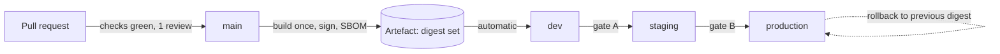

# Environments and release

**Status:** draft
**Owner:** _unassigned_
**Last updated:** 2026-09-20
**Companion docs:** [`02-HLD.md`](02-HLD.md), [`05-licensing-and-compliance.md`](05-licensing-and-compliance.md), [`11-data-retention-and-dpia.md`](11-data-retention-and-dpia.md), [`12-observability-and-runbooks.md`](12-observability-and-runbooks.md), [`14-threat-model.md`](14-threat-model.md), [`../CLAUDE.md`](../CLAUDE.md), [`../.env.example`](../.env.example), [`../docker-compose.yml`](../docker-compose.yml), [`../docker-compose.prod.yml`](../docker-compose.prod.yml), [`../project/MILESTONES.md`](../project/MILESTONES.md)

---

## 1. What this document is for

[`02-HLD.md`](02-HLD.md) §10 fits deployment into eleven lines: three node groups, three environments, blue-green for the API, drain for execution, expand-contract migrations. Every one of those lines is correct and none of them is operable as written. This document turns them into the procedures the team follows, and into the environment-variable reference that [`../CLAUDE.md`](../CLAUDE.md) makes binding.

The shape of the problem is unusual in one respect: **this system has windows during which it must not be touched.** Most services can absorb a deploy at any hour because a failed request is retried. An assessment cannot be retried — a candidate gets one sitting, the clock is running, and an interrupted attempt is a fairness problem before it is an availability problem. Release engineering here is therefore as much about *when not to deploy* as about how.

**Nothing described here is built yet.** The compose files and infrastructure configuration exist; the pipelines, the seed generator and the rehearsal cadence are specified below and tracked in [`../project/TRACKER.md`](../project/TRACKER.md).

---

## 2. Environments

| | **local** | **ci** | **dev** | **staging** | **production** |
|---|---|---|---|---|---|
| **Purpose** | One engineer's machine. Fast feedback, full stack, destructive experiments. | Automated verification of a commit. Ephemeral, per-job. | Shared integration. Where a branch is seen working against real infrastructure. | **Rehearsal.** Production shape, production volume, production-like load. The only place a concurrency bug is found before candidates find it. | Real candidates, real hiring decisions. |
| **Runs from** | [`../docker-compose.yml`](../docker-compose.yml), `make up` | GitHub Actions service containers | `docker-compose.prod.yml` shape, single small node group | `docker-compose.prod.yml`, all four node groups, reduced replica counts | `docker-compose.prod.yml`, full replica counts and placement constraints |
| **Data** | Seed profile `dev`. Synthetic, reproducible, disposable. | Migrations + fixtures per job, then destroyed. | Seed profile `dev` plus whatever developers create. Reset on demand. | Seed profile `staging` — **synthetic at production volume** (§3). No candidate PII, ever. | Real candidate data. |
| **Data policy** | No production data. No real candidate email addresses. | Same. | Same. | **Restoring a production dump here is prohibited** (§3.3). | Governed by [`11-data-retention-and-dpia.md`](11-data-retention-and-dpia.md). |
| **Access** | The engineer. | The pipeline's service account. | Every engineer, read/write. | Every engineer, read/write. Deploys via pipeline only. | On-call and platform owner. Break-glass, logged, reviewed. Recruiters use the product, not the environment. |
| **Secrets** | `.env` from `.env.example`, generated locally with `openssl rand -hex 32`. Placeholders only in the repo. | Pipeline-generated per job, never persisted. | Orchestrator secret store, dev values. | Orchestrator secret store, staging values. **Distinct from production.** | Orchestrator secret store. Rotated per §5. |
| **External services** | Mailpit, no OIDC, no LiveKit. | Nothing external. | Mailpit, dev OIDC client, LiveKit dev project. | Real SMTP to a sink domain, staging OIDC client, LiveKit staging project. | Real everything. |
| **Provisioned by** | `make up` | Workflow definition | IaC, long-lived | IaC, long-lived | IaC, long-lived, change-controlled |
| **Cost shape** | Engineer's laptop. Zero marginal. | Per-minute CI runner. Dominated by test suite duration and image builds; cache hits are the lever. | One small node. The cheapest long-lived environment and the one most often left running unused. | **The expensive one.** Must hold production-shaped data and take production-shaped load, which means real storage and burst compute. Mitigated by scaling compute to zero between rehearsals and keeping only the data volumes warm. | Dominated by exec capacity at peak (HLD §6: 100 concurrent executions) and by object storage for proctor media and recordings, which grows monotonically until the retention sweeps run. |
| **Observability** | Full stack under the `observability` compose profile | Metrics asserted in tests; no collector | Full | Full, and used — the exam-window dashboard is validated here | Full ([`12-observability-and-runbooks.md`](12-observability-and-runbooks.md)) |
| **Availability target** | None | None | Best effort | Best effort; must be up for a scheduled rehearsal | SLO-2: 99.9% during declared exam windows |

Two environments are worth arguing about.

**dev exists to be broken.** If engineers are afraid to break dev, they test in staging, and staging stops being a rehearsal environment. Dev is reset with a single command and nobody needs to ask.

**staging exists to be boring.** It is not a preview environment and not a demo environment. It is where the load test runs, where the migration runs first, where the restore rehearsal lands, and where a release earns its promotion. The moment it is used for a customer demo, someone starts protecting it and it stops being usable for the thing it is for.

---

## 3. Staging data: production-shaped, never production

### 3.1 Why volume is non-negotiable

HLD §10 already says it: staging carries production-shaped data volumes because *"assessment bugs only appear under concurrency."* The point deserves expanding, because the temptation to skip it is strong and the consequences are specific.

The defects this system produces are almost all volume- and concurrency-dependent:

- **Random draw feasibility.** ADR-004 materialises the served question set per attempt. Section rules draw *n* questions matching a skill and difficulty, honouring `exclude_seen_days`. Against 40 seeded questions the draw always succeeds. Against 3,000 questions and 500 candidates drawing simultaneously from an overlapping pool, it can fail to satisfy a rule, or serve the same question to an entire cohort. Neither is visible at small scale.
- **Write contention on `answers` and `submissions`.** 500 candidates autosaving at up to 60 writes per minute each is 500 writes per second on two hot tables. Lock contention, serialisation failures and pool exhaustion appear there and nowhere else.
- **Finalisation transactions.** The transition to `finalised` requires every `answers.final_score` non-null, enforced in one transaction (API spec §8). A cohort finishing at the same deadline runs hundreds of these at once.
- **Query plans flip.** Postgres picks an index scan at 40 rows and a sequential scan at 900,000. A report that returns in 4 ms on dev can take 40 seconds on production. The plan change is the bug and only volume exposes it.
- **Psychometrics.** Question statistics need n ≥ 30 per version before they mean anything (FR-5). A small dataset cannot exercise the stats pipeline at all.
- **Pagination and export.** Cursor pagination is correct or incorrect only across many pages; a full org export is a different operation at 25,000 candidates than at 12.

### 3.2 Synthetic generation

**Not to be confused with `make seed`.** Since 2026-09-18 `make seed` is the *product* seed — the
permission catalogue, the five system roles and the starter skill taxonomy (H-018). It is the rows
without which a fresh installation has no working authorisation at all, it is idempotent, and it
runs on every deploy. It generates no volume and no candidates.

The volume generator below is a separate, unbuilt thing and needs its own command; `make seed-volume`
is the name reserved for it, so that "seed the database" never means two things in one runbook:

```bash
make seed-volume PROFILE=staging     # production-shaped, deterministic
make seed-volume PROFILE=dev         # small, fast, same shapes
```

Design rules for the generator:

- **Deterministic.** A fixed PRNG seed, recorded in the profile. The same profile produces byte-identical data every time, so a bug found in staging is reproducible on a laptop and a bug report can cite a row id that exists for everyone.
- **Shape before size.** Volume alone does not reproduce the interesting defects. The generator must produce realistic *distributions*: answer correctness that lands questions across the 0.2–0.8 p-value band the PRD §10 targets, a long tail of slow submissions, some candidates who abandon mid-attempt, some who submit in the final ten seconds, a handful of oversized collaboration documents, questions with 1 and with 40 test cases, attempts spanning every one of the eight `attempt_status` values.
- **Synthetic identities only.** Names from a generator, never a scraped or borrowed list. **Every generated email address is at `@example.invalid`** — a domain reserved by RFC 2606 that cannot resolve. This is a hard safety property, not a convention: if staging is ever misconfigured to point at a real SMTP relay, the mail cannot reach a human being.
- **Question content is synthetic or permissively licensed.** Generated prompts, or content already cleared under [`05-licensing-and-compliance.md`](05-licensing-and-compliance.md), with `source_license` set. Copying the real bank into staging copies whatever licence obligations attach to it.
- **A separate load driver, not more rows.** Static volume does not create concurrency. A `make load-cohort` driver starts N synthetic candidates that redeem invitations, answer, autosave at the real rate, submit code and hit the deadline together. Specified in [`07-load-and-capacity-testing.md`](07-load-and-capacity-testing.md); the volume below is the substrate it runs against.

Target volumes for `PROFILE=staging`, set to roughly one year of a mid-sized organisation's use:

| Table | Rows | Why this number |
|---|---|---|
| `organizations` | 12 | Multi-tenant paths and RLS exercised against a real tenant count (ADR-010) |
| `users` | 200 | Permission checks against a realistic staff population |
| `skills` / `job_roles` | 120 / 40 | The join that makes the bank reusable (ADR-009) at a size where tagging quality matters |
| `questions` | 3,000 | Above the point where random draws become feasible and exposure counting becomes meaningful |
| `question_versions` | 7,500 | ~2.5 versions per question; immutability means versions accumulate (ADR-003) |
| `test_cases` | 30,000 | Comparison cost at realistic breadth |
| `candidates` | 25,000 | PII-bearing table at a size where erasure and export are slow if written badly |
| `invitations` | 40,000 | Redemption, expiry and token-lookup paths |
| `attempts` | 30,000 | Reporting and psychometrics substrate |
| `attempt_questions` | 900,000 | The materialised served set — the largest domain table and the one every report joins |
| `answers` | 850,000 | The hot write table |
| `submissions` | 250,000 | Including trial runs, which outnumber final submissions |
| `submission_results` | 3,000,000 | Per test case. The table that makes naive report queries fall over |
| `audit_log` | 2,000,000 | Seven-year retention means it is always the largest table eventually; partitioning must be exercised |
| `session_events` | 500,000 | M3 replay at realistic session length |

Refresh cadence: regenerated at each milestone exit, and on demand. Regeneration is destructive and takes the environment offline — that is acceptable and is why nothing durable may live only in staging.

### 3.3 Restoring a production dump into staging is prohibited

Not discouraged. Prohibited, with no approval path.

1. **There is no lawful basis.** Candidate data is collected to run an assessment. Copying it into an environment with a wider audience, weaker access control and no retention sweep is a new processing purpose that no candidate consented to and no legitimate-interest assessment survives. It contradicts the data-flow statement in [`11-data-retention-and-dpia.md`](11-data-retention-and-dpia.md), which is the document that says where candidate data lives.
2. **Erasure cannot follow the copy.** A GDPR erasure request deletes from production. A staging copy is a second dataset nobody tracks, nobody sweeps and nobody remembers at the point of erasure. You would be certifying a deletion you have not performed.
3. **Proctor media is Article 9 biometric data** with a hard 30-day ceiling (`RETENTION_PROCTOR_MEDIA_DAYS`). Copying webcam capture into a lower environment is the single worst version of this mistake.
4. **Staging fires real side effects.** A production dump contains real webhook endpoints and real candidate addresses. Point staging at that data and it delivers events to a customer's live ATS and sends mail to real people. This has happened to other products and it is always discovered by the recipient.
5. **Anonymisation does not rescue it.** A dataset with assessment timings, skill profiles, question sets and score patterns re-identifies trivially against any partial knowledge of a cohort. Pseudonymised data is still personal data; a dump with the names removed is not anonymous, it is a dump with the names removed.
6. **It is not even useful.** What staging needs is *shape and volume under load*, which the generator produces on demand, deterministically, without any of the above.

**Enforcement.** Production database credentials are not issued to anything that can write to staging; the two secret stores are separate. Any production export is a logged, audited action (`org.export` in the audit log) with a named recipient. A restore rehearsal (§11) restores production backups **into an isolated scratch environment that is destroyed afterwards**, never into staging, and that environment is treated as production for access purposes for as long as it exists.

If a production-only defect cannot be reproduced against synthetic data, the answer is to extend the generator to produce the shape that triggers it — and that extension is permanent value, whereas a dump is a one-off liability.

---

## 4. Environment variable reference

**This table is canon.** [`../CLAUDE.md`](../CLAUDE.md) makes adding or changing a variable a three-file change — [`../.env.example`](../.env.example), [`../docker-compose.yml`](../docker-compose.yml), and this table — and it must also be parsed and validated in `packages/config` so that a missing or malformed value fails at boot rather than at 03:00 during an exam window. A pull request touching one without the others is incomplete, and the review checklist in [`../project/DEFINITION-OF-DONE.md`](../project/DEFINITION-OF-DONE.md) says so.

**Legend.** Required-in: `L` local · `C` ci · `D` dev · `S` staging · `P` production. `all` means all five. **Secret:** yes means it must never appear in the repository, in a compose default, in a log line ([`12-observability-and-runbooks.md`](12-observability-and-runbooks.md) §7.2), or in a CI log — it arrives at runtime through the orchestrator's secret store, mounted at `/run/secrets/<name>` and read via the `*_FILE` variant in production. **Read by:** `api` = `apps/api`, `wrk` = `apps/worker`, `col` = `apps/collab`, `web` / `cnd` = the two frontends (build-time inlining where marked), `inf` = consumed by infrastructure configuration rather than application code.

### 4.1 Core

| Variable | Type | Default | Required in | Secret | Read by |
|---|---|---|---|---|---|
| `NODE_ENV` | enum `development`\|`test`\|`production` | `development` | all | no | api, wrk, col, web, cnd |
| `LOG_LEVEL` | enum `trace`\|`debug`\|`info`\|`warn`\|`error`\|`fatal` | `debug` local, `info` S/P | all | no | api, wrk, col |
| `APP_ENV` | enum `local`\|`ci`\|`dev`\|`staging`\|`production` | `local` | all | no | api, wrk, col — tags every log line, metric and span. The only variable that tells telemetry which environment it came from |

### 4.2 HTTP surface

| Variable | Type | Default | Required in | Secret | Read by |
|---|---|---|---|---|---|
| `API_PORT` | int | `8080` | all | no | api |
| `API_PUBLIC_URL` | url | `http://localhost:8080` | all | no | api (absolute links, webhook callback URLs), web + cnd (build-time) |
| `WEB_PUBLIC_URL` | url | `http://localhost:5173` | all | no | api (CORS, staff mail links), web |
| `CANDIDATE_PUBLIC_URL` | url | `http://localhost:5174` | all | no | api (**invitation links — wrong value means every invitation is dead**), cnd |
| `CORS_ALLOWED_ORIGINS` | csv of origins | the two localhost origins | all | no | api, col. Never `*`: the candidate app holds attempt tokens |

### 4.3 Database

| Variable | Type | Default | Required in | Secret | Read by |
|---|---|---|---|---|---|
| `DATABASE_URL` | postgres dsn | `postgres://hiring_app:…@postgres:5432/hiring` | all | **yes** | api, col. Contains a password; production uses `DATABASE_URL_FILE` |
| `DATABASE_JOB_URL` | postgres dsn | `postgres://hiring_job:…@postgres:5432/hiring` | all | **yes** | wrk. Separate role so worker permissions are bounded independently |
| `DATABASE_OWNER_URL` | postgres dsn | `postgres://hiring:…@localhost:5432/hiring` (host-side, not the compose hostname) | wherever migrations run | **yes** | The migration runner only (`pnpm run migrate`, `packages/db/src/cli.ts`), read through `loadMigrationTarget()` rather than the full `loadConfig()`. The role that owns the schema objects. **Never given to `api`, `worker` or `collab`**: an application holding the owner DSN turns a SQL injection into a schema rewrite (ADR-010). No fallback to `DATABASE_URL` — that role cannot alter the schema by design, so a fallback would fail half way through applying DDL. A migration job needs this variable and nothing else: not the session secret, the token pepper or the storage keys |
| `DATABASE_POOL_MAX` | int | `10` | all | no | api, wrk, col. Sum across replicas must stay under Postgres `max_connections`; the leading indicator of API stall is `db_pool_saturation_ratio` |
| `DATABASE_APP_ROLE` | identifier | `hiring_app` | all | no | api, col, inf ([`../infra/postgres/init/01-roles.sql`](../infra/postgres/init/01-roles.sql)). The role RLS policies are written against (ADR-010) |
| `DATABASE_JOB_ROLE` | identifier | `hiring_job` | all | no | wrk, inf |
| `DATABASE_APP_ROLE_PASSWORD` | string | dev placeholder | L, C, D | **yes** | inf. Bootstrap only; S/P create roles out of band |
| `DATABASE_JOB_ROLE_PASSWORD` | string | dev placeholder | L, C, D | **yes** | inf |
| `POSTGRES_USER` / `POSTGRES_PASSWORD` / `POSTGRES_DB` | string | `hiring` | L, C, D | **yes** (password) | inf. Superuser bootstrap for the container. **No application ever connects as this role** |

### 4.4 Valkey

| Variable | Type | Default | Required in | Secret | Read by |
|---|---|---|---|---|---|
| `REDIS_URL` | redis dsn | `redis://valkey:6379` | all | **yes** in S/P | api, wrk, col. Valkey 8, not Redis > 7.2 (RSALv2/SSPL — [`05-licensing-and-compliance.md`](05-licensing-and-compliance.md) §1). The variable keeps the conventional name so every Redis client library works unchanged |

### 4.5 Object storage

| Variable | Type | Default | Required in | Secret | Read by |
|---|---|---|---|---|---|
| `S3_ENDPOINT` | url | `http://seaweedfs:8333` | all | no | api, wrk. SeaweedFS, not MinIO (AGPL-3.0) |
| `S3_REGION` | string | `us-east-1` | all | no | api, wrk. SeaweedFS ignores it; the AWS SDK requires it set |
| `S3_BUCKET` | string | `hiring-dev` | all | no | api, wrk. **Must differ per environment** — a shared bucket is a cross-environment data path |
| `S3_ACCESS_KEY_ID` | string | dev placeholder | all | **yes** | api, wrk |
| `S3_SECRET_ACCESS_KEY` | string | dev placeholder | all | **yes** | api, wrk |
| `S3_FORCE_PATH_STYLE` | bool | `true` | all | no | api, wrk. `true` for SeaweedFS; managed S3 generally wants `false` |

### 4.6 Code execution — M2 onward

| Variable | Type | Default | Required in | Secret | Read by |
|---|---|---|---|---|---|
| `PISTON_URL` | url | `http://piston:2000` | all | no | **wrk only.** The API never calls Piston. Reachable from the `exec` network alone |
| `EXEC_CPU_TIME_MS` | int ms | `5000` | all | no | wrk. Kernel-enforced via cgroups, not application-enforced |
| `EXEC_WALL_TIME_MS` | int ms | `10000` | all | no | wrk. Also the lower bound on the exec drain timeout (§7) |
| `EXEC_MEMORY_MB` | int MB | `256` | all | no | wrk |
| `EXEC_MEMORY_MB_BYTES` | int bytes | `268435456` | all | no | inf. Derived; must stay consistent with the line above |
| `EXEC_MAX_PROCESSES` | int | `64` | all | no | wrk. Fork-bomb ceiling |
| `EXEC_MAX_OUTPUT_BYTES` | int bytes | `65536` | all | no | wrk. Output beyond this is truncated, which can make a correct solution fail — see `exec_output_truncated_total` |

**Changing any `EXEC_*` value changes what counts as a passing solution.** It is a scoring change wearing a configuration costume: treat it as a release with a change note, never as a live tuning knob, and never during an exam window.

### 4.7 Queues

| Variable | Type | Default | Required in | Secret | Read by |
|---|---|---|---|---|---|
| `QUEUE_RUN_CONCURRENCY` | int | `4` | all | no | wrk. Trial runs — lower priority than submissions |
| `QUEUE_SUBMIT_CONCURRENCY` | int | `2` | all | no | wrk. Raise only in step with exec capacity; ahead of it, this converts a queue into timeouts |
| `QUEUE_MAX_ATTEMPTS` | int | `3` | all | no | wrk, api. Exhausting it sends the job to the DLQ, which pages |
| `QUEUE_BACKOFF_MS` | int ms | `2000` | all | no | wrk, api. Exponential base |

### 4.8 Collaboration — M3 onward

| Variable | Type | Default | Required in | Secret | Read by |
|---|---|---|---|---|---|
| `COLLAB_PORT` | int | `8081` | all | no | col |
| `COLLAB_PUBLIC_URL` | ws url | `ws://localhost:8081` | all | no | col, web + cnd (build-time). `wss://` in S/P |
| `COLLAB_SNAPSHOT_INTERVAL_MS` | int ms | `15000` | all | no | col. **This value is the upper bound on interview work lost to a node crash or a rolling restart** (§7.3) |

### 4.9 Secrets and tokens

| Variable | Type | Default | Required in | Secret | Read by |
|---|---|---|---|---|---|
| `SESSION_SECRET` | 32-byte hex | placeholder | all | **yes** | api, col. Signs staff sessions. Rotation logs everyone out |
| `TOKEN_PEPPER` | 32-byte hex | placeholder | all | **yes** | api, wrk, col. Peppers candidate attempt tokens, invitation tokens and WS tickets before hashing. **Rotating it invalidates every outstanding invitation** — see §5.3 |
| `WEBHOOK_SIGNING_SECRET_ROTATION_DAYS` | int days | `90` | all | no | api, wrk. Policy value, not a secret. Drives `webhook_signing_key_age_days` |

### 4.10 Mail

| Variable | Type | Default | Required in | Secret | Read by |
|---|---|---|---|---|---|
| `SMTP_URL` | smtp dsn | `smtp://mailpit:1025` | all | **yes** in S/P | api, wrk. Mailpit in L/C/D — no mail leaves the machine |
| `MAIL_FROM` | email | `no-reply@hiring.localhost` | all | no | api, wrk. In S/P the sending domain must carry SPF, DKIM and DMARC alignment or invitations land in spam and redemption collapses silently |

### 4.11 Staff SSO — optional

| Variable | Type | Default | Required in | Secret | Read by |
|---|---|---|---|---|---|
| `OIDC_ISSUER` | url | empty | optional; required in P if SSO is enabled | no | api |
| `OIDC_CLIENT_ID` | string | empty | with the above | no | api |
| `OIDC_CLIENT_SECRET` | string | empty | with the above | **yes** | api |

Empty means password-based staff login via Better Auth. Candidate authentication never uses OIDC — candidates hold attempt tokens (API spec §1).

### 4.12 Live video — M3 onward

| Variable | Type | Default | Required in | Secret | Read by |
|---|---|---|---|---|---|
| `LIVEKIT_URL` | wss url | empty | S, P from M3 | no | api, web + cnd (build-time) |
| `LIVEKIT_API_KEY` | string | empty | S, P from M3 | no | api |
| `LIVEKIT_API_SECRET` | string | empty | S, P from M3 | **yes** | api. Mints room tokens; never reaches a browser |

### 4.13 Telemetry

| Variable | Type | Default | Required in | Secret | Read by |
|---|---|---|---|---|---|
| `OTEL_EXPORTER_OTLP_ENDPOINT` | url | `http://otel-collector:4317` | all | no | api, wrk, col |
| `OTEL_SERVICE_NAME` | string | `hiring-api` | all | no | Per service: `hiring-api`, `hiring-worker`, `hiring-collab`. Set per container, never globally |
| `OTEL_TRACES_SAMPLER_ARG` | float 0–1 | `1.0` | all | no | api, wrk, col. Head sampling; tail sampling in the collector is what actually decides what is kept |

### 4.14 Retention — policy values, enforced by worker sweeps

| Variable | Type | Default | Required in | Secret | Read by |
|---|---|---|---|---|---|
| `RETENTION_PROCTOR_MEDIA_DAYS` | int | `30` | all | no | wrk, api. Article 9 biometric data; a hard ceiling, not a preference |
| `RETENTION_SESSION_RECORDING_DAYS` | int | `90` | all | no | wrk, api |
| `RETENTION_ATTEMPT_DATA_MONTHS` | int | `24` | all | no | wrk, api |
| `RETENTION_CANDIDATE_PII_MONTHS` | int | `12` | all | no | wrk, api |
| `RETENTION_AUDIT_LOG_YEARS` | int | `7` | all | no | wrk, api |

Changing any of these changes a commitment made in [`11-data-retention-and-dpia.md`](11-data-retention-and-dpia.md) and stated to candidates. It requires the compliance owner's approval, not an engineer's, and the change is itself recorded in the audit log.

### 4.15 Local-only

Present in [`../.env.example`](../.env.example), meaningful only for the development compose stack, and absent from production: `POSTGRES_PORT`, `VALKEY_PORT`, `SEAWEEDFS_MASTER_PORT`, `MAILPIT_UI_PORT`, `MAILPIT_SMTP_PORT`, `OTLP_GRPC_PORT`, `OTLP_HTTP_PORT`, `PROMETHEUS_PORT`, `GRAFANA_PORT`, `WEB_PORT`, `CANDIDATE_PORT`, `PISTON_LOG_LEVEL`, `GRAFANA_ADMIN_USER`, `GRAFANA_ADMIN_PASSWORD`.

These decide only which **host** port each container publishes on, so an engineer with a local Postgres can work around a collision. They do not change the port inside the compose network, which is why every service-to-service URL above uses the canonical port. The canonical ports are fixed: api 8080, collab 8081, web 5173/3000, candidate 5174/3001, postgres 5432, valkey 6379, piston 2000, SeaweedFS S3 8333, Mailpit 8025/1025, OTLP 4317, Prometheus 9090, Grafana 3030.

### 4.16 Validation

`packages/config` parses this table once at boot, with zod, and **exits non-zero on any failure**. No lazy reads, no `process.env` anywhere outside that package, no defaults applied at the point of use.

The rule exists because of a specific failure: a missing `CANDIDATE_PUBLIC_URL` does not break anything at boot if it is read lazily. It breaks four hours later when the first invitation goes out with a broken link, to a cohort, at which point the damage is already delivered. Fail at boot, where a health check catches it and the deploy rolls back automatically.

Validation is not only presence. Required in production: URLs parse and use `https`/`wss`; `CORS_ALLOWED_ORIGINS` contains no `*`; every secret is at least 32 bytes and does not equal its `.env.example` placeholder; `DATABASE_POOL_MAX` × replica count is below `max_connections`; `EXEC_MEMORY_MB_BYTES` equals `EXEC_MEMORY_MB` × 1048576.

---

## 5. Secret management

### 5.1 Rules

1. **No secret enters the repository.** Not in `.env.example`, not in a test fixture, not as a compose default, not in a commented-out line, not in a CI log. Placeholders are obviously fake (`CHANGE_ME_openssl_rand_hex_32`) and config validation rejects them in production.

   A password a test genuinely needs must **look fake on sight** — `example-fixture-app`, never a random-looking string that could pass for a generated credential. A value that is fake but indistinguishable from a real credential is still a defect: an external scanner reported exactly that on 2026-09-17, and a fixture that trips an alert trains everyone to dismiss the next one, which may be real. `scripts/check-secrets.mjs` enforces this in CI (`make secrets`); it accepts the documented development defaults, which `packages/config` refuses in every deployed tier, and values that name themselves as fixtures.
2. **Injection at runtime.** Production reads secrets from files mounted at `/run/secrets/<name>` via the `*_FILE` variants declared in [`../docker-compose.prod.yml`](../docker-compose.prod.yml). A file is preferable to an environment variable: environment variables leak through `/proc`, crash dumps, orchestrator inspection APIs and child processes.
3. **No secret reaches an exec node.** Ever. [`../docker-compose.prod.yml`](../docker-compose.prod.yml) declares no `secrets:` and no `*_FILE` variable on the `piston` service, deliberately, and a change that adds one is wrong by construction. The sandbox is assumed to be escapable (HLD §7); the mitigation is that there is nothing on the node worth stealing.
4. **Environments never share secrets.** Staging and production have disjoint values for every secret. A staging credential that works in production makes staging a production access path.
5. **Every secret is logged as `[redacted]`**, enforced by the serialiser deny list in [`12-observability-and-runbooks.md`](12-observability-and-runbooks.md) §7.2 and asserted by a unit test.
6. **Generation:** `openssl rand -hex 32`. Never a passphrase, never a value reused from elsewhere.

### 5.2 Rotation cadence by class

| Class | Variables | Cadence | Impact of rotation | Procedure |
|---|---|---|---|---|
| Session signing | `SESSION_SECRET` | 180 days, or immediately on suspicion | Every staff session invalidated; everyone logs in again | Rotate outside a window; announce. Dual-key verification (accept old for 24h) removes the logout if implemented |
| Token pepper | `TOKEN_PEPPER` | **365 days**, or immediately on suspicion | **Every outstanding invitation, attempt token and WS ticket becomes unverifiable** | §5.3 — never a single-value swap |
| Database | `DATABASE_URL`, `DATABASE_JOB_URL`, role passwords | 180 days | Brief reconnect; pools re-establish | Create the new password, deploy, verify, then revoke the old. Postgres accepts a password change without disconnecting live sessions |
| Object storage | `S3_ACCESS_KEY_ID`, `S3_SECRET_ACCESS_KEY` | 180 days | None if overlapped | Issue a second key pair, deploy, verify, delete the first |
| Webhook signing | per-webhook secret | `WEBHOOK_SIGNING_SECRET_ROTATION_DAYS` = **90** | **Consumers reject deliveries** until they hold the new secret | Dual-secret: sign with both, `X-Signature` carries both, consumer accepts either. Notify the consumer, confirm, then drop the old. The most common cause of `WebhookDeliveryDegraded` (RB-10) is a hard cutover |
| Staff SSO | `OIDC_CLIENT_SECRET` | Per identity-provider policy, ≤ 365 days | Staff login fails until corrected | Coordinate with the IdP; most support two active secrets |
| Video | `LIVEKIT_API_SECRET` | 180 days | Issued room tokens stay valid to expiry; new rooms need the new secret | Rotate between interview blocks, never during one |
| SMTP | `SMTP_URL` credentials | 180 days | Mail stops; invitations stop; nobody notices for hours | Rotate, then send a live test invitation and confirm receipt. `mail_send_failure_total` is the detector |
| Superuser bootstrap | `POSTGRES_PASSWORD` | 365 days | None in normal operation; no application uses it | Break-glass credential; store offline |

Rotation is tracked, not remembered. `webhook_signing_key_age_days` is a metric with an alert; the rest are calendar items owned by the platform owner. Any credential exposed in an incident is rotated as part of containment, not afterwards (RB-14 step 8).

### 5.3 `TOKEN_PEPPER` — the dual-pepper transition

`TOKEN_PEPPER` is different from every other secret because it participates in a **one-way** function. Candidate attempt tokens, invitation tokens and WS tickets are peppered and hashed before storage; the plaintext token exists only in the candidate's email and browser. Rotating the pepper in one step makes every stored hash unverifiable: every unredeemed invitation dies, every in-flight attempt token fails, and every candidate mid-assessment is logged out with no way back in. During a campus drive that is a cohort-wide outage with no recovery — the tokens cannot be re-derived, because that is the property the pepper exists to provide.

The transition is therefore always dual-pepper, over a window at least as long as the longest token lifetime.

**Configuration.** `TOKEN_PEPPER` accepts an ordered list, newest first: `TOKEN_PEPPER=<new>,<old>`. Index 0 is the **write** pepper; every entry is a **verify** pepper.

| Phase | `TOKEN_PEPPER` | New tokens hashed with | Existing tokens verify? | Duration |
|---|---|---|---|---|
| 0 — steady | `old` | old | yes | — |
| 1 — introduce | `old,new` | old | yes (both accepted) | ≥ 1 release cycle, so every replica holds both before anything is signed with the new one |
| 2 — cut over | `new,old` | **new** | yes (both accepted) | ≥ the longest outstanding token lifetime: invitation expiry (default 14 days) + the longest assessment duration + 7 days margin ⇒ **≥ 21 days** |
| 3 — verify | `new,old` | new | measure | `token_verify_total{pepper="old"}` must be zero for 7 consecutive days |
| 4 — retire | `new` | new | new only | — |

Rules:

- **Phase 1 must complete on every replica before phase 2 begins.** A replica holding only the old pepper cannot verify a token minted by a replica already on the new one. This is why the phases are separate releases and not a single deploy.
- **Phase 2 may not begin inside a change freeze or a declared exam window** (§9).
- **Phase 3 is measured, not assumed.** `token_verify_total` is labelled by which pepper succeeded — a bounded two-value label, permitted under the cardinality rules. Retiring the old pepper while a single invitation still depends on it kills that invitation silently, and the candidate simply cannot start.
- **Emergency rotation** (the pepper is believed compromised) skips the wait and accepts the consequence, because a compromised pepper means forgeable attempt tokens. The decision is the security owner's. Containment then includes: invalidate and **re-issue every outstanding invitation** through the normal send path, contact every candidate with an in-flight attempt, and treat interrupted attempts as needing a re-sit rather than scoring them on partial work.

The same dual-value mechanism, with a shorter window, applies to `SESSION_SECRET` and to webhook signing secrets. `TOKEN_PEPPER` gets its own section because it is the only one whose mishandling destroys candidate access with no recovery path.

---

## 6. Release process

### 6.1 Trunk-based development

One long-lived branch, `main`, always releasable. Short-lived branches named for their tracker id (`h-038-question-authoring-ui`), merged by pull request, squashed. A branch older than three days is a merge conflict in waiting, and a branch older than a week is a rewrite.

Incomplete work reaches `main` behind a flag rather than living on a branch. Flags are removed within one milestone of the feature landing — a flag that outlives its feature becomes an untested code path, and the untested path is the one that runs during the incident.

`main` is protected: no direct pushes, at least one approving review, all required checks green ([`../.github/workflows/`](../.github/workflows/)), a linear history.

### 6.2 Versioning

| Thing | Scheme | Example | Why |
|---|---|---|---|
| Deployed release | CalVer `YYYY.MM.N` | `2026.11.3` | The question asked in an incident is "how old is what is running", and a date answers it instantly. There is no external consumer of the deployable, so semver's compatibility promise buys nothing here |
| Git tag | `v` + release | `v2026.11.3` | Annotated, signed, body is the release note (§13) |
| Milestone tag | `m0`…`m4` | `m2` | Per [`../project/MILESTONES.md`](../project/MILESTONES.md); marks the closing commit of a milestone |
| Container image | `<name>:<release>` **and always pinned by digest** | `hiring-api:2026.11.3@sha256:…` | Tags move, digests do not |
| `packages/contracts` | **semver** | `1.4.0` | This one *does* have consumers — both frontends and any ATS reading the generated OpenAPI 3.1 document. MAJOR on a breaking change to a published surface, MINOR on additive, PATCH on fixes |
| Database migration | `NNNN_description.sql`, monotonic | `0031_attempt_integrity_enum.sql` | Ordering is the only property that matters |

`N` in the CalVer resets each month. Two releases in one month are `2026.11.1` and `2026.11.2`; a month with no release simply has none.

### 6.3 The artefact

**One build, one digest, promoted unchanged to every environment.** A rebuild per environment is not a promotion — it is a new artefact that has never been tested, and the differences that bite (a transitive dependency resolving differently, a base image moving) are exactly the ones nobody looks for.

On merge to `main`, CI:

1. Runs lint, typecheck, unit, integration and end-to-end suites ([`06-testing-strategy.md`](06-testing-strategy.md)).
2. Runs the licence gate (`make licences`), failing on GPL, LGPL-static, AGPL, SSPL, BSL/BUSL, Commons Clause (ADR-001).
3. Builds each image at `target: runtime` from [`../infra/docker/`](../infra/docker/), reproducibly, with a pinned base image digest.
4. Generates a CycloneDX SBOM per image (`make sbom`) and attaches it to the release.
5. Signs each image and pushes it, recording the digest.
6. Writes the digest set to the release manifest.

Frontend caveat: `apps/web` and `apps/candidate` inline `API_PUBLIC_URL`, `COLLAB_PUBLIC_URL` and `LIVEKIT_URL` at build time, so their bundles are **not** environment-neutral. Either build one bundle per environment from the same commit — recording each digest against that commit — or serve those three values from a runtime configuration endpoint. The runtime endpoint is the better answer and is the recommended approach; until it exists, the per-environment build must be explicit in the release manifest so that "the same release" is not quietly two different bundles.

### 6.4 Digest pinning

`docker-compose.prod.yml` never names a mutable tag. Every service resolves its image from a
required variable — `HIRING_API_IMAGE`, `POSTGRES_IMAGE` and so on — and compose refuses to start if
one is unset, with a message pointing back here. A tag is a moving target: `:latest` on two nodes an
hour apart is two different builds, and that is not a property you want while an exam is running.

The release pipeline resolves each tag to a digest and exports the pinned references:

```sh
resolve() {          # resolve() <var> <tag-reference>
  digest=$(docker buildx imagetools inspect "$2" --format '{{.Manifest.Digest}}')
  echo "$1=${2%%:*}@${digest}"
}
resolve HIRING_API_IMAGE  "ghcr.io/assaybank/hiring-api:${RELEASE}"   >> release.env
resolve POSTGRES_IMAGE    "postgres:16-alpine"                        >> release.env
# ... one line per service
```

`release.env` is an artefact of the release, stored with it. Redeploying a release means replaying
its `release.env`, which is what makes a rollback land on exactly the bytes that were running before
rather than on whatever the tag points at today.

Third-party images (Postgres, Valkey, Caddy, Piston, SeaweedFS, the collector, Prometheus) are
re-resolved deliberately, not on every deploy — a base-image digest change is a reviewed change, and
it goes through the same promotion path as our own code.

### 6.4 Promotion path and gates



| Hop | Trigger | Gate |
|---|---|---|
| PR → `main` | Merge | All required checks green; one approving review; tracker id in the title; the tracker row flipped in the same PR; doc-freshness and link checks pass; licence gate passes; migration checklist (§8.4) complete if a migration is included |
| `main` → **dev** | Automatic on artefact publish | Smoke test after deploy: `/healthz` on api and collab, one synthetic attempt end to end. Failure rolls back and blocks promotion |
| dev → **staging** | Manual, any engineer | Artefact has been on dev ≥ 1 hour with no alert; migrations applied to staging first and verified against production-shaped data (§3); full e2e suite green against staging; load test green if the release touches the attempt, execution or grading path |
| staging → **production** | Manual, platform owner or on-call | Artefact has been on staging ≥ 4 hours (≥ 24 hours if it contains a migration) with no alert; **no change freeze in effect** (§9); **no open exam window** (§9); error budgets not exhausted for the affected tier ([`12`](12-observability-and-runbooks.md) §9.3); release note drafted (§13); rollback plan stated, including the migration position (§10) |

Hotfixes use the same path, never a shortcut. The only compression permitted is the soak time, and dropping it is a decision the platform owner records — skipping staging entirely is not available, because staging is where migrations are proven and a hotfix under pressure is exactly when a migration goes wrong.

---

## 7. Deploying each tier

Four tiers, four different constraints. The compose file encodes them; this section explains why each is what it is.

### 7.1 API — blue-green

`update_config: parallelism 1, delay 20s, order start-first, failure_action rollback, monitor 60s`.

Start the new task, wait for it to pass its health check, shift traffic, retire the old one. No request is ever served by a half-booted process. Because `packages/config` fails fast on invalid configuration (§4.16), a misconfigured release never passes health and never takes traffic — the bad deploy ends as a failed health check instead of as an outage.

Replicas roll one at a time, so a four-replica tier takes roughly four minutes. Rollback is `stop-first, parallelism 0`: revert immediately and completely, because a half-rolled-back API is the worst of both versions.

The API is stateless apart from SSE connections. Each retired replica drops its SSE connections and clients reconnect — which is why jittered exponential backoff on the client is a correctness requirement, not a nicety, and why a deploy can trigger RB-09 if it is missing.

### 7.2 Execution and workers — drain, never cut over

HLD §10: *"Execution nodes drain rather than cut over, since a running submission must finish."* The reason is the invariant from HLD §9 — an infrastructure event must never turn into a candidate's zero.

**Worker drain protocol** (`order: stop-first`, `stop_grace_period: 120s`):

1. The replica receives `SIGTERM`.
2. It **stops accepting new jobs** from BullMQ immediately. Nothing is consumed from the queue after this point.
3. It finishes the job in hand. Worst case: the Piston call bounded by `EXEC_WALL_TIME_MS` (10 s), plus test-case comparison, plus the result write — comfortably inside 30 s in normal operation.
4. It flushes telemetry to the collector and closes its database pool.
5. It exits. If it has not exited after **120 s**, the orchestrator sends `SIGKILL`.

The 120 s timeout is a bound on how long we wait for graceful, **not** a bound on data safety. A job killed mid-flight is not lost: it was never acknowledged, so BullMQ redelivers it, and grading is idempotent by ADR-008 — a replayed grading job produces the same score. The drain exists to avoid the redelivery, not to be the only thing preventing loss.

**Piston node recycle** (`stop_grace_period: 60s`) follows the same principle: an execution in flight finishes. 60 s is sufficient because a single execution is bounded at 10 s wall time. Nodes are recycled on a fixed cadence — container every 6 hours or 5,000 executions, node every 24 hours rolling — per [`../infra/piston/README.md`](../infra/piston/README.md), and **recycling is suspended during a declared exam window**.

Rolling with `parallelism: 1` and a 30 s inter-replica delay, a four-replica worker tier takes up to ten minutes to roll in the worst case. That is the correct trade: ten minutes of slow deploy against any possibility of a candidate's submission being discarded.

**Capacity during a drain.** Rolling one replica at a time removes 25% of grading capacity for the duration. Before deploying, check `bullmq_queue_depth` and `bullmq_time_in_queue_seconds`; deploying into an already-growing queue converts a slow deploy into RB-01.

### 7.3 Collaboration — the rolling-restart problem

The collab tier is the hardest to deploy, because it holds **live in-memory state for sessions with humans in them**. An API replica restart costs a reconnect. A collab replica restart can cost an interview.

Three mechanisms bound the loss, and all three are needed:

1. **Sticky routing.** Caddy routes by session id, so every participant in one session lands on the same node and shares one Yjs document. Without stickiness a reconnecting client reaches a node that does not hold the document, and reconnection makes things worse rather than better — which is the first thing to check in RB-08.
2. **Client reconnect with local state.** Yjs is a CRDT (ADR-005). A client reconnecting after a node restart **merges** its local state into the document rather than overwriting or being overwritten. A participant with an open tab is therefore a complete copy of the document. This is why RB-08's first instruction is "keep the tab open", and why in practice a restart with participants still connected loses nothing.
3. **Snapshot interval.** `COLLAB_SNAPSHOT_INTERVAL_MS = 15000` persists the document every 15 seconds. If every client is gone when the node dies, at most 15 seconds is lost. That number is the entire loss bound, which is why `collab_snapshot_lag_seconds > 60` and any snapshot failure both page.

Deploy configuration: `parallelism 1, delay 60s, order start-first, failure_action rollback, monitor 120s`. Start-first because a node must exist to route to; the long delay and monitor let a session settle before the next node moves.

**Operational rules:**

- **Never restart a collab node with an active session on it.** Check `collab_docs_resident` on the target node; proceed only at zero, or after the interviewer has agreed.
- **No collab deploy during scheduled interview hours** without the interviewer's agreement. This is a calendar constraint, not a technical one, and it is the one that actually prevents the incident.
- A snapshot is forced before a planned restart, reducing the residual loss to whatever happened in the seconds between.
- If a session is interrupted anyway, the interviewer records the interruption on the scorecard. A candidate must never be scored down for a session the tooling broke — the same principle as ADR-007: the system reports what happened, a human decides what it means.

### 7.4 Frontends

Static bundles behind the proxy. Deploy by switching the served digest; rollback is switching it back. The only hazard is cache: a stale `index.html` referencing a hashed asset that no longer exists produces a blank page. Serve `index.html` with `no-cache` and hashed assets immutable, and keep the previous release's assets available for at least 24 hours so a client that loaded the old shell can still fetch what it references.

**The Content-Security-Policy is baked into the bundle, not added by the proxy.** Each front end injects its own policy as a `<meta http-equiv="Content-Security-Policy">` at build time (`apps/web/src/csp.ts`, `apps/candidate/src/csp.ts`), so it applies in development, in `vite preview`, behind any static host and in production, and cannot be lost by a proxy nobody configured. Two consequences worth knowing before a deploy:

- **`VITE_API_PUBLIC_URL` and `VITE_COLLAB_PUBLIC_URL` are build-time inputs to the policy**, not runtime ones. Changing which API a built bundle may talk to means rebuilding it. That is the trade for having the policy travel with the artefact; the alternative, a runtime header, is a value that can be right in staging and absent in production.
- **`frame-ancestors 'none'` comes from Caddy** (`infra/caddy/Caddyfile`, the `frame_policy` snippet), because a browser ignores that directive in a meta tag and warns. It is set on the two front-end hostnames and nowhere else; the API sets its own policy through helmet. `tests/fixtures/csp.test.ts` asserts the header is in the Caddyfile, so removing it fails the build rather than quietly removing a clickjacking defence.

The policy itself starts from `default-src 'none'` with no `'unsafe-inline'` and no `'unsafe-eval'` in production; development relaxes `script-src` and `style-src` for Vite's inline preamble and adds the HMR WebSocket to `connect-src`. Those three differences, and only those three, are pinned by the same test (ADR-022, docs/14 T-038).

---

## 8. Database migrations

### 8.1 Expand-contract, strictly

HLD §10: *"Migrations are expand-contract: add nullable, backfill, switch reads, drop old. Never break a running exam window."*

The rule that makes it work: **every migration must leave the schema compatible with the application release that is currently running.** Blue-green means both releases run simultaneously for a period; a migration that breaks the old code breaks production during its own deploy. This is not a guideline, it is the definition of the pattern.

Each of the four phases ships as its own release. Combining them defeats the point — the whole value is that each step is independently safe and independently reversible.

### 8.2 Worked example: `attempts.integrity_flag`

The schema today ([`hiring_platform_schema.sql`](hiring_platform_schema.sql)) has:

```sql
integrity_flag  text,   -- clean | suspicious | violation
```

Free text with the permitted values in a comment. Reports group by it, `GET /attempts?integrity_flag=` filters on it, and nothing stops a typo writing `Violation` and creating a silent reporting gap. The fix is an enum. `attempts` is a large, hot table and this column is read during exam windows, so it is exactly the case expand-contract exists for.

Note first that this stays inside ADR-007. `integrity_flag` is an advisory signal that the review queue surfaces to a human; constraining its domain makes the signal more legible and changes nothing about what it does. It still never auto-rejects, auto-voids or down-scores.

**Release 1 — expand.** `0031_attempt_integrity_enum_expand.sql`

```sql
SET lock_timeout = '3s';
SET statement_timeout = '30s';

CREATE TYPE attempt_integrity_flag AS ENUM ('clean', 'suspicious', 'violation');

-- Nullable, no default. Adding a nullable column with no default is a
-- catalogue-only change in Postgres 16: no table rewrite, no long lock.
-- A DEFAULT here would be safe in 16 too, but omitting it keeps the
-- "unset" and "explicitly clean" cases distinguishable during backfill.
ALTER TABLE attempts ADD COLUMN integrity_flag_v2 attempt_integrity_flag;
```

Deployed with **no application change**. The running release neither reads nor writes the new column. Fully reversible: `DROP COLUMN`, `DROP TYPE`.

**Release 2 — dual-write and backfill.** `0032_attempt_integrity_enum_backfill.sql` plus an application change.

The application now writes **both** columns on every path that sets an integrity flag, and still reads only the old one. Then backfill in batches, never in one statement:

```sql
-- Run as a worker job, not as a migration step. A single UPDATE over
-- hundreds of thousands of rows holds one transaction open long enough
-- to block autovacuum and to conflict with the deadline sweep.
DO $$
DECLARE rows_done int;
BEGIN
  LOOP
    UPDATE attempts SET integrity_flag_v2 = integrity_flag::attempt_integrity_flag
    WHERE id IN (
      SELECT id FROM attempts
      WHERE integrity_flag IS NOT NULL AND integrity_flag_v2 IS NULL
      LIMIT 5000
    );
    GET DIAGNOSTICS rows_done = ROW_COUNT;
    EXIT WHEN rows_done = 0;
    COMMIT;
    PERFORM pg_sleep(0.1);   -- yield: this table serves live attempts
  END LOOP;
END $$;
```

A value outside the enum aborts the cast — which is the point. Rows that fail are reported, corrected by hand, and the backfill re-run. The batch job is idempotent and resumable: it can be stopped and restarted at any point. Reversible by stopping the dual-write and ignoring the column.

**Release 3 — switch reads.** Application change only, no DDL.

Reads now come from `integrity_flag_v2`; writes still go to both. Deploy, then verify over at least one full release cycle that reports, the `?integrity_flag=` filter, the review queue and every export produce identical results to before. Reversible by reverting one application release — the old column is still fully maintained, which is the entire reason this phase exists as its own release.

**Release 4 — contract.** `0033_attempt_integrity_enum_contract.sql`

```sql
SET lock_timeout = '3s';
ALTER TABLE attempts DROP COLUMN integrity_flag;
```

Ships **alone**, with no application change, and only after the phase-3 release has been in production for at least seven days with no rollback. This is the one irreversible step: the old column's data is gone and recovery means a restore from backup.

*On the name.* The column remains `integrity_flag_v2` after phase 4, which is ugly. A rename is cheap in Postgres (catalogue only) but it is **not** backward compatible — it breaks the running release instantly — so it needs its own expand-contract cycle via a view, or it is simply accepted. The honest answer: accept the name. A slightly ugly column name is a much smaller cost than an avoidable outage, and pretending otherwise is how a "quick rename" ends up in a hotfix at 02:00. If the name genuinely matters, do it as a fifth release behind a view.

### 8.3 Hard rules

1. **No migration runs during an open exam window.** Not an expand step, not a backfill, not an index build. Enforced by the deploy job: it reads the declared-window state and refuses, so the rule does not depend on anyone remembering. A migration that "cannot possibly affect anything" is precisely the one that takes a lock on `attempts`.
2. **No long transactions.** `lock_timeout` and `statement_timeout` are set in every migration. A migration that waits indefinitely for a lock queues every subsequent query behind it, including candidate autosave — one blocked `ALTER TABLE` becomes RB-04.
3. **Indexes are built `CONCURRENTLY`**, outside a transaction, and the migration checks `pg_stat_progress_create_index`. A plain `CREATE INDEX` on `answers` or `submission_results` locks writes for minutes.
4. **`NOT NULL` is added in two steps**: `ADD CONSTRAINT … CHECK (col IS NOT NULL) NOT VALID`, then `VALIDATE CONSTRAINT` (which takes only a `SHARE UPDATE EXCLUSIVE` lock), then optionally `SET NOT NULL` in Postgres 16, which can use the validated constraint instead of scanning again.
5. **Enum values are added, never removed or reordered.** `ALTER TYPE … ADD VALUE` is safe; removal requires a type swap, which is a full expand-contract of its own.
6. **Migrations are forward-only in production.** A `down` migration is written for local development and is never run against production. Recovering production means a compensating forward migration or a restore — treating `down` as a production tool is how a destructive rollback happens under pressure.
7. **Migrations run as a dedicated migration role**, not as the application role and not as superuser. The application role cannot alter schema, which means an application-level SQL injection cannot either (ADR-010's isolation only holds if the app role is actually limited).
8. **RLS policies are part of the migration.** A new table without its policy is a new table with no tenant isolation. The policy ships in the same migration, and the RLS test suite covers the new table in the same pull request.
9. **Every migration is applied to staging first**, against production-shaped volume, with the duration recorded. A migration that takes 40 ms on dev and 90 seconds on staging needs redesigning before it reaches production, and §3 exists so that this is discoverable.

### 8.4 Migration review checklist

Every pull request containing a migration carries this, completed:

- [ ] States its phase: **expand** / **backfill** / **switch** / **contract**.
- [ ] Leaves the schema compatible with the currently deployed application release.
- [ ] No table rewrite. (`ALTER TYPE` on a populated column, `SET NOT NULL` without a validated constraint, and `ADD COLUMN … DEFAULT` on older Postgres all rewrite.)
- [ ] Sets `lock_timeout` and `statement_timeout`.
- [ ] Indexes created `CONCURRENTLY`, outside a transaction.
- [ ] Backfills are batched, committed per batch, resumable, and run as a job rather than as a migration step.
- [ ] Applied to staging against production-shaped volume; **wall-clock duration recorded in the PR**.
- [ ] Lock impact assessed against the hot tables: `attempts`, `answers`, `submissions`, `submission_results`, `attempt_questions`.
- [ ] Rollback stated. If the phase is irreversible, that is stated explicitly with the recovery path.
- [ ] RLS policy included for any new table; RLS tests updated.
- [ ] Reversibility of the *application* release confirmed — can the previous release run against this schema?
- [ ] Contract phases only: the corresponding switch phase has been in production ≥ 7 days without rollback.
- [ ] Not scheduled inside a change freeze or within 48 hours of a declared exam window.
- [ ] `packages/db` schema, generated types and any affected contract in `packages/contracts` regenerated in the same PR.

---

## 9. Change freeze

### 9.1 When

| Trigger | Freeze period |
|---|---|
| Declared exam window (§ [`12`](12-observability-and-runbooks.md) §9.1) | T−48 h to T+4 h |
| Campus drive | T−72 h to T+24 h. Larger cohort, less recoverable, and candidates are often reachable only on the day |
| Certification exam window (M4) | T−72 h to T+24 h. High stakes for the candidate, proctored, and the most legally exposed mode the product has |
| Scheduled live-interview block | No blanket freeze, but no collab or API deploy during the block (§7.3) |
| Error budget exhausted for a tier | Until the budget recovers ([`12`](12-observability-and-runbooks.md) §9.3) |
| Organisation-wide holiday coverage gap | Whenever on-call cannot be staffed |

**Frozen:** application deploys, migrations of any phase, infrastructure changes, node recycles, configuration changes, secret rotation, dependency updates, `EXEC_*` changes, question-bank bulk imports against an assessment in use.

**Not frozen:** merging to `main` (work continues; it just does not ship), documentation, dashboard and alert-threshold changes, anything in dev.

A freeze is announced when the window is declared, not when it starts. A team that learns about a freeze the morning it begins has three branches queued behind it and will push for an exception.

### 9.2 Exceptions

Only three categories qualify:

1. A defect causing **candidate data loss** (RB-04, RB-11).
2. A **security fix** for an actively exploitable vulnerability (RB-14, RB-05).
3. A defect **blocking the window itself** — candidates cannot start, submit or be graded.

Anything else waits. "It is a one-line change" is not a category; a one-line change during a campus drive has the same blast radius as a hundred-line one and less scrutiny.

**Authorisation requires two people: the platform owner and the recruiting lead, jointly.** Deliberately not one person. The platform owner understands the technical risk; the recruiting lead understands what happens to the cohort if it goes wrong. Neither can authorise alone, because each systematically underweights the other's risk.

The exception is recorded in [`../project/STATUS.md`](../project/STATUS.md) before deploying, with: what is broken, why it cannot wait, what is changing, the blast radius, who authorised, and the rollback plan. An exception deploy is followed by a post-incident review (§ [`12`](12-observability-and-runbooks.md) §13) whether or not it went well.

Exception deploys follow the **full** pipeline. Staging is not skipped — a hotfix under time pressure is precisely when an untested migration destroys a cohort.

---

## 10. Rollback

Rolling back is the default response to a bad release. It is not an admission of anything; debugging forward while candidates are affected is the actual mistake.

| Tier | Procedure | Time | Notes |
|---|---|---|---|
| Frontends | Serve the previous digest | < 1 min | Keep prior hashed assets 24 h (§7.4) |
| API | `rollback_config: parallelism 0, order stop-first` — all replicas to the previous digest at once | 1–2 min | Deliberately not gradual: a half-rolled-back API serves two behaviours |
| Worker | Drain, then previous digest | up to 10 min | In-flight jobs redeliver; grading idempotent (ADR-008) |
| Collab | Rolling restart on the previous digest | 2–5 min | Costs a reconnect; ≤ 15 s document loss (§7.3). **Never during an active session** unless the session is already broken |
| Piston | Recycle onto the previous image | 5–10 min | Drains first; executions in flight finish |
| Configuration | Restore the previous values, redeploy the tier | 1–2 min | Config validation catches bad values at boot |
| **Database** | See below | — | **Not symmetric with the application** |

### 10.1 Rolling back when a migration has already run

This is the case people get wrong, so it is written out per phase.

**The design makes most of it a non-event.** Expand, backfill and switch phases are all backward compatible by construction (§8.1), so the previous application release runs unchanged against the migrated schema. **Roll the application back and leave the database alone.** Do not attempt to reverse the migration.

| Phase applied | Safe to roll the app back? | Reverse the migration? |
|---|---|---|
| **Expand** (new nullable column/type added) | Yes, immediately | No. The old code ignores the column. Reversing it needlessly is a second schema change under pressure |
| **Backfill** (dual-write + data copy) | Yes. The old code writes only the old column; the new column goes stale, which is harmless | No. Re-run the backfill before resuming the roll-forward |
| **Switch** (reads moved to the new column) | Yes. The old column was still being written throughout — that is exactly why this is its own release | No |
| **Contract** (old column dropped) | **No.** The previous release reads a column that no longer exists | **Not possible.** `ADD COLUMN` restores the shape but not the data |

The contract case is the only genuinely dangerous one, and the mitigation is procedural rather than technical:

- A contract migration ships **alone**, in its own release, with no application change — so if it must be rolled back, the application release being reverted to is byte-identical to the one running.
- It ships only after the switch release has been in production **≥ 7 days without a rollback**, which is long enough for anything that was going to need the old column to have needed it.
- Its recovery path is stated in the PR and is always one of: (a) re-add the column and backfill from the new column, if the transformation is invertible — for the §8.2 example it is, since the enum text is the old text; or (b) restore from backup, accepting the RPO.
- **A contract migration is never deployed within 7 days of a declared exam window.** If a rollback becomes necessary and the recovery path is a restore, doing that during a window is a cohort-level incident.

### 10.2 After a rollback

Every rollback is an incident, including a clean one. It means a release reached production that should not have, and the interesting question is which gate in §6.4 failed to catch it. A rollback with no follow-up is a rollback that happens again.

---

## 11. Backup and restore

### 11.1 What is backed up

| Asset | Method | Frequency | RPO | RTO | Retention |
|---|---|---|---|---|---|
| Postgres — all domain data | Physical base backup + **continuous WAL archiving** to object storage | Base nightly; WAL continuous with `archive_timeout = 300s` | **5 min** | **60 min** | 35 days of point-in-time recovery |
| Postgres — logical | `pg_dump -Fc` | Weekly | 7 days | 2 h | 12 weeks. For schema recovery and single-table restore, not the primary path |
| `audit_log` | Covered by the above, **plus** a monthly export to write-once storage | Monthly | 1 month | 24 h | **7 years** (`RETENTION_AUDIT_LOG_YEARS`) — outlives any backup rotation, so it needs its own path |
| Object storage (submissions, exports, recordings, proctor media) | SeaweedFS replication + nightly sync to a second location | Nightly | **24 h** | 4 h | Per asset class, capped by the `RETENTION_*` values — backups must not outlive the retention ceiling they are subject to |
| Valkey | AOF `everysec` + hourly snapshot | Continuous | 1 s | 15 min | 7 days |
| Secrets | Orchestrator secret store, plus an offline copy in the organisation's password manager | On change | 0 | 30 min | Current + previous generation |
| Infrastructure configuration | Git | Per commit | 0 | Redeploy time | Indefinite |
| Grafana dashboards and alert rules | Provisioned from git, not edited in the UI | Per commit | 0 | Redeploy | Indefinite |

**Valkey's RPO is misleading in a useful way.** Queue state is *derived*: every submission exists as a `submissions` row with `status='queued'` in Postgres before it is enqueued. Losing Valkey entirely loses no domain data — the reconciliation in RB-06 rebuilds the queue from Postgres. The 1 s figure describes the queue's own state, not the candidate's work.

**Proctor media deserves a note.** It is Article 9 biometric data with a 30-day ceiling. A backup rotation longer than the retention period silently defeats the retention policy: the sweep deletes the object, and a copy persists in a backup for another 60 days. Object-storage backups for that class must expire **at or before** `RETENTION_PROCTOR_MEDIA_DAYS`.

### 11.2 RTO by scenario

| Scenario | Target | Path |
|---|---|---|
| One API/worker/collab replica lost | < 1 min | Orchestrator reschedules |
| Whole app tier lost | 15 min | Redeploy from digest |
| Postgres primary lost | **< 5 min** | HA pair, automatic failover (HLD §9). Data loss bounded by `db_replication_lag_seconds` at the moment of failure — watch it, because it is the number that matters later |
| Postgres primary **and** standby lost | 60 min | Restore base backup + replay WAL to the latest point |
| Corruption discovered hours later | 2 h | Point-in-time recovery to just before the corrupting transaction |
| Object storage volume lost | 4 h | Restore from the nightly sync; up to 24 h of objects lost |
| Total environment loss, same region | 4 h | Rebuild from IaC, restore data, repoint DNS |
| Total region loss | §12 | Not currently within target — stated plainly there |

### 11.3 Rehearsal — an untested backup is not a backup

A backup job that reports success proves that a file was written. It proves nothing about whether that file can be restored, whether the WAL chain is complete, whether the restore fits the RTO, or whether the person on call at 03:00 can execute it. **Every one of those has failed in production somewhere, and every one is discovered only by rehearsing.**

**Procedure.** Provision an isolated scratch environment. Restore the most recent production base backup, replay WAL to a chosen point in time, run the schema verification suite, run a smoke test that completes one attempt end to end against the restored data, and record wall-clock time for each phase. Destroy the environment. The scratch environment holds real candidate data for as long as it exists and is treated as production for access control — it is never staging (§3.3).

**Cadence:** quarterly, and additionally within the 14 days before any campus season.

| Rehearsal | Date | Scope |
|---|---|---|
| **1 — first** | **2026-10-30** | Postgres PITR + object storage. End of M1, before M2's first load test, so the result informs M2 rather than arriving after it |
| 2 | 2027-01-29 | Full: Postgres, object storage, secrets, IaC rebuild |
| 3 | 2027-04-30 | Full, plus a region-loss tabletop (§12) |
| 4 | 2027-07-30 | Full |

Each rehearsal produces a written result: measured RTO per phase, measured RPO, what failed, what was fixed. A rehearsal that finds nothing is reported as such — that is a real result and it is also the one to be slightly suspicious of.

**A missed rehearsal blocks the next production release** after a 14-day grace period. Without that consequence the rehearsal is the first thing dropped in a busy month, and it is the thing whose absence is invisible until the day it matters.

---

## 12. Disaster recovery: total region loss

**Current posture, stated plainly: a total region loss is not survivable within any of the RTO targets in §11.2.** HLD §10 specifies single-region to start, and the design honestly accepts that. Writing an aspirational DR plan that nobody has provisioned would be worse than admitting the gap, because a plan on paper gets counted as a control.

### 12.1 What exists now

- Postgres HA pair with automatic failover — survives a **host** loss, not a region loss.
- SeaweedFS replication within the region — same limitation.
- Infrastructure as code in git, hosted outside the production region: an environment can be rebuilt anywhere, given data.
- Secrets in the orchestrator's store, with an offline copy held outside the region.

The gap is data. Backups currently land in object storage **in the same region as the database**, which means the region that fails takes the recovery material with it.

### 12.2 Minimum viable DR — a pilot light

The cheapest meaningful improvement, and the one to do first, needs no standby compute at all:

1. **Replicate the WAL archive and the object-storage backups to a second region.** Storage only — no compute, no database, no orchestration. This is a small monthly cost and it converts "unrecoverable" into "recoverable slowly", which is the single largest step available.
2. Keep an IaC target for a second region, exercised at each rehearsal so the templates are known to work.
3. Keep DNS TTLs low enough (≤ 300 s) that repointing is fast.

Resulting targets once provisioned: **RPO 5–15 min** (WAL shipping lag), **RTO 8 h** (provision compute, restore, replay, verify, repoint DNS). Eight hours is a long outage. It is also an entirely different situation from permanent data loss, and the difference costs the price of cross-region object storage.

A warm standby — streaming replica plus idle compute in a second region — brings RTO to roughly 30 minutes at roughly double the data-tier cost. That is not justified at current scale and becomes justified when certification exams carry contractual availability commitments, which is an M4 question.

### 12.3 Candidates in flight

A region loss during an exam window interrupts every active attempt. **The decision about what happens to those candidates is made in advance, not during the incident.**

The standing policy: **an attempt interrupted by a platform failure is re-sat, not scored.** Autosaved answers up to the RPO boundary are preserved as evidence for the dispute path (RB-12), and the attempt is never finalised on a partial record. Recording a truncated attempt as a score is the version of this that produces a defensibility problem eighteen months later, and it is the version that looks attractive at hour six of an outage.

Recruiting communicates the re-sit; engineering does not make that call.

### 12.4 Decisions outstanding

- **Off-region WAL and object-storage replication.** TBD — owner: platform engineer, decide by **2026-11-27** (M2 exit). This is cheap enough that the decision is really about doing it, not whether to.
- **Second region choice and DR posture.** TBD — owner: platform engineer with the compliance owner, decide by **2026-12-04**, aligned with the data-residency open question in [`../project/OPEN-QUESTIONS.md`](../project/OPEN-QUESTIONS.md). Region choice is a GDPR transfer question before it is an availability one: an EU candidate's DR copy in a non-EU region needs a transfer mechanism.
- **Region-loss tabletop exercise.** Scheduled for rehearsal 3, **2027-04-30**.

---

## 13. Deployment checklist

Completed for every production deploy. It takes two minutes and exists because each line represents something that has gone wrong somewhere.

**Before**

- [ ] Artefact digest recorded; it is the exact digest that soaked on staging.
- [ ] Soak satisfied: ≥ 4 h on staging, ≥ 24 h if it contains a migration. No alerts fired during the soak.
- [ ] **No change freeze in effect. No open exam window.** Checked, not assumed.
- [ ] No live interview session in progress if the release touches `apps/collab`.
- [ ] Migration phase identified and the §8.4 checklist complete; staging duration recorded.
- [ ] Env var changes present in all three files plus `packages/config` (§4).
- [ ] Error budgets not exhausted for the affected tier.
- [ ] Release note drafted with tracker ids (§14).
- [ ] Rollback plan stated, including the migration position (§10.1).
- [ ] Queue healthy: `bullmq_queue_depth` at baseline, `bullmq_dlq_depth == 0`. Deploying into a growing queue is RB-01 with extra steps.
- [ ] On-call aware the deploy is happening and available for the next hour.

**During**

- [ ] Grafana annotation posted at start.
- [ ] Watch: 5xx rate, `http_request_duration_seconds` p95, `autosave_failure_total`, `db_pool_saturation_ratio`, `bullmq_queue_depth`, `sse_reconnects_total`.
- [ ] Health checks pass on each new replica before the previous is retired.
- [ ] Worker and Piston drains complete cleanly, no `SIGKILL` in the logs.

**After**

- [ ] Annotation posted at completion.
- [ ] Smoke test on production: staff login; create and publish a question; issue an invitation; start an attempt; autosave; submit code; receive the result; finalise. **Run it, do not assume it.**
- [ ] Any scheduled job the release touched confirmed running via its `*_last_success_timestamp_seconds` gauge (RB-13 exists because these vanish silently at deploy).
- [ ] No new alert firing for 30 minutes.
- [ ] Release note published; tracker rows reflect reality.
- [ ] Backfill job started if the release included one, and its progress is being watched.

---

## 14. Release notes

Every release carries a note. It is the annotated git tag's body and the published release description, and it is the record that answers "what changed between the working state and now" — the first question asked in every incident and the one that is expensive to reconstruct from a commit log.

**Required structure:**

```
## 2026-11-18 — v2026.11.3

### Included
- H-072  Coding submission SSE result stream
- H-079  Queue-depth, execution-latency and dead-letter metrics with alerts
- H-081  Trial-run rate limiting per attempt

### Migrations
- 0031_attempt_integrity_enum_expand.sql — EXPAND. Adds nullable
  attempts.integrity_flag_v2 and the attempt_integrity_flag enum.
  No table rewrite. Staging duration: 42 ms. Reversible.

### Configuration
- New: QUEUE_RUN_CONCURRENCY (default 4). Present in .env.example,
  docker-compose.yml, docs/13 §4.7, packages/config.

### Observability
- New alerts: SubmitQueueBackingUp, DeadLetterQueueNonEmpty.
  Runbooks RB-01, RB-02.

### Rollback
- App: revert to v2026.11.2 (digest sha256:…). Migration is an expand
  phase; leave the schema in place.

### Known issues
- Trial-run rate limit counts per attempt, not per attempt-question.
  Tracked as H-088.
```

Rules:

- **Every line in "Included" cites a tracker id.** A change with no `H-NNN` is either missing its reference or is work the project did not agree to do — [`../project/TRACKER.md`](../project/TRACKER.md) states this and the release note is where it becomes visible. The ids are permanent and appear in branch names and commit messages, so the trail runs: release → tracker id → branch → PR → commit.
- **Migrations are always listed with their phase**, so a person deciding whether to roll back can answer §10.1's question without reading SQL.
- **Configuration changes are always listed**, with confirmation that the three-file rule was satisfied.
- **New or changed alerts are listed with their runbooks**, so an on-call engineer paged by something new can tell it is new.
- **Known issues are listed with their tracker ids.** Shipping with a known limitation is normal; shipping without saying so is how the same bug gets reported four times.

Milestone closes additionally carry a milestone tag (`m0`…`m4`) and a summary release note listing the milestone's exit criteria and their evidence, per step 10 of the milestone-close procedure in [`../project/MILESTONES.md`](../project/MILESTONES.md).

The note is written **before** the deploy, as part of the checklist, not afterwards from memory. A release note written the next morning omits precisely the detail that turns out to matter.
