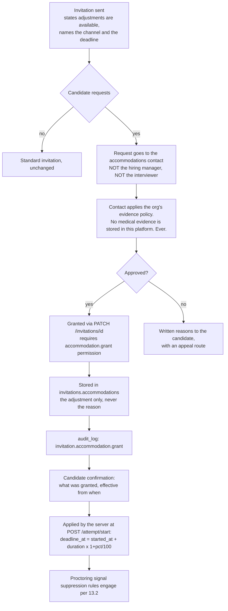

# Accessibility conformance

**Status:** draft
**Owner:** _unassigned_ (engineering lead, with People lead for the accommodation process)
**Last updated:** 2026-09-20
**Companion docs:** [`01-PRD.md`](01-PRD.md), [`05-licensing-and-compliance.md`](05-licensing-and-compliance.md), [`11-data-retention-and-dpia.md`](11-data-retention-and-dpia.md), [`06-testing-strategy.md`](06-testing-strategy.md), [`08-i18n-and-localisation.md`](08-i18n-and-localisation.md), [`03-API-spec.md`](03-API-spec.md), [`04-ADRs.md`](04-ADRs.md), [`hiring_platform_schema.sql`](hiring_platform_schema.sql), [`../project/MILESTONES.md`](../project/MILESTONES.md), [`../project/RISKS.md`](../project/RISKS.md)

---

## 1. Why this document exists and what it is not

[`01-PRD.md`](01-PRD.md) §8 states the requirement and then states the consequence in the same breath:

> Accessibility is not optional here. A candidate who cannot complete your assessment because of a screen-reader failure is a discrimination exposure, not a bug backlog item.

[`05-licensing-and-compliance.md`](05-licensing-and-compliance.md) §3 puts a legal frame around it: an inaccessible assessment that excludes a disabled candidate is actionable under the ADA, the Equality Act and their equivalents. R-11 in [`../project/RISKS.md`](../project/RISKS.md) scores it 3 × 5 = 15, high, first relevant at M1 — not at M4.

This document is not a WCAG summary. There are better ones, they are free, and copying the success criteria into a repository document produces something nobody reads and nobody updates. What this document does is the part a generic checklist cannot do: name the **specific, hard accessibility problems this product has**, decide how each is answered, and attach the answer to a milestone gate so it is verified when the surface ships rather than audited after everything is built.

The product has four properties that make it harder than a normal web application, and every one of them is load-bearing rather than incidental:

1. **It is timed, and the server owns the clock** ([ADR-006](04-ADRs.md)). A timed interface collides directly with SC 2.2.1 Timing Adjustable.
2. **It contains a code editor.** Monaco is the single most difficult widget in the product to make accessible, and it is the one candidates spend an hour inside.
3. **It changes state underneath the user** — autosave, countdown, asynchronous grading results arriving from a queue ([ADR-008](04-ADRs.md)). Every one of those is a status message that has to reach a screen-reader user without drowning them.
4. **It watches the user** in certification mode, and several of the things it watches for are indistinguishable from assistive technology working correctly.

Sections 3 through 13 take those four properties apart.

---

## 2. Scope, target, and the standards that apply

### 2.1 Conformance targets

| Surface | Bundle | Target | Binding? |
|---|---|---|---|
| Candidate app — assessment runner, MCQ, coding, interview join | `apps/candidate` | **WCAG 2.1 Level AA, full** | **Binding.** An NFR in [`01-PRD.md`](01-PRD.md) §8. A release-blocking gate per §16 |
| Candidate app — accessibility statement, privacy page, error pages | `apps/candidate` | WCAG 2.1 AA, full | Binding |
| Staff console — recruiter, interviewer, hiring manager, admin | `apps/web` | WCAG 2.1 AA **aspiration**, with an **AA-critical subset binding** (§2.2) | Partially binding |
| Emailed invitation and notification templates | `apps/api` | Plain-text alternative, semantic HTML, no information conveyed by image alone | Binding |
| Exported reports (PDF) | `apps/worker` | Tagged PDF, reading order, document language. PDF/UA is the aspiration | Aspiration, M4 |
| Authored question content | Question bank | The author's obligation, enforced at publish (§9) | Binding via validation |

The split between candidate and staff is not a judgement that staff matter less. It is a recognition of two different exposures. A candidate meets this product once, cannot negotiate its terms, cannot choose a different tool, and is being assessed by it — an accessibility failure there directly excludes someone from a job. A staff user is an employee whose employer owes them a reasonable-adjustment duty through an ordinary, negotiable, supportable channel, and who can be given a workaround while a fix ships. The exposures are different sizes, so the gates are different heights. The separate bundle (`apps/candidate`, existing primarily so no staff-only code or correct-answer flag ships to candidates) makes the split enforceable rather than notional: the two surfaces have their own route lists, their own axe configuration, and their own gates.

### 2.2 The AA-critical subset for the staff console

Full 2.1 AA for the staff console is the aspiration and the direction of travel. The following subset is binding from the milestone that first ships the surface, because failing any of these does not inconvenience a staff user — it locks them out of doing their job at all:

| SC | Level | Why it is in the critical subset |
|---|---|---|
| 1.1.1 Non-text Content | A | An icon-only toolbar with no accessible names is an unusable toolbar |
| 1.3.1 Info and Relationships | A | Tables of candidates and results are the staff console's core content |
| 1.4.1 Use of Color | A | Integrity flags, pass/fail, stage — all of which the UI will want to render as a coloured dot |
| 1.4.3 Contrast (Minimum) | AA | Cheap to get right, expensive to retrofit across a design system |
| 2.1.1 Keyboard / 2.1.2 No Keyboard Trap | A | Non-negotiable anywhere |
| 2.4.3 Focus Order, 2.4.7 Focus Visible | A / AA | Keyboard navigation of long result tables |
| 3.3.1 Error Identification, 3.3.2 Labels or Instructions | A | The assessment builder is a complex form; unlabelled fields make it guesswork |
| 4.1.2 Name, Role, Value | A | Every custom component the console builds |
| 4.1.3 Status Messages | AA | Bulk invite progress, export readiness, save confirmations |

Everything outside this subset is tracked in the known-limitations register (§19) with a target milestone, not silently dropped.

**Verified on the console's first real screen, 2026-09-20.** The question bank list — with its
filter toolbar, data table, loading, error and two empty states — was audited with axe-core 4.13
against the built bundle over `wcag2a`, `wcag2aa`, `wcag21a`, `wcag21aa` and `wcag22aa`: **0
violations** on `/`, `/questions`, `/questions` with filters applied, the authoring editor in both
its editable and its frozen state, and the editor's markdown **preview** — a rendered prompt with
headings, a data table, a code block, a blockquote and links. The audit is not yet a
CI gate — that is the `@axe-core/playwright` job of §15.1, which activates at M1 — so this is a
point-in-time result, recorded because an unverified claim of conformance is worth less than none.

Two things that audit taught, both now fixed and both worth stating because they are traps rather
than mistakes:

- **A control with a `background-image` has no computable contrast.** The select's chevron was
  drawn with two CSS gradients, the usual technique; axe could not resolve the control's background
  and returned `color-contrast` as *needs review* on every select in the product. The criterion
  most likely to regress had quietly stopped being checkable. The arrow moved to a pseudo-element
  on a wrapper and the control kept a flat background colour.
- **Programmatic focus on a heading must not run on first load.** The route announcer moves focus
  to the page `<h1>` so a screen reader reads the new screen; doing it on the initial render means
  the title is announced twice and a keyboard user's first Tab starts somewhere they did not
  choose. The guard is the *previous pathname*, not a "have we started" flag — a flag is defeated
  by React StrictMode's deliberate double-mount, which is how the bug survived its first fix.

**Rendered question content, added 2026-09-20.** A prompt is author-written markdown displayed to
someone under a timer, so the markup it becomes is a conformance surface of its own rather than a
detail of a component. `packages/ui`'s `Markdown` (ADR-022) decides it once for both apps:

- **Headings offset into the page, never `<h1>`.** A prompt's `#` becomes an `<h3>` by default. A
  fragment that emits its own `<h1>` gives the page two, and a screen-reader user navigating by
  heading concludes they have reached a different page (SC 1.3.1).
- **A code block and a table scroll sideways, so both are focusable.** `tabindex="0"` with a group
  role and a label, the same treatment the data table gets — a region a mouse can scroll and a
  keyboard cannot is a region whose right-hand columns a keyboard user cannot read (SC 2.1.1).
- **A link is underlined, not merely coloured** (SC 1.4.1), and one that opens a new tab says so in
  visually-hidden text before it is followed (SC 3.2.5). The candidate runner opens external links
  in a new tab for a reason that is not cosmetic: navigating away means leaving a timed attempt.
- **An image always carries `alt`, empty when the author wrote none.** An empty `alt` is the
  correct markup for a decorative image, so the node type makes the field required rather than
  optional — the renderer must be able to tell "no alt text" from "no information" (SC 1.1.1).
- **The Write/Preview control is a real tab list**, with the arrow-key, Home and End behaviour the
  role promises. Claiming `role="tablist"` without implementing the keys tells a screen-reader user
  to press keys that do nothing, which is the same reasoning `Toolbar` records for declining
  `role="toolbar"`.

### 2.3 WCAG 2.2, and what we do about it

The binding target is 2.1 AA because that is what [`01-PRD.md`](01-PRD.md) commits to and what EN 301 549 v3.2.1 currently references. WCAG 2.2 is a superset — every 2.1 AA criterion is in 2.2 AA — so a 2.2 claim is strictly stronger, and the regulatory references are moving that way. The position taken here:

**We build to 2.2 AA and claim 2.1 AA.** Four of the nine 2.2 additions are directly relevant to this product, cheap to satisfy while building, and expensive to retrofit. They are treated as binding on the candidate app despite not being in the claimed target:

| SC (new in 2.2) | Level | Relevance here | Treatment |
|---|---|---|---|
| **3.3.8 Accessible Authentication (Minimum)** | AA | The candidate redeems a token from an emailed link. Any CAPTCHA, puzzle, or "type the code from the image" step on redemption is a cognitive function test | **Binding.** No CAPTCHA on token redemption, ever. Rate limiting is per-IP (20/hour, [`03-API-spec.md`](03-API-spec.md) §2) and never escalates to a puzzle. Bot abuse of a single-use hashed token is not a real threat model |
| **2.4.11 Focus Not Obscured (Minimum)** | AA | A sticky countdown header or a fixed footer toolbar over a long question is the classic way to hide a focused control | **Binding.** Sticky chrome uses `scroll-padding-top`/`scroll-padding-bottom` sized to itself |
| **2.5.8 Target Size (Minimum)** | AA | MCQ option hit areas, the question navigator grid, mobile MCQ | **Binding.** 24 × 24 CSS px minimum; 44 × 44 for anything in the candidate app, which exceeds the requirement because a candidate under time pressure should not be fighting a target |
| **2.5.7 Dragging Movements** | AA | The system-design question kind and the assessment builder's section reordering are the two places a drag interaction will be proposed | **Binding.** Every drag has a non-drag equivalent — move-up/move-down buttons, or a "move to position" control |
| 3.2.6 Consistent Help | A | The help/contact affordance in the candidate app | Binding — one place, same place on every screen |
| 3.3.7 Redundant Entry | A | Multi-section assessments should not re-ask anything | Binding by construction; the runner asks nothing twice |

The remaining three (2.4.12, 2.4.13, 3.3.9) are AAA and out of scope. Note also that 2.2 removed 4.1.1 Parsing; we still validate markup, because duplicate `id` attributes break `aria-labelledby` regardless of what the standard says about them.

Reduced motion deserves a specific note because it is commonly misfiled: **`prefers-reduced-motion` support maps to SC 2.3.3 Animation from Interactions, which is Level AAA**, not AA. We commit to it anyway (§10), because a pulsing countdown in front of someone with a vestibular disorder during a timed exam is a cruelty the standard happens not to mandate.

### 2.4 Regulatory frame

| Instrument | What it references | Relevance |
|---|---|---|
| ADA Titles I and III (US) | No fixed technical standard; courts have used WCAG as the benchmark | An assessment is a term of employment application under Title I |
| Section 508 (US federal procurement) | WCAG 2.0 AA by incorporation | Relevant if a federal body or contractor procures the platform |
| EN 301 549 v3.2.1 (EU) | WCAG 2.1 AA | The harmonised standard behind the Web Accessibility Directive and the European Accessibility Act |
| European Accessibility Act | EN 301 549 | Applicable since 2025-06-28; scope depends on the deploying organisation |
| Equality Act 2010 (UK) | Reasonable adjustment duty | The accommodation flow in §13 is the operational answer to this |
| AODA (Ontario) | WCAG 2.0 AA | Relevant where candidates are in Ontario |

The reasonable-adjustment duty is worth separating from the conformance standard, because they are not the same obligation and satisfying one does not satisfy the other. WCAG conformance is about the product. Reasonable adjustment is about the individual: a candidate may need something the product cannot anticipate, and the duty is to provide it. §13 is that mechanism, and it is why [`01-PRD.md`](01-PRD.md) §9 lists accommodations as *"first class... recorded and auditable, not a hack"*.

---

## 3. The timed assessment versus SC 2.2.1

This is the hardest conformance question in the product and the one a generic checklist gets wrong in both directions — either by ignoring it, or by concluding that a timed test cannot conform.

### 3.1 The criterion and its exceptions

SC 2.2.1 Timing Adjustable (Level A) requires that for each time limit set by the content, at least one of the following is true: the user can **turn off** the limit before encountering it; the user can **adjust** it to at least ten times the default before encountering it; the user is **warned** before time expires and given at least 20 seconds to extend it with a simple action, extendable at least ten times; or one of three exceptions applies — **Real-time Exception** (the limit is part of a real-time event such as an auction), **Essential Exception** (the time limit is essential and extending it would invalidate the activity), or **20 Hour Exception**.

The Essential Exception is the one that applies, and WCAG's own understanding document names the case explicitly: a timed test where the time limit is essential to the validity of the result. A coding assessment measuring whether a candidate can solve a problem in 45 minutes is not measuring the same construct at 45 hours. Turning the limit off would invalidate the activity, which is the literal wording of the exception.

**So the assessment timer conforms under the Essential Exception.** That is the conformance position, and it is defensible. But it is also, on its own, a thin answer — because a person with a motor impairment typing at a third of the speed, or a screen-reader user for whom reading a code listing is serial rather than glanceable, is being measured on speed of interaction rather than on the skill the test claims to measure. The exception makes the product conformant. It does not make the assessment fair.

### 3.2 The accommodation is the real answer, not a feature

The conformance answer to a timed assessment is not "turn off the timer". It is **a different, longer limit for the candidates who need one, granted in advance, applied by the server, and recorded**.

[`03-API-spec.md`](03-API-spec.md) §6 already carries the mechanism: `accommodations.extra_time_pct` on the invitation, applied when `deadline_at` is computed, appearing in the audit log. [ADR-006](04-ADRs.md) confirms it: *"`deadline_at` is computed server-side at attempt start from `duration_seconds` plus any recorded accommodation."*

Three things follow, and stating them is the point of this section:

**First, this is a conformance mechanism, not a product nicety.** It is the reason SC 2.2.1's Essential Exception is an honest claim rather than a loophole. A timed assessment with no adjustment path is a timed assessment that measures disability. A timed assessment with a recorded, server-applied, audited adjustment path measures the skill. If the accommodation mechanism regresses — if `extra_time_pct` stops being applied, or the request channel stops being answered — the conformance claim in §2.1 is no longer true, even though no WCAG success criterion changed state. That coupling is why the accommodation flow appears in the milestone gate table in §14 next to the axe results.

**Second, the adjustment must be applied by the server and nowhere else.** A client-side timer that is told to run slower is not an accommodation; it is a bug that a candidate might discover and an auditor will certainly ask about. `deadline_at` is computed once, at `POST /attempt/start`, from `duration_seconds × (1 + extra_time_pct / 100)`, persisted, and never recomputed from client input. The one server-side adjustment permitted after start is a recorded `breaks_allowed` accommodation, which extends `deadline_at` by the paused interval through an audited server-side state transition — never by a client timer stop (ADR-006). The client countdown derives from `server_time` on every response and is display-only.

**Third, extra time is not the only adjustment, and treating it as the only one is the common failure.** A candidate with a bladder condition needs stoppable breaks, not a longer continuous window. A candidate with a cognitive disability may need a longer window *and* fewer questions per screen. The catalogue in §14.4 is deliberately broader than a percentage.

### 3.3 Warnings, and what the timer must not do

Independent of the exception, the countdown itself has to be usable:

- The remaining time is **always available on demand** — visible on screen, in the accessible name of a control, and readable at any moment without navigating away. A timed exam where a screen-reader user must hunt for the clock is worse than one with no clock.
- The timer element itself is **never `aria-live`**. A region that announces every second renders a screen reader useless. It is a plain element with `role="timer"` left un-live, plus threshold announcements (§5.2).
- Thresholds are announced at 50% remaining, 10 minutes, 5 minutes, and 1 minute — polite for the first three, assertive only at 1 minute.
- The warning never flashes, never pulses, and never changes to red alone (SC 1.4.1 and 2.3.1). Text plus an icon plus the number.
- **Time spent reading a warning is not deducted from anything.** The 20-second provision in SC 2.2.1 is about extension dialogs; there is no extension dialog here, and there must not be a modal that eats the candidate's remaining time while it demands acknowledgement.
- A section-level timer, where an assessment uses one, follows all of the above independently and is announced as such — a candidate needs to know whether the clock they can hear is the section's or the assessment's.

### 3.4 Autosave is what makes the time limit survivable

FR-9 requires autosave within 5 seconds of the last change and lossless resume after disconnection. It is listed in the PRD as a reliability requirement. It is also an accessibility requirement, and arguably a more important one: a candidate using speech recognition, a switch device, or an on-screen keyboard produces input slowly and irrecoverably, and losing five minutes of it is a far larger proportional loss than for a fast typist. §5.2 covers how autosave state is announced without becoming noise.

---

## 4. The code editor

Monaco is the accessibility crux of this product. It ships in M2 (2026-11-02 → 2026-11-27) and it is where a candidate spends most of a coding round.

### 4.1 What Monaco actually does for screen readers

Monaco does not render editable text as DOM text. It paints lines to the viewport and keeps a hidden `<textarea>` in sync for input. Screen readers read the hidden textarea, not the painted lines, which is why Monaco has an explicit accessibility mode rather than working by default.

| Setting | Value we ship | Why |
|---|---|---|
| `accessibilitySupport` | `'auto'` in the staff console, **`'on'` whenever the candidate has enabled the accessible editor mode** | `'auto'` relies on Monaco's screen-reader heuristic, which is a guess and is wrong for some AT and in some browsers. A candidate who needs the mode must be able to assert it rather than hope it is detected |
| `accessibilityPageSize` | 500 (up from the default 10) | The number of lines Monaco exposes to the screen reader at a time. The default trades correctness for performance and truncates what a screen reader can reach in a long file |
| `ariaLabel` | The question title plus the language, e.g. "Solution editor, Python, question 3 of 5" | A bare "editor" tells the candidate nothing about which of several editors they are in |
| `tabFocusMode` | Off by default, **toggleable** | §4.2 |
| `wordWrap` | `'on'` | Horizontal scrolling of code by keyboard is painful, and wrapping is required for reflow at 320 px anyway (§11) |
| `renderWhitespace` | `'selection'` | Whitespace markers rendered everywhere are noise in a screen-reader line read |
| `minimap` | Disabled in the candidate app | Pure visual affordance, costs horizontal space that reflow needs |
| `cursorBlinking` | `'solid'` under `prefers-reduced-motion` | §10 |

Monaco's screen-reader mode is functional but not excellent: line-by-line reading works, but autocomplete widgets, parameter hints, inline diagnostics and the find widget all announce inconsistently across screen readers. That is a known-limitation entry (§19), not something a configuration flag fixes.

### 4.2 The keyboard trap, and the escape affordance

SC 2.1.2 No Keyboard Trap is Level A and it is the criterion a code editor is most likely to fail. The editor captures **Tab**, because in an editor Tab indents — which is correct behaviour and also means that a keyboard user who arrives in the editor and presses Tab to leave does not leave. They indent. Then they press it again. The candidate is trapped inside the widget holding their entire answer, with a clock running.

The criterion's wording is the resolution: focus can be moved away *using a standard exit method*, and **if a non-standard method is required, the user is advised of it**. So a code editor conforms if and only if there is an escape route and the candidate is told about it, in the interface, before they need it.

What we ship:

| Affordance | Binding | Behaviour |
|---|---|---|
| Toggle tab-trapping | `Ctrl+M` (Windows/Linux), `Cmd+M` (macOS) — Monaco's `editor.action.toggleTabFocusMode` | Switches Tab between "insert indentation" and "move focus". State is announced on toggle and persisted per candidate for the whole attempt |
| Unconditional escape | `Escape` then `Tab` | `Escape` first closes any open widget (autocomplete, find, parameter hints); a second `Escape` with no widget open blurs the editor to the next focusable control. This is the route that works even if the candidate never discovers the toggle |
| Accessibility help | `Alt+F1` (`Option+F1` on macOS) — Monaco's `editor.action.accessibilityHelp` | Opens Monaco's own help panel listing the editor's keyboard model |
| Skip past editor | A visible-on-focus "Skip to test results" link immediately before the editor in DOM order | The fastest route for someone who does not want to enter the editor at all |

**The advisory is not optional and not buried.** A persistent instruction sits immediately before the editor in the DOM, visible to everyone (not `sr-only` — sighted keyboard users need it just as much):

> Press Ctrl+M (Cmd+M on Mac) to switch Tab between indenting and moving focus. Press Escape twice to leave the editor. Press Alt+F1 for editor keyboard help.

It is also announced once when focus first enters the editor, via the polite region (§5), and repeated in the pre-assessment instructions screen so a candidate meets it before the clock starts rather than during.

Two related criteria that the editor must not breach: **SC 2.1.4 Character Key Shortcuts** (Level A) — no single-character shortcut is registered outside the editor; every global shortcut in the candidate app uses a modifier, so a speech-recognition user dictating text cannot trigger one. And **SC 2.4.11 Focus Not Obscured** — the editor's own widgets (autocomplete, hover) must not sit over the focused line, which is Monaco's default behaviour but breaks under some custom layouts.

### 4.3 The fallback plan

If the M2 screen-reader test matrix (§15) shows Monaco failing against a screen reader in the primary matrix, the fallback is a **plain accessible editor mode**: a styled `<textarea>` with the same autosave, the same run and submit controls, the same language selection, monospace font, and no syntax highlighting, no autocomplete, no bracket matching. It is worse to write code in. It is infinitely better than an editor a candidate cannot use.

This is offered as a candidate-selectable option regardless of test results, on the pre-assessment screen and from within the attempt, not only as a contingency. Choosing it is never an integrity signal, never surfaced on the candidate report, and never counted in any comparison — the same rule as the non-proctored route in [`11-data-retention-and-dpia.md`](11-data-retention-and-dpia.md) §13.2, for the same reason.

CodeMirror 6 is listed in [`05-licensing-and-compliance.md`](05-licensing-and-compliance.md) §1 as a permissively licensed alternative to Monaco. Swapping editors wholesale is an expensive answer to an accessibility problem and is not the plan, but the licence check is done, so if Monaco proves unworkable the option is open rather than blocked. Decision point: 2026-11-20, one week before M2 closes, owner engineering lead.

---

## 5. Live-region announcements

Four things in the candidate app change without the candidate acting: autosave state, time remaining, execution results arriving from the async queue, and queue position. All four are SC 4.1.3 Status Messages (Level AA), which requires that status messages be programmatically determinable through role or properties *without receiving focus*. All four are also, if implemented naively, a way to make the application unusable with a screen reader by talking constantly.

### 5.1 The region architecture

Three regions, created once at app mount, never removed from the DOM, never re-created (a region added to the DOM at the same moment its content changes is frequently not announced at all — the live region must exist and be empty first):

| Region | ARIA | Purpose | Announcement budget |
|---|---|---|---|
| `#status-polite` | `role="status"`, `aria-live="polite"`, `aria-atomic="true"` | Autosave transitions, execution progress, queue status, navigation confirmations | 1 per 2 seconds; a queue coalesces and drops superseded messages |
| `#status-assertive` | `role="alert"`, `aria-live="assertive"`, `aria-atomic="true"` | 1-minute warning, submission failure, connection lost, session ending | 1 per 10 seconds; interruption is a cost, and something that interrupts every ten seconds is a siren |
| `#route-announcer` | `role="status"`, `aria-live="polite"` | Question navigation and route changes (§8) | 1 per navigation |

The coalescing queue is a shared utility in `packages/ui`, not a per-component `aria-live` attribute sprinkled where it seemed useful. Ad-hoc live regions are how an application ends up announcing four things simultaneously, of which a screen reader reads one at random.

### 5.2 What is announced, and what deliberately is not

| Event | Announced? | Wording | Region |
|---|---|---|---|
| Routine autosave success | **No** | — | — |
| Transition to "save failed" | Yes | "Your answer could not be saved. Retrying." | polite |
| Transition from failed back to saved | Yes | "Your answer is saved." | polite |
| Offline buffer engaged | Yes | "You are offline. Your work is being saved on this device and will sync when you reconnect." | polite |
| Reconnected and synced | Yes | "Reconnected. All answers saved." | polite |
| Time remaining, 50% | Yes | "Half your time remains: 22 minutes." | polite |
| Time remaining, 10 min / 5 min | Yes | "10 minutes remaining." | polite |
| Time remaining, 1 min | Yes | "1 minute remaining. Your answers are saved automatically." | assertive |
| Every other second of the countdown | **No** | — | — |
| Code run started | Yes | "Running your code." | polite |
| Code run finished | Yes | "Run complete. 3 of 4 sample tests passed. Results below." | polite |
| Each individual test case result | **No** — the results land in a table the candidate navigates when ready | — | — |
| Submission queued | Yes | "Submitted for grading." | polite |
| Queue wait over 10 seconds | Yes, once | "Still grading. This can take up to a minute." | polite |
| Compile error | Yes | "Your code did not compile. The compiler message is below the editor." | polite |
| Execution service unavailable | Yes | "Code execution is temporarily unavailable. Your code is saved. Try again shortly." | assertive |
| Final submit succeeded | Yes | "Assessment submitted. You can close this window." | assertive |
| Final submit failed | Yes | §12 | assertive |

Announcing routine autosave is the single most common mistake in this category, and it is worth saying why it is a mistake rather than a preference. Autosave fires within 5 seconds of the last change (FR-9). A candidate writing prose or code changes the document continuously. An announcement on every successful save means a screen-reader user hears "Saved" roughly every five seconds for the entire assessment, over the top of whatever they were actually reading. The state is still available — the save indicator is a plain element with an accessible name the candidate can navigate to at will, and it is included in the on-demand status summary (§5.3). **Only transitions are announced, and only into and out of the failure state**, because the failure state is the only one where the candidate needs to act.

### 5.3 The on-demand status summary

Rather than pushing state at the candidate, the candidate can pull it. A single control — a button in the assessment header, reachable by keyboard, with the accessible name "Assessment status" — reads out: time remaining, current question number and total, count answered, count unanswered, save state, connection state. It is the answer to "what is going on" that does not require anything to have been announced at the moment it changed.

This is also what makes §5.2's silence defensible. Withholding announcements is only reasonable if the information is reachable on request.

---

## 6. MCQ semantics

Multiple choice is the surface that ships first (M1, 2026-10-12 → 2026-10-30) and the one that looks easiest. It is easy, and it is also the one most often implemented as a list of `<div>`s with click handlers and a coloured border for the selection, which is a total failure of SC 1.3.1, 4.1.2 and 2.1.1 at once.

### 6.1 Markup

- **Single-select MCQ and true/false**: `<fieldset>` with a `<legend>` carrying the question prompt, and native `<input type="radio">` per option sharing a `name`. Native radios bring roving focus, arrow-key selection, group semantics and "3 of 5" position announcements for free, in every screen reader, with no JavaScript.
- **Multi-select MCQ**: `<fieldset>` + `<legend>`, native `<input type="checkbox">`. The distinction between "choose one" and "choose all that apply" is carried in the legend text, not only in a visual hint, because the control shape alone is not reliably announced as an instruction.
- The prompt is the `<legend>`. Where the prompt is long or contains a code block, the legend holds a short question line and the full prompt is associated with the group via `aria-describedby` — a legend containing four paragraphs and a code listing is re-read on every option in some screen readers, which is unbearable.
- Option bodies are `body_md` rendered inside the `<label>`. A label containing a code span or an inline image is fine; a label containing an interactive control is not, and the authoring validator rejects it.
- **No `role="radiogroup"` on a div with `tabindex` juggling.** Custom radios are permitted only where a native control genuinely cannot express the design, which for this product is never.
- Partial credit and negative marking (`negative_score`) are stated in the instructions before the section, in text. A candidate deciding whether to guess needs to know the rule, and that decision is part of the assessment.

### 6.2 Option shuffling versus reading order

FR-7 persists `attempt_questions.option_order` — the shuffle actually shown — and [ADR-004](04-ADRs.md) makes it immutable for the life of the attempt. Good for defensibility, and it has an accessibility consequence that has to be stated explicitly because the wrong implementation is the tempting one.

**The shuffle is applied to the array server-side, and the DOM is rendered in shuffled order.** It is never applied by reordering a rendered list with CSS `order`, `flex-direction: row-reverse`, or grid placement. Visual reordering with CSS decouples the visual order from the DOM order, which breaks SC 1.3.2 Meaningful Sequence and SC 2.4.3 Focus Order simultaneously: a sighted user sees B, C, A while a screen-reader user hears A, B, C, and keyboard focus follows the DOM. A candidate reading "the answer is the second option" from either channel gets a different option. In an assessment, that is not an inconvenience — it is a wrong answer caused by the interface.

Consequence: DOM order equals visual order equals focus order equals reading order, always, on every question type. The option letters shown to the candidate (A, B, C) are derived from the rendered position, so they are consistent across channels too.

### 6.3 Never conveying state by colour

SC 1.4.1 Use of Color. The places this product will want to break it:

| Surface | The colour-only temptation | What ships instead |
|---|---|---|
| Question navigator grid | Green = answered, grey = unanswered | Accessible name carries it: "Question 5, answered" / "Question 6, not answered". Plus a shape or a check glyph, plus colour |
| Flagged-for-review marker | A coloured corner | A flag icon with a text alternative, and "flagged for review" in the accessible name |
| Current question | Coloured background | `aria-current="step"`, plus a visible non-colour indicator |
| Post-attempt review (where enabled) | Green tick / red cross on correctness | Text — "Correct" / "Incorrect" — plus icon plus colour. The `explanation_md` carries the reasoning |
| Staff console integrity flag | A red dot on `integrity_flag = 'suspicious'` | Text label. And per [ADR-007](04-ADRs.md), it is a signal for a human to review, so it must be readable rather than glanceable |
| Staff console pass/fail | Red/green cell | Text plus the score |
| Test-case results table | Row tinted green or red | A "Passed"/"Failed" cell with a text value; the tint is supplementary |

The rule is simple enough to review against: **no information is available to a sighted user that is not available in text to a screen-reader user, and no distinction depends on hue.** Colour is redundant reinforcement, never the carrier.

### 6.4 Mobile MCQ

[`01-PRD.md`](01-PRD.md) §5 accepts MCQ on mobile and rules out mobile coding. So the mobile accessibility surface is MCQ, which brings VoiceOver/iOS and TalkBack/Android into the test matrix (§15) for that surface only, plus SC 1.3.4 Orientation (both orientations work), 2.5.8 Target Size, and the reflow behaviour in §11.

---

## 7. Code, contrast, and syntax highlighting

Syntax-highlighting themes are designed by eye for a dark background and routinely fail SC 1.4.3 Contrast (Minimum) at 4.5:1. The usual offenders are comment greys (often 2.5:1 or worse, because comments are *meant* to recede), string literals in pale pastels, and low-emphasis punctuation tokens.

Requirements:

- **Every token colour in every shipped Monaco theme meets 4.5:1 against that theme's editor background**, verified by an automated test that walks the theme's token colour table and computes the ratio. This is a unit test in `packages/ui`, not a manual review — a theme is a data file and a contrast ratio is arithmetic, so there is no excuse for checking it by hand once and never again.
- Same for rendered code blocks inside question prompts (`prompt_md` fenced blocks), which use the same token palette so there is one thing to verify rather than two.
- **Non-text contrast at 3:1** (SC 1.4.11) for the cursor, the current-line highlight, the selection background, bracket-match indicators, the error squiggle, and the focus ring. Selection background must also preserve 4.5:1 for the text sitting on it, which is the check people forget.
- **A high-contrast theme is available to the candidate** from the pre-assessment screen and from within the attempt, using Monaco's `hc-light` and `hc-black` bases. Switching themes mid-attempt does not disturb the document or the clock.
- **`forced-colors: active` is honoured.** Windows High Contrast mode replaces colours wholesale; the editor and the surrounding chrome must remain usable, which means never conveying state through `background-color` alone (it gets overridden) and never removing outlines that forced-colors is relying on. Verified manually in the M2 gate.
- **SC 1.4.12 Text Spacing**: no content is lost or clipped when a user stylesheet sets line height to 1.5×, paragraph spacing to 2×, letter spacing to 0.12em and word spacing to 0.16em. Code blocks in prompts are the risk; the editor itself is exempt in practice because it manages its own layout, which is noted in §19.
- The candidate can change the editor font size independently of page zoom, from 12 px to 24 px, persisted for the attempt.

---

## 8. Mathematical and diagram content in question prompts

`question_versions.prompt_md` is markdown rendered client-side. Authors will put images, diagrams, tables and mathematics in it. This is the one part of accessibility conformance that the engineering team cannot fix, because the content does not exist yet and the person creating it is a senior engineer writing a question at speed.

### 8.1 Mathematics

Rendered notation must be readable as notation, not as a picture of notation. LaTeX-in-markdown rendered to an image is the worst option and the easiest one to reach for.

- Inline and block maths authored as LaTeX, rendered to **MathML** where supported (all four target browsers now support MathML Core) with an accessible fallback string.
- The accessible fallback is the author's plain-language rendering where provided, and the LaTeX source otherwise. LaTeX read aloud is poor but comprehensible to a technical audience; an image with no alt text is nothing.
- Never an image of an equation. The authoring validator rejects it where it can detect it (§8.3) and the review step catches the rest.

### 8.2 Diagrams

The system-design and architecture question kinds are the ones that need pictures. Requirements on the author:

| Image role | Definition | Required |
|---|---|---|
| `decorative` | Adds no information; the prompt is complete without it | `alt=""` and `role="presentation"`. No alt text required, and the author must actively choose this |
| `illustrative` | Reinforces something the prompt already says | Short `alt_text`, one sentence |
| `informative` | Carries information found nowhere else — a network topology, a schema diagram, a chart the question asks about | Short `alt_text` **and** a `long_description_md` giving the full content in text or a table, rendered in a disclosure immediately after the image |

An informative diagram whose content is not available in text makes the question unanswerable by a blind candidate, which makes the assessment discriminatory in the most direct possible way. There is no configuration that fixes it after publication, because [ADR-003](04-ADRs.md) makes a published version immutable — a fix is a new version, and attempts already served continue to reference the broken one. That is precisely why the gate is at publish time.

Mermaid is the preferred format for diagrams that can be expressed as a graph, because the source is text, it is diffable, and the `long_description_md` can often be derived from it. Raster images are permitted for screenshots and photographs, where nothing else works.

### 8.3 Authoring-time validation

The obligation is enforced, not requested. **`POST /questions/{id}/versions/{v}/publish` rejects a version whose prompt or option bodies contain an image without a text alternative.**

Placing the gate at publish rather than at save is deliberate. Blocking `PATCH` on a draft would interrupt an author mid-thought, which is how you get an authoring tool people abandon — and [`01-PRD.md`](01-PRD.md) §3 warns that the question author *"will abandon the tool if authoring takes longer than writing the question in a text file"*. Blocking publish costs the author nothing while drafting and costs them thirty seconds once, at the moment the question becomes something a candidate will be judged on.

Error contract, following [`03-API-spec.md`](03-API-spec.md) §2:

```json
{
  "error": {
    "code": "accessibility_validation_failed",
    "message": "This question cannot be published until every image has a text alternative.",
    "details": {
      "violations": [
        { "field": "prompt_md", "line": 12, "rule": "image_missing_alt",
          "excerpt": "",
          "fix": "Add alt text: , or mark the image decorative." },
        { "field": "mcq_options[2].body_md", "rule": "image_missing_alt" }
      ]
    },
    "request_id": "req_01J..."
  }
}
```

Rules the validator applies at publish:

| Rule | Check | Severity |
|---|---|---|
| `image_missing_alt` | Every markdown image has non-empty alt text, or is registered `decorative` in `question_media` | **Blocks publish** |
| `informative_missing_long_desc` | Every image with `role = 'informative'` has `long_description_md` | **Blocks publish** |
| `alt_text_unhelpful` | Alt text is not `image`, `img`, `diagram`, `screenshot`, `picture`, the file name, or under 5 characters | **Blocks publish** |
| `table_missing_header` | Markdown tables in a prompt have a header row | **Blocks publish** |
| `link_text_ambiguous` | No link text of "here", "click here", "this", "link" (SC 2.4.4) | Warns |
| `heading_skip` | Heading levels in `prompt_md` do not skip (h2 → h4) | Warns |
| `colour_only_reference` | Prompt text matches `/the (red|green|blue|yellow|orange) (one|option|box|line|node)/i` — a question that refers to content by colour | Warns loudly, requires acknowledgement |
| `equation_as_image` | An image whose alt text or filename suggests an equation | Warns, points at §8.1 |

`colour_only_reference` is a heuristic and will produce false positives. It stays anyway, because "select the red node" is a question no colour-blind candidate can answer and no automated check downstream will ever catch it.

### 8.4 Schema support

`question_versions` has no media table today; images live inline in `prompt_md` markdown. The alt-text obligation becomes enforceable at the database level with:

```sql
CREATE TABLE question_media (
    id                  uuid PRIMARY KEY DEFAULT gen_random_uuid(),
    question_version_id uuid NOT NULL REFERENCES question_versions(id) ON DELETE CASCADE,
    object_key          text NOT NULL,              -- S3 key, never a public URL
    mime_type           text NOT NULL,
    role                text NOT NULL,              -- 'decorative' | 'illustrative' | 'informative'
    alt_text            text,
    long_description_md text,
    ordinal             int NOT NULL DEFAULT 0,
    CHECK (role IN ('decorative','illustrative','informative')),
    CHECK (role = 'decorative' OR (alt_text IS NOT NULL AND length(btrim(alt_text)) >= 5)),
    CHECK (role <> 'informative' OR long_description_md IS NOT NULL)
);

CREATE INDEX question_media_version_idx ON question_media (question_version_id, ordinal);
```

Two `CHECK` constraints replace an entire category of process. An informative image with no long description cannot be stored, so it cannot be published, so no candidate meets it. Enforcement in a constraint outlives whoever wrote the validator.

QTI 2.1 import and export (M0) must carry alt text through in both directions. An import that silently drops alt text turns an accessible imported question into an inaccessible one, and the loss is invisible until a candidate hits it. The M0 round-trip exit criterion — *"exportable and re-importable without loss"* — explicitly includes alt text and long descriptions.

---

## 9. Focus management

A single-page application moves content without moving focus, which leaves a screen-reader user reading the previous screen and a keyboard user tabbing into whatever the browser happens to think is first.

### 9.1 Question navigation

On navigating from question 5 to question 6:

1. Focus moves to the new question's `<h1>`, which carries `tabindex="-1"` so it is programmatically focusable but not in the tab order.
2. `#route-announcer` receives "Question 6 of 30. Multiple choice, 2 marks." Announced once, politely.
3. The document title updates to "Question 6 of 30 — {assessment name}".
4. `aria-current="step"` moves in the question navigator.
5. Scroll position resets to the top of the question region, not the top of the page — the assessment chrome above is stable and does not need re-reading.

Back navigation, where `assessments.allow_back_nav` permits it, behaves identically. Where it does not, the forward-only constraint is stated in the instructions before the section begins and the disabled control carries `aria-disabled="true"` with an explanatory accessible description, rather than simply vanishing — a control that disappears is a control the candidate thinks they lost.

### 9.2 Modal dialogs

Submit confirmation, "leave this question with unanswered items", consent dialogs, accommodation confirmations.

- `<dialog>` element with `showModal()`, or `role="dialog"` with `aria-modal="true"` where the native element does not suit.
- Focus moves to the dialog on open — to the first interactive element, or to the heading where the dialog is primarily informational.
- Focus is **trapped** inside while open, and background content is `inert`.
- `Escape` closes it. Always. A modal that cannot be dismissed with Escape is the keyboard trap of §4.2 wearing a different hat.
- Focus returns to the control that opened it on close.
- `aria-labelledby` points at the dialog heading; `aria-describedby` at the body.

The distinction between this legitimate trap and the SC 2.1.2 violation is worth being explicit about, because they are mechanically identical and only differ in whether the exit is documented and standard. A modal traps focus **and** exits on a universally known key. An editor traps Tab **and** must therefore advertise its non-standard exit (§4.2). Both conform. A widget that traps focus with an exit nobody is told about does not, regardless of how clever the exit is.

### 9.3 Everywhere else

- `:focus-visible` indicator on every interactive element: 3:1 against adjacent colours, at least 2 px thick, never removed. `outline: none` without a replacement is a review-blocking defect.
- Skip links: "Skip to question", "Skip to answer options", "Skip to test results", "Skip to editor" — visible on focus, positioned first in the DOM.
- No focus stealing. Nothing takes focus because it finished loading, arrived from the queue, or wants attention. Asynchronous results announce (§5); they do not grab.
- Landmarks: `<header>`, `<main>`, `<nav aria-label="Questions">`, `<aside aria-label="Test results">`. One `<main>` per page.
- Heading hierarchy that does not skip levels, on every route.
- The question navigator is a `<nav>` containing a list of buttons, not a grid of divs.

---

## 10. Reduced motion

`prefers-reduced-motion: reduce` disables, across both apps:

- The countdown's pulse, flash or colour animation at thresholds. It changes value; it does not throb.
- Progress-bar and spinner animation — replaced with a static indicator plus text, whose state is carried in the polite region.
- Page and route transition animation.
- Skeleton-loader shimmer.
- Auto-scrolling of the test-results panel when new results arrive. Results append; the viewport does not move.
- Monaco's cursor blink (`cursorBlinking: 'solid'`) and smooth scrolling (`smoothScrolling: false`).
- Toast slide-ins — they appear and disappear.

Independently of the media query and applying to everyone: **nothing in either app flashes more than three times per second** (SC 2.3.1, Level A), and there is no auto-playing motion that lasts more than five seconds without a pause control (SC 2.2.2). A timed assessment is an environment in which an anxious candidate is already under load; animated urgency cues are a design instinct that has no place here.

---

## 11. Zoom, reflow, and a code editor at 320 CSS pixels

SC 1.4.4 Resize Text (AA) requires text to scale to 200% without loss of content or function. SC 1.4.10 Reflow (AA) requires content to be presentable at 320 CSS pixels wide without two-dimensional scrolling — equivalent to 400% zoom on a 1280 px viewport.

1.4.10 carries an exception for *"parts of the content which require two-dimensional layout for usage or meaning"*, and source code is generally accepted as within it. That exception covers the **editor's own viewport**. It does not cover anything around it, and it is not permission to ship a layout that falls apart.

### 11.1 The candidate coding layout at 320 px

The desktop layout is three panes: prompt, editor, results. At 320 px it becomes one column, in this order:

```
┌──────────────────────────┐
│ Assessment header        │  time remaining, status, menu — sticky,
│                          │  with scroll-padding so focus is never hidden
├──────────────────────────┤
│ Question prompt          │  collapsible, expanded by default,
│                          │  state persisted per question
├──────────────────────────┤
│ Editor toolbar           │  language, font size, theme, accessible-editor toggle
├──────────────────────────┤
│ Editor                   │  full width, wordWrap on, minimap off,
│                          │  min-height 40vh, resizable
├──────────────────────────┤
│ Run / Submit             │  full-width, 44px targets, never overlapping
├──────────────────────────┤
│ Test results             │  collapsible, auto-expands on new results
│                          │  WITHOUT moving focus or scroll
├──────────────────────────┤
│ Question navigator       │
└──────────────────────────┘
```

Requirements that are easy to state and easy to get wrong:

- **`wordWrap: 'on'` is mandatory** in the candidate app. Without it the editor scrolls horizontally *and* the page might, which is the two-dimensional scroll 1.4.10 prohibits.
- **The sticky header is height-capped at 15vh** and `scroll-padding-top` matches it exactly, so a focused control scrolled into view by the browser is never hidden behind it (SC 2.4.11).
- **No fixed-position footer over content.** The Run/Submit controls are in flow. A bottom-anchored toolbar at 400% zoom can consume most of a short viewport.
- **The test-results table scrolls within its own container** with `overflow-x: auto`, a visible scrollbar, and keyboard scrollability — the container is focusable so a keyboard user can scroll it. The page never scrolls horizontally.
- **At 200% zoom the three-pane desktop layout collapses to two panes, then one.** Breakpoints are in `rem`, not `px`, so text-only zoom and full-page zoom both hit them.
- **Nothing is hidden at small widths that is available at large.** Collapsing is fine; removing is not. A candidate at 400% zoom must be able to reach every control a candidate at 100% can.
- SC 1.3.4 Orientation: both orientations work. A candidate using a tablet mounted in a fixed position cannot rotate it.

### 11.2 The MCQ layout

Far simpler, and no exception is needed or claimed: single column, full reflow at 320 px, no horizontal scroll anywhere, code blocks within prompts scrolling inside their own `overflow-x: auto` container.

---

## 12. Errors, and the failed submission near a deadline

SC 3.3.1 Error Identification (A), 3.3.3 Error Suggestion (AA), and 3.3.4 Error Prevention (AA). The general pattern is standard: identify the field in text, describe the problem, suggest the fix, associate the message with the control via `aria-describedby`, set `aria-invalid="true"`, and announce it.

The case worth specifying in detail is the one that combines the two hardest things in this product: **a submission that fails at T-minus-30-seconds.**

This is the worst moment in the application. The candidate has spent an hour, the clock is nearly out, something went wrong, and the consequence of not understanding the error quickly is losing the work. For a screen-reader user, or a user with a cognitive disability, or anyone with anxiety around timed tasks, the time cost of discovering and understanding a failure is larger — which means an error pattern that is merely adequate for a fast sighted user is a mechanism of exclusion for everyone else.

The required behaviour:

1. **Announce immediately, assertively.** `#status-assertive` receives the message the moment the failure is known. No waiting for a render pass, no toast that may or may not be picked up.
2. **State the disposition of the work first.** The first clause answers the only question the candidate has: *"Your answers are saved."* Then what failed. Then what to do. Not the reverse — a message that opens with a technical failure and mentions safety in the third sentence has already caused the panic.
3. **Move focus to the error.** This is one of the very few places where taking focus is correct, because the candidate cannot act on something they have not been placed in front of. The error region is `tabindex="-1"` and receives focus, with the retry control as its first child.
4. **Retry is one action.** A single button, 44 × 44 minimum, labelled "Try submitting again". Not a link to a support page, not a form.
5. **Never a bare technical message.** `error.code` is displayed in small text for support, and the human sentence is the message. A candidate should not have to read `execution_unavailable` to understand their position.
6. **The error is not a dialog** unless it needs to block. An inline region above the submit control, announced and focused, does not require dismissal and does not consume time.
7. **Automatic retry runs in the background** with backoff while the candidate reads. If it succeeds, the error is replaced with "Submitted successfully" and announced, and focus does not move again.

Wording that ships:

> **Your answers are saved.** The submission did not go through because the connection dropped. Press "Try submitting again". If it keeps failing, your saved answers will still be graded. (Reference: `submission_failed`)

### 12.1 The deadline interaction

The rule that makes the above honest: **a retry of a submission whose first receipt was before `deadline_at` is honoured.**

[ADR-006](04-ADRs.md) is unambiguous that the server owns the clock and that submissions after `deadline_at` are rejected. Nothing here weakens that. The mechanism is already in the API conventions: mutating endpoints accept `Idempotency-Key` and return the original response on replay ([`03-API-spec.md`](03-API-spec.md) §2). The submit request carries a key generated once per attempt; the server records the **first receipt timestamp** against that key. A retry of the same key is a replay of a request the server first saw before the deadline, so it is evaluated against that first receipt, not against the retry's arrival time.

Without this rule the accessible error pattern is a cruelty: it tells the candidate to retry while the retry is guaranteed to fail. With it, the pattern is true. The rule needs to be stated in the API spec as a documented behaviour rather than living only here — TBD: owner engineering lead, add to [`03-API-spec.md`](03-API-spec.md) §7 by 2026-10-30 (M1 close), because M1 is when final submit first exists.

A separate and stricter case: the attempt-expiry sweep grades whatever was autosaved ([ADR-006](04-ADRs.md)). A candidate whose submission never succeeds still has their work graded. The error message says so, because a candidate who believes their work is lost may do something drastic, like frantically retyping answers in the last thirty seconds.

### 12.2 SC 3.3.4 and final submission

Final submit is irreversible and consequential, so it requires a confirmation step: a dialog stating how many questions are unanswered and which, with "Review unanswered" and "Submit anyway" as equally weighted options, `Escape` to cancel, and no time cost while it is open. That satisfies 3.3.4's "reversible, checked, or confirmed" for the one action in the candidate app that qualifies.

---

## 13. Proctoring, and where it collides with assistive technology

M4 (2027-01-05 → 2027-01-30). This section is where accessibility and integrity monitoring pull in opposite directions, and where a decision taken for integrity reasons can quietly become a mechanism that flags every disabled candidate.

### 13.1 The collisions

| Proctoring behaviour | Assistive technology it collides with | What actually happens |
|---|---|---|
| Fullscreen enforcement, `fullscreen_exit` signal | Windows Magnifier, ZoomText, macOS Zoom, browser zoom beyond a threshold | A magnifier can run as a docked window, an overlay, or a separate process; panning and lens modes interact badly with the Fullscreen API. Exiting fullscreen to reach a magnifier control is recorded as an integrity event |
| `tab_blur` and focus-loss signals | Every screen reader, on-screen keyboards, switch-access scanning software, dictation (Dragon, Windows Voice Access, macOS Voice Control), IME candidate windows, braille display configuration panels | AT routinely opens panels, moves system focus, or shifts the active window. `blur` and `visibilitychange` fire. The candidate did nothing wrong and frequently does not know an event was recorded |
| `devtools_open` heuristics | Accessibility inspection tooling; some AT uses automation APIs that look similar to instrumentation | False positives against users of less common tooling |
| `paste` and `copy` signals | Dictation software inserting recognised text; clipboard-based workflows used by candidates with motor impairments to avoid repeated typing; AAC devices that paste prepared text | Assistive input is indistinguishable from pasting an answer, and the assistive-input user pastes far more often |
| `multi_face` / `no_face` | A support worker, interpreter, or personal assistant legitimately present; a candidate whose head position differs from the model's expectation; a candidate using a head-mounted pointer; poor lighting | The signal is generated by processing the candidate's face — Article 9 data, per [`11-data-retention-and-dpia.md`](11-data-retention-and-dpia.md) §9.1 — and its error rate is not uniform across populations |
| Safe Exam Browser kiosk lockdown | Screen readers, magnifiers, dictation — SEB's lockdown blocks other applications by design, and the ones it blocks include AT on some platform and version combinations | This is a hard, structural conflict, not a tuning problem |
| Extra time granted as an accommodation | Session-duration anomaly heuristics | A longer session looks anomalous to anything that models expected duration |

### 13.2 The rule

**A proctoring signal that is explained by a recorded accommodation is never counted against the candidate.** Concretely, and this is the specification that M4 implements:

1. **Recorded, not discarded.** The event is still written to `proctor_events`. Silently dropping events would leave the record incomplete and would make it impossible to show, later, that a candidate was not disadvantaged. The record stays; its interpretation changes.
2. **Annotated at capture.** Where the attempt's invitation carries an accommodation, every signal in the affected classes is written with `payload.accommodation_context = true` and `severity` forced to 1. The affected classes are declared per accommodation type in the catalogue (§14.4) — assistive technology permitted suppresses `tab_blur`, `fullscreen_exit`, `devtools_open`, `paste` and `copy`; extra time suppresses duration anomalies; support person present suppresses `multi_face`.
3. **Excluded from every count.** The integrity summary, the review-queue triage score, and `attempts.integrity_flag` all ignore annotated events. An annotated event that still increments a counter is the same as not annotating it, because the counter is what a reviewer looks at.
4. **Displayed with its explanation.** Where a reviewer does open the attempt, annotated events appear with the annotation adjacent and prominent — "Focus loss ×14. This candidate has assistive technology recorded; focus loss is expected and is not evidence." Not a tooltip. Not a footnote.
5. **Never a reason to void.** Voiding requires a reason and is audited (FR-25). "Focus-loss events" is not a reason where an accommodation is recorded, and the review UI does not offer it as a preset.
6. **And the same protection extends past the accommodation record.** A candidate who uses assistive technology and did not request an accommodation — because they did not know they could, or did not want to disclose — gets the benefit of the reviewer guidance: **focus-loss and fullscreen-exit signals are never, on their own, evidence of anything.** They are a prompt to look, and looking means looking at the work.

None of this weakens [ADR-007](04-ADRs.md); it is ADR-007 applied to a specific population. The system never auto-rejects, auto-voids or down-scores on a proctoring signal, for any candidate, ever. This section constrains what a *human* reviewer is shown and told, which is where the real risk sits — a reviewer presented with "14 integrity events" makes a different decision from one presented with "14 expected events from assistive technology".

Task H-098 is the release-blocking test that no code path lets a proctoring signal alter a score, status or decision. The assertions in §13.2 items 2 through 4 are added to it.

### 13.3 Structural conflicts that a rule cannot fix

Some of these are not tunable. Fullscreen enforcement genuinely conflicts with some magnifier configurations. SEB genuinely blocks some assistive technology. The honest answer is not a cleverer heuristic; it is a different route:

- **A candidate whose accommodation includes assistive technology is offered the non-proctored or invigilated alternative by default**, per [`11-data-retention-and-dpia.md`](11-data-retention-and-dpia.md) §13.2, arranged before the assessment rather than discovered during it.
- **SEB is only ever used for supervised, in-person certification.** Where a candidate in that setting requires AT, the invigilated alternative is arranged in advance. This constraint goes in the M4 operational documentation and in the org-facing description of the proctored profile, because the moment to discover an incompatibility is not when a candidate sits down.
- **Fullscreen enforcement is a warning, never a block.** Exiting fullscreen produces a dismissible prompt to return; it never terminates the attempt, never blanks the content, and never blocks input. A candidate reaching for a magnifier control must not lose their exam.
- **Webcam capture is off by default** ([`01-PRD.md`](01-PRD.md) §9) and is the profile with the sharpest accessibility and privacy cost. The browser-signal-only profile carries most of the deterrent value at a fraction of the exposure.

### 13.4 Consent and accommodation interact

A candidate who declines proctoring consent takes the non-proctored route ([`11-data-retention-and-dpia.md`](11-data-retention-and-dpia.md) §13). A candidate with a recorded accommodation may be offered it by default. Neither choice is surfaced on the candidate report, in any comparison view, or in any export by default — the same rule, for the same reason. A hiring manager who can see which candidates took the unmonitored route will eventually treat it as a signal, and it is not one.

---

## 14. The accommodation flow, end to end

[`01-PRD.md`](01-PRD.md) §9 requires accommodations to be *"first class... recorded and auditable, not a hack"*. This is what that means operationally.

### 14.1 The flow



### 14.2 Who does what

| Step | Owner | Constraint |
|---|---|---|
| Telling the candidate adjustments exist | Recruiter, via the invitation template | In every invitation, not on request. A candidate who does not know the option exists does not have it |
| Receiving the request | Named accommodations contact in the People function | **Never the hiring manager and never the interviewer.** The decision-maker must not learn a candidate's disability status from an adjustment request — that is the single most consequential design decision in this flow |
| Evidence | Per the org's policy, held by the People function | The platform stores no medical information, no diagnosis, and no reason. §14.3 enforces this in a constraint |
| Approval | People lead, or a delegate holding `accommodation.grant` | A new permission, distinct from `invite.send`, so it can be held by the People function without granting recruiting rights |
| Recording | `invitations.accommodations` | Structured, validated, audited |
| Application | `apps/api` at attempt start | Server-side only ([ADR-006](04-ADRs.md)) |
| Confirmation to the candidate | Automated on grant | States what was granted and when it takes effect, so the candidate can correct a misunderstanding before the clock starts |
| Visibility | Whoever must implement it sees it; scoring surfaces do not | An interviewer running a live round with a candidate who needs extra time must know. A hiring manager comparing scores must not |
| Deadline | Requests accepted up to 3 working days before the assessment window opens; later requests are honoured where practical | A hard cutoff that turns into a refusal is an adjustment duty not discharged |

### 14.3 Recording it — the schema

`invitations` has no `accommodations` column today, despite [`03-API-spec.md`](03-API-spec.md) §6 documenting the field. It is added, with constraints that make the two most important rules structural rather than procedural:

```sql
ALTER TABLE invitations
    ADD COLUMN accommodations           jsonb NOT NULL DEFAULT '{}',
    ADD COLUMN accommodation_granted_by uuid REFERENCES users(id),
    ADD COLUMN accommodation_granted_at timestamptz;

-- Extra time is bounded. 200% (triple time) is the widest adjustment granted
-- through this field; anything beyond it is a bespoke arrangement handled
-- outside the standard flow.
ALTER TABLE invitations ADD CONSTRAINT accommodations_extra_time_range CHECK (
    NOT (accommodations ? 'extra_time_pct')
    OR ((accommodations ->> 'extra_time_pct')::numeric BETWEEN 0 AND 200)
);

-- The platform stores the ADJUSTMENT, never the REASON. A diagnosis is
-- Article 9 health data with no business being in a hiring tool's invitation row.
-- See 11-data-retention-and-dpia.md, risk DS-14.
ALTER TABLE invitations ADD CONSTRAINT accommodations_no_reason CHECK (
    NOT (accommodations ?| array['reason','diagnosis','condition','medical_note',
                                 'disability','impairment','evidence'])
);

-- Break accommodations stop the clock, so the clock needs somewhere to record it.
ALTER TABLE attempts
    ADD COLUMN paused_seconds int NOT NULL DEFAULT 0 CHECK (paused_seconds >= 0);
```

`accommodations_no_reason` is the constraint worth defending. It will look pedantic to whoever hits it. It exists because the path from "let's add a note field so the coordinator remembers why" to "the hiring manager can see that this candidate is dyslexic" is two sprints long and nobody notices the middle step.

### 14.4 The catalogue

`accommodations` is a structured object, not free text, so the runner can act on it and the review layer can reason about it.

| Key | Type | Effect | Signals suppressed (§13.2) |
|---|---|---|---|
| `extra_time_pct` | 0–200 | `deadline_at = started_at + duration_seconds × (1 + pct/100)` | Duration anomaly |
| `breaks_allowed` | `{count, max_minutes}` | Candidate can pause; `attempts.paused_seconds` accumulates and extends `deadline_at` | `tab_blur`, `fullscreen_exit` during a break |
| `assistive_tech` | boolean | Accessible editor mode offered by default; editor SR mode forced on | `tab_blur`, `fullscreen_exit`, `devtools_open`, `paste`, `copy` |
| `support_person` | boolean | A second person may be present | `multi_face` |
| `no_proctoring` | boolean | Assessment runs on the `none` profile regardless of the assessment default | All media signals — none are captured |
| `alternative_format` | text enum | Large print, plain editor, simplified layout | — |
| `deferred_window` | timestamptz | `opens_at` / `expires_at` shifted | — |
| `reduced_question_count` | int | A shorter draw from the same rules; **the score is normalised to the same scale, and this is stated on the report** | — |

`reduced_question_count` is the one that needs care, because it changes what is measured rather than how it is delivered. It is available, it normalises the score, and its use is disclosed on the report — unlike every other accommodation, which is not disclosed, because the others do not change the construct being assessed. That asymmetry is deliberate and should be argued with counsel rather than assumed: TBD — owner: People lead with counsel, decide by 2026-12-11.

### 14.5 Auditing

Every grant, change and revocation writes an `audit_log` row with action `invitation.accommodation.grant` / `.update` / `.revoke`, `before` and `after` carrying the structured object (which, by §14.3's constraint, cannot contain a reason), and `actor_user_id` naming who approved it. This is what makes "recorded and auditable" true rather than aspirational, and it is what an equality-monitoring review or a tribunal would ask for: evidence that adjustments were requested, considered, granted and applied.

The aggregate — how many adjustments were requested and granted per quarter, and the completion rate of accommodated versus non-accommodated attempts — is a compliance metric reviewed alongside the adverse-impact check in [`05-licensing-and-compliance.md`](05-licensing-and-compliance.md) §4. A grant rate near zero means the channel is not working, not that nobody needed anything.

---

## 15. Testing

Three layers, none of which substitutes for the others. Automated testing finds roughly a third of accessibility defects and none of the interesting ones; the number is worth internalising before anyone treats a green axe run as a conformance claim.

### 15.1 Automated — axe-core in CI

- `@axe-core/playwright` running against every route in both apps, as part of the E2E suite defined in [`06-testing-strategy.md`](06-testing-strategy.md).
- Rule set: `wcag2a`, `wcag2aa`, `wcag21a`, `wcag21aa`, plus the 2.2 rules covering the criteria in §2.3. `best-practice` runs as warnings.
- **The build fails on any new violation.** Not on any violation — on any *new* one, measured against a checked-in baseline, because a suite that is red on day one gets disabled on day two.
- **Every baseline entry carries an owner and an expiry date.** A baseline entry past its expiry fails the build. This is the mechanism that stops "temporarily accepted" becoming permanent, and it is the difference between a baseline and an amnesty.
- Per-state, not just per-route: the axe run visits the meaningful states of each route, because a route is not a page. For a coding question that means editor focused, results panel populated, compile error shown, submit dialog open, error state after a failed submit.
- Colour-contrast rules run against the real themes, including the dark theme and the high-contrast theme.
- Runs on every PR touching `apps/candidate`, `apps/web` or `packages/ui`; and nightly against staging in full.

Route coverage (expands with each milestone):

| Surface | Routes | From |
|---|---|---|
| Candidate | Token redemption, instructions, consent, MCQ question, coding question, question navigator, submit confirmation, submitted, expired, error pages, accessibility statement, privacy | M1 / M2 |
| Candidate | Interview join, interview room, waiting room | M3 |
| Candidate | Proctoring consent, pre-flight check, in-attempt proctored state | M4 |
| Staff | Login, question list, question editor, assessment builder, invitation list, attempt list, attempt detail, review queue, scorecard, reports | M0 → M4 |

### 15.2 Manual — keyboard-only

A scripted walkthrough, run by a person with the mouse physically unplugged (not merely unused — the discipline collapses otherwise), once per milestone gate and whenever a candidate-facing interaction changes.

The script for the candidate app:

1. Redeem the token from the emailed link. Reach and read the instructions. No CAPTCHA anywhere (§2.3).
2. Read the consent screen; operate every consent control; find and operate "continue without proctoring".
3. Start the assessment. Confirm focus lands somewhere sensible and the first question is announced.
4. Answer an MCQ using only arrow keys within the group; move between groups with Tab.
5. Flag a question for review. Navigate the question navigator entirely by keyboard. Confirm answered/unanswered state is discoverable without colour.
6. Enter a coding question. Read the editor advisory before entering the editor.
7. Type code. Press Tab — confirm it indents. Press Ctrl+M — confirm the change is announced. Press Tab — confirm focus leaves. Press Ctrl+M again.
8. Press Escape twice from inside the editor with an autocomplete widget open. Confirm the widget closes, then focus leaves.
9. Run code. Reach the results table. Scroll it horizontally by keyboard.
10. Trigger a compile error. Find and read the message.
11. Open and dismiss the submit dialog with Escape. Confirm focus returns to the submit button.
12. Trigger a simulated submission failure. Confirm focus lands on the error, the retry is one action, and the announcement fired.
13. Complete the assessment. Read the confirmation.
14. Throughout: confirm the focus indicator is visible at every step, nothing is reachable-but-invisible, and nothing is visible-but-unreachable.

Failure of any step is a gate failure, not a ticket.

### 15.3 Manual — screen readers

Combinations are chosen for coverage of distinct engines, not for market share alone; JAWS and NVDA differ enough in their handling of live regions and custom widgets that passing one says little about the other.

| # | Screen reader | Browser | OS | Surfaces | Cadence |
|---|---|---|---|---|---|
| SR-1 | **NVDA** (current + previous stable) | Firefox | Windows 11 | All candidate surfaces | Primary. Every milestone gate |
| SR-2 | **JAWS** (current) | Chrome | Windows 11 | All candidate surfaces | Every milestone gate |
| SR-3 | **VoiceOver** | Safari | macOS current | All candidate surfaces | Every milestone gate |
| SR-4 | **VoiceOver** | Safari | iOS current | **MCQ only** — mobile coding is a declared non-goal ([`01-PRD.md`](01-PRD.md) §5) | M1 gate, then per release touching MCQ |
| SR-5 | **TalkBack** | Chrome | Android current | MCQ only | M1 gate, then annually |
| SR-6 | **Narrator** | Edge | Windows 11 | Candidate MCQ and coding | Annually; regression only |
| SR-7 | NVDA | Chrome | Windows 11 | Staff console AA-critical subset (§2.2) | Per milestone that ships a staff surface |

Per combination, per gate, the tester records: whether every step of §15.2's script is completable; what each live region announced and whether it was heard; whether the editor was usable end to end; and any place where the announcement was wrong rather than merely absent — a wrong announcement is worse than silence, because the user acts on it.

Additional configurations checked manually at least once per milestone gate: **Windows High Contrast / forced-colors**, **browser zoom at 200% and 400%**, **a text-spacing user stylesheet** (SC 1.4.12), and **`prefers-reduced-motion: reduce`**.

### 15.4 Testing with disabled users

Automated tools and sighted testers using a screen reader find different defects from daily screen-reader users, who are faster, use shortcuts the team does not know exist, and have expectations formed by thousands of hours the team does not have.

- At least one paid usability session with a screen-reader user before the first external candidate meets the assessment runner (target: 2026-10-23, before M1 closes).
- At least one paid session with a keyboard-only or switch-access user before M2 closes.
- Paid, at a professional rate, and recruited through a disability-inclusion organisation rather than from the team's network.
- Findings go into the known-limitations register with owners, not into a slide.

TBD — owner: People lead, budget and recruiting route confirmed by 2026-10-09 (M0 close).

---

## 16. Per-milestone conformance gates

Accessibility is verified as each surface ships. This is the mechanism that stops it becoming an audit at the end, which is the outcome R-11 predicts and which task H-108 alone would produce if it were the only accessibility work in the plan.

Each gate is checked at milestone close and recorded as milestone exit evidence in [`../project/MILESTONES.md`](../project/MILESTONES.md), alongside the functional exit criteria. A failed gate blocks the milestone in the same way a failed exit criterion does.

| Milestone | Dates | Surfaces shipped | Conformance gate |
|---|---|---|---|
| **M-1 Foundation** | 2026-09-15 → 2026-09-18 | None | `packages/ui` design tokens meet 4.5:1 / 3:1 in both themes, verified by a unit test. axe CI harness scaffolded and wired into the E2E job |
| **M0 Question bank** | 2026-09-21 → 2026-10-09 | Staff authoring | `question_media` table and its CHECK constraints migrated. Publish-time validator (§8.3) implemented with the blocking rules. QTI import/export round-trips alt text and long descriptions without loss. axe green on authoring routes. Usability-session budget confirmed |
| **M1 Async MCQ** | 2026-10-12 → 2026-10-30 | Candidate MCQ runner, invitations | **The first binding candidate gate.** axe green on every candidate route and state. Keyboard script §15.2 steps 1–6, 11, 13–14 pass. SR-1, SR-2, SR-3, SR-4 pass on MCQ. Live-region budget (§5) implemented and verified. `invitations.accommodations` migrated with constraints; `extra_time_pct` applied server-side and audited (task H-049). Reflow at 320 px. One paid screen-reader session completed |
| **M2 Coding rounds** | 2026-11-02 → 2026-11-27 | Monaco editor, run/submit, results | Editor advisory present and announced. Ctrl+M and double-Escape verified on SR-1, SR-2, SR-3. Accessible plain-editor fallback shipped and selectable. Every theme token at 4.5:1, verified by test. Reflow at 320 px **with the editor present** (§11.1). Failed-submission error pattern (§12) implemented and verified with a forced failure. Keyboard script in full. Monaco/CodeMirror decision recorded by 2026-11-20. One paid keyboard-only session |
| **M3 Live interviews** | 2026-11-30 → 2026-12-24 | Join flow, shared editor, session UI | Join-by-room-code is keyboard and screen-reader operable. Participant join/leave announced politely, not assertively. Remote cursors and selections do not steal focus and do not announce. Recording consent (§13.4 of the retention doc) is accessible. Extra time and break accommodations honoured in a live session. SR-1 and SR-3 on the interview room |
| **M4 Proctored mode** | 2027-01-05 → 2027-01-30 | Consent, pre-flight, proctored attempt, review queue, certificates | Consent controls keyboard and SR operable; "continue without proctoring" of equal prominence and equally reachable. Signal-suppression rules (§13.2) implemented and covered by the H-098 test. Fullscreen enforcement is a warning, never a block. SEB constraint documented in the operational guidance. Review queue shows annotations prominently (staff AA-critical subset). Certificate PDFs tagged with reading order and language. **Task H-108 conformance pass.** Accessibility statement published (§18). VPAT drafted (§17) |

Ongoing, independent of any milestone: axe on every PR; no baseline entry past its expiry; the known-limitations register reviewed monthly; the accessibility statement's "last reviewed" date never older than six months.

---

## 17. VPAT and the Accessibility Conformance Report

A VPAT (Voluntary Product Accessibility Template) filled in becomes an ACR — the document a procuring organisation asks for to assess whether the product meets its obligations.

**Which edition.** VPAT 2.5 **INT**, which covers WCAG 2.1 AA, Section 508 and EN 301 549 in one document. The 2.1 edition (WCAG only) is enough if procurement never involves a public body; INT costs little more and avoids redoing it later.

**When it must exist.** Before any of:

- The first procurement process, RFP or security questionnaire that asks for one — which will happen sooner than expected, because "do you have a VPAT" is now a standard question
- Any sale or deployment to a public-sector body in the US or EU
- Any deployment where the deploying organisation is itself subject to the European Accessibility Act
- Any external certification programme built on the platform ([`10-certification-and-credentials.md`](10-certification-and-credentials.md)), where the candidate population is the general public rather than applicants to one employer

**Target date:** draft at M4 close (2027-01-30), reviewed by counsel, published by 2027-02-27.

**The rule that matters more than the date:** an ACR is a representation about the product, and a false one is a misrepresentation with legal consequences, not an optimistic marketing claim. Each criterion is marked **Supports**, **Partially Supports**, **Does Not Support**, or **Not Applicable**, with remarks. "Partially Supports" with an honest explanation is a perfectly respectable answer and is what a knowledgeable procurement reviewer expects to see on a product with a code editor in it. "Supports" against SC 2.1.2 when §15's test matrix shows the editor failing on JAWS is a statement the test results contradict, in a document with the organisation's name on it.

Therefore: **the ACR is generated from the test matrix results, and every "Supports" must be traceable to a passing row in §15.** Evidence first, claim second. The ACR is reviewed on the same cadence as the DPIA — annually, and on any change to a candidate-facing surface.

---

## 18. The accessibility statement and feedback channel

A published page at a stable URL on the candidate app, linked from the footer of every screen and from the invitation email. Required in a specific form for public-sector bodies under the Web Accessibility Directive; good practice, and useful to candidates, everywhere else.

Contents:

1. **The conformance claim** — "This assessment platform aims to conform to WCAG 2.1 Level AA" — with the date it was last assessed and the method (self-assessment against the matrix in §15, or third-party audit where one has been done).
2. **Known limitations**, in plain language, each with what it affects, what to do instead, and a target date. Honesty here is protective: a documented, dated limitation with a workaround is evidence of a process; the same limitation undocumented is evidence of neglect.
3. **How to request an adjustment** — the §14 channel, the named contact, the 3-working-day guidance, and an explicit statement that requesting one does not affect the assessment outcome.
4. **The feedback channel** — a monitored address, `accessibility@<org>` by convention, with a stated response SLA: **acknowledged within 5 working days, substantive response within 20 working days.** An unanswered accessibility complaint is the fact pattern that begins most accessibility litigation.
5. **Escalation** — what to do if the response is unsatisfactory, including the relevant national enforcement body where one applies.
6. **The technical specification** relied upon (HTML, CSS, JavaScript) and a statement that JavaScript is required, with the reasoning.
7. **Last reviewed** date, never older than six months.

The same content, abbreviated to three sentences and a link, goes in the invitation email — because a candidate who needs an adjustment needs to know before they start, and a page they reach only after clicking into the assessment is a page they reach too late.

---

## 19. Known-limitations register

Live register, reviewed monthly by the owner of this document, published in abbreviated form in the accessibility statement. Seeded with what is known today; entries are added when a gate finds something that will not be fixed before the milestone closes.

| # | Limitation | Affects | Workaround | Target | Owner |
|---|---|---|---|---|---|
| A11Y-1 | Monaco's autocomplete, parameter-hint and find widgets announce inconsistently across screen readers | Coding questions, SR users | Accessible plain-editor mode (§4.3); autocomplete can be disabled per attempt | Monitor upstream; re-test each M | Engineering |
| A11Y-2 | SC 1.4.12 Text Spacing is not applied inside the Monaco viewport — the editor manages its own layout | Coding questions | Independent editor font-size control, 12–24 px | Accepted limitation; documented in the ACR as Partially Supports | Engineering |
| A11Y-3 | Safe Exam Browser kiosk mode conflicts with some assistive technology on some platforms | M4 proctored certification | Invigilated alternative arranged in advance (§13.3) | Structural; documented, not fixed | DPO + People |
| A11Y-4 | Staff console targets the AA-critical subset rather than full 2.1 AA | Staff users | Reasonable-adjustment route through the employer | Full AA: TBD — owner: engineering lead, decide by 2027-03-31 | Engineering |
| A11Y-5 | Exported PDF reports are not yet PDF/UA tagged | Anyone reading an exported report with AT | `format=json` export; the web report view is accessible | M4 for tagging; PDF/UA: TBD, decide by 2027-03-31 | Engineering |
| A11Y-6 | The system-design question kind has no defined accessible authoring or answering model | Authors and candidates, once that kind is used | The kind is not published until this is resolved | Before the first system-design question is published | Question bank owner |
| A11Y-7 | No third-party accessibility audit has been commissioned | The conformance claim's strength | Self-assessment against §15, published honestly | TBD — owner: engineering lead, decide by 2027-02-27, alongside the ACR | Engineering |

---

## 20. Ownership and cadence

Extends the checklist in [`05-licensing-and-compliance.md`](05-licensing-and-compliance.md) §4.

| Item | Owner | Cadence |
|---|---|---|
| axe CI gate green, no expired baseline entries | Engineering | Every build |
| Design-token contrast test | Engineering | Every build |
| Monaco theme token contrast test | Engineering | Every build |
| Publish-time accessibility validator active | Engineering | Every build |
| Keyboard-only walkthrough | Engineering | Per milestone gate, and per PR changing a candidate interaction |
| Screen-reader matrix (§15.3) | Engineering | Per milestone gate |
| Forced-colors, zoom, text-spacing, reduced-motion spot checks | Engineering | Per milestone gate |
| Accommodation request and grant rate reviewed | People lead | Quarterly, with the adverse-impact review |
| Accommodation audit trail sampled | People lead | Quarterly |
| Accessibility feedback channel within SLA | Owner of this document | Weekly |
| Known-limitations register reviewed | Owner of this document | Monthly |
| Accessibility statement "last reviewed" date refreshed | Owner of this document | Every 6 months |
| Paid usability session with a disabled user | People lead | At least annually, and per major new candidate surface |
| ACR regenerated from the test matrix | Engineering + counsel | Annually, and on any candidate-surface change |
| This document reviewed against the current WCAG version and the regulatory references in §2.4 | Owner of this document | Annually — next 2027-09-15 |
