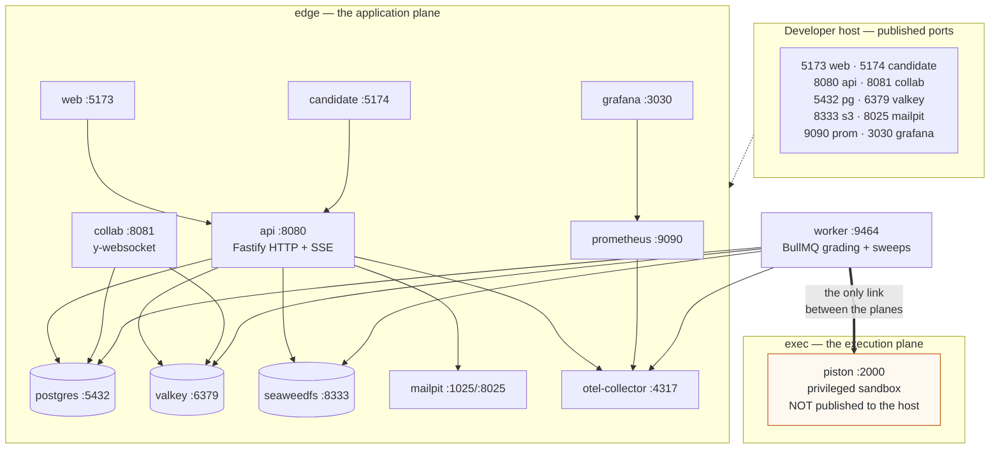

# Infrastructure

**Status:** draft
**Owner:** _unassigned_
**Last updated:** 2026-09-17
**Companion docs:** [../docs/02-HLD.md](../docs/02-HLD.md), [../docs/04-ADRs.md](../docs/04-ADRs.md), [../docs/05-licensing-and-compliance.md](../docs/05-licensing-and-compliance.md), [piston/README.md](piston/README.md)

---

Everything needed to run Assaybank on a laptop, and the shape of the same system in production. The development stack is real and works today. The application services in it are defined but inert, because `apps/*` does not exist yet — the profile guard and the milestone that lifts it are explained under [Application services](#application-services).

## Layout

| Path | What it is |
|---|---|
| `../docker-compose.yml` | Development stack. Data tier, execution tier, mail, object store, observability, and the guarded application services. |
| `../docker-compose.prod.yml` | Production shape. Swarm semantics: replicas, placement constraints, resource limits, secrets, hardened containers. |
| `docker/*.Dockerfile` | Multi-stage builds for the five application services. Specifications until their `apps/` directory exists. |
| `postgres/init/` | Extensions, roles, schema loader, RLS policies, event partitions. Runs once on a fresh volume, in filename order. |
| `piston/` | The execution matrix and its operational notes. See [piston/README.md](piston/README.md). |
| `caddy/Caddyfile` | TLS termination and routing for production, including the sticky WebSocket route. |
| `otel/otel-collector.yaml` | Telemetry pipeline, including span redaction. |
| `prometheus/prometheus.yml` | Scrape jobs for api, worker and collab. |
| `grafana/provisioning/` | Datasource, provisioned as a file so a fresh stack works without clicking. |
| `seaweedfs/` | Bucket bootstrap for development; the production identity template. |

## Network topology

Two networks in development, three in production. The split exists for one reason, and it is the reason that shapes everything else in this directory.



The properties that hold, stated plainly:

- `piston` is attached to `exec` and to nothing else. There is no route from it to `postgres`, `valkey`, `seaweedfs`, `api`, `collab`, `mailpit` or the collector.
- `worker` is the only service attached to both planes. It calls Piston; Piston calls nothing.
- `api` is attached to `edge` only. It never calls Piston. An interactive "Run" is enqueued exactly like a submission and executed by the worker, so no request handler has a path into the sandbox.
- Piston's port 2000 is not published to the host. Publishing an unauthenticated arbitrary-code-execution endpoint onto a developer's loopback interface is a bad trade for the convenience of `curl`. The mapping is present but commented out in `docker-compose.yml` for a deliberate debugging session.

One development-only concession: the `exec` network is not `internal: true`, because Piston must reach the public package index to install language runtimes on first boot. In production it is `internal: true` and the runtimes are baked into the image. The property that matters — Piston has no route to anything holding a credential — holds in both.

### Why exec is isolated

`docs/02-HLD.md` section 7 starts from an assumption rather than a hope: **the sandbox will eventually be escaped.** Piston and Judge0 have both had documented escapes. A design that depends on the sandbox holding is a design with one bug between it and every tenant's data.

So the design makes an escape worthless instead:

1. **Nothing to steal.** An exec node holds no database credential, no object-store key, no session secret, no token pepper, no OIDC client secret and no cloud IAM role. The `piston` service in both compose files declares no `secrets:` and references no `*_FILE` variable, and there is a comment in `docker-compose.prod.yml` saying that a change adding one is wrong.
2. **Nowhere to go.** No route to the data tier, no route to the application tier, no egress.
3. **Nothing to learn.** Test-case expectations never enter the sandbox. The adapter signature is `execute(language, version, files, stdin, limits)` — there is no question ID in it. Comparison happens in the grading worker.
4. **Nowhere to stay.** Environments are discarded after every execution, containers every six hours, nodes every 24. See [piston/README.md](piston/README.md#recycling-cadence).

Each of the four is weak alone. A node with no credentials but a route to Postgres is a pivot point. A node with no route but a copy of the expected outputs leaks the bank. Together they reduce a successful escape to "a candidate got a shell on a machine that will be destroyed within hours and contains nothing they did not send it".

In production the arrangement is enforced by placement rather than by convention. `docker-compose.prod.yml` constrains `piston` to `node.labels.hiring.role == exec` and sets `max_replicas_per_node: 1`; two sandboxes on one host share a kernel, which turns one escape into two compromised execution contexts.

## Bringing the stack up from clean

Prerequisites: Docker Engine 24+ with Compose v2, and roughly 8 GB of free disk for the Piston runtimes.

```sh
# 1. From the repository root.
cd /path/to/services/hiring

# 2. Create the local environment file. Every value has a working default for
#    development; the file exists so overrides have somewhere to live.
cp .env.example .env

# 3. Start the data and execution tiers. Nothing else is needed for M0 work.
docker compose up -d

# 4. Wait for health. All five services must report healthy before the init
#    scripts can be said to have succeeded.
docker compose ps

# 5. Apply the migrations. REQUIRED. Since P0 the schema is owned by
#    packages/db/migrations; the init chain only bootstraps table shapes, and a
#    database built by it alone is missing the ADR-003 trigger that makes a
#    published question version immutable. Runs from the host, reading
#    DATABASE_OWNER_URL from .env (localhost:5432).
make migrate

# 6. Install the language runtimes. First run takes 10-30 minutes depending on
#    the connection; the result persists in the piston_runtimes volume.
docker compose exec piston sh /piston/install-runtimes.sh

# 7. Optional: metrics and traces.
docker compose --profile observability up -d
#    Grafana: http://localhost:3030   (admin / admin)
#    Prometheus: http://localhost:9090
#    Mailpit: http://localhost:8025
```

Verify by hand:

```sh
# The schema is present and RLS is on.
docker compose exec postgres psql -U hiring -d hiring -c \
  "select relname, relrowsecurity from pg_class c
     join pg_namespace n on n.oid = c.relnamespace
    where n.nspname='public' and c.relkind in ('r','p') order by 1;"

# The partitions exist.
docker compose exec postgres psql -U hiring -d hiring -c \
  "select relname from pg_class where relname like 'session_events_%' order by 1;"

# The isolation holds: piston cannot reach the database.
docker compose exec piston sh -c "getent hosts postgres || echo 'no route to postgres — correct'"
```

Tear down:

```sh
docker compose down            # stop, keep the volumes
docker compose down -v         # stop and destroy every volume, including the
                               # installed Piston runtimes and the database
```

`down -v` means re-running the Postgres init chain and re-installing every runtime. Reach for it when you want a genuinely clean database; do not reach for it when a service is merely misbehaving.

## Application services

`api`, `worker`, `collab`, `web` and `candidate` are fully defined in `docker-compose.yml` and behind the `apps` and `ui` profiles. A service carrying a `profiles:` key is inert unless that profile is enabled, so the file parses and `docker compose up` works while `apps/*` does not exist.

| Milestone | Dates | What activates |
|---|---|---|
| M0 | 2026-09-21 → 2026-10-09 | `apps/api`, `apps/worker`, `apps/web`. Add `apps` to `COMPOSE_PROFILES` in `.env`. |
| M1 | 2026-10-12 → 2026-10-30 | `apps/candidate`. Add `ui`. |
| M3 | 2026-11-30 → 2026-12-25 | `apps/collab` carries real traffic; LiveKit joins the stack. |

Once every app directory exists, delete the `apps` and `ui` entries from the `profiles:` lists and the header comment block that explains them.

## Adding a service

1. **Decide which plane it belongs to.** Almost everything belongs on `edge`. A service belongs on `exec` only if it runs untrusted code, and in that case it belongs on `exec` *alone* — if it also needs the database, the design is wrong and the work should move to the worker.
2. **Give it a healthcheck.** Not optional. `depends_on: condition: service_healthy` is what stops the API from booting against a Postgres that is still replaying WAL, and a service with no healthcheck silently degrades that to `service_started`.
3. **Add its port to the canonical list** in the repo canon, `.env.example` and the table in this file. Three places, all of which must agree. A port that exists in the compose file and nowhere else is a port the next person will reallocate.
4. **Name its environment variables from the canonical set.** If a genuinely new variable is needed, it goes into `.env.example` in the same commit, with a comment saying what it does and what happens if it is wrong.
5. **Put it in a profile if it is not part of the default path.** The default `docker compose up` should stay small enough to run on a laptop while a video call is open.
6. **Add a Dockerfile to `infra/docker/`** if it is one of ours, following the `base → deps → dev → build → runtime` stages. Non-root, a HEALTHCHECK, tini, and a comment at the top naming the milestone that activates it.
7. **Mirror it into `docker-compose.prod.yml`** with `target: runtime`, a pinned digest, resource limits, a placement constraint and a restart policy. A service that exists only in development is a service that will be deployed by hand at midnight.
8. **Add a scrape job** to `prometheus/prometheus.yml` if it exposes metrics, and say in a comment which metric anyone would actually look at.

## Volumes and the Postgres backup story

Development volumes, all named and all local to the machine:

| Volume | Holds | Lost on `down -v` |
|---|---|---|
| `postgres_data` | The entire domain database | Yes — re-runs the init chain |
| `valkey_data` | Queue state, presence, rate-limit counters | Yes — nothing here is a source of truth |
| `piston_runtimes` | Installed language runtimes | Yes — a 10-30 minute reinstall |
| `seaweedfs_data` | Objects: exports, recordings, proctor media | Yes |
| `prometheus_data` | 15 days of metrics | Yes |
| `grafana_data` | Dashboards and preferences | Yes |
| `pnpm_store` | Shared pnpm content-addressable store | Yes |

Valkey is configured with `appendonly yes` and `maxmemory-policy noeviction`. Neither is a default and both are deliberate. The append-only file means a queued grading job survives a container restart. `noeviction` means Valkey refuses writes when it is full rather than silently discarding keys — a queue that quietly drops jobs under memory pressure produces ungraded submissions, and the whole point of `docs/02-HLD.md` section 9 is that no infrastructure failure may silently score a candidate as zero. Refusing a write is loud; evicting one is not.

### Backups

**Development has no backup and needs none.** The database is reproducible: `docker compose down -v && docker compose up -d` rebuilds it from `docs/hiring_platform_schema.sql`. If a local database contains something worth keeping, that is a signal it should be in a seed script.

**Production.** A single-container Postgres has no failover story and is not what production runs on; `docker-compose.prod.yml` says so where it defines the service. The requirement, independent of which HA option wins:

| Layer | Mechanism | Target |
|---|---|---|
| Continuous | WAL archiving to object storage (pgBackRest or WAL-G, both permissively licensed) | RPO ≤ 5 minutes |
| Daily | Full base backup, retained 30 days | — |
| Weekly | Full base backup, retained 12 months | Covers `RETENTION_AUDIT_LOG_YEARS` reporting needs |
| Restore | Rehearsed monthly into a scratch environment, timed | RTO ≤ 1 hour |

Three things that are easy to get wrong and expensive to discover late:

- **A backup nobody has restored is not a backup.** The monthly rehearsal is the deliverable, not the nightly job. It is timed because RTO is a claim that has to be true.
- **Point-in-time recovery is the one that matters here.** The realistic disaster is not a lost disk, it is a bad migration or a bulk delete run against the wrong organisation ten minutes ago. WAL archiving is what makes "restore to 14:32" possible; a nightly dump is not.
- **The object store needs its own story.** Proctor media and session recordings are not in Postgres, and a restored database pointing at objects that were deleted by the retention sweep is a half-restore. Object versioning with a lifecycle that lags `RETENTION_PROCTOR_MEDIA_DAYS` — but never exceeds it, because the retention policy is a legal commitment, not a preference. See `docs/11-data-retention-and-dpia.md`.

TBD — owner: platform engineer, decide by 2026-11-27 (M2 exit): pgBackRest versus WAL-G, and whether Postgres HA is Patroni or a managed service. Whichever wins, RLS and the two-role split from ADR-010 survive unchanged.

## Ports

Canonical, and identical in `docker-compose.yml`, `.env.example` and the docs.

| Service | Dev | Prod |
|---|---|---|
| api | 8080 | 8080, behind Caddy on 443 |
| collab | 8081 | 8081, behind Caddy on 443 |
| web | 5173 | 3000, behind Caddy on 443 |
| candidate | 5174 | 3001, behind Caddy on 443 |
| postgres | 5432 | 5432, `internal` network only |
| valkey | 6379 | 6379, `internal` network only |
| piston | 2000 | 2000, `exec` network only — never published |
| seaweedfs S3 | 8333 | 8333, `internal` network only |
| mailpit | 8025 UI / 1025 SMTP | not deployed; a real SMTP relay replaces it |
| otel-collector | 4317 OTLP gRPC / 4318 HTTP | same |
| prometheus | 9090 | 9090, operator VPN |
| grafana | 3030 | 3030, operator VPN |

## Licence notes

Three choices in this stack exist because of the policy in `docs/05-licensing-and-compliance.md`, and each has an obvious-looking alternative that is not permitted:

- **Valkey 8, not Redis.** Redis relicensed to RSALv2/SSPL after 7.2. Valkey is the BSD-3 Linux Foundation fork. `REDIS_URL` keeps its conventional name because Valkey speaks the Redis wire protocol and renaming the variable would help nobody.
- **SeaweedFS, not MinIO.** MinIO is AGPL-3.0, and running AGPL software as a networked service inside a product is what that licence is written to reach.
- **Piston, not Judge0.** Judge0 is GPL-3.0 (ADR-002).

CI fails the build on GPL, LGPL (static), AGPL, SSPL, BSL/BUSL and Commons Clause, and an SBOM is generated per release. Adding an image to either compose file means checking its licence first — a container image is a dependency, and the scanner reads manifests, not `docker-compose.yml`.
