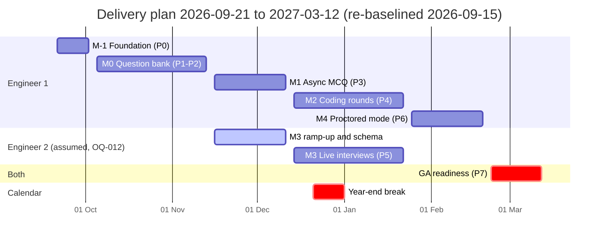

# Milestones

**Status:** draft
**Owner:** _unassigned_
**Last updated:** 2026-09-17
**Companion docs:** [`TRACKER.md`](TRACKER.md), [`RISKS.md`](RISKS.md), [`OPEN-QUESTIONS.md`](OPEN-QUESTIONS.md), [`STATUS.md`](STATUS.md), [`DEFINITION-OF-DONE.md`](DEFINITION-OF-DONE.md), [`../docs/01-PRD.md`](../docs/01-PRD.md), [`../docs/02-HLD.md`](../docs/02-HLD.md), [`../docs/04-ADRs.md`](../docs/04-ADRs.md)

---

## How to read this

Milestone scope comes from [`../docs/01-PRD.md`](../docs/01-PRD.md) §6. Exit criteria are quoted verbatim from that section and are not negotiable downward — a milestone that ships without meeting its exit criterion is not closed, it is in progress with a longer tail. Every scope line maps to at least one task id in [`TRACKER.md`](TRACKER.md); every risk named here has an entry in [`RISKS.md`](RISKS.md).

Dates are absolute and assume a five-day working week. Project start is Monday 2026-09-21. Weeks 1–18 in the PRD map onto the calendar below.

## Plan at a glance

| Milestone | Phase | Dates | Working days | Owner |
|---|---|---|---|---|
| M-1 Foundation | P0 | 2026-09-21 → 2026-10-02 | 10 | _unassigned_ |
| M0 Question bank | P1–P2 | 2026-10-05 → 2026-11-13 | 30 | _unassigned_ |
| M1 Async MCQ assessment | P3 | 2026-11-16 → 2026-12-11 | 20 | _unassigned_ |
| M2 Coding rounds | P4 | 2026-12-14 → 2027-01-22 | 20 | _unassigned_ |
| M3 Live interviews | P5 | 2026-12-14 → 2027-01-22 | 20 | _unassigned_ (engineer 2) |
| M4 Proctored / certification mode | P6 | 2027-01-25 → 2027-02-19 | 20 | _unassigned_ |
| GA readiness | P7 | 2027-02-22 → 2027-03-12 | 15 | _unassigned_ |

**Re-baselined 2026-09-15.** The PRD's 18-week calendar assumed a working repository, database and
deployment pipeline. None existed. [`ROADMAP.md`](ROADMAP.md) §1 sets out the arithmetic and the
three options; the plan above is the recommended one, and it needs an owner's sign-off (`OQ-013`).
PRD week numbers no longer map one-to-one onto the calendar and are omitted here rather than
carried forward as a second, wrong set of dates.

Non-working period: 2026-12-21 → 2027-01-01.

### The parallelism assumption

[`../docs/README.md`](../docs/README.md) states it plainly: *"M0 through M2 is the product. M3 is a separate track that can start in parallel with a second engineer."* The dates above encode that assumption. Specifically:

- M3 is staffed by a **second engineer**, not by whoever is finishing M2. M3 depends on M2's execution adapter (in-session run) and on M1's attempt and scoring model, but not on M2 being finished — the collaboration tier, the replay store and the scorecard model are independent surfaces.
- That second engineer ramps up during P3 (2026-11-16 → 2026-12-11): reading the docs, standing up `apps/collab` against the dev stack, and building the session and scorecard schema. Delivery work starts 2026-12-14.
- **If the second engineer is not confirmed, M3 becomes serial, M4 shifts behind it and GA moves to 2027-04-09.** That is a four-week slip to the whole plan, tracked as `R-12` in [`RISKS.md`](RISKS.md) and as `OQ-012` in [`OPEN-QUESTIONS.md`](OPEN-QUESTIONS.md), with a decide-by date of 2026-10-16 so the ramp-up window is still recoverable.

There is a deliberate non-working gap from 2026-12-21 to 2027-01-01. M2 and M3 resume on Monday 2027-01-04.

---

## M-1 — Foundation

**Dates:** 2026-09-21 → 2026-10-02 (phase P0)
**Goal:** land on Monday 2026-09-21 with nothing left to decide about repo shape, runtime, infrastructure or process, so week 1 is spent on the question bank rather than on scaffolding arguments.

This pre-milestone does not appear in the PRD. It exists because the PRD's M0 assumes a working repository, and there was none.

### Scope

- [x] Repo root identity — `README.md`, `CLAUDE.md`, `CONTRIBUTING.md`, `.gitignore`, `.editorconfig`, `.nvmrc`, `.env.example`, `Makefile`
- [x] Runtime and monorepo decision recorded as ADR-012 (Node 22 LTS + TypeScript 5.x + Fastify 5; pnpm workspaces + Turborepo), closing the HLD §5 "team familiarity should decide this" gap
- [x] ADR-013 through ADR-019 recorded in [`../docs/04-ADRs.md`](../docs/04-ADRs.md)
- [x] Dev docker stack — Postgres 16, Valkey 8, Piston, SeaweedFS, Mailpit, OTel collector, Prometheus, Grafana, on the canonical ports
- [x] Production compose and Caddy reverse-proxy configuration
- [x] `CODE-GRAPH.md` / `code-graph.json` and the generator that keeps them honest
- [x] CI workflows: lint, typecheck, test, build, licence gate, doc freshness, link check
- [x] Licence gate script that fails on GPL / LGPL-static / AGPL / SSPL / BSL / Commons Clause (ADR-001)
- [x] Project management layer — this file plus `TRACKER.md`, `RISKS.md`, `OPEN-QUESTIONS.md`, `STATUS.md`, `DEFINITION-OF-DONE.md`, `GLOSSARY.md`
- [x] Supporting design docs 06–16: testing strategy, load and capacity testing, i18n, ATS integration, certification and credentials, retention and DPIA, observability and runbooks, environments and release, threat model, accessibility conformance, AI usage policy
- [ ] pnpm workspace with all fourteen workspaces (five apps, nine packages) present and compiling empty (**pending — no application code exists in this repository yet**)
- [ ] `packages/config` env parsing that fails fast at boot against `.env.example` (**pending**)
- [ ] `packages/observability` logger, OTel bootstrap and `/metrics` endpoint (**pending**)
- [ ] First green CI run against a real `pnpm-lock.yaml` and a first CycloneDX SBOM (**pending — the gate script exists, the dependency tree it grades does not**)

### Exit criteria

Not defined by the PRD. Local criterion: **a new engineer clones the repository, runs `make up`, and reaches a running dev stack and a green CI run without asking anyone a question.**

| Criterion | Verified by |
|---|---|
| Dev stack starts clean | `make up` then `make ps` against the compose stack; see [`../infra/README.md`](../infra/README.md) |
| CI is green on an empty workspace | `.github/workflows/ci.yml` run on the first commit |
| Licence gate rejects a prohibited licence | `node scripts/check-licences.mjs` with a deliberately planted AGPL fixture (task H-039) |
| Docs are internally consistent | `node scripts/check-links.mjs` and `node scripts/check-doc-freshness.mjs` |
| The runtime question is closed | ADR-012 present and referenced by `CLAUDE.md` |

### Entry dependencies

None. This is the root of the graph.

### FR coverage

None directly. M-1 is the substrate for FR-26 (RLS needs a database), FR-27 (permissions need an app) and ADR-001 (the licence gate).

### Risks that could slip it

`R-08` licence traps (a dependency choice made here is expensive to unpick later), `R-12` staffing.

---

## M0 — Question bank

**Dates:** 2026-10-05 → 2026-11-13 (phases P1–P2)
**Goal:** the foundation everything else reads from. One bank, one taxonomy, immutable published versions, and content that can leave in an open format.

### Scope

- [ ] Drizzle schema and migrations for schema sections 1–4: tenancy, users, RBAC, skills, job roles, job openings, question bank
- [ ] Row-level security on every tenant table with `app.current_org` set per connection checkout (ADR-010)
- [ ] Separate application and background-job database roles, the job role explicitly elevated and audited
- [ ] Staff authentication (Better Auth sessions + OIDC) and per-action permission checks
- [ ] `packages/contracts`: zod schemas, stable error codes, generated OpenAPI 3.1
- [ ] Fastify app skeleton: request id, error envelope, cursor pagination, `server_time` on every response
- [ ] `Idempotency-Key` handling and the five documented rate-limit scopes
- [ ] Append-only audit log and audit middleware for privileged actions
- [x] Skills and job roles CRUD, `job_role_skills` weights, `GET /job-roles/{id}/coverage` — 2026-09-17, `apps/api/test/integration/taxonomy.test.ts`
- [x] Question CRUD for all eight kinds: `mcq_single`, `mcq_multi`, `true_false`, `short_answer`, `coding`, `sql`, `subjective`, `system_design` — 2026-09-17, `apps/api/test/integration/questions.test.ts`
- [x] Version lifecycle draft → review → published → retired, with `PATCH` on a published version returning `409 version_immutable` — 2026-09-17, `apps/api/test/integration/questions.test.ts` and the database trigger test in `packages/db/tests/question-bank.test.ts`
- [x] Question-to-skill tagging, with job-role tagging structurally impossible — 2026-09-17, `PUT /questions/{id}/skills`; the contract has no job-role field and a body carrying one is refused
- [ ] Import adapters for HumanEval, MBPP, LBPP and Exercism with `source_license` mandatory and `external_ref` preserved
- [x] QTI 2.1 and JSON import/export, round-trip lossless — 2026-09-17: `POST /questions/import`, `POST /questions/export` and their job and file routes (`apps/api/test/integration/bank-jobs.test.ts`), the `bank.jobs` outbox job (`apps/worker/test/integration/bank-job.integration.test.ts`), and the round trip (`bank-transfer.integration.test.ts`)
- [ ] Attributions page in the staff console for CC-BY sources, credit preserved in exports
- [x] Nightly `question_stats` job computing p-value and point-biserial discrimination once n ≥ 30 — 2026-09-17, as the corrected item-total correlation (rest score), `apps/worker/test/integration/question-stats.integration.test.ts`
- [ ] `exposure_count` maintenance and a retirement flag over a configurable threshold
- [ ] Staff console shell and the question authoring UI including the test-case editor

### Exit criteria

> 200 questions loaded, tagged to at least 3 job roles, exportable and re-importable without loss.

| Criterion | How it is verified |
|---|---|
| 200 questions loaded | `SELECT count(*) FROM questions WHERE status = 'published'` in the seeded staging database after the import run; task H-040 |
| Tagged to at least 3 job roles | `GET /job-roles/{id}/coverage` returns non-zero coverage for three distinct roles; the query goes role → `job_role_skills` → `question_skills`, never role → question (FR-2, ADR-009) |
| Exportable and re-importable without loss | Round-trip integration test: export QTI 2.1 and JSON, re-import into an empty org, assert deep equality of question versions, options, test cases and answer keys excluding generated ids and timestamps. Specified in [`../docs/06-testing-strategy.md`](../docs/06-testing-strategy.md); task H-033. **Met at the job layer 2026-09-17** — `apps/worker/test/integration/bank-transfer.integration.test.ts` imports every kind into one organisation, exports it, carries it as JSON and as QTI into two empty organisations, and asserts `toStrictEqual` on their exports. JSON carries every version; QTI carries the served version per question, which is the format's limit. Reachable over HTTP from 2026-09-17 through `POST /questions/export` and `POST /questions/import` (ADR-021) |
| Immutability actually holds | Contract test asserting `PATCH /questions/{id}/versions/{v}` on a published version returns `409` with code `version_immutable` (FR-1, ADR-003) |
| Tenant isolation actually holds | Per-table negative RLS test: a session with org A's `app.current_org` reads zero org B rows (FR-26, ADR-010); task H-017 |

### Entry dependencies

M-1 workspace, config and observability packages. A decision on which datasets to import first, with licence recorded — see [`../docs/05-licensing-and-compliance.md`](../docs/05-licensing-and-compliance.md) §2.

### FR coverage

FR-1, FR-2, FR-3, FR-4, FR-5, FR-26, FR-27, FR-29 (partial — bank export only).

### Risks that could slip it

`R-03` dataset contamination makes the imported 200 questions worthless above junior level; `R-07` skill taxonomy rot starting on day one; `R-09` RLS query-plan degradation discovered late; `R-13` question-bank cold start — imported content is not a bank.

---

## M1 — Async MCQ assessment

**Dates:** 2026-11-16 → 2026-12-11 (phase P3)
**Goal:** a recruiter can compose an assessment, invite candidates, and get one defensible number per candidate, with the server owning the clock and the question selection.

### Scope

- [ ] Drizzle schema and migrations for schema sections 5–6: assessments, sections, `section_questions`, `section_rules`, candidates, applications, invitations, attempts, `attempt_questions`, answers
- [ ] Assessment and section CRUD; editing a live assessment clones a new version and in-flight attempts finish on the old one
- [ ] Section rule resolver: `pick_count`, `skill_ids`, `kinds`, difficulty band, `exclude_seen_days` recency window
- [ ] `POST /assessments/{id}/simulate` returning feasibility, sample draw and warnings; publish blocked until simulate passes
- [ ] `POST /assessments/auto` composing a draft from `job_role_skills` weights
- [ ] Candidate and application CRUD, bulk CSV import
- [ ] Invitation tokens: high entropy, peppered hash at rest, plaintext returned exactly once, bulk send through SMTP
- [ ] Attempt start materialising `attempt_questions` including `option_order`, in one transaction, never re-rolled
- [ ] Server-computed `deadline_at` including `accommodations.extra_time_pct`; heartbeat returning `server_time` and `seconds_remaining`
- [ ] Autosave with ≤5s cadence, offline buffer, resume after disconnect
- [ ] Attempt state machine with the `finalised` guard requiring every `answers.final_score` non-null
- [ ] Deadline sweep transitioning overdue attempts to `expired` and grading what was autosaved
- [ ] `packages/grading`: MCQ partial credit, negative marking, short-answer matchers, all pure
- [ ] Per-skill sub-score roll-up from `question_skills` weights
- [ ] Regrade and manual override, both requiring a reason and both audited
- [ ] Candidate app: token redemption, MCQ runner, countdown derived from `server_time`
- [ ] Per-candidate report and cohort CSV export
- [ ] Assessment analytics: p-value, discrimination, mean time, MCQ option distribution
- [ ] Webhook emission with HMAC-SHA256 signing, at-least-once delivery, 24-hour retry window

### Exit criteria

> 50 candidates complete a 30-question test concurrently; scores reproduce exactly on re-grade.

| Criterion | How it is verified |
|---|---|
| 50 concurrent candidates complete | k6 scenario `mcq-50-concurrent` from [`../docs/07-load-and-capacity-testing.md`](../docs/07-load-and-capacity-testing.md), run against staging with production-shaped data. Pass = 50/50 attempts reach `finalised`, zero autosave failures, API p95 < 300 ms |
| 30-question test | The scenario uses a published assessment with one fixed section and one random-draw section summing to 30, so both `section_questions` and `section_rules` paths are exercised (FR-6) |
| Scores reproduce exactly on re-grade | `POST /attempts/{id}/regrade` on all 50 attempts; assert every `raw_score`, `score_pct` and per-skill sub-score is byte-identical to the original grading run, and that the audit log holds both runs (FR-20, API spec §8); task H-062 |
| The draw never re-rolls | Test that restarting an attempt, regrading it, and re-reading it all return the same `attempt_questions` rows and the same `option_order` (FR-7, ADR-004) |
| The client cannot move the deadline | Test submitting with a skewed client clock and a tampered payload; server rejects with `attempt_expired` (FR-8, ADR-006) |
| Nothing hidden leaks | Serialisation guard test asserting `is_correct`, `rationale_md`, `solution_code` and `expected_stdout` never appear in any candidate-facing response body (FR-12, HLD §7); task H-056 |

### Entry dependencies

M0 complete: published questions, skills, roles and RLS. A seeded staging environment sized per [`../docs/13-environments-and-release.md`](../docs/13-environments-and-release.md).

### FR coverage

FR-6, FR-7, FR-8, FR-9, FR-10, FR-12 (guard established), FR-20, FR-21, FR-27, FR-28 (retention clock recorded, sweep lands in M4).

### Risks that could slip it

`R-15` autosave loss under connection churn; `R-09` RLS plan degradation on the attempt hot path; `R-16` duplicate webhook deliveries moving an ATS stage twice; `R-01` early evidence of stampede behaviour at the deadline even without code execution.

---

## M2 — Coding rounds

**Dates:** 2026-12-14 → 2027-01-22 (phase P4)
**Goal:** candidates write and run real code in a sandbox that is assumed to be escapable, graded asynchronously, with a hidden-case boundary that holds.

### Scope

- [ ] Drizzle schema and migrations for schema section 7: `submissions`, `submission_results`
- [ ] `packages/exec-adapter` implementing `execute(language, version, files, stdin, limits)` over Piston, recording `language_version` and `runtime_image` on every submission
- [ ] Kernel-enforced limits: `EXEC_CPU_TIME_MS`, `EXEC_WALL_TIME_MS`, `EXEC_MEMORY_MB`, `EXEC_MAX_PROCESSES`, `EXEC_MAX_OUTPUT_BYTES`, no network egress
- [ ] Execution nodes holding no secrets, no database credentials and no cloud IAM role, asserted by an infrastructure test
- [ ] Piston runtime image pinning, container pre-warm, node recycle policy
- [ ] Two BullMQ queues with separate concurrency: interactive `run` and batch `submit`
- [ ] Grading worker pipeline, idempotent by submission id, bounded retries, output truncated before storage
- [ ] Dead-letter queue moving the attempt to `under_review` and alerting, never scoring zero
- [ ] Grading modes: `test_cases`, `unit_tests`, `custom_checker`, with per-case weights
- [ ] Candidate-visible result filtering: sample cases full detail, hidden cases pass/fail and label only, compile errors full
- [ ] Run versus submit separation — a run consumes no submission budget; author preview reuses the same path
- [ ] SSE stream emitting progress then the final result
- [ ] Per-attempt execution budget and a final-minute submission rate limit
- [ ] SQL question kind executing against a disposable fixture database
- [ ] Monaco in the candidate app with language selection, starter code, keyboard accessibility, and an SSE-driven results panel
- [ ] SeaweedFS object storage for large submission artifacts through pre-signed short-TTL URLs

### Exit criteria

> 100 concurrent submissions graded, p95 result latency under 8s.

| Criterion | How it is verified |
|---|---|
| 100 concurrent submissions graded | k6 scenario `coding-100-inflight` from [`../docs/07-load-and-capacity-testing.md`](../docs/07-load-and-capacity-testing.md) against two execution nodes sized per HLD §6. Pass = 100/100 submissions reach `done`, dead-letter queue empty; task H-080 |
| p95 result latency under 8s | Histogram `exec_result_latency_seconds` scraped by Prometheus, measured submit → final SSE event. p95 < 8s over the run window; dashboard defined in [`../docs/12-observability-and-runbooks.md`](../docs/12-observability-and-runbooks.md) |
| Hidden cases never leak | Extended serialisation guard: fuzz the run and submit responses, the SSE stream and every error path, asserting no `expected_stdout` or hidden-case stdin appears, including inside `stderr` and compile output (FR-12) |
| Grading is reproducible | Replay the same submission id through the worker twice; assert identical `submission_results` rows and identical score (ADR-008) |
| The sandbox is assumed hostile | Execution node test asserting no egress route, no reachable database port, and an empty environment beyond the Piston contract (FR-15, HLD §7) |
| Runtime identity is recorded | Assert every `submissions` row has non-null `language_version` and `runtime_image` (FR-13, G4) |

### Entry dependencies

M1 attempt lifecycle and scoring. Execution nodes provisioned and network-isolated. Piston runtime images pinned.

### FR coverage

FR-11, FR-12, FR-13, FR-14, FR-15, FR-20 (coding contribution to the weighted sum).

### Risks that could slip it

`R-01` deadline stampede on execution capacity — the headline risk of this milestone; `R-02` sandbox escape; `R-10` Piston maturity relative to Judge0; `R-04` AI assistants making imported coding questions non-discriminating.

---

## M3 — Live interviews

**Dates:** 2026-12-14 → 2027-01-22 (phase P5, parallel track)
**Goal:** an interviewer and a candidate share an editor with no setup on either side, and the session is reconstructable afterwards.

Staffed by the second engineer; ramp-up runs 2026-11-16 → 2026-12-11 alongside M1. See the parallelism assumption above.

### Scope

- [ ] Drizzle schema and migrations for schema sections 8–9: `interview_sessions`, `session_participants`, `session_events` (partitioned by month), scorecard templates, criteria, scorecards, ratings
- [ ] `apps/collab` y-websocket server with Valkey pub/sub cross-instance fanout
- [ ] WS tickets: 60-second TTL, single use, validated by the collab service; room-code join with no account and no download
- [ ] Periodic `doc_state` snapshot to Postgres on `COLLAB_SNAPSHOT_INTERVAL_MS`
- [ ] Every applied update appended to `session_events`, batched and asynchronous
- [ ] Replay API and a player UI with variable speed
- [ ] Shared editor UI with live cursors and awareness presence
- [ ] Multi-file workspace and in-session run routed to the interactive queue
- [ ] Interviewer private notes pane, enforced server-side rather than by client rendering
- [ ] Scorecard templates carrying behavioural anchors per rating level
- [ ] Scorecard submit locks the record; reviewers cannot read each other until all are submitted
- [ ] Self-hosted LiveKit for audio and video with token issuance

### Exit criteria

> an interviewer runs a full 45-minute loop and replays it afterwards.

| Criterion | How it is verified |
|---|---|
| A full 45-minute loop runs | Scripted rehearsal on staging with two real participants, recorded in the M3 rehearsal note; task H-094. Pass = zero lost keystrokes, editor sync p95 < 150 ms same-region measured from the awareness round trip |
| It replays afterwards | `GET /sessions/{id}/replay` produces an artifact that the player reconstructs to the same final document text as `interview_sessions.doc_state`, at 1×, 2× and 8× speed (FR-18) |
| Convergence without a central lock | Automated Yjs convergence test: three clients, concurrent edits, forced disconnect and reconnect, assert identical converged state (FR-17, ADR-005) |
| Candidate joins with a room code only | End-to-end test from a clean browser profile: no account, no install, no plugin (FR-16, G2) |
| Private notes stay private | Test asserting the candidate's session payload and WS awareness frames contain no interviewer note content (FR-19) |
| Scorecards do not anchor | API test: reviewer B's `GET /scorecards?session_id=` returns reviewer A's scorecard only after both are submitted (FR-22, API spec §11) |

### Entry dependencies

M2 execution adapter for in-session run. Second engineer confirmed by 2026-10-16 (OQ-012). LiveKit credentials provisioned.

### FR coverage

FR-16, FR-17, FR-18, FR-19, FR-22.

### Risks that could slip it

`R-12` single-engineer bus factor — this milestone is the one with a named staffing dependency; `R-14` Yjs binary state is unqueryable, so a replay divergence is hard to debug; `R-18` an infrastructure failover mid-session.

---

## M4 — Proctored / certification mode

**Dates:** 2027-01-25 → 2027-02-19 (phase P6)
**Goal:** run a high-stakes exam where integrity concerns reach a human with evidence attached, and no automated verdict is ever computed.

M4 is last deliberately: least value per unit of effort, most legal exposure. [`../docs/04-ADRs.md`](../docs/04-ADRs.md) ADR-007 governs everything in it.

### Scope

- [ ] Drizzle schema and migrations for schema section 10: `proctor_events` (partitioned by month), `proctor_media`
- [ ] Browser-signal collection in the candidate app: focus loss, paste, fullscreen exit, devtools — batched and fire-and-forget
- [ ] Proctor event ingestion that is advisory only, with a test proving no code path lets a signal change a score, void an attempt or reject a candidate
- [ ] Integrity review queue with the specific triggering evidence attached per flag
- [ ] Human void flow requiring a reason, audited
- [ ] Consent capture before any media capture, with a non-proctored alternative always offered
- [ ] Proctor media upload to object storage, readable only through short-TTL pre-signed URLs
- [ ] Safe Exam Browser configuration generation and launch handshake
- [ ] Certificate issuance with a verifiable id and a public verification endpoint
- [ ] GDPR erasure hard-deleting PII while retaining anonymised psychometric rows
- [ ] Retention sweeps enforcing every `RETENTION_*` variable in code, not in a policy document
- [ ] Full organisation export in open formats
- [ ] `GET /reports/adverse-impact` with a four-fifths-rule breakdown
- [ ] Accessibility conformance pass on the candidate app

### Exit criteria

> a 90-minute certification exam runs end to end with a reviewable integrity report.

| Criterion | How it is verified |
|---|---|
| 90-minute exam end to end | Scripted rehearsal on staging: SEB launch, consent, 90-minute timed attempt, submit, grade, certificate issued and verified through the public endpoint; task H-109 |
| Reviewable integrity report | A reviewer opens the flagged attempt and sees each signal with its timestamp, type and payload, and the media (if any) behind a pre-signed URL (FR-24) |
| No automated verdict exists | Test asserting the ingestion path writes only to `proctor_events` and `attempts.integrity_flag`, and never to `raw_score`, `score_pct`, `passed` or `status` (FR-23, ADR-007); task H-098. This test is a release blocker, not a nice-to-have |
| Void requires a reason | API test: `POST /attempts/{id}/void` without `reason` returns `validation_failed`; with a reason it writes an `audit_log` row naming the actor (FR-25) |
| Consent is real consent | Test that declining consent still allows a non-proctored route to a completed attempt (GDPR, [`../docs/05-licensing-and-compliance.md`](../docs/05-licensing-and-compliance.md) §3) |
| Retention is enforced in code | Time-travel test advancing the clock past `RETENTION_PROCTOR_MEDIA_DAYS` and asserting the sweep deletes the media and the object-store blob (FR-28) |
| Accessibility holds | Automated axe run in CI plus a manual keyboard-only and screen-reader pass against WCAG 2.1 AA, per [`../docs/15-accessibility-conformance.md`](../docs/15-accessibility-conformance.md) |

### Entry dependencies

M2 grading and M1 attempt lifecycle. DPIA drafted and reviewed ([`../docs/11-data-retention-and-dpia.md`](../docs/11-data-retention-and-dpia.md)). Certificate format decided (OQ-004, resolved by [`../docs/10-certification-and-credentials.md`](../docs/10-certification-and-credentials.md)). Legal sign-off on retention defaults (OQ-005).

### FR coverage

FR-23, FR-24, FR-25, FR-28, FR-29.

### Risks that could slip it

`R-05` EU AI Act high-risk classification; `R-06` NYC LL144 bias-audit obligation; `R-17` pressure to soften ADR-007 under delivery deadline; `R-11` accessibility as a discrimination exposure; `R-20` candidate PII exposure through export files and pre-signed URLs.

---

## Milestone-completion ritual

A milestone is not closed by a demo. It is closed by this list, run in order, in a single pull request titled `close: M<n>`.

1. **Exit criteria evidence.** Every row in the milestone's exit-criteria table has a linked artifact: a CI run id, a k6 result file, or a rehearsal note committed under `project/rehearsals/`. A criterion with no artifact is not met.
2. **Tracker reconciliation.** Every task in [`TRACKER.md`](TRACKER.md) for the milestone is `done`, or has been explicitly moved to a later milestone with a one-line reason in the PR description. No task is left `in-progress` across a milestone boundary.
3. **Open questions.** Every OQ with a decide-by date inside the milestone window is `resolved` or `deferred` with a new date and a named owner. A silently-passed decide-by date is a process failure, not a scheduling detail.
4. **Risk register review.** Re-score every risk in [`RISKS.md`](RISKS.md) whose milestone has now passed. Close what the milestone retired. Add what it revealed. A milestone that surfaced no new risks was not examined honestly.
5. **ADR check.** Any decision made during the milestone that would be expensive to reverse gets an ADR appended to [`../docs/04-ADRs.md`](../docs/04-ADRs.md). Retro-fitting an ADR two milestones later means the reasoning is already lost.
6. **Docs freshness.** Every doc touched by the milestone has its **Last updated** bumped and passes `node scripts/check-doc-freshness.mjs`. The PRD's §6 scope list is annotated with what actually shipped versus what was specified.
7. **Structure.** `code-graph.json` and `CODE-GRAPH.md` regenerated if packages, apps or module boundaries changed.
8. **Supply chain.** A CycloneDX SBOM is generated and committed for the milestone tag, and the licence gate is green against the current lockfile (ADR-001).
9. **Status snapshot.** [`STATUS.md`](STATUS.md) updated: current milestone rolled forward, RAG re-assessed, metrics table updated with anything now measurable.
10. **Tag.** Annotated git tag `m<n>` on the closing commit, and a release note in [`../docs/13-environments-and-release.md`](../docs/13-environments-and-release.md) terms.

The ritual takes half a day. Skipping it costs more than that the first time someone asks what M1 actually delivered.
