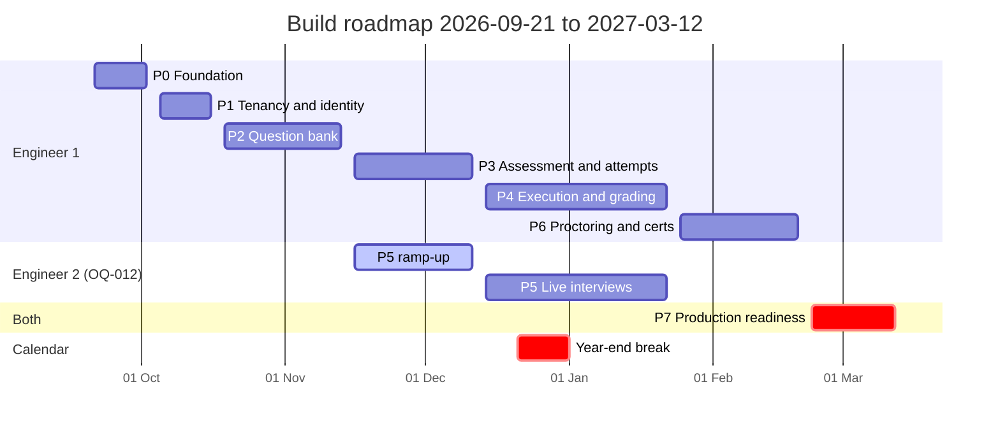

# Build roadmap

**Status:** draft
**Owner:** _unassigned_ (engineering lead)
**Last updated:** 2026-09-15
**Companion docs:** [`MILESTONES.md`](MILESTONES.md), [`P0-FOUNDATION-PLAN.md`](P0-FOUNDATION-PLAN.md), [`TRACKER.md`](TRACKER.md), [`DEFINITION-OF-DONE.md`](DEFINITION-OF-DONE.md), [`../docs/17-engineering-standards.md`](../docs/17-engineering-standards.md), [`../docs/02-HLD.md`](../docs/02-HLD.md), [`../CODE-GRAPH.md`](../CODE-GRAPH.md)

---

## What this document is, and what it is not

[`MILESTONES.md`](MILESTONES.md) is the **contract**: what each milestone delivers, the exit criteria
quoted from the PRD, and the dates those are promised against. It answers *what is owed and when*.

This document is the **build order**. It answers *in what sequence do we construct it, and why that
sequence*. Where the two disagree on a date, this document is the one that was re-baselined and
`MILESTONES.md` follows it — they are reconciled as of 2026-09-15 and the doc-freshness gate keeps
them that way.

Neither replaces [`TRACKER.md`](TRACKER.md), which holds the individual task rows and their status.
The relationship is: roadmap phase → milestone commitment → tracker tasks.

---

## 1. The schedule reality check

The PRD's 18-week plan (§6) assumes a working repository, a running database, an authentication
system and a deployment pipeline already exist. None of them do. As of 2026-09-15 this repository
contains documentation, configuration and a docker stack — and zero lines of application code.

Building the foundation honestly costs two weeks, and the tenancy, identity and audit spine that
every other feature sits on costs another two. The PRD folded both into "M0 Question bank, weeks
1–3". That was never going to hold, and pretending otherwise would just move the slip to somewhere
less visible.

There is a second omission. The PRD's plan ends when M4 ships, with no phase for the work that
makes a system safe to run in front of real candidates: the load test that
[`../docs/07-load-and-capacity-testing.md`](../docs/07-load-and-capacity-testing.md) specifies, a
restore rehearsal, an external security review, and the accessibility audit that
[`../docs/15-accessibility-conformance.md`](../docs/15-accessibility-conformance.md) requires. Those
are P7 here.

**The honest number is 25 working weeks to GA, not 18.** The delta is 2 weeks of foundation,
2 weeks of tenancy spine, and 3 weeks of production readiness.

Three ways to respond, in order of preference:

| Option | Effect | Cost |
|---|---|---|
| **Accept the 25-week plan** (recommended) | GA 2027-03-12 with every exit criterion met | Six weeks later than the PRD implied |
| Cut M4 from v1 | GA 2027-02-05 | No certification mode, no proctoring. M4 is the least valuable per unit of effort and the most legally fraught — the PRD already says so, and it sequences last for that reason |
| Add a second engineer from P1 | GA ~2027-02-12 | Only helps if the two tracks are genuinely separable, and P0/P1 are not — they are one person's critical path. Parallelism pays from P2 onward |

Do not respond by compressing P0 or P7. Compressing P0 means every later phase pays interest on a
bad foundation; compressing P7 means discovering the capacity ceiling during a campus drive, which
is the single worst failure this product can have.

This re-baseline is an estimate and needs an owner's sign-off. Tracked as `OQ-013` in
[`OPEN-QUESTIONS.md`](OPEN-QUESTIONS.md).

---

## 2. Plan at a glance

Project start Monday 2026-09-21. Non-working period 2026-12-21 → 2027-01-01.

| Phase | Name | Dates | Weeks | Milestone | Engineer |
|---|---|---|---|---|---|
| **P0** | Foundation | 2026-09-21 → 2026-10-02 | 2 | M-1 | 1 |
| **P1** | Tenancy, identity and audit spine | 2026-10-05 → 2026-10-16 | 2 | M0 | 1 |
| **P2** | Question bank | 2026-10-19 → 2026-11-13 | 4 | M0 | 1 |
| **P3** | Assessment and attempt engine | 2026-11-16 → 2026-12-11 | 4 | M1 | 1 |
| **P4** | Execution and grading | 2026-12-14 → 2027-01-22 | 4 | M2 | 1 |
| **P5** | Live interviews | 2026-12-14 → 2027-01-22 | 4 | M3 | 2 |
| **P6** | Proctoring and certification | 2027-01-25 → 2027-02-19 | 4 | M4 | 1 |
| **P7** | Production readiness | 2027-02-22 → 2027-03-12 | 3 | GA | 1 + 2 |



### The critical path

```
P0 foundation ─► P1 tenancy+identity ─► P2 question bank ─► P3 attempt engine ─► P4 grading ─► P7 GA
                                             │                     │
                                             └──► P5 live (eng 2) ─┘
                                                            P6 proctoring ──────────────────► P7
```

Everything depends on P0 and P1. Nothing parallelises before P2, because until the tenancy spine
exists there is no safe place to put a second person's code. **P5 is the only genuinely parallel
track** and it needs its own engineer ramping during P3.

P6 depends on P3 (attempts) and P4 (a finalised attempt is what a certificate attests), not on P5.

---

## 3. The eight principles this sequence encodes

**1. Build the spine before the organs.** Tenancy, identity, audit and the error envelope are not
features and they cannot be retrofitted. `org_id` and row-level security in particular: ADR-010
exists because application-layer filtering works right up until one developer forgets one `WHERE`
clause. Retrofitting RLS onto twenty tables of live data is a migration nobody wants to write.

**2. One thin vertical slice, early.** The end of P1 is not "auth works". It is *a request arrives
with a session, resolves an org, passes a permission check, reads a row that RLS scoped, writes an
audit entry, and returns the standard error envelope on failure* — proven by a test. Every later
feature is a variation on that path. Getting it right once is worth more than getting five features
half-right.

**3. The invariants come first within each phase.** In P2 the immutability of a published version
(ADR-003) is built and tested before the authoring UI. In P3 the materialised draw (ADR-004) and
the server clock (ADR-006) come before the candidate app. A UI built on a soft invariant hardens
the wrong behaviour into muscle memory and into screenshots.

**4. Candidate-facing safety is a standing test suite, not a review habit.** The leak suite from
[`../docs/06-testing-strategy.md`](../docs/06-testing-strategy.md) lands in P1 with one assertion
and grows every phase. It must be impossible for a correct-answer flag, a reference solution or
hidden test-case content to reach a candidate-scoped response — including in an error payload or an
SSE frame.

**5. Async paths carry their observability from birth.** A queue added without a depth metric and a
dead-letter alarm is a queue that will fail silently during an exam window. The metric ships in the
same pull request as the queue, per
[`../docs/12-observability-and-runbooks.md`](../docs/12-observability-and-runbooks.md).

**6. Every phase ends at a demonstrable state.** Not "the code is written" but "here is the thing
running, here is the command that proves it". A phase with an unverifiable exit criterion is a phase
that will be declared done while it is not.

**7. Migrations are expand-contract from the first one.** Not from the first one that needs to be.
The habit is what matters, and the cost of the habit is near zero before there is data.

**8. Accessibility and licence compliance are gates, not phases.** They run in every phase. An
inaccessible candidate experience is a discrimination exposure
([`../docs/15-accessibility-conformance.md`](../docs/15-accessibility-conformance.md)), and a
prohibited licence found at P7 is a rewrite.

---

## 4. Phase gate protocol

No phase starts until the previous phase's exit gate is signed. The gate is a checklist, run by
someone who did not write the code, producing a dated entry in [`STATUS.md`](STATUS.md).

Every phase gate includes these five, in addition to the phase-specific criteria below:

| Gate item | Verified by |
|---|---|
| All phase tasks in [`TRACKER.md`](TRACKER.md) are `done` or explicitly deferred with a reason | Tracker review |
| CI green on the phase branch, including the leak suite | `.github/workflows/ci.yml` |
| Docs updated and the freshness gate passes | `node scripts/check-doc-freshness.mjs` |
| `code-graph.json` reflects any new node, edge, queue or job | `node scripts/gen-code-graph.mjs --check` |
| No new prohibited licence entered the tree | `node scripts/check-licences.mjs` |

A phase may not borrow from the next phase's budget to finish. If a phase overruns, the overrun is
recorded and the plan re-baselined — silently absorbing it is how an 18-week plan becomes a
34-week one with nobody able to say when it happened.

---

## 5. The phases

### P0 — Foundation · 2026-09-21 → 2026-10-02 · 2 weeks

**Goal.** A new engineer clones the repository, runs one command, and has the whole stack running
with a green CI run — and every architectural seam the later phases plug into already exists and is
enforced.

**Entry gate.** None. This is the root.

Detailed step-by-step build order, with files, commands and verification for each step, is in
[`P0-FOUNDATION-PLAN.md`](P0-FOUNDATION-PLAN.md). Summary of workstreams, in dependency order:

1. pnpm workspace, Turborepo, shared TypeScript config, ESLint and Prettier, commit hooks
2. `packages/config` — environment schema that fails fast at boot
3. `packages/observability` — structured logger, OpenTelemetry bootstrap, metrics registry
4. `packages/contracts` — error envelope, stable error codes, zod primitives, OpenAPI emission
5. `packages/db` — Drizzle, migration tooling, the schema as migration 0001, RLS harness
6. `apps/api` — Fastify skeleton: health, request context, error handler, OpenAPI route
7. `apps/worker` — BullMQ skeleton: queue registry, graceful shutdown, DLQ wiring
8. `apps/collab` — y-websocket skeleton behind a ticket check
9. `apps/web` and `apps/candidate` — Vite, router, design tokens, accessibility baseline
10. Test harness — Vitest, testcontainers, Playwright, axe, the empty leak suite
11. CI switched from skipping to enforcing, first lockfile, first SBOM

**Exit gate.**

| Criterion | Verified by |
|---|---|
| `make dev` brings up the full stack from a clean clone | Timed on a second machine; must be under 10 minutes including image pulls |
| `GET /healthz` and `/readyz` return correctly on api, worker and collab | `make health` |
| The schema applies as a migration, not a mounted file, and `make migrate` is idempotent | Run twice, second run is a no-op |
| An RLS negative test proves cross-org reads return zero rows | Integration test, must exist and pass |
| A deliberately planted AGPL dependency fails CI | Fixture branch, task `H-039` |
| `/metrics` exposes process and HTTP metrics on all three services | Prometheus target list all green |
| An unhandled error returns the standard envelope with a `request_id` that resolves to a trace | Integration test |
| `pnpm build` produces runnable artefacts for all five apps | CI |

**Risks.** Over-engineering the scaffold (timebox each step; a package with no consumer yet gets an
interface and a test, not an implementation). Toolchain churn eating the fortnight — the stack is
already decided in ADR-012 and ADR-013 and is not reopened here.

---

### P1 — Tenancy, identity and audit spine · 2026-10-05 → 2026-10-16 · 2 weeks

**Goal.** The one vertical slice every feature is a variation on, proven end to end.

**Entry gate.** P0 signed.

**Workstreams.**

1. **Tenancy.** `organizations`, the connection-pool hook that sets `app.current_org` per checkout,
   RLS policies on every tenant table, and the elevated background-job role with its own audit
   trail (ADR-010). Negative tests per table, generated rather than hand-written, so a new table
   without a policy fails the suite.
2. **Staff identity.** Sessions, password login, OIDC start and callback, `GET /auth/me`. Better
   Auth wired, not wrapped in an abstraction that will never have a second implementation.
3. **Authorisation.** Permissions as data, custom roles, and a per-action check (FR-27). The check
   is a function call at the route level with a test asserting that an unlisted permission denies.
4. **Audit log.** Append-only, written inside the same transaction as the action it records, with
   the actor, the entity and the reason where one is required. If the action rolls back the audit
   entry rolls back with it.
5. **Candidate token model.** Invitation tokens high-entropy and hashed at rest, exchanged for an
   attempt-scoped token; WebSocket tickets single-use with a 60-second life. Built now even though
   there is no attempt to scope to yet, because the token model is a security boundary and
   retrofitting scope onto an issued credential is not possible.
6. **The leak suite, seeded.** One test today: a candidate-scoped token cannot read any staff route.

**Exit gate.**

| Criterion | Verified by |
|---|---|
| A staff request resolves org → permission → RLS-scoped read → audit write → typed response | End-to-end integration test |
| Cross-org read returns zero rows on every tenant table | Generated RLS suite; a new table without a policy fails CI |
| A candidate token cannot reach any staff route | Leak suite |
| Every privileged action writes an audit row, and rolls it back with a failed transaction | Integration test |
| Permission check is per action, not per role name | Test with a custom role |

**Risks.** RLS query-plan degradation (`R-09`) — measure now, on seeded volume, not at P7.
Over-abstracting auth: one identity provider, one session store, no plugin architecture.

---

### P2 — Question bank · 2026-10-19 → 2026-11-13 · 4 weeks · M0

**Goal.** The PRD's M0: 200 questions loaded, tagged to at least three job roles, exportable and
re-importable without loss.

**Entry gate.** P1 signed.

**Workstreams, in order.**

1. **Immutability first (ADR-003).** `questions` / `question_versions`, the draft → review →
   published → retired lifecycle, and a database-level guarantee that a published version cannot be
   updated. A `PATCH` against one returns `409 version_immutable`. Test before UI.
2. **Skill taxonomy and job roles (ADR-009).** Two levels, org-editable, with merge. Roles declare
   weighted skills. `GET /job-roles/{id}/coverage` lands here, not later — it is what stops a
   recruiter building an assessment for a role the bank cannot support.
3. **Question kinds.** MCQ single and multi, true/false, short answer, coding, SQL, subjective,
   system design. Options, coding specs, test cases, answer keys.
4. **The serialisation guard.** Candidate-facing and author-facing serialisers are separate types,
   and the leak suite grows an assertion per kind: no `is_correct`, no reference solution, no hidden
   test-case content. This is the phase where that discipline is cheap to establish.
5. **Import and export.** QTI 2.1 and JSON round-trip, plus the dataset importers (HumanEval, MBPP,
   LBPP, Exercism) with `source_license` mandatory and rejected if absent
   ([`../docs/05-licensing-and-compliance.md`](../docs/05-licensing-and-compliance.md) §2).
   Asynchronous with per-row errors.
6. **Authoring console.** The first real UI. Accessibility baseline applies from the first screen.
7. **Statistics scaffold.** The nightly p-value and discrimination job, writing nothing useful until
   n ≥ 30, but wired and observable.

**Exit gate.** The PRD criterion verbatim — *200 questions loaded, tagged to at least 3 job roles,
exportable and re-importable without loss* — plus:

| Criterion | Verified by |
|---|---|
| A published version cannot be mutated by any path, including direct SQL as the app role | Integration test |
| Export → import → export produces byte-identical output | Round-trip test |
| Import without `source_license` is rejected | Contract test |
| No candidate-facing serialiser emits an answer key for any of the eight kinds | Leak suite |
| Coverage report correctly reports a thin skill | Fixture with a deliberate gap |

**Risks.** Taxonomy rot (`R-10`) — assign the owner in this phase, not later. QTI round-trip
fidelity is the most commonly underestimated task here; start it in week 1 of the phase, not week 4.

---

### P3 — Assessment and attempt engine · 2026-11-16 → 2026-12-11 · 4 weeks · M1

**Goal.** The PRD's M1: 50 candidates complete a 30-question test concurrently, and scores reproduce
exactly on re-grade.

**Entry gate.** P2 signed. Engineer 2 starts ramping for P5 at the top of this phase.

**Workstreams, in order.**

1. **Assessment composition.** Sections, pinned picks, random-draw rules, assessment versioning
   (FR-10), and `POST /assessments/{id}/simulate` — which must pass before an assessment can be
   published, because rule infeasibility discovered mid-exam is the worst failure this product has
   (ADR-004).
2. **The attempt state machine.** Implemented as an explicit machine with illegal transitions
   rejected, not as a status column updated from six places. The `finalised` transition is guarded
   in a single transaction requiring every `final_score` to be non-null.
3. **The materialised draw (ADR-004).** Attempt start resolves every rule once and writes
   `attempt_questions` including `option_order`, in one transaction. Nothing re-rolls, ever.
4. **The server clock (ADR-006).** `deadline_at` computed server-side with accommodation applied,
   `server_time` on every response, submissions after the deadline rejected, and the scheduled
   sweep that expires overdue attempts and grades what was autosaved.
5. **Autosave and resume.** ≤5s autosave, resume with no data loss, and the autosave failure metric
   wired to a page-now alert — a candidate losing work is the failure that ends trust in the product.
6. **Inline grading.** MCQ and short answer, partial credit, negative marking, per-skill roll-up.
7. **Candidate app.** Timer display derived from `server_time`, never the local clock. Full
   keyboard operation and screen-reader verification before the phase closes.
8. **Invitations.** Tokenised, expiring, attempt-limited, bulk, with the plaintext token returned
   exactly once.

**Exit gate.** PRD criterion verbatim, plus:

| Criterion | Verified by |
|---|---|
| Re-grading a finalised attempt reproduces the score exactly | Determinism test |
| The draw is never recomputed after start | Test that mutates the bank mid-attempt and asserts the served set is unchanged |
| A manipulated client clock cannot extend an attempt | Integration test |
| The expiry sweep grades autosaved work rather than discarding it | Integration test |
| Autosave failure rate is zero under the 50-concurrent test | Metric during the load run |
| Candidate app passes axe and a manual keyboard-only walkthrough | [`../docs/15-accessibility-conformance.md`](../docs/15-accessibility-conformance.md) |

**Risks.** This is the highest-risk phase in the plan: it holds three of the four load-bearing
ideas. Do not compress it. The deadline stampede (`R-01`) first becomes measurable here.

---

### P4 — Execution and grading · 2026-12-14 → 2027-01-22 · 4 weeks · M2

**Goal.** The PRD's M2: 100 concurrent submissions graded, p95 result latency under 8 seconds.

**Entry gate.** P3 signed.

**Workstreams, in order.**

1. **The execution adapter (ADR-002).** `execute(language, version, files, stdin, limits) → result`.
   It never receives a question id. Piston behind it, swappable.
2. **Sandbox hardening before anything is graded.** Network egress blocked, cgroup-enforced CPU,
   wall, memory, process and output limits, node holds no credentials, recycled. The security tests
   from [`../docs/06-testing-strategy.md`](../docs/06-testing-strategy.md) — fork bomb, egress
   attempt, memory bomb, output flood, filesystem escape — run against a real Piston and must pass
   before the first candidate submission is graded.
3. **Grading workers (ADR-008).** Two queues with separate priorities: interactive `run` and batch
   `submit`. Idempotent by submission id, bounded retries, dead-letter with an alarm. A grading
   outage leaves attempts valid and `under_review`, never silently zero.
4. **Result filtering.** Sample cases show full detail; hidden cases show pass/fail and a label and
   nothing else, including in compile output and SSE progress frames. Leak suite grows accordingly.
5. **Runtime provenance (FR-13).** Every submission records language version and runtime image
   digest, so a re-grade months later is explicable.
6. **Monaco surface.** Language selection, starter code, run against samples without consuming a
   submission, SSE result streaming. Editor accessibility per docs/15.

**Exit gate.** PRD criterion verbatim, plus:

| Criterion | Verified by |
|---|---|
| All five sandbox escape tests fail to escape | Nightly security job against real Piston |
| No hidden test-case content appears in any candidate response, SSE frame or error | Leak suite |
| A replayed grading job produces an identical score | Idempotency test |
| Killing a worker mid-grade loses no submission | Chaos test |
| Per-attempt execution budget prevents one candidate starving the pool | Load test |

**Risks.** Execution capacity is the system's only real bottleneck (`R-01`). Sandbox escape (`R-02`)
— the posture assumes escape rather than trusting the sandbox, and this phase is where that posture
is proven rather than asserted.

---

### P5 — Live interviews · 2026-12-14 → 2027-01-22 · 4 weeks · M3 · engineer 2

**Goal.** The PRD's M3: an interviewer runs a full 45-minute loop and replays it afterwards.

**Entry gate.** P3 signed, engineer 2 ramped during P3, and the second-engineer question (`OQ-012`)
answered by 2026-10-16. **If it is answered no, P5 becomes serial and GA moves to 2027-04-09.**

**Workstreams.** Yjs document server with Redis pub/sub fanout and snapshotting (ADR-005); the
parallel `session_events` append-only stream that replay, analytics and audit read instead of the
CRDT blob; join-by-room-code with no account and no download (FR-16); in-session execution reusing
P4's adapter; variable-speed replay; scorecards with behavioural anchors and the hard rule that
reviewers cannot see each other's scorecards until all are submitted; the interviewer-private notes
pane.

**Exit gate.** PRD criterion verbatim, plus: a mid-session collab node restart loses at most the
snapshot interval and converges on reconnect; the private notes pane is absent from every
candidate-scoped payload (leak suite); replay reconstructs the session from `session_events` alone.

---

### P6 — Proctoring and certification · 2027-01-25 → 2027-02-19 · 4 weeks · M4

**Goal.** The PRD's M4: a 90-minute certification exam runs end to end with a reviewable integrity
report.

**Entry gate.** P4 signed. P5 need not be complete.

**Workstreams.** Browser-signal collection (focus loss, paste, fullscreen exit, devtools) as
advisory events only; the human review queue with triggering evidence attached; Safe Exam Browser
integration; consent capture with a genuine non-proctored alternative, because consent conditioned
on proceeding is not freely given; webcam capture off by default with a hard retention ceiling and
automatic deletion; credential issuance per
[`../docs/10-certification-and-credentials.md`](../docs/10-certification-and-credentials.md) with
signing keys off the API and execution nodes; public verification that reveals no answers, no
question set and no PII beyond what the holder consented to.

**Exit gate.** PRD criterion verbatim, plus: **no code path exists that can reject, void or
down-score an attempt from a proctoring signal** — verified by test and by a reviewer reading the
integrity module, because this is ADR-007 and it is not configurable; retention deletion actually
deletes, including from object storage; a revoked credential fails verification.

---

### P7 — Production readiness · 2027-02-22 → 2027-03-12 · 3 weeks · GA

**Goal.** Safe to put in front of real candidates at volume. This phase is not in the PRD and is
the one most likely to be cut under pressure. Do not cut it.

**Workstreams.**

1. **Load and capacity.** Every scenario in
   [`../docs/07-load-and-capacity-testing.md`](../docs/07-load-and-capacity-testing.md), including
   the deadline stampede with 80% of submissions in the final five minutes. The pass gates there are
   gates, not observations.
2. **Disaster recovery rehearsal.** Restore from backup into a clean environment and measure against
   the RPO and RTO in [`../docs/13-environments-and-release.md`](../docs/13-environments-and-release.md).
   An untested backup is not a backup.
3. **External security review.** Against [`../docs/14-threat-model.md`](../docs/14-threat-model.md),
   with the sandbox as the priority target.
4. **Accessibility audit.** Full screen-reader matrix, and a VPAT/ACR if one is owed.
5. **Compliance sign-off.** DPIA signed, retention jobs verified in production configuration,
   adverse-impact reporting exercised on real cohort data, licence SBOM published.
6. **Runbook rehearsal.** Execute the top five runbooks from
   [`../docs/12-observability-and-runbooks.md`](../docs/12-observability-and-runbooks.md) against a
   staging failure and correct whatever was wrong in them.
7. **Operational readiness.** On-call rota, alert routing, exam-window checklist, change-freeze
   policy in force.

**Exit gate.** Every load gate green at 500 sustained and 1000 peak; a restore rehearsal completed
within RTO; no unresolved high-severity security finding; no unresolved WCAG 2.1 AA failure on the
candidate path; DPIA signed; five runbooks rehearsed and corrected.

---

## 6. What runs in every phase

These are not phases and never appear as a task to be scheduled at the end.

| Discipline | Expectation per phase |
|---|---|
| Testing | Written with the change, not after it. See [`../docs/06-testing-strategy.md`](../docs/06-testing-strategy.md) |
| Leak suite | Grows an assertion whenever a new candidate-facing response is added |
| Accessibility | Every candidate-facing screen verified before the phase closes, not audited at P7 |
| Observability | A new async path ships with its metric and its alert |
| Documentation | Updated in the same pull request; the freshness gate enforces it |
| Code graph | `code-graph.json` updated with any structural change |
| Licence gate | Green on every pull request |
| ADRs | A decision expensive to reverse becomes an ADR before the code that assumes it |

---

## 7. How this document is maintained

Per rule 3 of the maintenance contract in [`../CLAUDE.md`](../CLAUDE.md):

- A phase gate signed updates [`STATUS.md`](STATUS.md) and this document's phase status in the same
  change.
- A date that moves moves here **and** in [`MILESTONES.md`](MILESTONES.md) in the same change. The
  two disagreeing is a bug the doc-freshness gate is configured to catch.
- A phase that overruns is re-baselined explicitly, with the reason recorded. The plan is allowed to
  change; it is not allowed to change silently.
- Scope removed from a phase moves to [`TRACKER.md`](TRACKER.md) with a deferral reason, never
  deleted.
